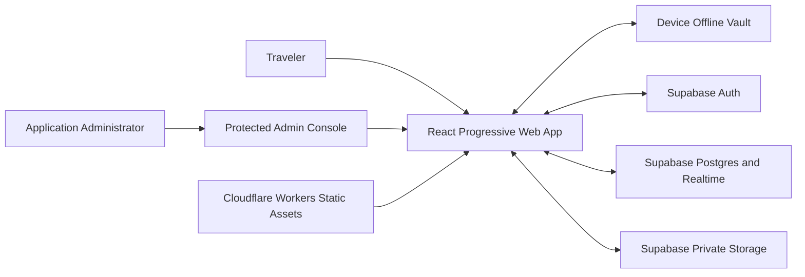
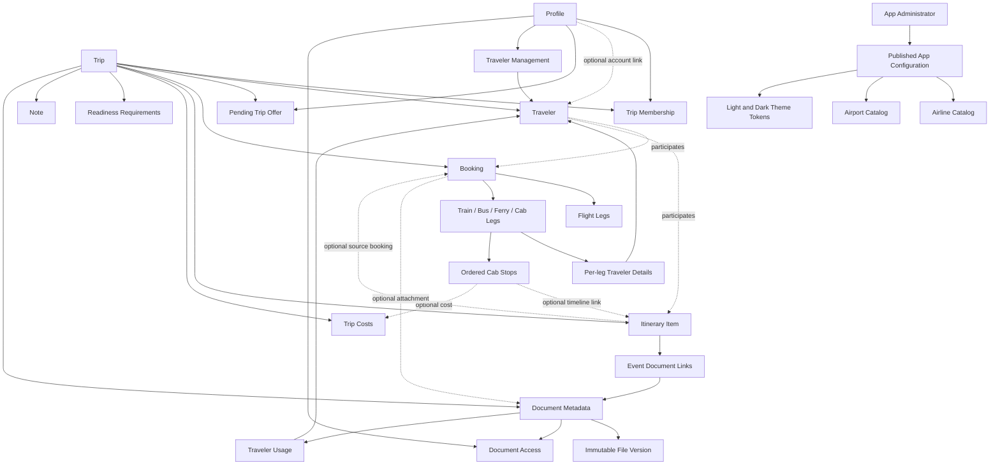
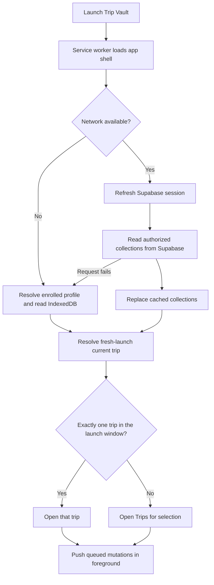
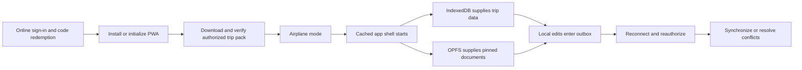

# Trip Vault High-Level Design

> **September 23 update:** The latest pulled UI adds a dedicated filtered Expenses page, compact quick-cost entry and shared event/Moment/Cab-stop connections. Notification changes now capture created/updated/restored actions and named-record summaries. These changes are locally verified; the new notification migration, sender deployment and phone acceptance remain pending.

> **September 20 release update:** Phone push delivery is owner-confirmed after correcting the VAPID contact subject; automatic Cron delivery and destination acceptance remain pending. The temporary test-send button and permanent test-trip deletion UI are retired. Protected backend diagnostics and legacy purge/storage-cleanup infrastructure remain; normal users retain notification preferences and recoverable trip lifecycle actions.

> **Current contract:** This document, the [LLD](LOW_LEVEL_DESIGN.md), and [feature catalog](FEATURES.md) describe the implementation verified locally on September 23. They do not imply that the latest SQL sections or client build have been deployed. The [changelog](../CHANGELOG.md) records implementation history; earlier review notes are historical, not overriding specifications.

Trip Vault is a personal-use installable web application that keeps travel bookings, itineraries, notes, and documents together for the owner and invited travel companions. It is not intended to become a commercial product. This document records the implemented system boundaries and the few deliberately deferred capabilities.

**Document status:** Implemented personal MVP 1.0

**Implementation status:** Shared document icons/cards, booking-wide document detach, refreshed demo surfaces, concise admin screens, release field comparisons and draft discard are implemented and locally verified on September 22. Fresh projects use the single SQL installer; existing projects apply outstanding incremental migrations after backup. The latest database functions have not been applied to the hosted database during this work. See the LLD verification table and `docs/PUSH_SETUP.md` for precise local and deployment acceptance boundaries.

**Default decision state:** Accepted unless explicitly marked as deferred or revisit

## Release Reality

### Expenses and connected costs

Home and trip-header expense totals open `/trips/:tripId/expenses`. The page combines search, category and traveler filters with per-currency filtered totals, read-first cost details, role-gated editing and optional balances. Its filters live in the URL and inherit traveler focus when no URL selection exists.

Quick Add Cost collects a title, positive amount and category, defaults to the trip currency and Paid, and assigns all active travelers. An optional connection links the cost to an event, an activity Moment or a Cab stop; the same connection UI is reused by the full cost form. The new Snacks and Gift categories require `202609220005_quick_cost_categories.sql` on existing databases. Moment/stop creation and cost persistence are separate operations; a created child is retained for retry if the later cost save fails.

Light/dark border contrast is stronger. Known exact stock cached palettes upgrade to the new defaults; administrator-customized palettes remain unchanged.

### Deployment state

| Area                      | Current state                                                                                                                                                                                                                                        |
| ------------------------- | ---------------------------------------------------------------------------------------------------------------------------------------------------------------------------------------------------------------------------------------------------- |
| Application               | Trips / Vault / Profile shell; unified timeline, type/date search and filters, contextual return paths, event-colored details, and in-app document preview                                                                                           |
| Automated verification    | The current automated baseline is recorded in the LLD verification table; remote SQL, Storage, and device acceptance remain separate release gates                                                                                                   |
| Existing Supabase project | Do not use the complete setup as an upgrade script. Back up first and apply outstanding incremental migrations with their prerequisites; then run all schema smoke tests                                                                             |
| Fresh Supabase project    | Run the canonical complete setup. Phase 1 installs the current schema; Phase 2 publishes the regional catalog after an active administrator is available. If publication is deferred, rerun only the marked Phase 2 section, then run the smoke test |
| Cloudflare                | Workers Static Assets configuration exists; the post-push live deployment is not verified here                                                                                                                                                       |
| Acceptance                | Phone, desktop, multi-member, upload, and airplane-mode tests remain manual release gates                                                                                                                                                            |

## 1. Product Vision

A traveler should be able to open Trip Vault and immediately answer:

- What do I need to do next?
- Where am I going and when?
- Where is the booking or document I need right now?
- Is this information available without a network connection?
- Which travelers can see or edit it?

The product should feel like a focused travel utility, not a general cloud drive.

The primary trip experience is a chronological projection over itinerary events and scheduled task/readiness rows. Detailed booking, journey-leg, cost, readiness, and document records remain authoritative in their own tables and link into that projection. A task may remain checklist-only, occur on a date, or appear a defined time before/after a selected dated event.

## 2. Goals and Non-Goals

### Goals

| Goal                           | Outcome                                                                                                                |
| ------------------------------ | ---------------------------------------------------------------------------------------------------------------------- |
| One application across devices | Phone, tablet, and desktop use the same responsive codebase                                                            |
| Personal-use scope             | Optimize for the owner and invited travel companions rather than public or commercial use                              |
| Immediate trip context         | Online views refresh from Supabase and fall back to locally cached structured data; offline views read the device copy |
| Reliable offline access        | Users explicitly pin trips or documents and receive a verified readiness result                                        |
| Safe collaboration             | Trip membership and document visibility control who can access data                                                    |
| Manageable document library    | Cloud object storage holds originals while the database holds searchable metadata                                      |
| Low operational complexity     | Supabase owns application data, authentication, and document authorization; Cloudflare hosts the app                   |
| Future portability             | The web app can later be wrapped or complemented by native clients without replacing the backend                       |

### Non-Goals for the First Release

| Non-goal                                           | Reason                                                                                                                                                                                                                                 |
| -------------------------------------------------- | -------------------------------------------------------------------------------------------------------------------------------------------------------------------------------------------------------------------------------------- |
| Full airline or hotel booking engine               | Trip Vault organizes existing reservations rather than selling travel                                                                                                                                                                  |
| Automatic support for every email provider         | Manual entry and upload establish the core model first                                                                                                                                                                                 |
| Provider-blind end-to-end encryption               | Key recovery, sharing, search, and previews require a separate product decision                                                                                                                                                        |
| Guaranteed background work on every mobile browser | Browser support is inconsistent; foreground resume is the reliable baseline                                                                                                                                                            |
| Standalone expense-splitting platform              | Trip-scoped payer, participants, equal splits, and per-currency balances are supported behind a per-trip opt-in control; ordinary cost entry defaults silently to everyone, while an independent Splitwise-style product remains later |
| Native iOS and Android applications                | The installable PWA is the first delivery format                                                                                                                                                                                       |
| Commercial or public product                       | Billing, subscriptions, public acquisition, organization tenancy, commercial support, and commercialization are outside the permanent product scope                                                                                    |

## 3. Users and Collaboration Boundary

| Actor                      | Primary needs                                                                                                                                       |
| -------------------------- | --------------------------------------------------------------------------------------------------------------------------------------------------- |
| Solo traveler              | Keep personal bookings and sensitive documents organized and offline                                                                                |
| Trip owner                 | Create a trip, invite travelers, control membership, and manage shared information                                                                  |
| Trip editor                | Add and update shared bookings, itinerary items, notes, and documents                                                                               |
| Trip viewer                | Read shared information and download documents permitted to them                                                                                    |
| Managed traveler           | Participate in bookings and requirements without an account; an authorized organizer manages their information                                      |
| Non-traveling collaborator | Help plan or view a trip through a signed-in editor or viewer membership without appearing as a traveler                                            |
| Application administrator  | Use a separate administrator account to maintain global travel metadata and published appearance defaults without receiving access to private trips |

The **trip** is the primary collaboration boundary. Every person who opens private trip information must authenticate and hold active membership. A traveler record is separate from an account: a member may be linked to their own traveler, manage another traveler, or join only as a non-traveling collaborator. Document visibility can narrow membership access further.

## 4. System Context

## 5. Component Responsibilities

| Component            | Responsibility                                                                                                                        | Explicitly does not own                             |
| -------------------- | ------------------------------------------------------------------------------------------------------------------------------------- | --------------------------------------------------- |
| React PWA            | User interface, protected admin console, validation, network-first online reads, offline cache fallback, sync orchestration, previews | Authoritative permissions or permanent originals    |
| Device offline vault | Cached structured data, pinned files, pending mutations                                                                               | Cross-device truth or long-term backup              |
| Supabase Auth        | Email-only identity, sign-in sessions, and identity used to redeem a join code                                                        | Trip authorization by itself                        |
| Supabase Postgres    | Trips, memberships, bookings, itinerary, notes, account-upload receipts, document metadata, access rules                              | Binary file contents                                |
| Supabase Realtime    | Notify connected members of shared-data changes                                                                                       | Durable event history or file transfer              |
| Supabase Storage     | Private original files and immutable versions                                                                                         | Business metadata or offline guarantees             |
| Cloudflare           | Application deployment, TLS, static-asset delivery, optional narrow API routes                                                        | Primary trip database or duplicate document storage |

## 6. Core Architectural Principles

### 6.1 Structured data before document parsing

Dashboard information must come from booking and itinerary records, not from opening and re-reading PDFs. A document supports a record but does not replace it.

### 6.2 Cloud source of truth, local travel pack

Supabase remains authoritative across devices. The device holds a synchronized working copy and explicitly pinned originals for offline use.

### 6.3 One file platform in the first release

Supabase Storage holds documents because it shares authentication and row-level authorization with the database. Cloudflare R2 remains a later option only if measured scale or cost justifies a migration.

### 6.4 Offline readiness is verified

The product contract is that **Ready offline** means complete structured trip data plus every current document version the user is authorized to open. A deliberately reduced document set is labeled **Essentials ready**.

The current implementation downloads and caches the major structured domains and checksum-verifies the selected document versions. Its persisted readiness manifest, however, records only document-version IDs: it does not yet prove the completeness of every structured domain, explicitly fetch generic journey legs, or become stale after every booking or itinerary mutation. Until HLD-042 is resolved, the UI result is provisional and an airplane-mode acceptance test is required before relying on it during travel.

### 6.5 Sharing is authenticated and consent-based

For a first shared trip, the owner creates a unique, expiring, one-time code for an intended traveler or non-traveling collaborator. The recipient signs up or signs in before entering the code. Redeeming it creates membership atomically and invalidates the code. After two accounts have shared an accepted trip, the owner can offer a later trip directly to that known account. The recipient sees the pending offer on Trips and must accept before membership and any traveler link are created. Neither mechanism provides anonymous access, and permanent public trip or document URLs are not part of the design.

### 6.6 Sensitive defaults

An Owner/Editor upload defaults to all signed-in trip members so ordinary shared confirmations work without extra setup; a Viewer-managed upload remains private. The uploader may choose narrower access during upload, and an Owner/Editor can later change an existing document between trip-wide, private, and selected-member visibility. Removing a member prevents future cloud access but cannot revoke copies already downloaded.

### 6.7 Document meaning is separate from access

Vault also has a personal, trip-independent section for passports, Aadhaar, insurance, and other files. These use the existing owner-only `account_document_uploads` and private `account-documents` bucket, with personal title/type/label metadata. They are completed personal documents rather than unfinished trip uploads. A database constraint prevents personal originals from acquiring a trip association, and Storage checks prevent a trip document reference from granting access to them. There is no automatic sharing or identity-number extraction.

Installed Android PWAs register a file share target. A service worker validates one supported file under 5 MB, stages a short-lived bounded local handoff, and redirects to an authenticated review page. Users explicitly save to Personal documents or a chosen trip; the latter reuses the upload form with an initial Only me selection. Save/Cancel/sign-out clear temporary shares; iPhone retains manual upload. See `PERSONAL_DOCUMENTS_SETUP.md` for migration and device acceptance requirements.

A document has four independent concerns: immutable file versions, a specific travel purpose, links to bookings/events/journey legs, and traveler usage. Usage is **Shared**, **Selected travelers**, or **Assign later** and never grants access. Visibility remains **Only me**, **Signed-in trip members**, or **Selected signed-in members**. This permits one accommodation confirmation to support a group, a personal visa or boarding pass to follow one traveler, and unnamed admission tickets to remain in a pool until assigned.

The upload flow derives the Vault title from document type, traveler usage, and linked event context while preserving the original filename separately. A custom title may replace the generated title, but the generated context remains visible beneath it. File persistence is deliberately two-phase: the original is first checksum-verified into the current profile's device vault and private account Storage inbox, then one atomic database operation associates it with a trip, booking or leg, travelers, and visibility. A failed or interrupted association leaves an account-owned inbox item in Profile for retry, later association, or deletion while it remains unassociated; it never presents a missing object as an attached document. The private Storage lifecycle is intentionally append-only: an object may be inserted only for an owned pending receipt, object updates are disallowed, and deletion is allowed only while the receipt is unassociated. Once associated, both the receipt and bytes are immutable through the inbox; the resulting Vault document uses its archive/version flows instead.

Trip upload and the Profile inbox share one large centered file-selection surface; Replace remains compact. It accepts touch, keyboard, and desktop drop, reports the selected filename and measured size, disables reselection while busy, and rejects empty, unsupported, or `>= 5_000_000`-byte files before persistence. A phone file reported as an empty or generic `application/octet-stream` regains its approved PDF/image MIME from its extension before validation; extensionless OPFS handles are retyped later from trusted receipt/version metadata.

The document route is viewer-first. Approved images render with in-app zoom. PDFs render page-by-page to a canvas through the pinned, same-origin PDF.js runtime and worker under `public/vendor/pdfjs/`, with page, zoom, and fit controls that remain available offline as part of the PWA shell. The explicit **Open** action remains as a native device-viewer fallback when an engine cannot render the PDF or the traveler prefers the platform viewer. File facts, access, local-copy controls, replacement, archiving, and version history live behind one labelled Info action instead of displacing the document; narrow screens retain the compact Info icon with its full accessible name and a separate hit target from Open.

A timeline event exposes one labelled primary document shortcut—such as **View ticket** or **View voucher**—without replacing the whole-card event-details action. The shortcut chooses an explicitly linked event document first, then a booking document, and applies the active traveler filter before presentation. Booking details also let an editor start an upload from a particular Train, Bus, Ferry, or Cab leg; the upload carries that `journey_leg_id`, defaults to a journey-ticket purpose, and remains available only to the traveler context allowed by the document assignment.

Within an event, existing documents precede secondary add actions: Everyone first/open, traveler groups next with contextual expansion, then unassigned. Selecting a traveler expands their applicable groups alongside Everyone. Compact up/down controls order documents within a group; unlink remains a separate action. Explicit links unlink from the current event; booking-associated files detach from the booking and its events through one permission-checked online operation, without deleting the Vault document or file.

Document cards share a type-specific paper icon, full title, and a compact metadata row with purpose and a plain visibility symbol. Globe means all signed-in trip members, lock means private, and key means restricted access; none indicates a public web link. Personal is a storage/privacy distinction, not a document type. Timeline shortcuts omit the visibility control. Detail-page visibility controls support tap, hover and keyboard explanations without a coloured badge background. In-app navigation says **View**; **Open** is reserved for the external device viewer. Booking heroes use monochrome document icons, icon-only on phones; document previews retain the labelled Open action on phones.

### 6.8 Timeline is the primary trip interface

Opening a trip displays applicable events plus dated/event-linked readiness tasks in chronological order on one connected timeline. The app identifies one current or next actionable entry, scrolls it into view on the first open, and distinguishes it with color and an explicit label. Completing a task advances attention to the next entry; completing or archiving it immediately removes its timeline emphasis and derived in-app alert, while the completed task remains visible in **Tasks & readiness**. Everyone context shows the complete trip. Selecting a traveler becomes a presentation filter across the timeline, reservations, costs, readiness, seats, and documents: shared records plus that traveler's assigned records remain, while another traveler's private planning context is hidden. This filter never changes authentication or database authorization.

The timeline and former Agenda are one date-grouped surface. Dates begin open, only the active entry begins expanded, and several event cards can stay open. A single filter sheet offers Dates, Event types, and Display with draft selections, counts, Reset, and Apply; closing discards unapplied edits. Search and current-event jumps reveal their destination and clear conflicting filters. Search includes visible event-type labels, plurals and aliases as well as metadata and flexible local dates. Expansion/filter choices are local session state scoped to profile, trip, and traveler, never authorization or cloud settings.

Explicit Next up, search, alert, and current-event jumps center the destination heading in the usable viewport between the sticky headers and bottom controls. After scroll settlement, a stronger border/outline flashes three times over 3.5 seconds, including tasks. Ordinary targets use the primary brand tone; the active event retains its current-event accent and the active task its warning tone. Reduced-motion preference removes smooth scrolling and animation. Explicit destinations supersede stale return positions; manual expansion only scrolls enough to uncover content.

Timeline headers expand/collapse their cards; the expanded body opens the inspection-first event sheet, with independent document, navigation, and contact actions. Reservation cards open Flight or Booking details. Detail pages place role-gated, type-labeled Edit actions alongside Back rather than inside the hero. Modal summaries expose saved hotel-host or cab-driver names/numbers and Call/WhatsApp where valid. Location-bearing summaries offer navigation. Event and trip expense rows retain the shared read-first cost sheet and role-gated editing; balances remain opt-in.

Trip details is a dashboard over large collections, not the full collection itself. It shows the next three applicable events, compact reservation/document category counts, three chronological reservations, and three documents ranked by the earliest upcoming event that can use them. Stable reservation and trip-document routes hold the complete searchable lists, retain traveler/category filters, and return to Trip details through route state. This keeps a trip with tens of reservations or documents readable while preserving direct access and browser Back behavior.

Shallow Flight fact, note, and airline snapshot cards may open editing directly for an authorized Owner/Editor; Viewer rendering remains static. Readiness titles instead open the shared read-first task sheet, while the checkbox is the direct completion action. Owner-only Edit trip opens settings; there is no duplicate Trip information overview card. Navigate, Call, WhatsApp, document, status, and destructive actions remain independent controls and never trigger the surrounding card destination.

A relative event's **Before/After** relationship controls its place independently from its optional schedule details. It may remain relation-only, carry only a planned duration, or later gain a real start and optional end. The timeline and event detail name the selected anchor and keep stable groups in the order **before events → anchor → after events**. The non-null `starts_at` retained for database ordering is not presented as an actual start when none was entered: such an event cannot become **Now** solely from that fallback, is omitted from calendar export, and gives a later booking no fabricated schedule.

A readiness row opens the same read-first task sheet from either the timeline or **Tasks & readiness**. The row checkbox is the only direct completion target; the sheet shows status, schedule, audience, notes, and role-gated edit/archive actions. An offline-pack alert opens the trip's **Offline** details section instead of redirecting to whichever timeline entry is current.

Trip details exposes only an **Open archive** entry; archived records are inspected in a separate panel. It includes tasks, notes, events, booking groups, and costs. Owners/editors may restore or confirm permanent deletion while online. Completion is separate from archiving, and restored tasks retain their status. Permanent event/booking deletion retains documents and costs while clearing associations; relative scheduling dependencies must be unlinked first. Documents keep their separate Vault trash. Missing database rows cannot be restored by this interface.

Exact and relative schedules share one calculation rule. Start plus duration derives the end; start plus end derives the duration; and when all three are supplied they must agree. An end without a start, a non-positive or inconsistent interval, or a start/derived end outside the trip dates is rejected. Duration may remain useful without a start on a relative event, so knowing “after hotel check-in, about two hours” never requires inventing a clock time.

Trip child links capture their exact origin route, underlying card offset, view, and nested parent context. In-app Back returns explicitly to that origin with a safe trip fallback, not an arbitrary browser-history step. Timeline → modal → booking → Back restores the modal and then the original timeline position; reservations and Trip details restore their own clicked-card position. Unrelated routes do not inherit trip scrolling. The trip header opens itemized expenses, uses Indian grouping for INR, and in dark mode inverts to a light-teal primary background with dark text.

### 6.8.1 Event identity and document-first details

Compact timeline headers retain small colored type icons, including a bed for hotels, and top-right chevrons. Decorative silhouettes belong in expanded summaries, event modals, and detail heroes—not behind collapsed titles. They rest bottom-right, at 80% of expanded booking-summary height and 50% in other supported cards. Flights enter diagonally upward at 45 degrees, transport enters from the left, hotel suns rise, activity wheels rotate, and meal lids open. Motion runs briefly on opening across phone, tablet, and desktop and becomes static under reduced motion. Artwork never captures input or substitutes for a label.

Event type determines the summary tint and contrast-safe hero color; airline identity remains a separate small accent. Ordinary timeline borders stay neutral. The current event alone has a persistent accented double stroke/outline and faint tint with a trailing NEXT/NOW badge; the active task retains its amber TO DO treatment.

Existing documents precede secondary upload/attach actions; empty states promote those actions. Everyone documents appear before traveler groups. Booking summary shortcuts use icons on phones and text labels on larger screens while retaining accessible names and tooltips. Hotel stay summaries show days and nights. PDF previews use a vertical, lazily rendered page stack with zoom, fit, fullscreen where supported, and per-page retry.

### 6.9 Time zones belong to the local event or international endpoints

Flights, trains, buses, ferries, and cabs persist strict IANA time zones for each origin and destination, but the form exposes endpoint zones only when the traveler must resolve missing international metadata. A Domestic journey never asks for a zone on each connection; its timeline uses one event-level zone. A known flight airport supplies its name, code, country, and time zone as one catalog selection; the derived code is read-only. An International **Other airport** asks for a strict manual IANA zone and sends the proposed airport to administrator review. Hotels, activities, meals, and other local events also keep one event-level zone for correct storage. New local entries inherit the zone of the event chronologically furthest along the trip, using its end when available and otherwise its start; unscheduled items are ignored. An empty timeline falls back to the trip's captured primary zone. Creation and editing show that single prefilled event zone with a **Default / local** shortcut so it can be corrected without exposing a zone on every Domestic connection. International journeys do not duplicate that event control because their endpoint zones are authoritative; they keep their departure and arrival zones.

Travelers enter journey times exactly as printed at each endpoint. Flights require both departure and arrival. Train, Bus, Ferry, and Cab always keep a departure but may leave arrival unknown when the plan or official source does not provide it; the interface says so rather than inventing an end. When arrival exists, the client converts both values independently with their applicable zones, stores the resulting instants, and calculates real elapsed duration. Departure displays use the origin zone; arrival and overall journey-end displays use the applicable destination zone. `trips.primary_timezone` remains the final compatibility fallback, not a free-text trip setting. Domestic journeys show one booking-level event zone and no country or per-connection zone controls; International non-flight endpoints request country and endpoint zones because there is no reviewed station/terminal catalog yet. If a route remains inside one country but crosses time-zone regions, the user chooses International so separate origin and destination zones are available. Domestic Flight editing keeps daylight-saving occurrence controls hidden and changes every connection atomically when its event zone changes; International editing exposes repeated-clock choices because local clock times may need disambiguation.

### 6.10 Events are the common entry point

The unified Add Event flow presents Flight, Hotel, Activity, and Bus first, followed by Cab, Ferry/Boat, Train, Meal, Preparation, Other transport, and Other. Flight asks **Direct** or **Connecting**; Train, Bus, and Ferry ask **Single service** or **Connecting services**; Cab asks neither. A single/direct selection owns exactly one stored route segment, while Connecting starts with two ordered segments and may add more. Each later connection automatically starts at the preceding destination and the database still validates normalized code/name continuity. The form labels collapsible route cards as **Connection N · ORIGIN → DESTINATION** once endpoints are known, rather than exposing the implementation term “leg.” The stored segment count remains authoritative, so no redundant route-type column is required. When a missing flight connection is appended later, the UI locks its origin to the prior arrival and filters a Domestic destination to that same country; the database function locks the booking and prior segment and independently enforces endpoint/time-zone continuity, positive layover, journey scope, and Domestic country. Journey location is derived from the complete ordered route, such as `BLR → DEL → DXB`; it is never collected as a generic place. Whenever an event form has booking metadata, **Booking details** is a collapsible section placed before **More details**.

The form reveals detail progressively. Flight remains booking-first. Hotel, Activity, Meal, Train, Bus, Ferry, Cab, transport, and custom work record whether the plan is unbooked, arranged locally, or booked when that distinction applies; booking fields appear only for the booked state, except that a completed Cab may retain actual/reference detail. Traveler scope is chosen before journey details so allocation inputs can be limited to included travelers. Flight stores seat, boarding group, and ticket number per traveler and leg; Train stores seat/berth, coach, and passenger reference; Bus stores seat and passenger reference; Ferry always permits a passenger reference and shows seat/cabin only for assigned seating; Cab deliberately has no passenger-seat grid. The saved booking records explicit Everyone/Selected scope, and the server rejects participant rows that contradict that scope. The migration canonicalizes legacy all-active-traveler assignments to Everyone and removes their redundant assignment rows. Mode-specific Train/Bus/Ferry/Cab attributes live in a validated discriminated JSON object rather than one universal form. Hotel booking data and its check-in/check-out milestones are saved atomically through one server function. Participant changes and later journey-leg changes use locked server functions that update the booking, every affected itinerary milestone, and permitted traveler/allocation rows as one integrity-checked unit rather than a sequence of browser writes.

Ferry creation and editing deliberately expose only the facts needed from a normal ticket: route and timing, operator, included travelers, optional contact, reservation state, and the main booking reference. Age, insurance, vehicle, accommodation, baggage, and similar uncommon fields are not requested. Existing legacy values remain stored when a simplified edit saves unrelated fields.

A Cab journey may contain an ordered stop list without pretending each stop is a separate booking. A stop carries its own label, optional arrival/departure, notes, optional linked timeline event, and optional stop-specific cost. Editors add, edit, reorder, or remove stops in Cab details; the timeline shows a compact first-three-stops preview. The Cab event owns the visible local timezone for the whole domestic journey, while each stored stop receives that resolved zone for deterministic display and validation.

Booking-backed timeline names remain editable even when the journey route itself is managed by Flight or Booking details. The event editor explains that separation and provides the corresponding travel-management action, consistently for Flight, Train, Bus, Ferry, and Cab.

The form keeps three travel concepts explicit: an **airline/operator** performs a journey, a **hotel/property name** identifies a stay, and **booked via** identifies the seller, website, or agent used to purchase it. Airline and booking-vendor pickers remain visible after **Other** is chosen so the traveler can switch back to a catalog value. Selecting a saved vendor reconciles the booking website to that catalog entry—filling its official URL or clearing a stale URL when none is defined—while choosing **Other** clears the prior catalog URL before manual entry. The same rule applies during create and edit. The bundled booking-vendor fallback includes Airbnb and Trip.com; the complete installer's admin-gated catalogue phase copies the existing published release and publishes those same additions for database-backed clients. Hotel creation does not ask for a separate service provider, time-zone chooser, or clock-repeat choice. Contact name is omitted for flights and trains, while a phone remains optional where a Call or WhatsApp action is useful.

An unbooked Activity, Meal, Transport, Preparation, or Custom event may gain generic booking details later through an online action that creates and links a Booked reservation while preserving the event's identity, placement, timing details, and participant choice. A planned Train/Bus/Ferry/Cab already owns its journey booking and can receive reservation facts, traveler allocations, leg corrections, and official documents from its booking details later. Selected pre-fills and retains that event's travelers; Everyone stays the canonical scope and writes no redundant traveler-link rows. The edit flow retains the existing-booking selector alongside the new-booking action. If the event has no explicit start, the linked booking keeps its start, end, and source timezone null instead of copying a date-only, all-day, unscheduled, or relative ordering fallback. A later event edit may add the real schedule without disturbing its before/after relationship.

Add Event may create linked booking details, ordered journey legs, costs, contacts, and map actions; event details then attach one or many classified Vault documents. A cost is optional, but a missing-cost state remains visible so it can be completed later. The core event is considered saved before optional cost persistence: if the cost fails, the completion view explicitly says the event succeeded, reports a non-blocking warning, and directs the traveler to add the cost later instead of resubmitting and duplicating the event. When offline, a queued cost depends on every newly created booking and itinerary row that it references. A booked Ferry may also be saved without blocking when no reference exists, but its completion view explicitly warns that an official confirmation/ticket or reference is still required before relying on it. Durations use compact human units: hours through exactly 24 hours, days above 24 hours through exactly seven days, and weeks above seven days.

### 6.11 Online reads and offline writes are explicit

While online, collection reads request Supabase first, update IndexedDB on success, and fall back to the cached collection on failure. TanStack Query controls the in-memory request lifecycle with a 30-second freshness window. Offline reads use IndexedDB directly. Supported mutations are written locally and queued; foreground synchronization retries them when the app is open, online, and authorized. Parent-child dependency IDs keep booking, itinerary, allocation, document-association, and optional-cost operations in referential order; failure of an optional child is surfaced for later completion without reclassifying its already-saved parent as failed.

## 7. Primary Data Domains

## 8. Major User Flows

### 8.1 Open the app

Automatic routing runs only at the fresh root entry. A trip is eligible from ten calendar days before departure through its final day in its own timezone, excluding archived/completed trips. Exactly one eligible trip opens automatically; zero or multiple eligible trips open Trips. Explicit links/resumed routes are not overridden. Legacy `/home` and `/add` redirect to `/trips`.

### 8.2 Open a trip

1. A trip card opens `/trips/:tripId` directly in Timeline view.
2. The client loads every authorized itinerary item and its booking/journey summaries, then applies the selected Everyone/traveler presentation context.
3. One event is resolved as current, otherwise next, otherwise most recent.
4. On the first timeline render, the page scrolls that event into the viewport; returning from Trip details restores the previous timeline position. Leaving for an unrelated route does not transfer that scroll position.
5. Date/type filters and independent date/card expansion controls organize the timeline; search and current-event jumps reveal their target.
6. Selecting an event header expands it; its body opens details, linked costs, map/contact actions, and authorized documents.
7. The floating controls open Add Event, People & sharing, or jump back to the active event.

### 8.3 Add an event or document

1. The user selects the trip and event or document type. Event forms reveal only the sections relevant to that type and booking state.
2. For a document, the user chooses a concrete purpose and whether it is shared, assigned to selected travelers, or awaiting assignment; this combination determines its Vault name, while access is chosen separately.
3. The large reusable picker validates type, non-empty content, and size, normalizes an approved generic phone MIME when possible, then the app calculates its checksum and points to an existing Vault item when the same bytes already exist in that trip.
4. The original is saved locally and queued into the signed-in account's private Storage inbox before trip metadata is attempted.
5. Only after the file upload succeeds may the dependent association atomically create its trip document, version, traveler usage, and selected-member access.
6. A cancelled, interrupted, or rejected association remains in Profile for retry, later association, or deletion while it is still unassociated. Offline deletion is limited to a local pending upload whose first cloud attempt has not started; any attempted or cloud-backed upload requires a connection so it cannot reappear at the next synchronization.
7. After association succeeds, the local receipt is immediately reconciled to the returned document ID and its pending/error state is cleared. Later inbox reads include associated server receipts specifically so a server-associated row suppresses any stale unassociated device copy rather than making the upload reappear.
8. The UI shows `Saved locally`, `Syncing`, `Synced`, or a safe `Action required` reason.
9. Other connected members receive only metadata and files allowed by document visibility.

### 8.4 Prepare a trip for offline use

1. The user chooses **Make trip available offline**.
2. The app calculates required structured data and all current documents authorized for that user.
3. Available device quota is checked.
4. Missing files download with visible progress.
5. Checksums are verified locally.
6. The trip receives a timestamped readiness result.
7. A document-version change marks the current manifest stale. Booking, itinerary, and generic journey-leg freshness still require the HLD-042 follow-up and manual airplane-mode verification.

Trip-planning readiness is audience-aware independently of offline-pack readiness. A task defaults to Everyone, may target selected traveler profiles, and stays visible to the whole-trip view. Selecting one traveler is a presentation filter: it retains Everyone tasks plus that traveler's tasks in the checklist, summary, alerts, and timeline while excluding tasks assigned only to other travelers. It never changes membership or authorization.

### 8.5 Join with a one-time code

1. The owner creates or selects a traveler, or chooses **Non-traveling collaborator**.
2. The owner chooses Editor or Viewer and generates a cryptographically random code.
3. The recipient opens the private link/QR, then creates an account or signs in. The pending invitation is remembered in that browser through navigation and later login, for at most 14 days; no trip identity is revealed. Signup immediately establishes a session with the current confirmation-disabled configuration; no email/OTP changes are included.
4. After authentication the normal Join trip screen shows the code already filled in. Both new and existing accounts confirm joining while online; manual code entry remains available.
5. The backend validates expiry, revocation, attempted reuse, and the intended target.
6. One transaction creates membership, links the account to the traveler when applicable, and consumes the code.
7. The recipient may then prepare their authorized trip data and documents for offline use.

No special email redirect or template is needed for invitation continuation. See [invitation signup acceptance](INVITATION_SIGNUP_SETUP.md). A different browser/device must reopen the original invitation. Authentication is never bypassed; invalid, used or expired invitations retain a generic error and allow a replacement code without automatic retry loops.

### 8.6 Operate without a connection

After a device has been authenticated and its trip data and documents have been prepared, Home, itinerary, bookings, readiness, alerts, queued supported edits, and downloaded document previews can operate without Supabase or Cloudflare. First-time sign-up, code redemption, membership changes, missing document downloads, external maps, and flight-tracker links still require a connection. The current readiness badge remains provisional for the structured-data limitation described in 6.4.

### 8.7 Re-invite a known account

1. The owner opens People & sharing and selects **Known account**.
2. The server lists only accounts that have already joined at least one trip shared with that owner.
3. The owner selects the account, traveler or non-traveling helper target, and Editor or Viewer role.
4. Trips shows the recipient a pending offer with Accept and Decline actions.
5. Accepting atomically creates active membership and the optional traveler link; declining creates neither.

Trip-local traveler identity remains separate from account identity. An Owner or Editor may correct a traveler profile name from People & sharing because that name drives trip assignments, seats, documents, and readiness. The associated signed-in member alone controls their account display name from Profile; editing either name never silently overwrites the other.

### 8.8 Publish application metadata

Administrator configuration is an online-only workflow. The Admin console never presents an offline edit as saved and never queues publication, rollback or draft deletion for later replay. The responsive shell uses concise single headings, compact release status and accessible catalogue actions; secondary overview guidance is collapsed under About admin.

1. The administrator signs in through the separate Admin entry using a dedicated Supabase Auth account.
2. Server-side authorization confirms an active application-administrator record; the route itself never grants the role.
3. The administrator edits draft airline, airport, booking-vendor or light/dark appearance configuration. Journey operators and stored defaults are read-only; the current app has no runtime consumers for the stored defaults.
4. Appearance previews reuse actual booking/document components, scoped to each palette without changing the active app theme. Validation remains authoritative before publication.
5. Publishing creates an immutable configuration version and records the actor and time.
6. Connected clients fetch the newest published version; prepared devices retain their last cached version offline.
7. Existing trips retain copied airline and airport snapshots unless an owner deliberately applies newer metadata.

**View changes** shows added, removed and edited release-owned records, with expandable before/after fields. Drafts compare with the currently live version, not merely their original copied source; historical versions compare with the previous published version, including rollback publications. Built-in catalogue fallbacks are not silently merged into this comparison. A removed override may still have a built-in fallback in the traveler app.

**Delete draft** requires confirmation and administrator authorization. It discards only an unpublished draft, hides it from active release lists, and retains its rows/assets and audit history. Live and previously published versions cannot be deleted this way. Publication and discard use a shared database lock boundary so a discarded draft cannot become live through a competing publish. Existing databases must apply `supabase/migrations/202609220004_admin_release_management.sql` before draft deletion works.

### 8.9 Review the safe demo

Flight seat shortcuts now share `FlightSeatsEditor` with the live flight sheets. Demo seat edits are session-local React state, retained while navigating within the preview and cleared by Reset demo. The same seat-placeholder styling and expense-row treatment apply in both surfaces.

The public `/preview` route uses synthetic fixtures and bundled sample files, including when opened from Admin. Booking heroes, document cards, collection filters, booking summaries, costs and PDF rendering reuse production components rather than parallel mock layouts. Read-only document viewing uses the in-app viewer, with separate external Open, download and device-share actions. No demo content is written into a real trip or Vault; authenticated application-shell services remain separate from the demo data source. Local demo clock, traveler focus and reset do not alter the device clock or live data.

## 9. Deployment and Environments

| Environment   | Purpose                                        | Data policy                                            |
| ------------- | ---------------------------------------------- | ------------------------------------------------------ |
| Local         | Development and automated tests                | Synthetic data only                                    |
| Preview       | Review each proposed change on a temporary URL | Synthetic or dedicated test project                    |
| Personal live | Real traveler data                             | Dedicated Trip Vault Supabase project and live secrets |

The deployment unit is a React/Vite build configured for Cloudflare Workers with Static Assets. Supabase configuration is injected through environment-specific public settings; privileged service credentials must never enter the browser bundle.

### 9.1 Supabase project boundary

Trip Vault uses its own Supabase project, separate from every other personal application. That project supplies one integrated default Postgres database together with its own Auth users, Storage buckets, Realtime configuration, API URL, and keys.

Additional Postgres databases must not be manually created inside another application's Supabase project. Supabase's integrated Dashboard, Auth, API, Storage, and Realtime services are designed around each project's default database.

### 9.2 Document Storage deployment boundary

There is no Supabase Dashboard switch that makes Trip Vault document upload work safely. The deployed database must include the latest schema, which creates the private `account-documents` bucket, its PDF/JPEG/PNG/WebP and 4,999,999-byte limits, account-owned object policies, upload receipts, and the atomic association function. Keep the bucket private; making it public would bypass the product's document-privacy model.

An upload is considered stored only after Supabase Storage has accepted the object and the server has recorded that verified state. A database receipt by itself is not proof that bytes exist. Trip association must reject any receipt whose object is missing, while the originating device keeps its verified local copy and retry operation. When another device sees an unfinished receipt, it first asks the server to verify whether the object already exists; a successfully uploaded object can therefore recover from an interrupted final response. Only after the server confirms that the object is absent does the app require the original device or a reselected file. Storage policies allow INSERT only while the owned receipt is pending and unassociated, expose no UPDATE path, and allow DELETE only while it remains unassociated; association therefore makes the stored original immutable to the inbox owner.

The SQL smoke test verifies bucket, policy, function, and schema presence. A real signed-in upload remains a deployment acceptance test because a browser, stale PWA, content filter, or network gateway can block the Storage request even when Postgres is healthy. Supabase JSON errors indicate a project policy/schema problem; an HTML block page or request that never reaches the Supabase host indicates the intervening network, browser, or device policy instead.

### 9.3 Schema and catalog deployment order

The client always bundles starter airport, airline, and booking-vendor data so Add Event is usable before a published configuration is downloaded. Database-backed catalog publication is separate because it needs a trusted administrator audit actor.

Existing projects must not rerun the complete installer. Back up and apply outstanding incremental migrations, following `supabase/README.md`. Historical migrations and down scripts were retired at consolidation; Git retains their history. New database changes ship a migration for existing projects and update the complete installer for fresh setups. Catalogue publication remains admin-gated.

For a fresh project:

1. Follow `supabase/README.md` and run `supabase/TRIP_VAULT_COMPLETE_SETUP.sql` on the blank project. Phase 1 installs the complete current schema, functions, grants, Row Level Security policies, and Storage configuration. Phase 2 publishes the regional catalog with 103 airports, 27 airlines, and 9 booking vendors.
2. If Phase 2 reports that no active administrator exists, create the dedicated Auth administrator and bootstrap its active `app_admins` row through a trusted administrative operation.
3. Select and run only the SQL between the Phase 2 markers. Do not rerun Phase 1, the whole setup, or the catalog migration files.
4. Run `supabase/tests/001_schema_smoke.sql` after both phases complete.

Phase 2 is safe to retry because its catalog releases use stable change-note guards. It changes only global catalog metadata; it does not change private trips or booking snapshots.

## 10. Security and Privacy Boundaries

| Concern                          | Implemented or accepted control                                                                                                                 |
| -------------------------------- | ----------------------------------------------------------------------------------------------------------------------------------------------- |
| Unauthorized database reads      | Row Level Security based on active trip membership                                                                                              |
| Unauthorized file reads          | Private storage bucket plus membership-aware policies                                                                                           |
| Exposure of trip details         | Require authentication and active membership before returning destination, dates, travelers, bookings, or document metadata                     |
| Unauthorized administration      | Separate administrator account, server-checked application role, least-privilege RLS, immutable publication history, and no self-promotion path |
| Administrative privacy overreach | Application-administrator status grants configuration access only and never bypasses trip membership or document visibility                     |
| Accidental broad sharing         | Private-by-default documents and explicit visibility selection                                                                                  |
| Leaked download address          | Authenticated downloads or short-lived signed URLs                                                                                              |
| Secret exposure                  | Publishable client key only; privileged keys remain server-side                                                                                 |
| Shared or lost device            | Clear cached vault on sign-out; provide local-copy removal control                                                                              |
| Sensitive logs                   | Never log document content, booking codes, passport data, or signed URLs                                                                        |
| Deleted membership               | Block new access immediately; disclose that existing downloaded copies cannot be revoked                                                        |

Custom end-to-end encryption is deferred. Browser/OS profile isolation, private Storage, and Row Level Security are the accepted personal-MVP boundary; provider-blind storage would require a separate design before adoption.

## 11. Availability, Backup, and Recovery

- Online data and files remain authoritative even when local browser storage is cleared.
- The application must remain usable offline from its last verified local state and queue supported edits for later synchronization.
- Pending local changes must be visibly distinguished from synchronized records.
- Portable trip export is not implemented and remains a deferred recovery improvement.
- Free-tier pausing after a quiet period is an accepted limitation for this personal application.
- Before a trip, the owner resumes the project if necessary, synchronizes current data, and verifies the offline trip pack.
- During a pause, cloud login, synchronization, and sharing are unavailable; previously verified local data remains the travel fallback.
- Offline-capable means a previously initialized device can start the cached app, read its authorized trip pack, preview verified local documents, compute alerts, and queue supported edits without contacting the backend.
- Browser storage remains device-local and can still be removed by the user, PWA uninstall, site-data clearing, quota pressure, or device loss; it is a working travel copy rather than the only permanent archive.
- The app requests persistent storage, checks quota, bundles its app-shell assets, and verifies downloaded files. The structured-data proof needed for a strict **Ready offline** guarantee remains HLD-042.
- An always-on paid tier is optional and is needed only if the owner later decides manual pre-trip activation is inconvenient.
- Trip and document removal normally use recoverable archive/soft-delete flows. During testing only, the owner also has an explicitly labeled online-only permanent trip purge that requires typing the exact trip title. One database transaction records every legacy `trip-documents` object in the owner's cleanup queue and deletes the trip; the queue rows deliberately survive the cascade. After commit, the client removes each queued object and acknowledges its queue row only after Storage succeeds. Failed legacy cleanup therefore remains retryable on later online trip-list reads without resurrecting the trip, and the server refuses cleanup when a live document version still references that path. Associated `account-documents` objects are cleaned after the transaction has cleared their association; the client removes the now-unassociated receipt only after its bytes are removed. A failure in this second path leaves the account upload receipt visible in Profile, while a legacy-file failure remains in the separate cleanup queue. If the deletion RPC reports an error after the server may have committed, the client probes whether the trip still exists before deciding that deletion failed; a confirmed absence proceeds into the normal queued cleanup.

## 12. Scale Assumptions

Initial design targets:

| Dimension          | Planning assumption                                                      |
| ------------------ | ------------------------------------------------------------------------ |
| Members per trip   | Usually 1–20                                                             |
| Trips per user     | Tens active, hundreds historical                                         |
| Documents per trip | Tens to low hundreds                                                     |
| Accepted document  | PDF or approved image smaller than 5,000,000 bytes                       |
| Oversized document | Rejected with measured-size guidance; never automatically altered in MVP |
| Offline pack       | User-selected; never silently download the entire lifetime vault         |

These are design assumptions, not enforced limits. Metrics from actual use should guide later changes.

## 13. Decision Register

| ID      | Decision                                | Current recommendation                                                                                                                                                                                                                                                                             | Status               |
| ------- | --------------------------------------- | -------------------------------------------------------------------------------------------------------------------------------------------------------------------------------------------------------------------------------------------------------------------------------------------------- | -------------------- |
| HLD-001 | Delivery format                         | React TypeScript PWA first                                                                                                                                                                                                                                                                         | Accepted             |
| HLD-002 | Application hosting                     | Cloudflare Workers with Static Assets                                                                                                                                                                                                                                                              | Accepted             |
| HLD-003 | System of record                        | Dedicated Trip Vault Supabase project and its default Postgres database                                                                                                                                                                                                                            | Accepted             |
| HLD-004 | File platform                           | Supabase private Storage only for v1                                                                                                                                                                                                                                                               | Accepted             |
| HLD-005 | Offline model                           | Structured cache plus explicitly pinned file packs                                                                                                                                                                                                                                                 | Accepted             |
| HLD-006 | Collaboration boundary                  | Trip membership with owner, editor, and viewer roles                                                                                                                                                                                                                                               | Accepted             |
| HLD-007 | Document visibility                     | Private, whole trip, or selected members                                                                                                                                                                                                                                                           | Accepted             |
| HLD-008 | Offline synchronization                 | Foreground-first outbox with retryable file operations                                                                                                                                                                                                                                             | Accepted             |
| HLD-009 | Native applications                     | Reconsider only after PWA constraints are measured                                                                                                                                                                                                                                                 | Accepted             |
| HLD-010 | Custom end-to-end encryption            | Deferred; browser/OS profile isolation is the personal MVP boundary                                                                                                                                                                                                                                | Accepted             |
| HLD-011 | Permanent product scope                 | Personal use by the owner and invited travel companions; no commercial roadmap                                                                                                                                                                                                                     | Accepted             |
| HLD-012 | Login and onboarding                    | Email-only Supabase authentication; onboarding has no separate confirmation gate for now                                                                                                                                                                                                           | Accepted             |
| HLD-013 | Free-tier availability                  | Pausing is acceptable with pre-trip resume, sync, and offline verification                                                                                                                                                                                                                         | Accepted             |
| HLD-014 | Backend isolation                       | Trip Vault receives its own Supabase project rather than another database in an existing project                                                                                                                                                                                                   | Accepted             |
| HLD-015 | Root trip context                       | Fresh root opens exactly one eligible trip from ten days before departure through trip end; overlaps open Trips; legacy Home/Add redirect to Trips                                                                                                                                                 | Accepted             |
| HLD-016 | Flight operations                       | Flight status, delays, gates, terminals, and baggage details are maintained manually; airline and public tracker links are supporting actions                                                                                                                                                      | Accepted             |
| HLD-017 | Reminder delivery                       | MVP reminders are recomputed on app load and shown in an in-app Alerts page; web push is optional later                                                                                                                                                                                            | Accepted             |
| HLD-018 | Map integration                         | MVP opens keyless Google Maps URLs; embedded map images, paid geocoding, route optimization, and offline map downloads are excluded                                                                                                                                                                | Accepted             |
| HLD-019 | Visa guidance                           | Store user-entered visa requirements and dates without automated eligibility claims                                                                                                                                                                                                                | Accepted             |
| HLD-020 | Trip invitation                         | A first-time recipient redeems a unique one-time code; an account previously associated through a shared trip can receive a later consent-required trip offer                                                                                                                                      | Accepted             |
| HLD-021 | Traveler identity and focus             | Travelers exist independently from accounts; Owner/Editor members can select Everyone or one traveler to filter the trip presentation without impersonation or changing authorization                                                                                                              | Accepted             |
| HLD-022 | Trip privacy                            | No real trip details are visible before sign-in and active membership                                                                                                                                                                                                                              | Accepted             |
| HLD-023 | Offline operating boundary              | A previously initialized and verified trip pack supports local reads, document preview, alerts, and queued edits; enrollment and synchronization remain online                                                                                                                                     | Accepted             |
| HLD-024 | Administrator access                    | Separate Admin sign-in route and dedicated Supabase Auth account protected by an application-admin allowlist                                                                                                                                                                                       | Accepted             |
| HLD-025 | Administrator privacy boundary          | App administrators manage catalogs and presentation defaults but receive no implicit access to trips, travelers, or documents                                                                                                                                                                      | Accepted             |
| HLD-026 | Theme support                           | Bundle accessible light and dark tokens, default to the device preference, permit a local override, and cache the published palette offline                                                                                                                                                        | Accepted             |
| HLD-027 | Metadata publication                    | Admin edits are online-only and use draft, preview, publish, audit, and rollback; existing trips keep their copied metadata until explicitly refreshed                                                                                                                                             | Accepted             |
| HLD-028 | Visual references                       | Use multiple references for hierarchy and itinerary structure while creating an original Trip Vault identity                                                                                                                                                                                       | Accepted             |
| HLD-029 | Current-item emphasis                   | Use persistent semantic border/tint and explicit NEXT/NOW or TO DO; separate temporary landing feedback and decorative one-shot motion; no continuous scroll-linked scale                                                                                                                          | Accepted             |
| HLD-030 | Demonstration trip                      | Bundle a resettable synthetic trip and small watermarked sample documents that work offline without Supabase                                                                                                                                                                                       | Accepted             |
| HLD-031 | Document size boundary                  | Accept only files smaller than 5,000,000 bytes and enforce the limit before local queuing and in cloud storage                                                                                                                                                                                     | Accepted             |
| HLD-032 | Document compression                    | Do not automatically rewrite files in MVP; consider explicit user-reviewed image optimization later and leave PDFs unchanged                                                                                                                                                                       | Accepted             |
| HLD-033 | Local document opening                  | A current local sign-in and a verified file in that profile's device namespace are sufficient to open it; only cloud retrieval rechecks trip and document authorization                                                                                                                            | Accepted             |
| HLD-034 | Itinerary event attachments             | Model event-to-document links independently so an event can contain many documents and unlinking an event never deletes the Vault document                                                                                                                                                         | Accepted             |
| HLD-035 | Document traveler usage                 | Keep usage separate from access and support Shared, Selected travelers, and Assign later with a many-to-many traveler relationship                                                                                                                                                                 | Accepted             |
| HLD-036 | Document interaction                    | Render images and PDFs in a local-first in-app viewer with zoom/page controls; put metadata and management behind Info and retain device Open as a fallback                                                                                                                                        | Accepted             |
| HLD-037 | Duplicate files                         | Compare SHA-256 within the trip before storing another copy and direct the user to the existing Vault document                                                                                                                                                                                     | Accepted             |
| HLD-038 | Primary trip experience                 | Show one chronological timeline for the current traveler context, auto-scroll to its current/next/most-recent event, and retain shared plus selected-traveler records                                                                                                                              | Accepted             |
| HLD-039 | Journey time zones and optional arrival | Store strict endpoint zones on international journey legs; use one event-level zone for domestic/local timelines; inherit the chronologically furthest scheduled event's zone for new local entries before the hidden trip fallback; permit an unknown non-flight arrival without inventing an end | Accepted             |
| HLD-040 | Unified progressive creation            | Route travel, stay, meal, activity, preparation, and custom creation through Add Event; reveal booking/mode detail only when relevant and save the core event before optional document transfer                                                                                                    | Accepted             |
| HLD-041 | Read/cache order                        | Read Supabase first while online with IndexedDB fallback; read IndexedDB directly while offline; push queued mutations in foreground                                                                                                                                                               | Accepted             |
| HLD-042 | Offline readiness proof                 | Extend the manifest to cover structured entity versions and generic journey legs before treating the badge as a complete guarantee                                                                                                                                                                 | Revisit              |
| HLD-043 | Event context                           | Support optional linked cost, booking vendor, HTTPS website, phone/WhatsApp action, map action, and multiple documents                                                                                                                                                                             | Accepted             |
| HLD-044 | Travel metadata entry                   | Use searchable airline, airport, and booking-vendor catalogs; derive airport code/country/time zone atomically and route explicit Other values to online administrator review                                                                                                                      | Accepted             |
| HLD-045 | Post-creation flight connection         | Allow an owner/editor to append a validated leg to an existing flight booking and extend its timeline end without rebuilding the booking                                                                                                                                                           | Accepted             |
| HLD-046 | Account document inbox                  | Persist each original under the signed-in account before trip association; make association atomic and retain interrupted uploads in Profile for retry, completion, or deletion                                                                                                                    | Accepted             |
| HLD-047 | Journey form structure                  | Ask Direct/Connecting for Flight and Single/Connecting service for Train, Bus, and Ferry; Cab asks neither; derive the answer from one versus several persisted ordered legs                                                                                                                       | Accepted             |
| HLD-048 | Time-zone form boundary                 | Persist strict endpoint zones, derive known airport zones automatically, hide domestic/local-event zone controls, and add a Default/local shortcut inside only the explicit International/Cross-border zone picker                                                                                 | Accepted             |
| HLD-049 | Schedule calculation                    | Treat supplied departure/arrival as endpoint-local values, convert each with its endpoint zone, and calculate elapsed duration only when arrival exists; Flight still requires both values                                                                                                         | Accepted             |
| HLD-050 | Expense entry point                     | Show compact per-currency totals on Home and the trip header and open one itemized Trip expenses section from either surface                                                                                                                                                                       | Accepted             |
| HLD-051 | Trip creation defaults                  | Suggest a start 15 days from today and an end seven days later while preserving any deliberate user-entered dates                                                                                                                                                                                  | Accepted             |
| HLD-052 | Route scroll ownership                  | Keep active-trip timeline restoration local to that trip/view and reset unrelated route content to the top                                                                                                                                                                                         | Accepted             |
| HLD-053 | Connected-route continuity              | Require every later journey leg to start where its predecessor ends, comparing normalized codes when possible and normalized names otherwise                                                                                                                                                       | Accepted             |
| HLD-054 | Generic event booking enrichment        | Add booking details online to an unbooked Activity, Meal, Transport, Preparation, or Custom event; preserve the event and keep booking times null until the event has a real start                                                                                                                 | Accepted             |
| HLD-055 | Account-original immutability           | Permit pending INSERT and unassociated DELETE, expose no Storage UPDATE, and make associated inbox originals immutable; reconcile successful association into the cache and let the associated server receipt suppress stale local inbox copies                                                    | Accepted             |
| HLD-056 | Permanent-purge cleanup queue           | Atomically enqueue legacy object paths with trip deletion, acknowledge each row only after Storage cleanup, clean account-inbox bytes after association clears, and retain the appropriate queue row or account receipt on failure                                                                 | Accepted for testing |
| HLD-057 | Relative placement and timing           | Keep the before/after anchor independent from optional duration and explicit start/end; never treat the storage ordering fallback as a real schedule                                                                                                                                               | Accepted             |
| HLD-058 | Card interaction hierarchy              | Make the card the primary target; open read-first details for rich records; edit shallow flight, note, airline, readiness, and Owner trip-overview cards directly; keep quick/destructive actions independent; and defer only Admin catalog cards                                                  | Accepted             |
| HLD-059 | Geographic origin/destination dataset   | Consider a version-pinned, attributed ODbL country/city snapshot for later non-flight origin and destination suggestions; keep airport metadata and Google Maps navigation separate and avoid adding the full global export to the offline app shell                                               | Deferred             |
| HLD-060 | Event-form data model                   | Store booking reservation state and explicit participant scope, validate mode-specific journey detail, assign seats/references per traveler and leg, and save hotel milestones atomically                                                                                                          | Accepted             |
| HLD-061 | File selection surface                  | Reuse a large centered touch/keyboard/drop target for new trip/Profile uploads, retain a compact replacement target, normalize approved generic phone MIME, and keep authoritative backend validation                                                                                              | Accepted             |
| HLD-062 | Large-trip collection presentation      | Keep Trip details to small previews and counts; use stable searchable reservation/document routes for complete collections; rank document urgency by the next applicable event before purpose preference                                                                                           | Accepted             |
| HLD-063 | Unified timeline navigation             | Replace the separate Agenda with date-grouped expandable timeline cards, draft date/type/display filters, session-scoped presentation state, and date/type-aware search                                                                                                                            | Accepted             |
| HLD-064 | Timeline focus feedback                 | Center the destination heading between sticky bars and bottom controls; flash a stronger outline three times over 3.5 seconds after arrival; preserve current-event/task semantics and reduced-motion behavior                                                                                     | Accepted             |
| HLD-065 | Cab stop model                          | Store ordered Cab stops beneath the journey, optionally link a stop to one same-trip event and one or more same-trip costs, and retain one visible Cab event timezone                                                                                                                              | Accepted             |
| HLD-066 | Event and airline identity              | Event type owns summary tint and detail-hero color; airline identity stays a separate small accent; ordinary timeline borders are neutral and persistent emphasis belongs to the current entry                                                                                                     | Accepted             |
| HLD-067 | Simplified ferry capture                | Ask only for normal ticket, route, traveler, contact, and primary reference facts while preserving hidden legacy values during edit                                                                                                                                                                | Accepted             |
| HLD-068 | Consolidated documentation              | Maintain product scope in Features, architecture in HLD, implementation and verification in LLD, and fold temporary redesign/checklist/source notes into those three documents                                                                                                                     | Accepted             |

### September 19 follow-up decisions

| ID      | Topic                        | Decision                                                                                                                                                          | Status                                  |
| ------- | ---------------------------- | ----------------------------------------------------------------------------------------------------------------------------------------------------------------- | --------------------------------------- |
| HLD-069 | Explicit return destinations | Capture nested page/modal origin and card offset; Back restores origin, while new navigation intents override stale restoration                                   | Accepted                                |
| HLD-070 | Decorative event motion      | Keep compact headers informational; animate bottom-right silhouettes only in expanded/detail surfaces, with reduced-motion support                                | Accepted                                |
| HLD-071 | Trip presentation            | Use dark-mode light-teal hero/dark text and currency-specific Indian grouping for INR                                                                             | Accepted                                |
| HLD-072 | Optional Web Push            | Per-device consent, server-authorized change/reminder jobs, named change summaries (lock-screen visible), and exact record links supplement offline in-app alerts | Implemented locally; deployment pending |

Web Push is implemented locally: owner-scoped subscriptions and a protected job queue feed a secret-authenticated Supabase Edge dispatcher; a JWT-authenticated function supports device tests. An optional one-minute Cron invokes the dispatcher; neither migration nor frontend deployment enables Cron automatically. Reminders cover the hour before explicitly timed events plus a five-day heads-up for flights/buses, not tasks/visa/manual alerts. The early stage has a bounded 24-hour catch-up window and names the departure with its local date/time. Send-time checks revalidate membership, source records, preferences, and reminder timing. The generated PWA worker retains its offline/update lifecycle and imports push handlers. The feature flag defaults off. See [PUSH_SETUP.md](PUSH_SETUP.md) for migration, runtime, device, and deployment release gates. Offline receipt, free-project pausing, and browser/OS restrictions prevent alarm-like guarantees.

Travel-day shortcuts preserve the detailed editing flows: Vault uploads default to the latest-starting current trip, using the span from its earliest event, dated preparation task or trip-linked reminder through its last scheduled entry/end, not the trip's travel dates. Completed entries preserve the original beginning; unrelated reminders do not affect it. The form offers an optional event association followed by document type and traveller fields. Flights suggest Boarding pass; traveller assignment defaults to Everyone and remains independent of access permissions. Personal entry points stay personal. Flight event sheets expose a small seat-only editor for eligible travelers, using existing offline passenger storage without clearing other passenger fields.

## 14. Risks Requiring Explicit Discussion

| Risk                                  | Why it matters                                                                                                                    | Candidate response                                                                                                                                                                                 |
| ------------------------------------- | --------------------------------------------------------------------------------------------------------------------------------- | -------------------------------------------------------------------------------------------------------------------------------------------------------------------------------------------------- |
| Browser storage eviction              | A traveler may assume a file is present when it is not                                                                            | Persistent-storage request, readiness verification, and export fallback                                                                                                                            |
| Provisional offline manifest          | The current badge verifies document versions but not every structured entity or generic journey leg                               | Treat airplane-mode acceptance as mandatory and implement HLD-042 before relying on the badge alone                                                                                                |
| Schema/client mismatch                | A deployed client can reference tables, functions, triggers, policies, or catalog releases missing from an older Supabase project | For an existing project, back up and apply only reviewed missing SQL sections; for a fresh project, complete both canonical setup phases; then execute the schema smoke test before client testing |
| Silent cache fallback                 | A failed online request can display older cached data                                                                             | Keep sync state visible and show freshness/failure rather than implying the cache is current                                                                                                       |
| Stale service worker                  | An installed phone can continue running an older application bundle                                                               | Preserve update prompts and verify an update/reload during deployment acceptance                                                                                                                   |
| Sensitive travel documents            | Passports and visas have higher impact than ordinary attachments                                                                  | Private defaults, least-privilege access, optional local storage, audit trail                                                                                                                      |
| Conflicting offline edits             | Two travelers can change the same record                                                                                          | Version checks and an explicit conflict-resolution screen                                                                                                                                          |
| Stale itinerary times                 | Time zones and schedule changes can mislead travelers                                                                             | Store original time zone and mark last synchronization time                                                                                                                                        |
| Join code is disclosed or guessed     | Possession of an unredeemed code could grant membership                                                                           | High-entropy code, server-side hash, short expiry, rate limiting, atomic single use, revocation, and no pre-redemption trip details                                                                |
| Admin account is compromised          | Global metadata or unsafe action links could be changed                                                                           | Dedicated account, stronger sign-in option, server-side role check, HTTPS-only URL validation, publication audit, and rollback                                                                     |
| Custom colors reduce readability      | Admin-selected palettes could hide important travel information                                                                   | Token allowlist, light/dark preview, automated contrast validation, and bundled safe fallback palettes                                                                                             |
| Motion distracts or causes discomfort | Large or scroll-linked scale effects can obscure hierarchy and trigger vestibular symptoms                                        | Small discrete transitions, stable layout, explicit labels, and a reduced-motion path with no transforms                                                                                           |
| A required scan exceeds 5 MB          | The strict limit may block high-resolution camera scans                                                                           | Reject before local queuing, show exact size and export guidance, and evaluate an explicit image-copy optimizer only after MVP                                                                     |
| Free backend suspension               | Cloud access may be unavailable at the beginning of a trip                                                                        | Owner resumes before travel, synchronizes, and verifies the offline pack                                                                                                                           |
| Scope expansion                       | Imports, maps, notifications, and expenses can delay the core                                                                     | Freeze MVP after feature review                                                                                                                                                                    |

## 15. Post-Implementation Validation Order

1. Complete the single-file setup for a new project, or apply outstanding incremental migrations to an existing project after backup, then run the SQL smoke tests. See `supabase/README.md`.
2. Create a fresh three-member trip and verify owner, editor, viewer, managed traveler, and collaborator behavior.
3. Exercise Flight Direct/Connecting and Train/Bus/Ferry Single/Connecting domestic/international journeys, including endpoint-continuity rejection, hidden/derived zones, International Other fallbacks, optional non-flight arrival, per-traveler leg allocations, Cab modes, domestic Flight edit controls, complete route summaries, destination-zone arrival/end display, and elapsed time across different endpoint zones.
4. Exercise fresh-launch current-trip routing, deterministic overlap fallback, explicit Home navigation, and the complete timeline on phone and desktop, including current-event scrolling, unrelated-route scroll isolation, stable named before/after groups, relation-only/duration-only/later-timed entries, generic booking enrichment without fabricated times, and the card interaction hierarchy with mouse, keyboard, and touch. Use a large synthetic trip to verify the three-item Next up/reservation/document previews, complete reservation/document routes, search/category/traveler filters, full document names, event-first document ranking, reservation whole-card navigation, independent phone/map actions, event and expense detail sheets for Viewers and Editors, direct-edit flight/note/airline/readiness cards, the Owner-only Trip information route to settings, and opt-in balances.
5. Use the large trip/Profile picker and compact replacement picker with touch, keyboard, and desktop drop. Upload, assign, open, page/zoom/fit a PDF, zoom an image, retry through the device Open fallback, and unlink each important document purpose; verify generic phone MIME normalization, stale-cache suppression after association, the unassociated/associated deletion boundary, the legacy cleanup queue, and the post-association account-object cleanup path during permanent purge.
6. Prepare the trip and repeat the defined flows in airplane mode; treat failures as HLD-042 blockers.
7. Validate Cloudflare installation, update prompting, and phone launch from the installed PWA.
8. Verify the implemented responsive Admin console, catalogue/suggestion reads, scoped theme previews, field-level comparisons, confirmed draft discard, publish and rollback on an isolated deployment. Local checks do not authorize changing live configuration.

## Source File Index

The implementation is organized by application shell, product feature, local persistence, and backend schema. Detailed paths and verification ownership are indexed in the LLD.

| Resource                             | Path                                                                                                                                                                                               | Responsibility                                                                                                                             |
| ------------------------------------ | -------------------------------------------------------------------------------------------------------------------------------------------------------------------------------------------------- | ------------------------------------------------------------------------------------------------------------------------------------------ |
| High-level design                    | `docs/HIGH_LEVEL_DESIGN.md`                                                                                                                                                                        | System boundaries, major flows, and decision register                                                                                      |
| Low-level design                     | `docs/LOW_LEVEL_DESIGN.md`                                                                                                                                                                         | Implemented application and data contract                                                                                                  |
| Feature catalog                      | `docs/FEATURES.md`                                                                                                                                                                                 | Product scope and acceptance conditions                                                                                                    |
| Database migrations                  | `supabase/TRIP_VAULT_COMPLETE_SETUP.sql`                                                                                                                                                           | Complete database baseline and dated changelog                                                                                             |
| Supabase deployment workflow         | `supabase/README.md`                                                                                                                                                                               | Canonical two-phase fresh install and immutable existing-project upgrade rules                                                             |
| Latest catalog addition              | `supabase/TRIP_VAULT_COMPLETE_SETUP.sql`                                                                                                                                                           | Publishes Airbnb and Trip.com after the regional catalog                                                                                   |
| Trip Storage cleanup queue           | `supabase/TRIP_VAULT_COMPLETE_SETUP.sql`                                                                                                                                                           | Atomically records legacy object cleanup with permanent trip deletion and hardens appended flight connections                              |
| Relative-event timing migration      | `supabase/TRIP_VAULT_COMPLETE_SETUP.sql`                                                                                                                                                           | Separates relative placement from real start/end precision and stores an optional planned duration                                         |
| Event-form data migration            | `supabase/TRIP_VAULT_COMPLETE_SETUP.sql`                                                                                                                                                           | Reservation/participant state, nullable journey arrival, validated mode details, per-leg traveler allocations, and atomic hotel milestones |
| Journey placement/timezone migration | `supabase/TRIP_VAULT_COMPLETE_SETUP.sql`                                                                                                                                                           | Journey Before/After placement and Domestic journey/flight timezone edits                                                                  |
| Cab-stop migration                   | `supabase/TRIP_VAULT_COMPLETE_SETUP.sql`                                                                                                                                                           | Ordered Cab stops, same-trip event links, and stop-specific costs                                                                          |
| Agenda, focus, and search            | `src/features/timeline/TimelineFilters.tsx`, `src/features/timeline/model.ts`, `src/features/timeline/scroll.ts`                                                                                   | Compact date navigation, flexible date aliases, shared target positioning, and focus feedback                                              |
| Readiness and event documents        | `src/features/readiness/RequirementDetailsSheet.tsx`, `src/features/workspace/EventDocuments.tsx`                                                                                                  | Read-first task detail and traveler-grouped event attachments                                                                              |
| Airline accents                      | `src/features/workspace/airlineAccent.ts`, `src/pages/FlightPage.tsx`, `src/pages/TripPage.tsx`                                                                                                    | Theme-safe airline rails, hero markers, and connection dots                                                                                |
| Journey operator fallback            | `src/features/metadata/JourneyOperatorPicker.tsx`, `src/features/metadata/starter-journey-operators.json`                                                                                          | Offline Train/Bus/Ferry operator and Cab company/app suggestions plus explicit Other/manual entry                                          |
| Document preview and selection       | `src/components/DocumentPreview.tsx`, `src/components/FileDropzone.tsx`, `public/vendor/pdfjs/`                                                                                                    | Offline-capable PDF/image viewing, device Open fallback, and reusable validated file selection                                             |
| Large-trip collection presentation   | `src/features/trips/TripDetailsView.tsx`, `src/features/trips/TripDetailsCards.tsx`, `src/components/TripDocumentRow.tsx`, `src/pages/TripReservationsPage.tsx`, `src/pages/TripDocumentsPage.tsx` | Small Trip-details previews, full searchable collections, traveler/category filtering, complete names, and event-ranked documents          |
| Consolidated database setup          | `supabase/TRIP_VAULT_COMPLETE_SETUP.sql`                                                                                                                                                           | Canonical two-phase current schema and catalog setup for a fresh project                                                                   |
| Application source                   | `src/`                                                                                                                                                                                             | React PWA, feature workflows, offline storage, and tests                                                                                   |
| Documentation conventions            | `docs/doc-conventions.md`                                                                                                                                                                          | Status and writing rules                                                                                                                   |
