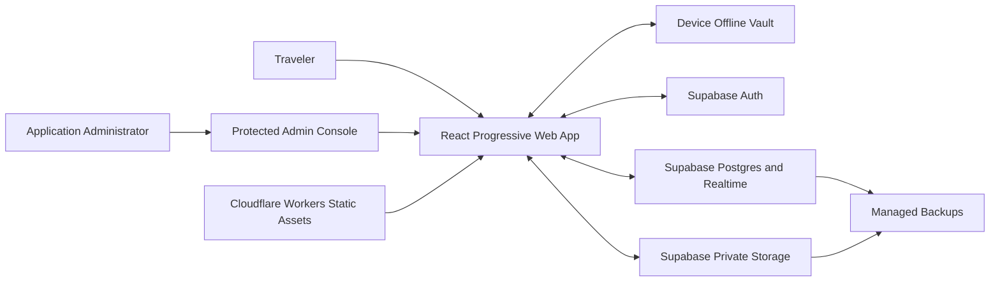
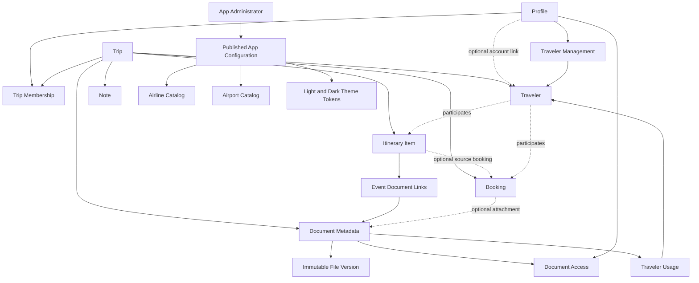
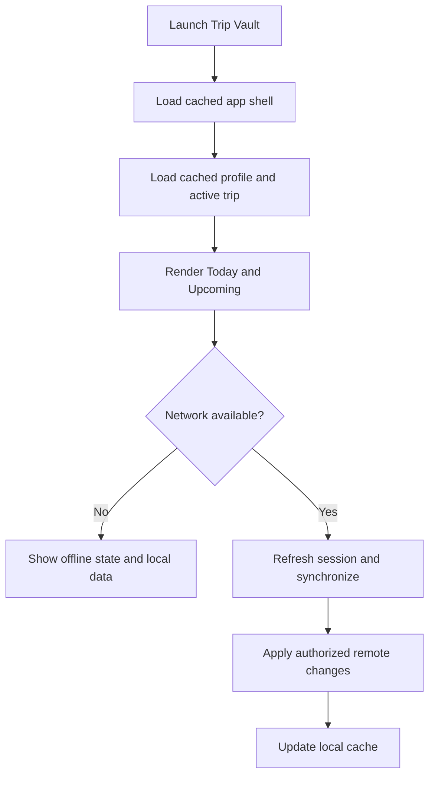
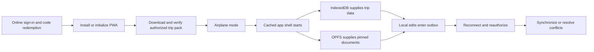

# Trip Vault High-Level Design

Trip Vault is a personal-use installable web application that keeps travel bookings, itineraries, notes, and documents together for the owner and invited travel companions. It is not intended to become a commercial product. This document records the implemented system boundaries and the few deliberately deferred capabilities.

**Document status:** Implemented personal MVP 1.0

**Implementation status:** Timeline-first local application complete; configured Supabase project requires `202609110001_timeline_redesign.sql` and remote acceptance testing

**Default decision state:** Accepted unless explicitly marked as deferred

## 1. Product Vision

A traveler should be able to open Trip Vault and immediately answer:

- What do I need to do next?
- Where am I going and when?
- Where is the booking or document I need right now?
- Is this information available without a network connection?
- Which travelers can see or edit it?

The product should feel like a focused travel utility, not a general cloud drive.

The primary trip experience is a chronological projection over itinerary rows. Detailed booking, journey-leg, cost, readiness, and document records remain authoritative in their own tables and link into that projection. Readiness is derived into one pre-trip summary card; optional dated work such as packing or SIM setup is stored as a normal Preparation event.

## 2. Goals and Non-Goals

### Goals

| Goal | Outcome |
|---|---|
| One application across devices | Phone, tablet, and desktop use the same responsive codebase |
| Personal-use scope | Optimize for the owner and invited travel companions rather than public or commercial use |
| Immediate trip context | Today and Upcoming views load from locally cached structured data |
| Reliable offline access | Users explicitly pin trips or documents and receive a verified readiness result |
| Safe collaboration | Trip membership and document visibility control who can access data |
| Manageable document library | Cloud object storage holds originals while the database holds searchable metadata |
| Low operational complexity | Supabase owns application data, authentication, and document authorization; Cloudflare hosts the app |
| Future portability | The web app can later be wrapped or complemented by native clients without replacing the backend |

### Non-Goals for the First Release

| Non-goal | Reason |
|---|---|
| Full airline or hotel booking engine | Trip Vault organizes existing reservations rather than selling travel |
| Automatic support for every email provider | Manual entry and upload establish the core model first |
| Provider-blind end-to-end encryption | Key recovery, sharing, search, and previews require a separate product decision |
| Guaranteed background work on every mobile browser | Browser support is inconsistent; foreground resume is the reliable baseline |
| Full expense-splitting platform | Useful later, but not part of the core travel-information problem |
| Native iOS and Android applications | The installable PWA is the first delivery format |
| Commercial or public product | Billing, subscriptions, public acquisition, organization tenancy, commercial support, and commercialization are outside the permanent product scope |

## 3. Users and Collaboration Boundary

| Actor | Primary needs |
|---|---|
| Solo traveler | Keep personal bookings and sensitive documents organized and offline |
| Trip owner | Create a trip, invite travelers, control membership, and manage shared information |
| Trip editor | Add and update shared bookings, itinerary items, notes, and documents |
| Trip viewer | Read shared information and download documents permitted to them |
| Managed traveler | Participate in bookings and requirements without an account; an authorized organizer manages their information |
| Non-traveling collaborator | Help plan or view a trip through a signed-in editor or viewer membership without appearing as a traveler |
| Application administrator | Use a separate administrator account to maintain global travel metadata and published appearance defaults without receiving access to private trips |

The **trip** is the primary collaboration boundary. Every person who opens private trip information must authenticate and hold active membership. A traveler record is separate from an account: a member may be linked to their own traveler, manage another traveler, or join only as a non-traveling collaborator. Document visibility can narrow membership access further.

## 4. System Context

## 5. Component Responsibilities

| Component | Responsibility | Explicitly does not own |
|---|---|---|
| React PWA | User interface, protected admin console, validation, local-first reads, sync orchestration, previews | Authoritative permissions or permanent originals |
| Device offline vault | Cached structured data, pinned files, pending mutations | Cross-device truth or long-term backup |
| Supabase Auth | Email-only identity, sign-in sessions, and identity used to redeem a join code | Trip authorization by itself |
| Supabase Postgres | Trips, memberships, bookings, itinerary, notes, document metadata, access rules | Binary file contents |
| Supabase Realtime | Notify connected members of shared-data changes | Durable event history or file transfer |
| Supabase Storage | Private original files and immutable versions | Business metadata or offline guarantees |
| Cloudflare | Application deployment, TLS, static-asset delivery, optional narrow API routes | Primary trip database or duplicate document storage |

## 6. Core Architectural Principles

### 6.1 Structured data before document parsing

Dashboard information must come from booking and itinerary records, not from opening and re-reading PDFs. A document supports a record but does not replace it.

### 6.2 Cloud source of truth, local travel pack

Supabase remains authoritative across devices. The device holds a synchronized working copy and explicitly pinned originals for offline use.

### 6.3 One file platform in the first release

Supabase Storage holds documents because it shares authentication and row-level authorization with the database. Cloudflare R2 remains a later option only if measured scale or cost justifies a migration.

### 6.4 Offline readiness is verified

The label **Ready offline** may be shown only when complete structured trip data and every current document version the user is authorized to open exist locally and match the server manifest. A deliberately reduced file set is labeled **Essentials ready**.

### 6.5 Sharing is authenticated and code-based

The owner creates a unique, expiring, one-time code for an intended traveler or non-traveling collaborator. The recipient signs up or signs in before entering the code. Redeeming it creates membership atomically and invalidates the code. A code never provides anonymous trip access, and permanent public trip or document URLs are not part of the design.

### 6.6 Sensitive defaults

New documents are private to their uploader until the user deliberately chooses trip-wide or selected-member visibility. Removing a member prevents future cloud access but cannot revoke copies already downloaded.

### 6.7 Document meaning is separate from access

A document has four independent concerns: immutable file versions, a specific travel purpose, links to bookings/events/journey legs, and traveler usage. Usage is **Shared**, **Selected travelers**, or **Assign later** and never grants access. Visibility remains **Only me**, **Signed-in trip members**, or **Selected signed-in members**. This permits one accommodation confirmation to support a group, a personal visa or boarding pass to follow one traveler, and unnamed admission tickets to remain in a pool until assigned.

The document route is a viewer first: an authorized PDF or image opens automatically from the verified device copy, or downloads once and is then cached locally. Native full-screen viewing remains available for zooming. File facts, access, local-copy controls, replacement, archiving, and version history live behind an information action instead of displacing the travel document.

## 7. Primary Data Domains

## 8. Major User Flows

### 8.1 Open the app

### 8.2 Add a booking or document

1. The user selects the trip and content type.
2. For a document, the user chooses a concrete purpose and whether it is shared, assigned to selected travelers, or awaiting assignment; access is chosen separately.
3. The app validates the file, calculates its checksum, and points to an existing Vault item when the same bytes already exist in that trip.
4. A new file and metadata record are saved locally immediately.
5. If online, structured data is written to Supabase and files upload separately; if offline, the mutation remains in the device outbox.
6. The UI shows `Saved locally`, `Syncing`, `Synced`, or a safe `Action required` reason.
7. Other connected members receive only metadata and files allowed by document visibility.

### 8.3 Prepare a trip for offline use

1. The user chooses **Make trip available offline**.
2. The app calculates required structured data and all current documents authorized for that user.
3. Available device quota is checked.
4. Missing files download with visible progress.
5. Checksums are verified locally.
6. The trip receives a timestamped readiness result.
7. Any later server change marks the pack as needing refresh.

### 8.4 Join with a one-time code

1. The owner creates or selects a traveler, or chooses **Non-traveling collaborator**.
2. The owner chooses Editor or Viewer and generates a cryptographically random code.
3. The recipient creates an account or signs in; no trip identity is revealed before authentication.
4. The recipient enters the code while online.
5. The backend validates expiry, revocation, attempted reuse, and the intended target.
6. One transaction creates membership, links the account to the traveler when applicable, and consumes the code.
7. The recipient may then prepare their authorized trip data and documents for offline use.

### 8.5 Operate without a connection

After a device has been authenticated and a trip is marked **Ready offline**, Home, itinerary, bookings, readiness, alerts, manual flight updates, and downloaded documents operate without Supabase or Cloudflare. First-time sign-up, code redemption, membership changes, missing document downloads, external maps, and flight-tracker links still require a connection.

### 8.6 Publish application metadata

Administrator configuration is an online-only workflow. The Admin console never presents an offline edit as saved and never queues a publish or rollback for later replay.

1. The administrator signs in through the separate Admin entry using a dedicated Supabase Auth account.
2. Server-side authorization confirms an active application-administrator record; the route itself never grants the role.
3. The administrator edits a draft airline, airport, travel-default, or light/dark appearance configuration.
4. Validation and accessibility checks run before preview.
5. Publishing creates an immutable configuration version and records the actor and time.
6. Connected clients fetch the newest published version; prepared devices retain their last cached version offline.
7. Existing trips retain copied airline and airport snapshots unless an owner deliberately applies newer metadata.

## 9. Deployment and Environments

| Environment | Purpose | Data policy |
|---|---|---|
| Local | Development and automated tests | Synthetic data only |
| Preview | Review each proposed change on a temporary URL | Synthetic or dedicated test project |
| Personal live | Real traveler data | Dedicated Trip Vault Supabase project and live secrets |

The deployment unit is a React/Vite build configured for Cloudflare Workers with Static Assets. Supabase configuration is injected through environment-specific public settings; privileged service credentials must never enter the browser bundle.

### 9.1 Supabase project boundary

Trip Vault uses its own Supabase project, separate from every other personal application. That project supplies one integrated default Postgres database together with its own Auth users, Storage buckets, Realtime configuration, API URL, and keys.

Additional Postgres databases must not be manually created inside another application's Supabase project. Supabase's integrated Dashboard, Auth, API, Storage, and Realtime services are designed around each project's default database.

## 10. Security and Privacy Boundaries

| Concern | Proposed control |
|---|---|
| Unauthorized database reads | Row Level Security based on active trip membership |
| Unauthorized file reads | Private storage bucket plus membership-aware policies |
| Exposure of trip details | Require authentication and active membership before returning destination, dates, travelers, bookings, or document metadata |
| Unauthorized administration | Separate administrator account, server-checked application role, least-privilege RLS, immutable publication history, and no self-promotion path |
| Administrative privacy overreach | Application-administrator status grants configuration access only and never bypasses trip membership or document visibility |
| Accidental broad sharing | Private-by-default documents and explicit visibility selection |
| Leaked download address | Authenticated downloads or short-lived signed URLs |
| Secret exposure | Publishable client key only; privileged keys remain server-side |
| Shared or lost device | Clear cached vault on sign-out; provide local-copy removal control |
| Sensitive logs | Never log document content, booking codes, passport data, or signed URLs |
| Deleted membership | Block new access immediately; disclose that existing downloaded copies cannot be revoked |

Custom end-to-end encryption remains an unresolved decision. If provider-blind storage becomes mandatory, it must be decided before file previews, sharing, and import automation are implemented.

## 11. Availability, Backup, and Recovery

- Online data and files remain authoritative even when local browser storage is cleared.
- The application must remain usable offline from its last verified local state and queue supported edits for later synchronization.
- Pending local changes must be visibly distinguished from synchronized records.
- A trip export should provide a user-controlled recovery copy in a portable format.
- Free-tier pausing after a quiet period is an accepted limitation for this personal application.
- Before a trip, the owner resumes the project if necessary, synchronizes current data, and verifies the offline trip pack.
- During a pause, cloud login, synchronization, and sharing are unavailable; previously verified local data remains the travel fallback.
- Offline-capable means a previously initialized device can start the cached app, read its authorized trip pack, preview verified local documents, compute alerts, and queue supported edits without contacting the backend.
- Browser storage remains device-local and can still be removed by the user, PWA uninstall, site-data clearing, quota pressure, or device loss; it is a working travel copy rather than the only permanent archive.
- The app requests persistent storage, checks quota, bundles its fonts/icons/airline catalog, and verifies every downloaded file before showing **Ready offline**.
- An always-on paid tier is optional and is needed only if the owner later decides manual pre-trip activation is inconvenient.
- Document deletion should use a recovery window before irreversible object removal.

## 12. Scale Assumptions

Initial design targets:

| Dimension | Planning assumption |
|---|---|
| Members per trip | Usually 1–20 |
| Trips per user | Tens active, hundreds historical |
| Documents per trip | Tens to low hundreds |
| Accepted document | PDF or approved image smaller than 5,000,000 bytes |
| Oversized document | Rejected with measured-size guidance; never automatically altered in MVP |
| Offline pack | User-selected; never silently download the entire lifetime vault |

These are design assumptions, not enforced limits. Metrics from actual use should guide later changes.

## 13. Decision Register

| ID | Decision | Current recommendation | Status |
|---|---|---|---|
| HLD-001 | Delivery format | React TypeScript PWA first | Accepted |
| HLD-002 | Application hosting | Cloudflare Workers with Static Assets | Accepted |
| HLD-003 | System of record | Dedicated Trip Vault Supabase project and its default Postgres database | Accepted |
| HLD-004 | File platform | Supabase private Storage only for v1 | Accepted |
| HLD-005 | Offline model | Structured cache plus explicitly pinned file packs | Accepted |
| HLD-006 | Collaboration boundary | Trip membership with owner, editor, and viewer roles | Accepted |
| HLD-007 | Document visibility | Private, whole trip, or selected members | Accepted |
| HLD-008 | Offline synchronization | Foreground-first outbox with retryable file operations | Accepted |
| HLD-009 | Native applications | Reconsider only after PWA constraints are measured | Accepted |
| HLD-010 | Custom end-to-end encryption | Deferred; browser/OS profile isolation is the personal MVP boundary | Accepted |
| HLD-011 | Permanent product scope | Personal use by the owner and invited travel companions; no commercial roadmap | Accepted |
| HLD-012 | Login and onboarding | Email-only Supabase authentication; onboarding has no separate confirmation gate for now | Accepted |
| HLD-013 | Free-tier availability | Pausing is acceptable with pre-trip resume, sync, and offline verification | Accepted |
| HLD-014 | Backend isolation | Trip Vault receives its own Supabase project rather than another database in an existing project | Accepted |
| HLD-015 | Current-trip context | Each user has at most one focused current trip; current mode begins one calendar day before departure in the trip time zone | Accepted |
| HLD-016 | Flight operations | Flight status, delays, gates, terminals, and baggage details are maintained manually; airline and public tracker links are supporting actions | Accepted |
| HLD-017 | Reminder delivery | MVP reminders are recomputed on app load and shown in an in-app Alerts page; web push is optional later | Accepted |
| HLD-018 | Map integration | MVP opens keyless Google Maps URLs; embedded map images, paid geocoding, route optimization, and offline map downloads are excluded | Accepted |
| HLD-019 | Visa guidance | Store user-entered visa requirements and dates without automated eligibility claims | Accepted |
| HLD-020 | Trip invitation | Authenticated recipient enters a unique, expiring, one-time code bound to one traveler or collaborator invitation | Accepted |
| HLD-021 | Traveler identity | Travelers exist independently from accounts; an account can claim a traveler or join as a non-traveling collaborator, while Owner/Editor members use a convenient traveler context switcher without impersonation or per-traveler capability setup | Accepted |
| HLD-022 | Trip privacy | No real trip details are visible before sign-in and active membership | Accepted |
| HLD-023 | Offline operating boundary | A previously initialized and verified trip pack supports local reads, document preview, alerts, and queued edits; enrollment and synchronization remain online | Accepted |
| HLD-024 | Administrator access | Separate Admin sign-in route and dedicated Supabase Auth account protected by an application-admin allowlist | Accepted |
| HLD-025 | Administrator privacy boundary | App administrators manage catalogs and presentation defaults but receive no implicit access to trips, travelers, or documents | Accepted |
| HLD-026 | Theme support | Bundle accessible light and dark tokens, default to the device preference, permit a local override, and cache the published palette offline | Accepted |
| HLD-027 | Metadata publication | Admin edits are online-only and use draft, preview, publish, audit, and rollback; existing trips keep their copied metadata until explicitly refreshed | Accepted |
| HLD-028 | Visual references | Use multiple references for hierarchy and itinerary structure while creating an original Trip Vault identity | Accepted |
| HLD-029 | Current-item emphasis | Combine a restrained discrete zoom/elevation with an explicit Current or Now label; never use continuous scroll-linked zoom or motion-only meaning | Accepted |
| HLD-030 | Demonstration trip | Bundle a resettable synthetic trip and small watermarked sample documents that work offline without Supabase | Accepted |
| HLD-031 | Document size boundary | Accept only files smaller than 5,000,000 bytes and enforce the limit before local queuing and in cloud storage | Accepted |
| HLD-032 | Document compression | Do not automatically rewrite files in MVP; consider explicit user-reviewed image optimization later and leave PDFs unchanged | Accepted |
| HLD-033 | Local document opening | A current local sign-in and a verified file in that profile's device namespace are sufficient to open it; only cloud retrieval rechecks trip and document authorization | Accepted |
| HLD-034 | Itinerary event attachments | Model event-to-document links independently so an event can contain many documents and unlinking an event never deletes the Vault document | Accepted |
| HLD-035 | Document traveler usage | Keep usage separate from access and support Shared, Selected travelers, and Assign later with a many-to-many traveler relationship | Accepted |
| HLD-036 | Document interaction | Open PDFs/images directly in a local-first viewer; put metadata and management behind an Info action and retain native full-screen zoom | Accepted |
| HLD-037 | Duplicate files | Compare SHA-256 within the trip before storing another copy and direct the user to the existing Vault document | Accepted |

## 14. Risks Requiring Explicit Discussion

| Risk | Why it matters | Candidate response |
|---|---|---|
| Browser storage eviction | A traveler may assume a file is present when it is not | Persistent-storage request, readiness verification, and export fallback |
| Sensitive travel documents | Passports and visas have higher impact than ordinary attachments | Private defaults, least-privilege access, optional local storage, audit trail |
| Conflicting offline edits | Two travelers can change the same record | Version checks and an explicit conflict-resolution screen |
| Stale itinerary times | Time zones and schedule changes can mislead travelers | Store original time zone and mark last synchronization time |
| Join code is disclosed or guessed | Possession of an unredeemed code could grant membership | High-entropy code, server-side hash, short expiry, rate limiting, atomic single use, revocation, and no pre-redemption trip details |
| Admin account is compromised | Global metadata or unsafe action links could be changed | Dedicated account, stronger sign-in option, server-side role check, HTTPS-only URL validation, publication audit, and rollback |
| Custom colors reduce readability | Admin-selected palettes could hide important travel information | Token allowlist, light/dark preview, automated contrast validation, and bundled safe fallback palettes |
| Motion distracts or causes discomfort | Large or scroll-linked scale effects can obscure hierarchy and trigger vestibular symptoms | Small discrete transitions, stable layout, explicit labels, and a reduced-motion path with no transforms |
| A required scan exceeds 5 MB | The strict limit may block high-resolution camera scans | Reject before local queuing, show exact size and export guidance, and evaluate an explicit image-copy optimizer only after MVP |
| Free backend suspension | Cloud access may be unavailable at the beginning of a trip | Owner resumes before travel, synchronizes, and verifies the offline pack |
| Scope expansion | Imports, maps, notifications, and expenses can delay the core | Freeze MVP after feature review |

## 15. Recorded Review Order

1. Confirm PWA-first and whether a native wrapper is ever needed for personal use.
2. Agree on the privacy model for passports, visas, and local copies.
3. Define exactly what **Ready offline** promises.
4. Agree on trip roles and per-document visibility.
5. Confirm the MVP feature boundary.
6. Review the detailed data model and conflict behavior.
7. Approve visual direction and only then begin implementation.

## Source File Index

The implementation is organized by application shell, product feature, local persistence, and backend schema. Detailed paths and verification ownership are indexed in the LLD.

| Resource | Path | Responsibility |
|---|---|---|
| High-level design | `docs/HIGH_LEVEL_DESIGN.md` | System boundaries, major flows, and decision register |
| Low-level design | `docs/LOW_LEVEL_DESIGN.md` | Implemented application and data contract |
| Feature catalog | `docs/FEATURES.md` | Product scope and acceptance conditions |
| Redesign checklist | `docs/REDESIGN_CHECKLIST.md` | Active timeline-first decisions, schema impact, and preview slices |
| Database migrations | `supabase/migrations/` | Authoritative schema, functions, grants, Storage configuration, and RLS |
| Application source | `src/` | React PWA, feature workflows, offline storage, and tests |
| Documentation conventions | `docs/doc-conventions.md` | Status and writing rules |
