# Trip Vault Low-Level Design

This document is the implementation contract for the personal Trip Vault MVP. The timeline-first application, device storage, Supabase schema, PWA behavior, and administrator console exist in the repository. Online reads use Supabase first with an IndexedDB fallback; offline reads use the device copy directly.

**Document status:** Implemented personal MVP 1.0

**Implementation status:** Timeline-first implementation plus the accepted event-form and document-experience redesign are complete in the local working tree. Existing Supabase projects apply every pending migration in filename order through the single new tail `supabase/migrations/202609140001_event_form_data_model.sql`. Fresh projects run `supabase/TRIP_VAULT_COMPLETE_SETUP.sql` for the current schema, bootstrap an active administrator, and then publish the regional and booking-vendor catalog releases as described in 16.6. Remote, responsive, and airplane-mode acceptance remain pending.

## 1. Technology Set

| Concern | Implemented choice | Decision state | Notes |
|---|---|---|---|
| Language | TypeScript | Implemented | Shared types and safer data migrations |
| UI | React | Implemented | Responsive component model |
| Build and local development | Vite | Implemented | Supported by Cloudflare tooling |
| Hosting | Cloudflare Workers with Static Assets | Configured | SPA hosting is configured; successful post-push deployment is not verified in this document |
| Routing | React Router | Implemented | Explicit route and layout model |
| Remote query cache | TanStack Query | Implemented | Online request lifecycle; not the offline source of truth |
| Local metadata database | IndexedDB through Dexie | Implemented | Queryable structured offline data and migration support |
| Local file storage | Origin Private File System with fallback | Implemented | Pinned documents and checksum verification |
| PWA lifecycle | Service worker generated through a Vite-compatible PWA plugin | Implemented | App-shell caching and update prompts |
| Safe document rendering | Vendored Mozilla PDF.js 6.3.289 plus native image rendering | Implemented | Same-origin module/worker assets render PDFs to canvas; device Open remains fallback |
| Database and identity backend | Supabase | Accepted | Auth, Postgres, and Realtime in a dedicated Trip Vault project |
| Cloud file storage | Supabase private Storage | Implemented | Separate private account inbox and trip-version bucket keep persistence independent from association |
| Authentication | Supabase email-only authentication | Accepted | Onboarding has no separate confirmation gate for now; detailed session behavior follows the Supabase project configuration |
| Administrator authorization | Dedicated Supabase Auth account plus `app_admins` allowlist and RLS | Accepted | Separate Admin entry; no new authentication provider and no implicit trip access |
| Validation | Zod | Implemented | Shared parsing at network and form boundaries |
| Styling | Design tokens plus Tailwind CSS | Implemented | Semantic tokens support both appearance modes |
| Appearance modes | CSS custom properties with System, Light, and Dark | Accepted | Bundled fallback palettes, local preference, published admin palette, and offline startup |
| Motion | Property-specific Tailwind transitions plus CSS scroll snap and Intersection Observer | Implemented | Restrained focus changes and reduced-motion fallback |
| Map hand-off | Google Maps URLs | Accepted | Search and directions links need no API key; no embedded maps, geocoding, or downloads in MVP |
| Flight status | Manual records plus external links | Accepted | No live-data provider, scraping, or background polling |
| Testing | Vitest, React Testing Library, SQL smoke test, and manual browser acceptance | Implemented | Exact automated baseline is recorded in 16.1; remote SQL, phone/desktop, Storage, and airplane-mode acceptance remain manual |

## 2. Implemented Repository Layout

```text
trip-vault/
├── docs/
│   ├── HIGH_LEVEL_DESIGN.md
│   ├── LOW_LEVEL_DESIGN.md
│   ├── FEATURES.md
│   ├── REDESIGN_CHECKLIST.md
│   ├── FEATURE_TEST_CHECKLIST.md
│   ├── source-index.md
│   └── doc-conventions.md
├── public/
│   ├── demo-documents/
│   ├── icons/
│   ├── vendor/pdfjs/
│   └── brand-mark.svg
├── src/
│   ├── app/
│   │   ├── App.tsx
│   │   ├── AppProviders.tsx
│   │   └── RouteScrollManager.tsx
│   ├── components/
│   ├── demo/
│   ├── features/
│   │   ├── admin/
│   │   ├── alerts/
│   │   ├── home/
│   │   ├── metadata/
│   │   ├── readiness/
│   │   ├── sync/
│   │   ├── timeline/
│   │   ├── trips/
│   │   └── workspace/
│   ├── lib/
│   │   ├── auth/
│   │   ├── forms/
│   │   ├── local-db/
│   │   ├── storage/
│   │   ├── supabase/
│   │   └── theme/
│   ├── pages/
│   ├── styles/globals.css
│   └── test/
├── supabase/
│   ├── migrations/
│   ├── tests/
│   └── TRIP_VAULT_COMPLETE_SETUP.sql
├── scripts/
├── .env.example
├── package.json
├── tsconfig.json
├── vite.config.ts
└── wrangler.jsonc
```

Feature folders should own their views, hooks, validation, and tests. Shared primitives move into `components/` or `lib/` only after at least two features use them.

## 3. Route Map

| Route | Access | Primary view | Offline behavior |
|---|---|---|---|
| `/` | Public or authenticated | Redirect to onboarding or home | App shell available |
| `/welcome` | Public | Welcome and value introduction | Fully available |
| `/preview` | Public | Sample Mediterranean trip | Fully available with bundled demo data |
| `/sign-in` | Public | Email-only Supabase sign-in | Explains that connection is required |
| `/join` | Authenticated | Enter and redeem a one-time trip code | Connection required; reveals no real trip data before successful redemption |
| `/admin/sign-in` | Public | Dedicated administrator account sign-in | Connection required; generic denial reveals no allowlist membership |
| `/admin` | Application administrator | Configuration overview, validation failures, and published version | Cached view optional; all changes require connection |
| `/admin/airlines` | Application administrator | Global airline catalog and action templates | Read-only cached view; publishing unavailable |
| `/admin/airports` | Application administrator | Airport names, codes, timezones, aliases, and optional location | Read-only cached view; publishing unavailable |
| `/admin/vendors` | Application administrator | Booking vendor names, links, branding, ordering, and enablement | Read-only cached view; publishing unavailable |
| `/admin/suggestions` | Application administrator | Privacy-safe airline, airport, vendor, and provider suggestions | Not available offline |
| `/admin/defaults` | Application administrator | Booking, document, readiness, reminder, and link defaults | Read-only cached view; publishing unavailable |
| `/admin/appearance` | Application administrator | Light/dark token editor and preview | Bundled preview works; saving and publishing require connection |
| `/admin/releases` | Application administrator | Draft, publish history, audit, and rollback | Connection required |
| `/home` | Authenticated | Upcoming-trip or current-trip Home | Online trip read refreshes Supabase first; mode and focus are derived locally from the returned or cached collection |
| `/alerts` | Authenticated | Urgent, Today, Upcoming, and dismissed alerts | Alerts and unread count are derived locally from the currently loaded or cached data |
| `/trips` | Authenticated | Upcoming, active, and past trips | Supabase first online; cached trip index on failure or offline |
| `/trips/new` | Authenticated | Create a trip | A valid submitted creation is cached and queued; unfinished fields are not an autosaved draft |
| `/trips/:tripId` | Trip member | Complete chronological timeline by default; `?view=details` opens sectioned trip details | Online refresh with cached fallback; offline reads the authorized device snapshot and restores timeline position |
| `/trips/:tripId/reservations` | Trip member | Complete chronological reservation index with search, category counts, and traveler filter | Uses the same cached trip, booking, leg, document, and traveler collections as Trip details |
| `/trips/:tripId/documents` | Trip member | Complete trip-document index with Needed next, search, category filter, and traveler filter | Uses cached authorized document metadata and cached event/document relationships; opening a file follows the existing local-first document route |
| `/trips/:tripId/bookings/:bookingId` | Trip member | Booking details and attachments | Network-first metadata with cached fallback |
| `/trips/:tripId/flights/:flightLegId` | Trip member | Flight details, manual update, ticket, boarding pass, and baggage tags | Network-first metadata with cached fallback; local document files remain available |
| `/trips/:tripId/readiness` | Trip member | Visa, passport, insurance, check-in, and custom requirements | Network-first list with cached fallback; supported submissions queue locally |
| `/trips/:tripId/documents/:documentId` | Authorized member | Local-first document viewer with secondary information/actions sheet | Verified local version opens immediately; a permitted cloud version downloads once and is cached |
| `/vault` | Authenticated | Searchable cross-trip document index | Searches local metadata; remote refresh when online |
| `/add` | Authenticated | Quick-add chooser | Drafts can be stored locally |
| `/profile` | Authenticated | Account, private document inbox, devices, storage, and security | Local settings and locally staged uploads remain available |

The wide-screen layout may render several routes as side panels, but URL identity must remain stable.

## 4. Domain Types

### 4.1 Enumerations

| Type | Implemented values |
|---|---|
| `trip_status` | `draft`, `upcoming`, `active`, `completed`, `archived` |
| `member_role` | `owner`, `editor`, `viewer` |
| `member_status` | `active`, `removed` |
| `participation_type` | `traveler`, `collaborator` |
| `traveler_status` | `active`, `removed` |
| `invitation_target_type` | `traveler`, `collaborator` |
| `app_admin_status` | `active`, `disabled` |
| `config_release_status` | `draft`, `published`, `retired` |
| `theme_preference` | `system`, `light`, `dark` |
| `booking_type` | `flight`, `hotel`, `train`, `bus`, `ferry`, `cab`, `transport`, `activity`, `restaurant`, `other` |
| `booking_reservation_state` | `planned`, `walk_up`, `booked` |
| `participant_scope` | `everyone`, `selected` |
| `timeline_event_type` | `flight`, `train`, `bus`, `ferry`, `cab`, `hotel_check_in`, `hotel_check_out`, `transport`, `meal`, `activity`, `preparation`, `custom` |
| `journey_mode` | `train`, `bus`, `ferry`, `cab` |
| `journey_scope` | `domestic`, `international` |
| `journey_structure` | Transient form choice only: `direct`, `connecting`; persisted ordered-leg count is authoritative |
| `cost_category` | `flight`, `hotel`, `transport`, `activity`, `food`, `visa`, `insurance`, `other` |
| `payment_status` | `planned`, `paid`, `refunded` |
| `document_category` | `flight`, `hotel`, `activity`, `visa`, `passport`, `insurance`, `ticket`, `transport`, `receipt`, `other` |
| `document_purpose` | `confirmation`, `ticket`, `boarding_pass`, `baggage_tag`, `visa`, `passport`, `insurance`, `hotel_confirmation`, `activity_ticket`, `meal_voucher`, `receipt`, `other` |
| `document_assignment_mode` | `shared`, `selected`, `unassigned` |
| `document_visibility` | `private`, `traveler_and_managers`, `trip`, `selected_members` |
| `flight_status` | `scheduled`, `check_in_open`, `boarding`, `delayed`, `departed`, `landed`, `cancelled` |
| `requirement_type` | `visa`, `passport`, `insurance`, `check_in`, `payment`, `packing`, `custom` |
| `requirement_status` | `to_check`, `not_required`, `required`, `in_progress`, `complete`, `expired` |
| `alert_severity` | `urgent`, `today`, `upcoming`, `information` |
| `focus_source` | `automatic`, `manual` |
| `sync_state` | `local_only`, `queued`, `syncing`, `synced`, `conflict`, `failed` |
| `offline_state` | `not_requested`, `preparing`, `essentials_ready`, `ready`, `stale`, `failed`, `insufficient_space` |

### 4.2 Shared value objects

Location data is context-specific rather than one shared database type:

| Context | Stored shape | Rule |
|---|---|---|
| Booking | Human-readable label/address in booking `location`, with optional future coordinates | User entry is preserved; coordinates are never required |
| Itinerary item | `label`, `address`, and optional HTTPS `map_url` | At least one useful location value is supplied when a map action is expected |
| Journey endpoint | Name/code/country plus a strict IANA time zone on each leg | Origin and destination are independent snapshots |

The app uses an explicit `map_url` when present; otherwise it builds a keyless Google Maps search from the stored label or address. Flight, train, bus, ferry, and cab forms do not ask for this generic location: their complete route is derived from ordered endpoints. Local stays, meals, activities, preparation, other transport, and custom events may use the shared place/address shape.

### 4.3 Database Tables

The catalog below is the logical model implemented by the migration set. The migration SQL remains authoritative for exact PostgreSQL types, defaults, triggers, indexes, grants, and Row Level Security policies.

#### `profiles`

| Field | Type | Purpose |
|---|---|---|
| `id` | UUID, primary key | Matches authenticated user ID |
| `display_name` | Text | Name shown to trip members |
| `avatar_path` | Text, nullable | Private or public-safe avatar reference |
| `home_timezone` | Text | Default for new trips |
| `created_at` | Timestamp | Audit timestamp |
| `updated_at` | Timestamp | Change detection |

#### `app_admins`

This table authorizes the separate administrator account. It is bootstrapped through a migration or trusted Supabase administrative operation; the browser has no insert, update, delete, or self-promotion policy.

| Field | Type | Purpose |
|---|---|---|
| `user_id` | UUID, primary key | Dedicated Supabase Auth administrator account |
| `status` | `app_admin_status` | Active or disabled |
| `granted_by` | UUID, nullable | Trusted bootstrap or prior administrator audit |
| `created_at` | Timestamp | Grant audit |
| `disabled_at` | Timestamp, nullable | Revocation audit |

#### `config_releases`

| Field | Type | Purpose |
|---|---|---|
| `id` | UUID, primary key | Configuration release identity |
| `version_number` | Integer, unique | Monotonic version shown to clients |
| `status` | `config_release_status` | Draft, currently published, or retired |
| `based_on_release_id` | UUID, nullable | Version copied to create the draft |
| `change_note` | Text | Administrator summary |
| `created_by` | UUID | Administrator author |
| `created_at` | Timestamp | Draft creation time |
| `published_by` | UUID, nullable | Administrator who published or rolled back |
| `published_at` | Timestamp, nullable | Activation time |

Exactly one release may be `published`. Publishing or rollback is a server transaction; travelers never read draft rows.

#### `airline_catalog_entries`

| Field | Type | Purpose |
|---|---|---|
| `id` | UUID, primary key | Stable catalog-entry identity |
| `config_release_id` | UUID | Draft or published version containing the row |
| `stable_key` | Text | Identity preserved across configuration releases |
| `name` | Text | Airline display name |
| `iata_code` | Text, nullable | Two-character code where known |
| `icao_code` | Text, nullable | Three-character code where known |
| `aliases` | Text array | Searchable former or familiar names |
| `check_in_url_template` | Text, nullable | Official check-in action |
| `manage_booking_url_template` | Text, nullable | Official booking-management action |
| `status_url_template` | Text, nullable | Official status action |
| `tracker_url_template` | Text, nullable | Default public tracker action |
| `brand_color` | Text, nullable | Optional accessible accent |
| `logo_asset_path` | Text, nullable | Immutable catalog asset |
| `banner_asset_path` | Text, nullable | Immutable catalog asset |
| `is_enabled` | Boolean | Available in new-flight pickers |
| `updated_by` | UUID | Administrator audit |
| `updated_at` | Timestamp | Change time |

#### `airport_catalog_entries`

| Field | Type | Purpose |
|---|---|---|
| `id` | UUID, primary key | Stable catalog-entry identity |
| `config_release_id` | UUID | Draft or published version containing the row |
| `stable_key` | Text | Identity preserved across releases |
| `iata_code` | Text, nullable | Three-character passenger airport code |
| `icao_code` | Text, nullable | Four-character airport code |
| `name` | Text | Airport display name |
| `city` | Text | Primary served city |
| `country_code` | Text | ISO country code |
| `timezone` | Text | IANA timezone used to seed flight times |
| `aliases` | Text array | Search terms such as metro or former names |
| `latitude` | Decimal, nullable | Optional picker/map seed |
| `longitude` | Decimal, nullable | Optional picker/map seed |
| `is_enabled` | Boolean | Available in new-flight pickers |
| `updated_by` | UUID | Administrator audit |
| `updated_at` | Timestamp | Change time |

Airport entries seed a flight leg. The leg keeps its own code, name, and timezone snapshot so later catalog corrections do not rewrite travel history.

#### `booking_vendor_catalog_entries`

| Field | Type | Purpose |
|---|---|---|
| `id` | UUID, primary key | Catalog-entry identity |
| `config_release_id` | UUID | Draft or published configuration version |
| `stable_key` | Text | Identity copied into a booking snapshot |
| `name` | Text | Vendor display name |
| `aliases` | Text array | Autocomplete search values |
| `website_url` | HTTPS URL, nullable | Safe hand-off to the vendor |
| `logo_asset_path` | Text, nullable | Validated catalog artwork |
| `brand_color` | Hex color, nullable | Optional accessible accent |
| `is_enabled` | Boolean | Included in new-entry autocomplete |
| `sort_order` | Integer | Admin-controlled ordering |
| `updated_by` | UUID | Administrator audit actor |
| `updated_at` | Timestamp | Change time |

#### `catalog_suggestions`

Authenticated users may submit a privacy-safe unknown airline, airport, booking vendor, or service-provider value. The row stores normalized display metadata and a pending/approved/rejected review state, but never a booking reference, traveler name, trip identifier, or document content. Admin review is online-only.

#### `metadata_defaults`

| Field | Type | Purpose |
|---|---|---|
| `config_release_id` | UUID | Parent release |
| `namespace` | Text | `booking`, `document`, `readiness`, `alerts`, or `external_links` |
| `key` | Text | Code-defined setting identifier |
| `value` | JSON | Value validated by the matching Zod and database schema |
| `updated_by` | UUID | Administrator audit |
| `updated_at` | Timestamp | Change time |

Primary key: `(config_release_id, namespace, key)`. Admin can adjust labels, icons, ordering, enablement, suggested document visibility, readiness templates, reminder thresholds, and external-link defaults, but cannot invent executable schemas or authorization rules.

#### `theme_palettes`

| Field | Type | Purpose |
|---|---|---|
| `config_release_id` | UUID, primary key | Parent release |
| `light_tokens` | JSON | Allowlisted light-palette token values |
| `dark_tokens` | JSON | Allowlisted dark-palette token values |
| `updated_by` | UUID | Administrator audit |
| `updated_at` | Timestamp | Change time |

Only fixed token names and validated color values are accepted; arbitrary CSS, selectors, URLs, fonts, or scripts are prohibited.

#### `config_audit_events`

| Field | Type | Purpose |
|---|---|---|
| `id` | UUID, primary key | Audit identity |
| `config_release_id` | UUID | Affected draft or published release |
| `actor_id` | UUID | Application administrator |
| `action` | Text | Created, edited, validated, published, retired, or rolled_back |
| `safe_summary` | JSON | Changed keys and identifiers without secrets |
| `created_at` | Timestamp | Event time |

#### `trips`

| Field | Type | Purpose |
|---|---|---|
| `id` | UUID, primary key | Stable trip identifier |
| `title` | Text | User-facing trip name |
| `destination_summary` | Text | Short destination label |
| `start_date` | Date | Trip start |
| `end_date` | Date | Trip end |
| `primary_timezone` | Text | Device-captured compatibility fallback for trip-day grouping and non-journey entries; not a free-text user field |
| `status` | `trip_status` | Lifecycle state |
| `cover_image_path` | Text, nullable | Optional visual |
| `created_by` | UUID | Original owner |
| `version` | Integer | Optimistic concurrency counter |
| `created_at` | Timestamp | Audit timestamp |
| `updated_at` | Timestamp | Change detection and cache freshness |
| `deleted_at` | Timestamp, nullable | Recoverable soft deletion |

#### `user_trip_focus`

| Field | Type | Purpose |
|---|---|---|
| `user_id` | UUID, primary key | One focus record per user |
| `trip_id` | UUID | Current candidate selected for Home |
| `source` | `focus_source` | Distinguishes automatic choice from explicit switching |
| `updated_at` | Timestamp | Resolves newer local or remote choices |

This table does not make a trip current. The Home selector must still verify active membership and the D-1 date window before honoring it.

#### `trip_members`

| Field | Type | Purpose |
|---|---|---|
| `trip_id` | UUID | Membership scope |
| `user_id` | UUID | Member identity |
| `role` | `member_role` | Trip-level capability |
| `participation_type` | `participation_type` | Traveler or non-traveling collaborator |
| `status` | `member_status` | Invitation and access state |
| `joined_at` | Timestamp, nullable | Acceptance audit |
| `added_by` | UUID | Actor who initiated membership |
| `removed_at` | Timestamp, nullable | Revocation audit |

Primary key: `(trip_id, user_id)`.

#### `travelers`

A traveler is a person represented in bookings, itinerary items, requirements, and documents. The person may or may not operate an account.

| Field | Type | Purpose |
|---|---|---|
| `id` | UUID, primary key | Traveler identity within the trip |
| `trip_id` | UUID | Parent trip and authorization scope |
| `display_name` | Text | Name used in trip planning |
| `status` | `traveler_status` | Active or removed; claimed and managed labels are derived from relationship rows |
| `is_minor` | Boolean | Optional workflow hint; never used to infer legal authority |
| `created_by` | UUID | Member who added the traveler |
| `version` | Integer | Optimistic concurrency counter |
| `created_at` | Timestamp | Audit timestamp |
| `updated_at` | Timestamp | Change detection and cache freshness |
| `removed_at` | Timestamp, nullable | Removal audit |

#### `traveler_accounts`

| Field | Type | Purpose |
|---|---|---|
| `traveler_id` | UUID, primary key | Claimed traveler profile |
| `user_id` | UUID | Signed-in account linked to that traveler |
| `invitation_id` | UUID | One-time code redemption that established the link |
| `linked_at` | Timestamp | Claim audit |

One account can claim at most one traveler per trip. Non-traveling collaborators have no row here.

#### `traveler_managers`

This table is retained as a forward-compatible authorization boundary but is not configured by the personal MVP UI. In the MVP, an Owner or Editor stays signed in as themselves and uses a local traveler context switcher; this is selection, not impersonation.

| Field | Type | Purpose |
|---|---|---|
| `traveler_id` | UUID | Managed traveler |
| `user_id` | UUID | Active trip member acting as manager |
| `can_view_documents` | Boolean | Can open traveler-and-manager documents |
| `can_manage_documents` | Boolean | Can upload or replace those documents |
| `can_edit_profile` | Boolean | Can update traveler details |
| `assigned_by` | UUID | Owner who delegated management |
| `created_at` | Timestamp | Audit timestamp |
| `revoked_at` | Timestamp, nullable | Delegation end |

Primary key: `(traveler_id, user_id)`.

#### `trip_invitations`

| Field | Type | Purpose |
|---|---|---|
| `id` | UUID, primary key | Invitation identifier |
| `trip_id` | UUID | Trip being shared |
| `target_type` | `invitation_target_type` | Traveler claim or non-traveling collaboration |
| `traveler_id` | UUID, nullable | Required for traveler invitations; null for collaborators |
| `role` | `member_role` | Editor or Viewer role granted after redemption |
| `code_lookup` | Text, unique | Non-secret prefix used to locate the invitation safely |
| `code_secret_hash` | Text | Salted hash of the high-entropy secret; raw code is shown only when created |
| `expires_at` | Timestamp | Invitation expiry |
| `invited_by` | UUID | Inviting member |
| `redeemed_by` | UUID, nullable | Resulting member identity |
| `redeemed_at` | Timestamp, nullable | Atomic single-use audit |
| `revoked_at` | Timestamp, nullable | Manual invalidation |

The displayed code contains the lookup prefix and a cryptographically random secret. It is unique per invitation, not shared across the trip. Before redemption it is bound to an intended traveler slot or collaborator role; after redemption it is permanently bound to that authenticated user.

#### `trip_membership_offers`

This table supports later trips between accounts that have already shared an accepted trip. The owner selects a known account rather than sending another code, but the recipient still decides whether to join.

| Field | Type | Purpose |
|---|---|---|
| `id` | UUID, primary key | Offer identity |
| `trip_id` | UUID | Trip being offered |
| `invited_user_id` | UUID | Existing associated account that must respond |
| `target_type` | `traveler` or `collaborator` | Whether acceptance links a traveler profile |
| `traveler_id` | UUID, nullable | Intended traveler; null for a helper |
| `role` | `editor` or `viewer` | Membership role created on acceptance |
| `status` | Text | Pending, accepted, declined, or revoked |
| `offered_by` | UUID | Owner who sent the offer |
| `created_at`, `responded_at` | Timestamps | Consent audit |

Only one pending offer may exist for an account and trip. A security-definer RPC verifies prior association, trip ownership, target shape, and traveler availability. Acceptance creates membership and the optional traveler-account link atomically.

#### `booking_travelers`

| Field | Type | Purpose |
|---|---|---|
| `booking_id` | UUID | Parent booking |
| `traveler_id` | UUID | Traveler covered by the reservation |
| `updated_at` | Timestamp | Change detection |

Primary key: `(booking_id, traveler_id)`.

#### `bookings`

| Field | Type | Purpose |
|---|---|---|
| `id` | UUID, primary key | Booking identifier |
| `trip_id` | UUID | Parent trip |
| `type` | `booking_type` | Display and form behavior |
| `title` | Text | Human-readable label |
| `provider` | Text, nullable | Airline/operator snapshot for a journey, property name for a hotel, or service provider for another reservation |
| `reference_code` | Text, nullable | Confirmation or reservation code; mandatory for flights |
| `start_at` | Timestamp, nullable | Chronological placement |
| `end_at` | Timestamp, nullable | Duration or checkout |
| `source_timezone` | Text, nullable | Time zone as issued by provider |
| `journey_scope` | `domestic` / `international`, nullable | User-classified travel scope |
| `booked_via_name` | Text, nullable | Booking website, agency, or direct channel snapshot |
| `booked_via_url` | HTTPS URL, nullable | Booking-management hand-off |
| `booking_vendor_catalog_key` | Text, nullable | Optional published vendor source |
| `contact_name` | Text, nullable | Driver, property, operator, or agent contact |
| `contact_phone` | Text, nullable | Number exposed through platform Call and WhatsApp handlers |
| `location` | JSON, nullable | Structured name and address |
| `details` | JSON | Type-specific fields validated by schema |
| `reservation_state` | `booking_reservation_state` | Planned only, arrange/buy locally, or booked; independent from itinerary Done/Skipped/Cancelled status |
| `participant_scope` | `participant_scope` | Explicit Everyone or Selected behavior; never inferred from an empty assignment list |
| `created_by` | UUID | Audit actor |
| `version` | Integer | Optimistic concurrency counter |
| `created_at` | Timestamp | Audit timestamp |
| `updated_at` | Timestamp | Change detection and cache freshness |
| `deleted_at` | Timestamp, nullable | Recoverable soft deletion |

#### `trip_airlines`

An airline selected from the bundled starter catalog is copied into the trip before a flight leg references it. This keeps existing trips stable when the starter catalog changes and lets the trip owner or editor correct stale metadata.

| Field | Type | Purpose |
|---|---|---|
| `id` | UUID, primary key | Trip-scoped airline identity |
| `trip_id` | UUID | Authorization and edit scope |
| `name` | Text | Display name |
| `iata_code` | Text, nullable | Two-character airline code where known |
| `icao_code` | Text, nullable | Three-character airline code where known |
| `check_in_url_template` | Text, nullable | Approved official action template |
| `manage_booking_url_template` | Text, nullable | Approved official action template |
| `status_url_template` | Text, nullable | Approved official flight-status template |
| `tracker_url_template` | Text, nullable | User-selected public tracker template |
| `brand_color` | Text, nullable | Accessible card accent, never the only identity cue |
| `logo_asset_key` | Text, nullable | Bundled, licensed, or user-supplied asset reference |
| `banner_asset_key` | Text, nullable | Optional safe card artwork reference |
| `source_catalog_key` | Text, nullable | Global stable key copied from the published catalog |
| `source_config_version` | Integer, nullable | Published version from which metadata was copied |
| `metadata_source` | Text | `bundled_fallback`, `published_catalog`, or `manual` |
| `last_verified_at` | Timestamp, nullable | When action URLs were last checked by a user |
| `created_by` | UUID | Audit actor |
| `version` | Integer | Optimistic concurrency counter |
| `updated_at` | Timestamp | Change detection and cache freshness |

The client does not scrape or hotlink airline branding. Missing artwork falls back to a neutral monogram and the airline name.

#### `flight_legs`

One flight booking may contain several ordered legs. Each leg keeps scheduled values intact and records manual operational changes separately.

| Field | Type | Purpose |
|---|---|---|
| `id` | UUID, primary key | Flight-leg identifier |
| `booking_id` | UUID | Parent booking, which must have type `flight` |
| `segment_order` | Integer | Stable order within the booking |
| `marketing_airline_id` | UUID, nullable | Trip airline shown with the flight number |
| `operating_airline_id` | UUID, nullable | Operating carrier when different |
| `flight_number` | Text | Number as shown on the ticket |
| `departure_airport_catalog_key` | Text, nullable | Optional source catalog identity; display uses the snapshot fields below |
| `departure_airport_code` | Text, nullable | Usually IATA code |
| `departure_airport_name` | Text | Human-readable source airport |
| `arrival_airport_catalog_key` | Text, nullable | Optional source catalog identity; display uses the snapshot fields below |
| `arrival_airport_code` | Text, nullable | Usually IATA code |
| `arrival_airport_name` | Text | Human-readable destination airport |
| `scheduled_departure_at` | Timestamp | Original planned departure instant |
| `scheduled_arrival_at` | Timestamp | Original planned arrival instant |
| `estimated_departure_at` | Timestamp, nullable | Latest user-entered revised departure |
| `estimated_arrival_at` | Timestamp, nullable | Latest user-entered revised arrival |
| `actual_departure_at` | Timestamp, nullable | User-entered actual departure |
| `actual_arrival_at` | Timestamp, nullable | User-entered actual arrival |
| `departure_timezone` | Text | IANA timezone for source display |
| `arrival_timezone` | Text | IANA timezone for destination display |
| `boarding_at` | Timestamp, nullable | User-entered boarding time |
| `boarding_lead_minutes` | Integer, nullable | Derives boarding from departure when no exact time exists |
| `journey_scope` | `domestic` / `international`, nullable | Booking scope copied to the leg |
| `departure_country_code` | Two-letter code, nullable | Origin country snapshot |
| `arrival_country_code` | Two-letter code, nullable | Destination country snapshot |
| `departure_terminal` | Text, nullable | Current terminal |
| `departure_gate` | Text, nullable | Current gate |
| `arrival_terminal` | Text, nullable | Current arrival terminal |
| `arrival_gate` | Text, nullable | Current arrival gate when relevant |
| `baggage_claim` | Text, nullable | Arrival belt or collection note |
| `status` | `flight_status` | Current user-maintained state |
| `status_note` | Text, nullable | Delay, cancellation, or operational note |
| `status_updated_by` | UUID | User responsible for latest operational values |
| `status_updated_at` | Timestamp | Freshness shown in the UI |
| `version` | Integer | Optimistic concurrency counter |
| `updated_at` | Timestamp | Change detection and cache freshness |
| `deleted_at` | Timestamp, nullable | Recoverable soft deletion |

Unique constraint: `(booking_id, segment_order)`.

#### `flight_leg_travelers`

| Field | Type | Purpose |
|---|---|---|
| `flight_leg_id` | UUID | Parent leg |
| `traveler_id` | UUID | Traveler on the leg, with or without an account |
| `seat` | Text, nullable | Seat shown on the boarding pass |
| `boarding_group` | Text, nullable | Boarding group or sequence |
| `ticket_number` | Text, nullable | Optional ticket number; treated as sensitive metadata |
| `updated_at` | Timestamp | Change detection |

Primary key: `(flight_leg_id, traveler_id)`.

#### `journey_legs`

Train, Bus, Ferry/Boat, and Cab bookings share one ordered-leg model.

| Field group | Purpose |
|---|---|
| `booking_id`, `segment_order`, `mode` | Parent, stable connection order, and Train/Bus/Ferry/Cab discriminator |
| `operator_name`, `service_number` | Optional operator/service snapshot; a booked Train/Bus/Ferry requires an operator in the current form |
| origin/destination name, code, country, timezone | Independent endpoint snapshots; Domestic UI omits country/zone entry and uses the hidden strict fallback |
| `scheduled_departure_at` | Required journey start instant |
| `scheduled_arrival_at` | Nullable destination instant; when present it must be after departure |
| boarding/platform fields | Optional exact/lead boarding information and bays/platforms |
| `details` | Required validated discriminated object whose `kind` matches `mode`; only allowlisted mode-specific keys are accepted |
| legacy shared coach/seat columns | Retained for compatibility but new form writes traveler allocations instead |

The UI enters departure in origin-local time and an optional arrival in destination-local time. When arrival exists, it converts both to instants, rejects invalid order/DST inputs, and derives elapsed duration; when absent it displays **Arrival time not added** and does not invent a booking/timeline end. Domestic journeys hide country, zone, and repeated-clock controls and persist the strict compatibility fallback. International non-flight journeys show country and strict endpoint-zone controls because there is no station/port catalog from which to derive them. Every later leg must begin at the previous leg's destination.

#### `journey_leg_travelers`

| Field | Type | Purpose |
|---|---|---|
| `journey_leg_id` | UUID | Parent Train/Bus/Ferry leg |
| `traveler_id` | UUID | Included traveler from the same trip and, for Selected bookings, the booking roster |
| `seat_or_berth` | Text, nullable | Train berth/seat, Bus seat, or assigned-seat Ferry place |
| `coach_or_cabin` | Text, nullable | Train coach or assigned-seat Ferry cabin; unused by the Bus form |
| `passenger_reference` | Text, nullable | Optional passenger-specific Train/Bus/Ferry ticket reference |
| `updated_at` | Timestamp | Sync freshness |

Primary key: `(journey_leg_id, traveler_id)`. RLS uses the parent booking's trip. Assignment triggers reject cross-trip travelers and a leg allocation outside a Selected booking's traveler roster. The collection is cached and included in offline preparation.

#### `itinerary_items`

| Field | Type | Purpose |
|---|---|---|
| `id` | UUID, primary key | Itinerary identifier |
| `trip_id` | UUID | Parent trip |
| `booking_id` | UUID, nullable | Optional booking source |
| `title` | Text | Timeline label |
| `event_type` | `timeline_event_type` | Flight, Train, Bus, Ferry, Cab, hotel milestone, transport, meal, activity, preparation, or custom |
| `completed_at` | Timestamp, nullable | Completion state for preparation events |
| `starts_at` | Timestamp | Real start when `has_explicit_start_time` is true; otherwise a compatibility ordering fallback |
| `ends_at` | Timestamp, nullable | Real end, present only when a real start exists |
| `timezone` | Text | Display time zone |
| `is_all_day` | Boolean | Compatibility flag for date-only/all-day presentation |
| `timing_mode` | `exact`, `date_only`, `all_day`, `relative`, or `unscheduled` | Controls placement without requiring every event to have a user-entered clock time |
| `scheduled_date` | Date, nullable | User-facing date for date-only/all-day and dated ordering; null for Unscheduled |
| `anchor_itinerary_item_id` | UUID, nullable | Dated same-trip anchor for a relative item |
| `relative_position` | `before` / `after`, nullable | Places a relative item beside its anchor |
| `has_explicit_start_time` | Boolean | Distinguishes a real user-entered start from a non-null ordering fallback |
| `duration_minutes` | Positive integer, nullable | Planned duration; a relative event may retain it before its real start is known |
| `event_status` | `planned`, `done`, `skipped`, or `cancelled` | Visible lifecycle state independent from archive |
| `location` | JSON, nullable | Structured place |
| `notes` | Text, nullable | Shared contextual note |
| `applies_to_all_travelers` | Boolean | Uses the whole active traveler roster instead of selected participant rows |
| `sort_key` | Text | Stable ordering for equal times |
| `version` | Integer | Optimistic concurrency counter |
| `updated_at` | Timestamp | Change detection and cache freshness |
| `deleted_at` | Timestamp, nullable | Recoverable soft deletion |

#### `itinerary_participants`

If `itinerary_items.applies_to_all_travelers` is true, no participant rows are required. Otherwise this table contains the selected travelers.

| Field | Type | Purpose |
|---|---|---|
| `itinerary_item_id` | UUID | Parent itinerary item |
| `traveler_id` | UUID | Included traveler |
| `updated_at` | Timestamp | Change detection |

Primary key: `(itinerary_item_id, traveler_id)`.

#### `itinerary_item_documents`

An itinerary event may link any number of documents without owning or duplicating their stored files. The same document may be reused on more than one event.

| Field | Type | Purpose |
|---|---|---|
| `itinerary_item_id` | UUID | Parent itinerary event |
| `document_id` | UUID | Linked Vault document |
| `label` | Text, nullable | Optional event-specific label such as Entry ticket or Waiver |
| `sort_order` | Integer | Stable order within the event's document section |
| `created_by` | UUID | Member who attached the document |
| `version` | Integer | Optimistic concurrency for reorder or unlink |
| `created_at` | Timestamp | Attachment time |
| `updated_at` | Timestamp | Change detection and cache freshness |
| `deleted_at` | Timestamp, nullable | Recoverable unlink without deleting the document |

Primary key: `(itinerary_item_id, document_id)`. Unlinking a row or deleting an itinerary event does not delete the referenced document or any immutable file version.

#### `documents`

| Field | Type | Purpose |
|---|---|---|
| `id` | UUID, primary key | Stable document identity |
| `trip_id` | UUID | Parent trip |
| `booking_id` | UUID, nullable | Optional related booking |
| `flight_leg_id` | UUID, nullable | Optional related flight leg |
| `traveler_id` | UUID, nullable | Legacy single-traveler compatibility value; new usage assignment is authoritative in `document_travelers` |
| `assignment_mode` | `document_assignment_mode` | Shared booking/event, selected traveler set, or ticket awaiting assignment |
| `title` | Text | User-facing name |
| `category` | `document_category` | Search and filtering |
| `purpose` | `document_purpose` | Contextual presentation such as ticket, boarding pass, or baggage tag |
| `short_label` | Text, nullable | Bag number or another compact differentiator |
| `visibility` | `document_visibility` | Access scope |
| `current_version_id` | UUID, nullable | Version presented by default |
| `uploaded_by` | UUID | Original uploader |
| `version` | Integer | Metadata concurrency counter |
| `created_at` | Timestamp | Audit timestamp |
| `updated_at` | Timestamp | Change detection and cache freshness |
| `deleted_at` | Timestamp, nullable | Recoverable soft deletion |

Traveler usage and authorization are deliberately independent. A shared document is not public: its `visibility` still determines which signed-in members may open it. A selected assignment may contain one or several travelers. An unassigned activity ticket or meal voucher remains visible in the all-travelers trip view until someone decides who will use it.

#### `account_document_uploads`

This is the private, account-owned staging record created before any trip association. Only the owner can list an unfinished row. Association is performed by one database function after the Storage object exists.

| Field | Type | Purpose |
|---|---|---|
| `id` | UUID, primary key | Upload identity and first immutable-version identity |
| `owner_id` | UUID | Signed-in account that owns the unassociated upload |
| `storage_path` | Text, unique | Path beneath the owner's UUID in the `account-documents` bucket |
| `original_filename` | Text | Original device filename |
| `mime_type` | Text | Approved PDF/image type |
| `byte_size` | Big integer | Must remain below 5,000,000 bytes |
| `sha256` | Text | Integrity proof shared with the eventual document version |
| `associated_document_id` | UUID, nullable | Set only by the atomic association function |
| `stored_at` | Timestamp, nullable | Set by the server only after the matching private Storage object is verified |
| `created_at`, `updated_at` | Timestamp | Recovery ordering and synchronization state |

Unassociated rows appear in Profile. The browser may INSERT a receipt only for the current owner with `associated_document_id` and `stored_at` still null; it has no direct UPDATE grant. The finalization and association functions alone record server-verified storage and association. Storage follows the same append-only boundary: an object INSERT requires an owned pending unassociated receipt, no object UPDATE policy exists, and object DELETE requires the receipt to remain unassociated. Deleting an unassociated inbox entry removes its private object and local copy. Once associated, its receipt and object are immutable through the inbox and are managed through the Vault document/version lifecycle instead.

After the association function returns, the sync layer updates the cached receipt with `associated_document_id`, clears `association_pending`, errors, and retry state, marks it synchronized, and removes the outbox operation. Inbox refresh intentionally reads both associated and unassociated server receipts before merging. An associated server receipt suppresses a stale unassociated device row; only pending local work or a local row absent from the server may overlay the cloud copy, and the final visible list filters every associated receipt. This prevents a completed upload from reappearing as unfinished after reconnect or cross-device synchronization.

#### `trip_storage_cleanup_queue`

This owner-scoped database queue preserves legacy `trip-documents` object paths across permanent trip deletion. It is separate from the Profile document inbox and deliberately has no trip foreign key.

| Field | Type | Purpose |
|---|---|---|
| `id` | UUID, primary key | Cleanup-work identity |
| `owner_id` | UUID | Trip owner authorized to inspect and acknowledge the row |
| `trip_id` | UUID | Deleted trip identity retained for grouping; no foreign key |
| `storage_bucket` | Text | Restricted to `trip-documents` |
| `storage_path` | Text | Exact immutable legacy object path |
| `created_at` | Timestamp | Queue age and recovery ordering |

The authenticated client can read and delete only its own rows and cannot insert them directly. `delete_trip_permanently` inserts the complete distinct path set and deletes the trip in one database transaction. `can_cleanup_trip_storage_object` authorizes Storage deletion only for an owned queued `trip-documents` path that is no longer referenced by a live `document_versions` row. The client acknowledges a queue row only after its Storage deletion succeeds.

#### `document_travelers`

Used only when `documents.assignment_mode = selected`.

| Field | Type | Purpose |
|---|---|---|
| `document_id` | UUID | Parent Vault document |
| `traveler_id` | UUID | Traveler who will use or carry it |
| `assigned_by` | UUID | Audit actor |
| `created_at` | Timestamp | Assignment time |

Primary key: `(document_id, traveler_id)`. A same-trip trigger rejects cross-trip assignments. The client retains `documents.traveler_id` only as backward-compatible support for older one-traveler records.

#### `document_versions`

| Field | Type | Purpose |
|---|---|---|
| `id` | UUID, primary key | File-version identity |
| `document_id` | UUID | Parent document |
| `version_number` | Integer | Monotonic version |
| `storage_bucket` | Text | `trip-documents` for legacy/replacement versions or `account-documents` for inbox-originated versions |
| `storage_path` | Text, unique | Private object location |
| `original_filename` | Text | Download name |
| `mime_type` | Text | Preview and validation |
| `byte_size` | Big integer | Quota and progress |
| `sha256` | Text | Integrity and offline verification |
| `source_upload_id` | UUID, nullable | Account-inbox provenance for the first associated version |
| `created_by` | UUID | Upload actor |
| `created_at` | Timestamp | Audit timestamp |

#### `document_access`

Used only when a document has `selected_members` visibility.

| Field | Type | Purpose |
|---|---|---|
| `document_id` | UUID | Protected document |
| `user_id` | UUID | Explicitly permitted active trip member |
| `granted_by` | UUID | Audit actor |
| `created_at` | Timestamp | Audit timestamp |

Primary key: `(document_id, user_id)`.

#### `notes`

| Field | Type | Purpose |
|---|---|---|
| `id` | UUID, primary key | Note identity |
| `trip_id` | UUID | Parent trip |
| `title` | Text, nullable | Optional heading |
| `body` | Text | Plain text or constrained Markdown |
| `created_by` | UUID | Author |
| `version` | Integer | Optimistic concurrency counter |
| `created_at` | Timestamp | Audit timestamp |
| `updated_at` | Timestamp | Change detection and cache freshness |
| `deleted_at` | Timestamp, nullable | Recoverable soft deletion |

#### `trip_requirements`

| Field | Type | Purpose |
|---|---|---|
| `id` | UUID, primary key | Requirement identifier |
| `trip_id` | UUID | Parent trip |
| `type` | `requirement_type` | Visa, passport, insurance, check-in, or custom workflow |
| `title` | Text | User-facing requirement name |
| `destination_country_code` | Text, nullable | Relevant destination for a visa or entry requirement |
| `visa_type` | Text, nullable | User-entered visa or permit type |
| `status` | `requirement_status` | Current manual state |
| `timing_mode` | Text | `unscheduled`, `date_only`, or `relative` |
| `due_date` | Date, nullable | Required only for date-only task timing |
| `anchor_itinerary_item_id` | UUID, nullable | Dated event used by relative timing |
| `relative_position` | Text, nullable | `before` or `after` the anchor event |
| `offset_minutes` | Integer, nullable | Non-negative distance from the anchor |
| `issued_on` | Date, nullable | User-entered document issue date |
| `expires_on` | Date, nullable | User-entered expiry date |
| `validity_buffer_days` | Integer, nullable | User-defined desired validity after the trip |
| `official_guidance_url` | Text, nullable | Embassy or government source selected by the user |
| `guidance_checked_at` | Timestamp, nullable | When the user last checked that source |
| `linked_document_id` | UUID, nullable | Direct resolution or viewing action |
| `notes` | Text, nullable | User-entered context and caveats |
| `created_by` | UUID | Audit actor |
| `version` | Integer | Optimistic concurrency counter |
| `updated_at` | Timestamp | Change detection and cache freshness |
| `deleted_at` | Timestamp, nullable | Recoverable soft deletion |

The timing-shape constraint permits exactly one scheduling mode. A relative task must reference an active, dated, non-relative event in the same trip. Scheduled tasks join the main timeline projection; checklist-only tasks remain on **Tasks & readiness**. Completed tasks stay in that list but cannot become the active timeline entry or produce a due alert. Trip Vault stores this information but never labels a traveler legally eligible or replaces official immigration guidance.

#### `requirement_assignees`

| Field | Type | Purpose |
|---|---|---|
| `requirement_id` | UUID | Parent requirement |
| `traveler_id` | UUID | Traveler affected, including a managed traveler without an account |

Audience uses sparse assignment semantics: zero active assignee rows means **Everyone**, while one or more rows means **Selected travelers**. New tasks default to Everyone, so travelers added later inherit them without a backfill. Editing a task from Everyone to Selected creates the chosen rows; returning it to Everyone removes them. An older task that explicitly names every existing traveler remains selected-to-those-travelers until an editor changes it.
| `completed_at` | Timestamp, nullable | Optional per-person completion |
| `updated_at` | Timestamp | Change detection |

Primary key: `(requirement_id, traveler_id)`.

#### `trip_costs`

| Field | Type | Purpose |
|---|---|---|
| `id` | UUID, primary key | Cost identity |
| `trip_id` | UUID | Parent trip |
| `booking_id` | UUID, nullable | Optional booking relationship |
| `itinerary_item_id` | UUID, nullable | Optional event relationship |
| `title` | Text | User-facing description |
| `category` | `cost_category` | Flight, stay, transport, activity, food, visa, insurance, or other |
| `amount_minor` | Big integer | Non-negative amount in minor currency units |
| `currency_code` | Three-letter code | Currency used for the amount |
| `payment_status` | `payment_status` | Planned, paid, or refunded |
| `paid_by` | UUID, nullable | Legacy optional paying account retained for compatibility |
| `paid_by_traveler_id` | UUID, nullable | Traveler who paid, including an organizer-managed traveler without an account |
| `notes` | Text, nullable | User-entered context |
| `created_by` | UUID | Audit actor |
| `version` | Integer | Optimistic concurrency counter |
| `created_at`, `updated_at`, `deleted_at` | Timestamps | Audit, synchronization, and soft deletion |

Trip totals group non-refunded costs by currency. Every Add Event path may create an optional linked cost; if none exists, the event details explicitly show that cost is missing and offer a completion action. A cost may be archived and restored without archiving its event.

#### `trip_cost_participants`

| Field | Type | Purpose |
|---|---|---|
| `cost_id` | UUID | Parent trip cost |
| `traveler_id` | UUID | Traveler included in the expense |
| `share_amount_minor` | Big integer, nullable | Explicit minor-unit share; null currently means derive an equal split |
| `updated_at` | Timestamp | Change detection |

Primary key: `(cost_id, traveler_id)`. `trips.expense_splitting_enabled` is a non-null boolean that defaults to false. When false, Add/Edit Cost hides participant controls and writes every active traveler as an equal participant for new costs; editing an existing cost preserves its saved participants. When true, the form exposes participant selection. The current trip companion divides equal shares deterministically in minor currency units, assigns any remainder in stable traveler order, and derives per-currency balances from source costs. It never combines currencies or stores mutable running balances as authoritative data.

#### `reminders`

Manual reminders are persistent inputs to the alert engine; generated alerts themselves are not duplicated as server rows.

| Field | Type | Purpose |
|---|---|---|
| `id` | UUID, primary key | Reminder identifier |
| `user_id` | UUID | User who should see it |
| `trip_id` | UUID, nullable | Optional trip context |
| `entity_type` | Text, nullable | Flight leg, requirement, booking, document, or itinerary item |
| `entity_id` | UUID, nullable | Optional direct action target |
| `title` | Text | Reminder label |
| `due_at` | Timestamp | When it becomes active |
| `severity` | `alert_severity` | User-selected importance |
| `completed_at` | Timestamp, nullable | Resolution state |
| `version` | Integer | Optimistic concurrency counter |
| `updated_at` | Timestamp | Change detection and cache freshness |

#### `alert_states`

| Field | Type | Purpose |
|---|---|---|
| `user_id` | UUID | User-specific state |
| `alert_key` | Text | Stable deterministic key produced by the alert engine |
| `read_at` | Timestamp, nullable | Excludes alert from unread count |
| `dismissed_at` | Timestamp, nullable | Hides this occurrence until its key changes |
| `snoozed_until` | Timestamp, nullable | Temporarily suppresses it |
| `updated_at` | Timestamp | Reconciles device changes |

Primary key: `(user_id, alert_key)`.

#### `activity_events`

| Field | Type | Purpose |
|---|---|---|
| `id` | UUID, primary key | Audit-event identity |
| `trip_id` | UUID | Parent trip |
| `actor_id` | UUID | Member responsible |
| `entity_type` | Text | Trip, booking, document, note, or member |
| `entity_id` | UUID | Changed record |
| `action` | Text | Created, updated, deleted, invited, or access_changed |
| `safe_summary` | JSON | Redacted display details only |
| `created_at` | Timestamp | Event time |

### 4.4 Critical constraints and indexes

- `trips.end_date >= trips.start_date` and every stored timezone must be a supported IANA identifier.
- Client sessions cannot insert, update, or delete `app_admins`; administrator bootstrap and disablement use a trusted migration or server-only operation.
- Only an active application administrator can read drafts or mutate configuration tables. Ordinary authenticated users may read the single published release through a restricted view.
- At most one `config_releases` row is published. Publish and rollback atomically retire the prior published version and activate a fully validated version.
- Catalog stable keys are unique within a release; airline and airport snapshots copied into a trip are not changed by later global publication.
- Theme JSON accepts only known token keys and valid color values and must pass required contrast checks before publication.
- A `user_trip_focus` row may reference only a trip where the user has active membership; authorization is enforced again when reading.
- A traveler belongs to one trip. One account may claim at most one traveler in that trip, while a managed traveler may have no account.
- A collaborator membership has no traveler-account link. A traveler membership must receive its intended traveler link in the same transaction that redeems the code.
- A traveler-targeted invitation requires a traveler from the same trip; a collaborator invitation requires `traveler_id` to be null.
- Code redemption succeeds only for a signed-in user and only when the code is unexpired, unrevoked, unused, and within rate limits. Membership creation and code consumption are atomic.
- A known-account offer is available only after the two accounts have an accepted shared-trip history; it creates no membership until the recipient accepts it.
- `flight_legs.booking_id` must reference a flight booking. Referenced trip airlines, documents, and travelers must belong to the same trip.
- Flight arrival must be after departure. A non-flight journey arrival may be null; when supplied it must be after departure as an instant, and different local calendar dates remain valid.
- A booking's explicit `participant_scope` must agree with its assignment rows. Everyone has no booking-traveler rows; Selected requires at least one traveler in the application/RPC, and assignment triggers reject contradictory rows.
- `journey_legs.details` must be an object whose `kind` matches the leg mode and whose keys/value shapes pass `valid_journey_leg_details`.
- Every `journey_leg_travelers` row uses a same-trip traveler and, for a Selected booking, a traveler included in `booking_travelers`.
- `save_hotel_stay` locks an existing hotel/version when needed and writes its booking, participant rows, and both active milestone rows in one transaction; caller-provided milestone IDs cannot target unrelated itinerary rows.
- Latitude and longitude are either both null or both valid ranges.
- A document's optional booking, leg, legacy traveler, and linked trip must be mutually consistent. Every `document_travelers` row must reference a traveler from that same trip.
- `assignment_mode` describes usage only and never participates in `can_read_document`; visibility remains the sole document-access input after active trip membership.
- Every itinerary-document link references an event and document from the same trip; deleting or unlinking the event relationship never deletes the document.
- Every `document_versions.byte_size` is smaller than `5_000_000`; the same bound is checked before local queuing and enforced by the private bucket.
- An account upload path starts with its `owner_id`; trip metadata is created only by `associate_account_document` after the dependent account-object upload succeeds.
- A permanent purge cleanup row can be inserted only by the owner-only database function, survives trip deletion, names only the `trip-documents` bucket, and cannot authorize object deletion while any live document version still references its path.
- `traveler_and_managers` visibility requires `documents.traveler_id`; trip-level documents use `trip` or `selected_members` visibility.
- Booking, flight-leg, itinerary, and requirement assignments always reference traveler profiles rather than account IDs.
- A relative itinerary row references a dated, non-relative event in the same active trip. Its before/after relationship is independent from optional schedule detail; when no real start exists, the database maintains the anchor instant/date/timezone only as an ordering fallback and propagates later anchor changes to that fallback.
- `has_explicit_start_time` is true for Exact, false for Date only/All day/Unscheduled, and optional for Relative. An end requires a real start. Duration is positive and belongs only to Exact or Relative; start plus duration derives end, start plus end derives duration, and all three must agree when supplied.
- `validity_buffer_days` is non-negative; visa and passport warnings are advisory calculations only.
- External action URLs accept `https` only and are validated again when opened.
- Soft-deleted rows are excluded from normal indexes and queries.
- Synchronizable trip-owned tables receive `(trip_id, updated_at, id)` indexes for ordered change queries; the current client still refreshes complete authorized collections instead of maintaining pull cursors. Flights and generic journeys also index `(booking_id, segment_order)`.
- Alert-state lookup is indexed by `(user_id, updated_at)`; the deterministic `alert_key` is never derived from sensitive document contents.

## 5. Relationship Model

```mermaid
erDiagram
    PROFILES ||--o{ TRIP_MEMBERS : joins
    PROFILES ||--o| APP_ADMINS : may_authorize
    APP_ADMINS ||--o{ CONFIG_RELEASES : authors
    CONFIG_RELEASES ||--o{ AIRLINE_CATALOG_ENTRIES : versions
    CONFIG_RELEASES ||--o{ AIRPORT_CATALOG_ENTRIES : versions
    CONFIG_RELEASES ||--o{ BOOKING_VENDOR_CATALOG_ENTRIES : versions
    CONFIG_RELEASES ||--o{ METADATA_DEFAULTS : contains
    CONFIG_RELEASES ||--o| THEME_PALETTES : styles
    CONFIG_RELEASES ||--o{ CONFIG_AUDIT_EVENTS : records
    PROFILES ||--o| USER_TRIP_FOCUS : selects
    TRIPS ||--o{ TRIP_MEMBERS : contains
    TRIPS ||--o{ TRAVELERS : includes
    TRAVELERS ||--o| TRAVELER_ACCOUNTS : may_be_claimed
    PROFILES ||--o{ TRAVELER_ACCOUNTS : claims
    TRAVELERS ||--o{ TRAVELER_MANAGERS : delegates
    PROFILES ||--o{ TRAVELER_MANAGERS : manages
    TRIPS ||--o{ TRIP_INVITATIONS : offers
    TRAVELERS o|--o{ TRIP_INVITATIONS : targeted_by
    TRIPS ||--o{ TRIP_MEMBERSHIP_OFFERS : proposes
    PROFILES ||--o{ TRIP_MEMBERSHIP_OFFERS : receives
    TRIPS ||--o{ TRIP_AIRLINES : configures
    TRIPS ||--o{ BOOKINGS : contains
    BOOKINGS ||--o{ BOOKING_TRAVELERS : covers
    TRAVELERS ||--o{ BOOKING_TRAVELERS : participates
    BOOKINGS ||--o{ FLIGHT_LEGS : contains
    BOOKINGS ||--o{ JOURNEY_LEGS : contains
    TRIP_AIRLINES ||--o{ FLIGHT_LEGS : markets_or_operates
    FLIGHT_LEGS ||--o{ FLIGHT_LEG_TRAVELERS : assigns
    TRAVELERS ||--o{ FLIGHT_LEG_TRAVELERS : travels
    JOURNEY_LEGS ||--o{ JOURNEY_LEG_TRAVELERS : assigns
    TRAVELERS ||--o{ JOURNEY_LEG_TRAVELERS : travels
    TRIPS ||--o{ ITINERARY_ITEMS : schedules
    ITINERARY_ITEMS ||--o{ ITINERARY_PARTICIPANTS : assigns
    TRAVELERS ||--o{ ITINERARY_PARTICIPANTS : participates
    ITINERARY_ITEMS ||--o{ ITINERARY_ITEM_DOCUMENTS : attaches
    DOCUMENTS ||--o{ ITINERARY_ITEM_DOCUMENTS : appears_on
    BOOKINGS o|--o{ ITINERARY_ITEMS : informs
    TRIPS ||--o{ DOCUMENTS : contains
    DOCUMENTS ||--o{ DOCUMENT_TRAVELERS : assigned_to
    TRAVELERS ||--o{ DOCUMENT_TRAVELERS : uses
    BOOKINGS o|--o{ DOCUMENTS : attaches
    FLIGHT_LEGS o|--o{ DOCUMENTS : uses
    DOCUMENTS ||--o{ DOCUMENT_VERSIONS : versions
    PROFILES ||--o{ ACCOUNT_DOCUMENT_UPLOADS : stages
    ACCOUNT_DOCUMENT_UPLOADS o|--o| DOCUMENT_VERSIONS : becomes
    DOCUMENTS ||--o{ DOCUMENT_ACCESS : grants
    PROFILES ||--o{ DOCUMENT_ACCESS : receives
    TRIPS ||--o{ NOTES : contains
    TRIPS ||--o{ TRIP_REQUIREMENTS : requires
    TRIP_REQUIREMENTS ||--o{ REQUIREMENT_ASSIGNEES : assigns
    TRAVELERS ||--o{ REQUIREMENT_ASSIGNEES : receives
    TRIPS ||--o{ TRIP_COSTS : totals
    BOOKINGS o|--o{ TRIP_COSTS : costs
    ITINERARY_ITEMS o|--o{ TRIP_COSTS : costs
    PROFILES ||--o{ REMINDERS : owns
    PROFILES ||--o{ ALERT_STATES : controls
    TRIPS ||--o{ ACTIVITY_EVENTS : records
```

## 6. Authorization Contract

### 6.1 Trip-level matrix

| Action | Owner | Editor | Viewer |
|---|---:|---:|---:|
| View trip and permitted shared records after sign-in | Yes | Yes | Yes |
| Edit trip details | Yes | Yes | No |
| Create and edit bookings or itinerary | Yes | Yes | No |
| Link, order, or unlink documents on an itinerary event | Yes | Yes | No |
| Update manual flight operations | Yes | Yes | No |
| Edit trip airline metadata | Yes | Yes | No |
| Edit shared readiness requirements | Yes | Yes | No |
| Upload trip-wide non-traveler documents | Yes | Yes | No |
| Upload and manage documents for self or assigned travelers | Yes | Yes | Yes |
| Manage own private documents | Yes | Yes | Yes |
| Generate, revoke, or replace join codes | Yes | No | No |
| Add a non-traveling collaborator | Yes | No | No |
| Delegate traveler management | Yes | No | No |
| Change member roles | Yes | No | No |
| Remove members | Yes | No | No |
| Delete or archive trip | Yes | No | No |

Non-traveling collaborators receive the capabilities of their Editor or Viewer role but are excluded from traveler counts, booking participants, traveler requirements, and traveler-document ownership.

### 6.2 Administrator authorization

The Admin entry uses the same Supabase Auth service but a dedicated account. After authentication, every Admin route and database mutation checks `is_app_admin(auth.uid())` against `app_admins`; a client-side route check alone is never trusted. Supabase RLS remains the enforcement layer for exposed tables.

| Action | Active app administrator | Ordinary authenticated member |
|---|---:|---:|
| Read published catalog and theme | Yes | Yes |
| Read drafts and audit history | Yes | No |
| Create or edit a draft | Yes | No |
| Publish or roll back configuration | Yes | No |
| Upload an immutable catalog asset | Yes | No |
| Add or promote an app administrator from the browser | No | No |
| View a private trip without trip membership | No | No |
| View or manage users' documents by being an app administrator | No | No |
| Edit API secrets, RLS, or executable validation schemas | No | No |

Administrator changes require a live connection and a current authenticated session. If the dedicated administrator account is also invited to a trip, that separate trip membership is evaluated normally and is unrelated to its configuration authority.

### 6.3 Document visibility evaluation

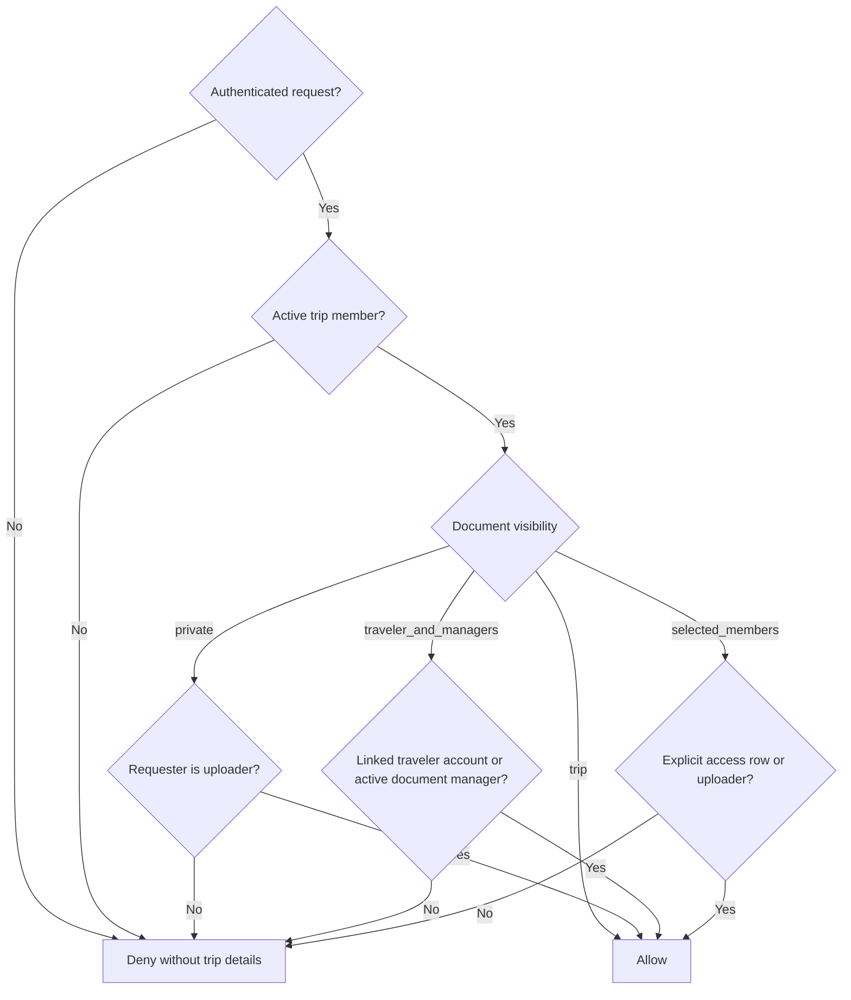

The same access predicate must protect document metadata and the corresponding private storage object. UI hiding is not authorization.

New uploads expose **Only me** (`private`), **Signed-in trip members** (`trip`), and **Selected signed-in members** (`selected_members`). Owner/Editor uploads default to `trip`; Viewer-managed uploads are forced to `private`. An Owner/Editor may later change an existing document through `update_document_visibility`, which validates selected accounts against active trip membership and replaces `document_access` rows atomically. `traveler_and_managers` remains a schema compatibility mode for older records and is not offered by the current flow.

### 6.4 One-time join-code redemption

The owner creates one invitation for one intended target. The implemented code uses a 16-character, case-insensitive Crockford Base32 value shown in four groups, avoids ambiguous characters, contains 80 random bits before formatting, expires after 14 days, and allows revocation or regeneration.

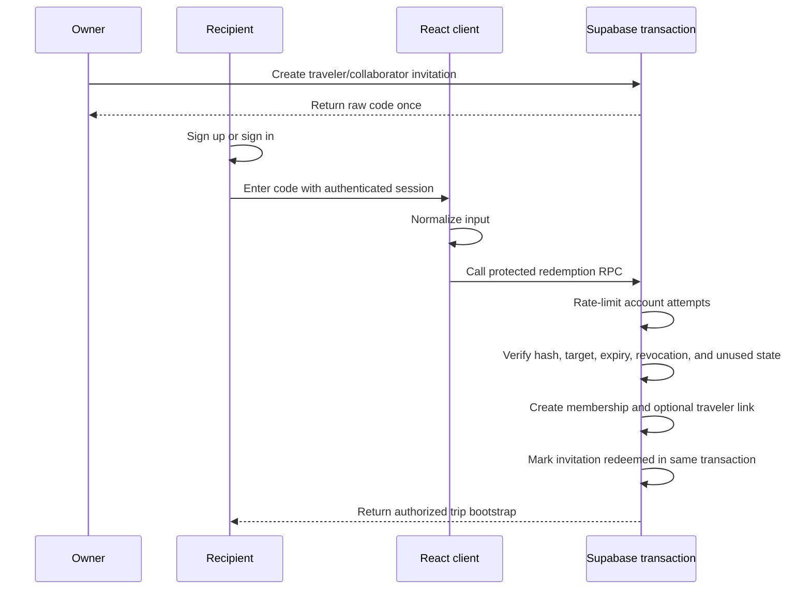

The first four code characters are stored as a non-secret lookup prefix; the complete code is stored only as a salted `crypt` hash. The MVP rate limit permits five failed attempts per authenticated account in fifteen minutes. A Cloudflare network-address limit may be layered on before public exposure, but is unnecessary for the personal deployment. The route returns the same generic failure for unknown, expired, used, or revoked codes and never returns trip title, dates, destination, travelers, or role before successful redemption. The client can encode the displayed code as a QR image locally; scanning still leads to authenticated redemption.

Code redemption requires a connection. Once redeemed, membership—not continued possession of the code—controls access.

#### Reusing an associated account

After a recipient has joined any trip shared with the owner, People & sharing can list that account by display name. The owner can offer a later trip as a selected traveler or non-traveling helper with an Editor or Viewer role. The recipient sees the pending offer on Home and chooses Accept or Decline. Both operations require a connection; acceptance performs the membership and optional traveler link in one transaction. A pending offer reveals trip details only to its authenticated intended recipient.

### 6.5 Traveler and collaborator behavior

| Membership case | Traveler link | Appears in traveler roster | Can receive itinerary/bookings | Can use the app |
|---|---|---:|---:|---:|
| Claimed traveler | One `traveler_accounts` row | Yes | Yes | Yes |
| Managed child or parent | No account link required | Yes | Yes | Through a signed-in Owner or Editor |
| Non-traveling collaborator | None | Separately as collaborator | No | Yes, according to Editor/Viewer role |

If an elderly parent uses their own phone, the organizer helps create that parent's account, redeem their targeted code, and prepare the device offline. If the parent does not operate an account, an Owner or Editor remains signed in as themselves and selects the managed traveler from the persistent trip switcher. The selection pre-populates new records and filters the visible trip to shared records plus that traveler's timeline, bookings, requirements, costs, seats, and documents; it never changes the authenticated identity or server permissions.

### 6.6 Trip-information boundary

- Public routes may show only generic product information and bundled synthetic preview data.
- The sign-in and join-code screens never disclose whether a real trip, traveler, or invitation exists.
- Real trip summaries, destinations, dates, traveler names, bookings, requirements, and document metadata require an authenticated active membership.
- An authorized member can see shared readiness state without receiving permission to open the linked document.

## 7. File Storage Contract

### 7.1 Bucket

Three Supabase Storage buckets are configured by the schema:

| Bucket | Read policy | Write policy | Contents |
|---|---|---|---|
| `trip-documents` | Authorized document predicate | Authorized trip uploader | Private travel documents and immutable versions |
| `account-documents` | Upload owner or authorized associated-document reader | Signed-in owner folder only | Private originals retained before trip association |
| `catalog-assets` | Public, non-sensitive read | Active application administrator only | Immutable approved airline logos and banners |

No personal trip data, booking reference, traveler image, or uploaded travel document may enter `catalog-assets`.

### 7.2 Object key

```text
trips/{trip_id}/documents/{document_id}/versions/{version_id}/{sanitized_filename}
{account_id}/{upload_id}/{sanitized_filename}
catalog/releases/{config_release_id}/{asset_id}/{sanitized_filename}
```

Object keys use generated IDs for authorization boundaries. Original filenames are metadata and must not be trusted as paths.

### 7.3 Upload sequence

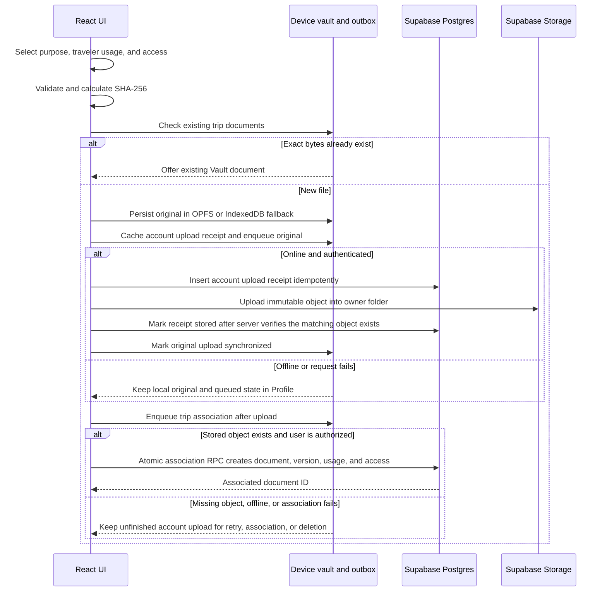

Because every accepted file is smaller than 5 MB, MVP retries the individual immutable file from its verified local copy rather than implementing chunk-level resume. A database receipt is not treated as synchronized until the object exists and the server records `stored_at`; the association RPC independently rejects receipts without a matching Storage object. A failed cloud upload remains immediately available on its originating device and its outbox operation exposes a safe failure class such as permission or authentication until a foreground retry finalizes it. A different device calls the finalization check first, which recovers an object whose upload succeeded before the original response was interrupted. If the server confirms that no object exists, that device reports that the original device or a reselected file is required instead of claiming a false retry. Raw server details and document content are not logged.

Successful association also reconciles the device cache immediately: the returned document ID replaces the pending association state, retry/error flags are cleared, and the outbox entry is removed. A later server refresh reads associated receipts as reconciliation evidence before filtering them from the visible inbox. The merge permits local overlay only for genuinely pending work or a receipt absent from the server, so an associated cloud row suppresses a stale unassociated local row instead of letting it reappear.

People & sharing treats a traveler profile name and an account profile name as separate records. Owner/Editor can use the pencil action on a traveler card to edit `travelers.display_name` (and its managed-child flag); selecting the rest of that card still switches traveler focus and closes the sheet immediately. Editing a traveler never updates `profiles.display_name`. A signed-in member controls that account-level name from Profile. Closing the traveler editor returns to People & sharing.

Inbox deletion distinguishes local cancellation from cloud cleanup. Offline, the app may discard only a pending upload whose queued first attempt still has `attemptCount = 0`. If an attempt has started, a receipt may already exist remotely even when the client saw a failure, so deleting only the local copy could make the item reappear. Any attempted, finalized, or otherwise cloud-backed upload therefore requires an online Storage-and-receipt delete. Association blocks inbox deletion entirely; the user must use the Vault document lifecycle.

### 7.3.1 Permanent trip purge

Permanent purge is an owner-only, online testing action. It is split at the Postgres/Storage transaction boundary:

1. The client first records the owner's associated `account-documents` paths and source upload IDs because those records will be removed by the trip cascade. Its PostgREST embed names `document_versions_document_id_fkey` explicitly because `documents.current_version_id` creates a second relationship between the same two tables.
2. The `delete_trip_permanently` security-definer function locks the trip and its documents, inserts every distinct legacy `trip-documents` path into `trip_storage_cleanup_queue`, and deletes the trip in the same database transaction. Queue rows have no trip foreign key and survive commit.
3. If the RPC returns an error after the server may have committed, the client probes the trip. A confirmed absence is treated as committed deletion; a still-present trip preserves the original failure.
4. After commit, the client reads its queue rows, removes those exact legacy Storage objects, and deletes only queue rows whose Storage removal succeeded. Queue authorization is path-specific and additionally rejects any path reused by a live document version.
5. The client then removes the remembered owner-held `account-documents` bytes, whose receipts are now unassociated, and deletes each receipt only after its object is gone.
6. Failed legacy cleanup leaves a queue row and is retried during later online `listTrips` calls. Failed account-inbox cleanup leaves its now-unassociated receipt in Profile. Neither cleanup failure restores the deleted trip or claims that all bytes were removed.

### 7.4 Validation

- New trip uploads and the Profile inbox use the reusable large `FileDropzone`; replacement uses its compact variant.
- The visible button is a full-width touch/keyboard target, accepts a desktop drop, shows guidance before selection and filename/measured size afterward, and is disabled while the selected file is being saved.
- Reject empty content and multiple/unsupported inputs immediately. A file whose browser MIME is empty or `application/octet-stream` may be retyped only when its `.pdf`, `.jpg`, `.jpeg`, `.png`, or `.webp` extension is approved.
- Allow an explicit MIME-type list for previews and downloads.
- Reject files of `5_000_000` bytes or larger before local queuing or upload.
- Sanitize display filenames and generate storage paths independently.
- Compute a SHA-256 digest for integrity and duplicate hints.
- Reject an exact same-trip checksum before copying another file; offer to link the existing Vault document to the event instead.
- Treat uploaded content as untrusted; do not render active HTML or SVG inline.
- Use attachment downloads for unsupported or risky file types.

### 7.5 Document-open flow

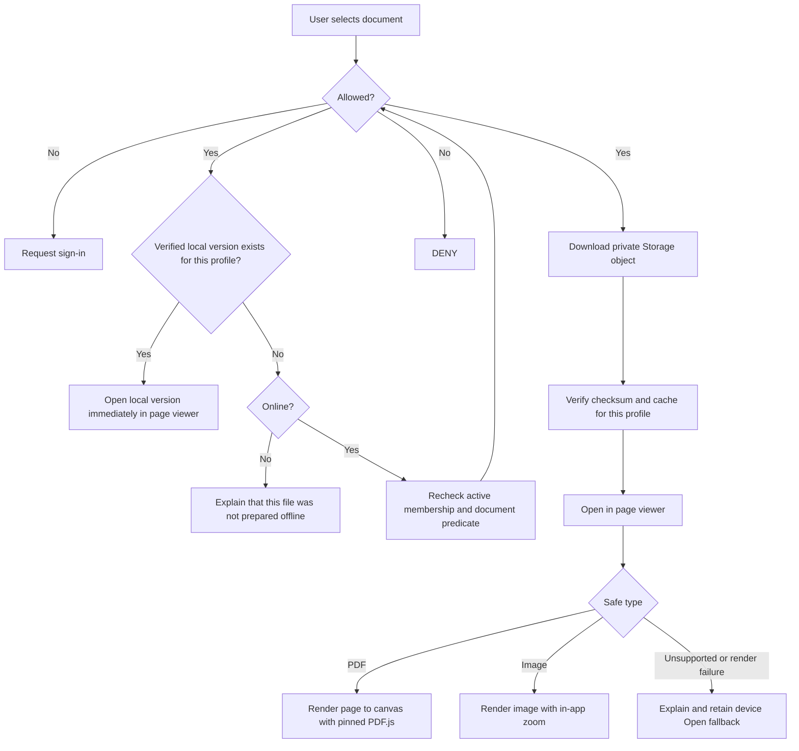

The app never stores a permanent public file address. A verified local file needs no per-open cached authorization evaluation: possession in the current profile's local namespace plus the current local sign-in context is sufficient. Server-side membership and visibility rules still decide whether a missing file may be downloaded. The route automatically renders an approved image with zoom or a PDF page to canvas through the pinned same-origin PDF.js module/worker. PDF controls provide previous/next page, zoom in/out, and fit-to-width; image controls provide zoom and fit. The **Open** action launches the device viewer as a clear fallback and alternative, while Info opens one labelled metadata/management sheet. Traveler usage never changes this access decision. A readiness status may be shared without granting access to a missing cloud file.

### 7.6 File-size and optimization boundary

`MAX_DOCUMENT_BYTES` is exactly `5_000_000`; an accepted file must satisfy `file.size < MAX_DOCUMENT_BYTES`. The UI describes this as **smaller than 5 MB** and shows the measured size when a file is rejected. Shared validation checks the limit before an offline file is copied into OPFS or added to the outbox and checks it again during upload finalization. Both private document buckets use a `4_999_999`-byte limit so a modified client cannot bypass the strict inequality. Supabase supports restrictions at both the project and [bucket level](https://supabase.com/docs/guides/storage/uploads/file-limits). OPFS stores files under extensionless version IDs and may return an empty or generic Blob MIME on Safari/Chrome. `readOfflineFile(profileId, versionId, expectedMimeType)` therefore retypes the Blob from the already-validated receipt/version metadata before both `trip-documents` and `account-documents` uploads. This is required because the Storage client wraps Blob bodies in multipart form data and derives the part MIME from `Blob.type`; its `contentType` option alone does not override that multipart part.

The MVP does not automatically compress, resize, recompress, rasterize, or rewrite an uploaded document:

- Lossless optimization may save little or nothing for an already compressed JPEG, WebP, or photo-heavy PDF and cannot guarantee the size target.
- Material reduction of a scan normally changes image resolution or encoding quality, so it must not be described as lossless.
- Rewriting a PDF can invalidate a digital signature, discard searchable text or annotations, alter page rendering, or make a barcode harder to scan.
- ZIP wrapping is not useful for in-app preview and often provides little benefit for compressed PDFs and images.

For an oversized file, the MVP preserves the selected original on the user's device, does not queue it, and explains how to export or scan a smaller copy. A later image-only **Make a smaller copy** action may use browser-side decoding and encoding, but it must show original/result size and a full-resolution legibility preview, require explicit approval, and never overwrite the original. PDFs remain unchanged unless a separate reviewed design is accepted.

## 8. Device Offline Model

### 8.1 Local structured stores

Dexie uses six physical stores. Most server domains share the generic `entities` store and are distinguished by a profile-scoped entity key; they are not separate IndexedDB object stores.

| Physical store | Contents |
|---|---|
| `settings` | Device-specific preferences and small non-secret values |
| `localDocuments` | Profile-scoped local file metadata, verification state, and OPFS path |
| `localFileBlobs` | IndexedDB blob fallback when OPFS is unavailable |
| `entities` | Profile-scoped structured snapshots keyed by logical domain and entity ID |
| `outbox` | Pending local mutations with dependency, attempt, and error state |
| `offlineManifests` | Prepared-trip level, expected document-version IDs, byte totals, and timestamps |

Logical keys in `entities` include profiles, published configuration, airlines, airports, vendors, trips, memberships, travelers, bookings, flight legs, generic journey legs, itinerary items and links, documents, requirements, costs, reminders, alert state, focus, and notes. The current client does not store incremental pull cursors; an online collection read replaces that authorized logical collection in the cache.

### 8.2 Local file record

| Field | Purpose |
|---|---|
| `profile_id` | Namespaces the copy to the profile that downloaded or created it |
| `document_version_id` | Connects local blob to immutable server version |
| `local_path` | OPFS-internal location |
| `byte_size` | Quota accounting |
| `sha256` | Integrity verification |
| `downloaded_at` | Readiness timestamp |
| `last_verified_at` | Last successful local checksum check |
| `pin_reason` | Explicit document pin or inherited trip pin |

Every local metadata row and OPFS document path is namespaced by `profile_id`. Signing into another account on the same browser opens a different local namespace and cannot list or open the prior profile's cached files. Sign-out follows the user-selected keep-or-remove-local-copies behavior; retained files become reachable again only when that same profile signs in or resumes its enrolled offline context.

### 8.3 Caching boundaries

| Content | Mechanism | Strategy |
|---|---|---|
| Versioned JS, CSS, icons, fonts, PDF.js module and worker | Service worker cache | Precache current application shell and same-origin document-rendering runtime |
| Theme preference and validated bootstrap palette | LocalStorage plus bundled CSS fallback | Apply before React renders; contains no personal data |
| Published metadata catalogs | IndexedDB plus bundled JSON fallbacks | Use cached/bundled values at startup and refresh published configuration online |
| HTML navigation | Service worker precache and SPA navigation fallback | Serve the installed app shell without runtime-caching Supabase requests |
| Supabase structured records | IndexedDB | Supabase first while online, replacing the cached collection on success; cached collection on request failure or offline |
| Current-account traveler links and trip event/document links | IndexedDB logical collections plus TanStack Query | Fetch each relationship set once per trip, reuse it across Home/Trip details/full collection pages, invalidate it from Realtime and attachment mutations, and fall back to the last authorized cache offline |
| Opened or prepared file originals | OPFS with IndexedDB blob fallback | Persist the verified profile-scoped copy until the user removes local data |
| Authenticated download URLs | Memory only | Never persist signed URLs |

### 8.4 Prepared-trip levels

| Level | Required local content | Meaning |
|---|---|---|
| Not prepared | App shell only or incomplete trip data | Do not promise travel access |
| Essentials ready | Complete structured trip data plus every explicitly selected document, all checksum-verified | Core itinerary works, but some authorized documents were intentionally excluded |
| Ready offline | Complete structured trip data plus the current version of every document the user is authorized to open for that trip, all checksum-verified | The prepared trip can be used fully within the offline capability boundary |
| Stale | The expected document-version set changed or a required local copy no longer verifies | Local content still opens, but structured-record staleness is not yet detected by the manifest |

The default **Make trip available offline** action targets **Ready offline**. If quota is insufficient, the app may offer a reviewed essentials subset but must label it **Essentials ready**, not fully ready.

Current implementation limitation: preparation fetches the major trip domains and verifies every selected current document version, but the persisted manifest enumerates only document-version IDs. It does not yet record structured entity versions, does not explicitly fetch generic `journey_legs`, and becomes stale automatically only when the document-version set changes. Therefore the current **Ready offline** display is provisional until an airplane-mode test passes; LLD-044 tracks the missing proof.

### 8.5 Airplane-mode cold start

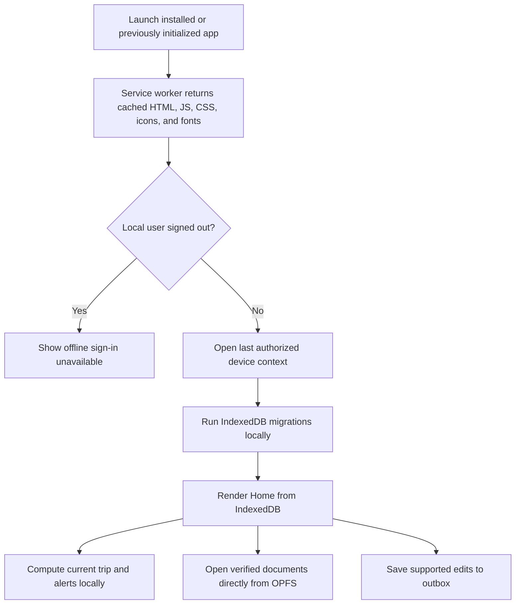

When the browser is offline and an enrolled device profile exists, the app does not wait for a Supabase request before rendering. The service worker supplies the executable application; Dexie/IndexedDB supplies cached structured data and catalogs; OPFS or the IndexedDB blob fallback supplies local originals. Required fonts, icons, fallback artwork, starter airline/airport/vendor data, and safe light/dark palettes are bundled rather than loaded from a CDN.

### 8.6 Offline capability matrix

| Capability | Fully offline after preparation? | Behavior |
|---|---:|---|
| Start the app and open Home | Yes | Cached shell and local database |
| View trips, itinerary, bookings, requirements, costs, and notes | Yes, when cached | Local authorized snapshot; preparation fetches these domains |
| View flight times, gate, ticket, boarding pass, and baggage tag | Yes | Structured cache plus verified OPFS files |
| View train, bus, ferry, or cab leg detail | Not guaranteed by preparation yet | Works if the journey-leg collection was already cached; LLD-044 adds an explicit preparation fetch |
| Compute D-1 mode, countdowns, and alerts | Yes | Device clock and local rules |
| Add or edit supported structured data | Yes | Validate locally and enqueue mutation |
| Add a document from the device | Yes, when smaller than 5,000,000 bytes and within quota | Validate size before copying to OPFS, checksum it, and queue upload metadata and bytes |
| Search trip and document metadata | Yes | IndexedDB indexes; no OCR |
| Sign up, sign in on a new device, or redeem a join code | No | Backend identity and atomic membership are required |
| Download a missing or changed cloud document | No | Existing local version may be shown as stale; missing file stays unavailable |
| Change membership or permissions | No | Requires authoritative server checks |
| Use Google Maps, airline check-in, or external flight tracking | No | Keep address/reference copy actions available |
| Receive another person's latest changes | No | Arrives during foreground synchronization after reconnecting |

Offline access relies on the device and browser profile that was previously authenticated. The app cannot learn that membership was revoked while disconnected; it reauthorizes before pushing or pulling on reconnection and then applies the removal policy. Without a later app-lock/encryption decision, the actual local security boundary is the device lock plus browser-origin isolation.

The app requests persistent storage through `navigator.storage.persist()` and records whether it was granted. Persistent mode reduces automatic eviction risk, but users can still clear site data or uninstall the PWA. OPFS is therefore a verified working copy, not the sole archival copy.

## 9. Synchronization Design

### 9.1 Local mutation envelope

| Field | Purpose |
|---|---|
| `operation_id` | Client-generated idempotency key |
| `entity_type` | Target domain |
| `entity_id` | Stable client-generated UUID |
| `operation` | Create, update, delete, account-file upload, or account-file association |
| `payload` | Validated mutation data |
| `base_version` | Server version observed before edit |
| `depends_on` | Earlier operations that must finish first |
| `attempt_count` | Retry control |
| `last_error_code` | User-action or retry classification |
| `created_at` | Stable local ordering |

### 9.2 Foreground synchronization

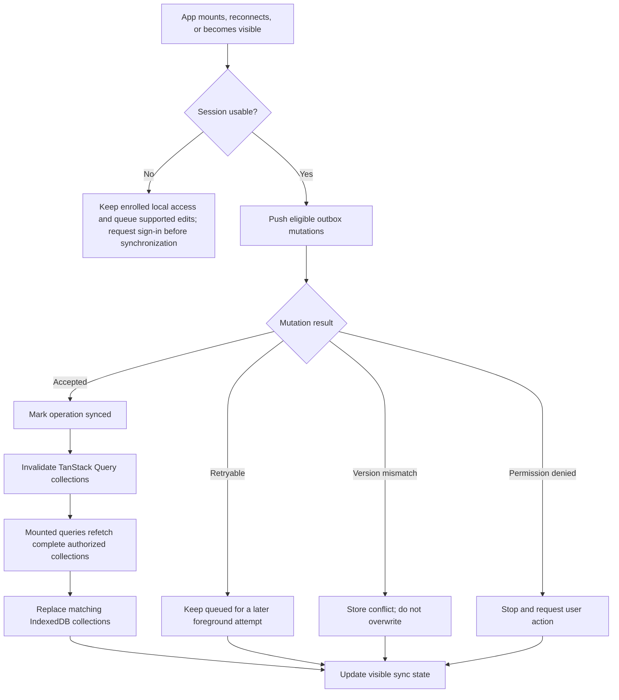

There is no incremental pull cursor in the current client. Online reads use complete authorized collection queries and update the cache; Supabase Realtime invalidates mounted query data after shared changes. Background Sync may be used as an enhancement where supported, but correctness cannot depend on it.

For new documents, `upload_account_document` always precedes `associate_account_document`. A dependent association is skipped while its upload operation still exists in the outbox, including after a failed upload attempt. This preserves an unassociated Profile inbox row rather than creating trip metadata that points at absent bytes. Retrying the inbox item replays the existing idempotent operations instead of creating another document identity.

### 9.3 Conflict policy

| Data | Default conflict behavior |
|---|---|
| Trip fields | Show local and server values; user chooses |
| Booking fields | Field-level comparison where possible; otherwise user chooses version |
| Flight operational fields | Show both updates with actor and time; user selects the authoritative manual value |
| Airline action templates | Preserve both versions and require an editor to choose before launching a disputed URL |
| Itinerary ordering | Merge distinct items; flag edits to the same item |
| Itinerary-document links | Merge links to different documents; version-check reorder or unlink of the same relationship |
| Readiness requirements | Merge different assignees; conflict on edits to the same requirement |
| Notes | Preserve both bodies and request merge |
| Document binary | Never merge; create separate immutable versions |
| Deletion versus edit | Preserve edit locally and request restore-or-discard decision |

Server updates require `base_version` to match. A mismatch returns a conflict rather than silently using last-write-wins.

### 9.4 Published-configuration synchronization

1. Startup immediately uses the last locally validated published configuration or the bundled fallback.
2. When online, the client requests only the current published version number.
3. If unchanged, no catalog payload is downloaded.
4. If newer, the client downloads the complete published release and validates every section with Zod.
5. Airline catalog, airport catalog, defaults, theme tokens, and version are committed to IndexedDB in one transaction.
6. The small validated theme bootstrap snapshot is mirrored to LocalStorage for the next first paint.
7. Invalid or incomplete remote configuration is rejected as a unit; the prior cached version remains active.

Draft releases and audit history are never sent to ordinary traveler clients. Updating a global catalog does not mutate a trip's copied airline or airport values; it can only produce a reviewable **Update available** suggestion for an owner.

## 10. Offline Readiness Algorithm

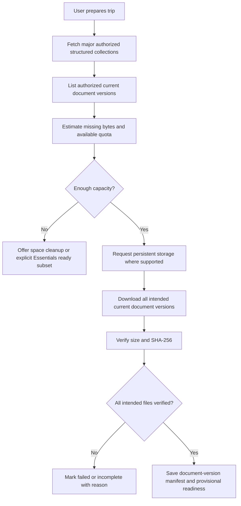

Today, readiness becomes `stale` automatically when the authorized document-version set changes or a required local file no longer verifies. Booking, itinerary, requirement, cost, and generic journey changes are fetched during normal reads but are not represented in the manifest, so they do not independently stale it. Revoked access is learned only after reconnecting; the app then blocks future cloud access and follows the agreed local-removal warning flow. LLD-044 is required before the badge alone can certify the complete structured pack.

## 11. UI Composition

### 11.1 Application shell

| Region | Phone | Wide screen |
|---|---|---|
| Header | Sticky brand, Alerts button, and theme action | Sticky brand plus visible sync status, Alerts, and theme action |
| Primary navigation | Fixed bottom bar: Home, Trips, Add, Vault, Profile | Persistent side navigation from the `lg` breakpoint |
| Content | Single-column responsive surfaces with safe-area spacing | Centered content area with wider cards and details sections |
| Add action | Central Add navigation action; trip timeline also has a floating Add Event control | Add navigation entry plus the same trip-scoped floating controls |
| Sync state | Compact icon/state with the issues panel available | Text status in the header with the same issues panel |

### 11.2 Core shared components

| Component | Responsibility |
|---|---|
| `AppShell` | Responsive header, desktop side navigation, phone bottom navigation, alert count, theme, and sync placement |
| `RouteScrollManager` | Resets document scroll on pathname changes while leaving same-trip query-string Timeline/Details navigation to `TripPage` |
| `TripUi` exports | Shared `PageHeader`, `TripCard`, badges, empty states, and trip-facing visual primitives |
| `ModalSheet` | Accessible modal/sheet container with an explicit Back action and Escape dismissal for mobile-friendly creation and management flows |
| `FocusSurface` | Current/active label, accent, elevation, and reduced-motion-safe emphasis |
| `TripPage` timeline composition | Complete timeline, phase jumps, active-event scroll, event detail sheet, people/sharing sheet, and Details switch |
| `TripDetailsView` | Three-item Next up, reservation, and document previews; category counts; section navigation; links to the complete reservation/document routes |
| `ReservationRow`, `TripDocumentRow` | Compact whole-row navigation with complete route/document context, document counts, full wrapping titles, traveler audience, and visibility |
| `TripReservationsPage`, `TripDocumentsPage` | Stable full-collection routes with search, category and traveler filtering, event-ranked documents, and Back continuity to Trip details |
| `ReadinessPage` | Readiness requirement list whose Owner/Editor card body opens the requirement editor while status, guidance, document, and Archive controls remain independent; Viewer cards stay read-only |
| `ReservationCard` | Makes the complete reservation surface a native details link while keeping Call and WhatsApp as independent actions |
| `CostDetailsSheet`, `TripExpensesContent`, and `EventCost` | Shared read-first expense detail, role-gated editing/archive, itemized cost rows, and opt-in per-currency balances |
| `AddEventForm` | Progressive creation ordered Flight, Hotel, Activity, Bus, Cab, Ferry/Boat, Train, Meal, Preparation, Other transport, Other; saves the core record before optional document transfer |
| `CatalogPicker` | Shared searchable desktop popover/mobile dialog that stays inside the visual viewport when the phone keyboard opens and always exposes an explicit Other path |
| `TimeZoneAutocomplete` | Strict searchable IANA-zone chooser with compact desktop list and a keyboard-aware mobile dialog |
| `AirlinePicker`, `AirportPicker`, `VendorPicker` | Published/bundled catalog selectors with manual Other inputs and privacy-safe administrator suggestions; airport selection atomically supplies name, code, country, and time zone; vendor selection fills or clears the controlled website snapshot |
| `AddFlightConnectionForm` | Locks the new origin to the previous arrival, country-filters Domestic destinations, and calls the server-validated append that extends the booking and timeline end |
| `EventFormCommonFields`, `JourneyEventFields` | Progressive reservation, stay, cost, route, endpoint, Cab mode, and per-traveler ticket sections shared by `AddEventForm` |
| `ParticipantSelector`, `TravelerSwitcher` | Everyone/selected-traveler assignment and persistent management context without impersonation |
| `EventDocuments` | Complete event document list, multi-select existing attachment, one-at-a-time classified upload, ordering, and unlink |
| `FileDropzone` | Large centered trip/Profile picker plus compact replacement variant, with touch/keyboard/drop input, immediate validation, phone-MIME normalization, selected-file feedback, and busy locking |
| `UploadDocumentForm` and `documentModel` | Travel-purpose presets, assignment/access separation, duplicate recovery, and queued local copy |
| `DocumentPreview` | Approved image zoom and PDF.js canvas rendering with page, zoom, fit, loading, and safe failure states |
| `DocumentPage` | Loads and verifies the local-first file, renders `DocumentPreview`, retains device Open, and keeps facts/management in the Info sheet |
| `OfflinePackControl` | Quota check, persistence request, preparation progress, document verification, and provisional manifest state |
| `SyncStatus`, `SyncIssuesPanel`, `ForegroundSync`, `RealtimeRefresh` | Visible outbox state, foreground retry, issue recovery, and online query invalidation |
| `LocalQrCode` | Generates a share-code QR locally without a third-party QR service |
| `StoragePermissionPrompt` | Requests persistent browser storage after authentication and explains the device-copy boundary |
| `AdminPage` / `AdminShell` | Protected, online-only catalog, suggestion, appearance, release, and rollback experience |
| `ThemeProvider`, `ThemeToggle` | System/Light/Dark resolution with bundled offline-safe tokens |

### 11.3 Implemented visual tokens

| Token | Current direction |
|---|---|
| Background | Warm off-white |
| Surface | White with hairline gray border |
| Accent | Deep navy |
| Secondary accent | Muted coral |
| Text | Near-black with softer gray metadata |
| Radius | Moderate; restrained rather than pill-heavy |
| Shadow | Minimal; elevation only for overlays and active controls |
| Typography | Neutral sans-serif with strong numeric legibility |

No gradients should be used. Decorative elements must not compete with urgent trip information.

### 11.4 Timeline and trip details

`/trips/:tripId` opens in Timeline view unless `?view=details` is present.

- The timeline always renders the complete authorized itinerary from oldest to newest; Past, Current/Next, and Upcoming shortcuts scroll rather than filter.
- `resolveCurrentTimelineItem` selects the event containing the current time, otherwise the next event, otherwise the most recent past event.
- After the first data-backed render, two animation frames allow layout to settle before the active card scrolls near the viewport center. Returning from Details restores the saved timeline scroll unless the user explicitly requests a jump. `RouteScrollManager` resets Home, Profile, Vault, another trip, and every other pathname to the top without interfering with these same-trip query-string transitions.
- The current/next card is the only card with the contextual accent and label. Every card remains clickable and keyboard-operable and opens the event-detail sheet.
- Event icons sit inside the card corner on phone layouts to preserve width; on desktop they align centrally with the vertical connector.
- A relative card and its detail sheet say **Before {anchor title}** or **After {anchor title}**. Sorting forms stable **before group → anchor → after group** clusters; equal siblings retain their stored start/sort-key/ID order instead of relying on a non-transitive pairwise comparison.
- Relative placement is independent from schedule precision. The edit form always keeps Position and Event, then offers a separate responsive schedule block for an optional start, optional end, and optional duration in minutes, hours, or days. Relation-only and duration-only records are valid, and a later edit may add a real start/end without changing the anchor.
- A relative row without a real start retains the anchor's non-null instant only for storage and grouping. The UI leaves Start blank, never marks that row Current, omits it from calendar export, and creates a later generic booking with null schedule fields. A planned duration may still appear on the timeline and detail sheet.
- Everyone shows the complete trip. Traveler focus retains shared events and the selected person's assigned events, reservations, linked costs, seats, and documents while hiding records assigned only to someone else. For readiness, an empty `requirement_assignees` set is the shared Everyone case; a selected traveler sees those tasks plus tasks with their own assignee row.
- The floating control group opens Add Event, People & sharing/current member, or the active-event jump. Creation controls are hidden from Viewers.
- Search matches timeline titles, booking/provider data, PNRs, airport codes/names, documents, travelers, readiness items, and related metadata after two characters, returning at most 40 results.
- Details view keeps the existing sectioned experience: Next up, Overview, Reservations, Costs, People, Readiness, Documents, Archived, Offline, Travel data, and Notes. Next up contains at most three upcoming events. Reservations and Documents show category counts plus at most three compact rows, then route to their complete collection pages. Home and the trip header show one compact per-currency cost line; either cost line deep-links to this itemized Costs section.

The complete reservation page sorts by real booking start and then title, searches title/provider/reference/full route, filters Flight, Stay, Ground & water, or Plan, and optionally retains shared plus one selected traveler's bookings. The complete document page searches full title/purpose/short label, filters category and traveler, keeps Shared documents with a selected traveler's documents, and separates the first three finite event-ranked results into **Needed next**. Document titles wrap rather than truncate on both compact and full routes.

#### Card interaction contract

Cards are primary interaction targets. Their primary activation depends on whether the summarized record has a meaningful read-only detail surface:

| Surface | Primary activation | Role and secondary-action behavior |
|---|---|---|
| Timeline event card | Opens `EventDetailsSheet` in display mode | Every trip member can inspect it. Edit, Archive, status, cost, booking, and document-management actions appear inside the sheet only when the role permits them. Navigation remains a separate link on the card. |
| Reservation card | The whole card is a native link to Flight or Booking details | Owner, Editor, and Viewer use the same read-first details route; applicable role-gated Edit, Archive, update, and connection actions live there. Call and WhatsApp remain separately focusable links above the card-wide target and do not navigate into the reservation. |
| Event-linked expense row | Opens `CostDetailsSheet` | Owner, Editor, and Viewer can inspect the same expense. The surrounding event sheet closes before the cost sheet opens; Edit and Archive remain role-gated inside the cost sheet. |
| Main Trip expenses row | Opens the same `CostDetailsSheet` | The full row is one button for every trip role. It does not send an Editor directly into the form. |
| Departure, Arrival, Boarding, and Arrival details fact card | Opens the manual Flight editor directly | These facts already appear in full on Flight details, so there is no second read-only layer. Only Owner/Editor render the card as a button; Viewer receives a static card. |
| Trip note or airline snapshot card | Opens its edit form directly | The complete note/snapshot is already visible. Only Owner/Editor receive the direct edit target; note Archive remains a separate destructive button and Viewer receives static content. |
| Readiness requirement card | Opens the requirement editor directly | Owner/Editor receive the card-wide edit target. Status, official guidance, linked document, and Archive remain independent controls above that target; Viewer receives a static card with permitted read-only links. |
| Trip information overview card | Opens Trip settings directly | Only Owner receives the card-wide settings target. The explicit Settings action remains an independent control with the same destination; Editor and Viewer receive static overview content. |
| Admin catalog card | No card-wide convention yet | Admin catalog cards retain their explicit named controls until the Admin responsive redesign instead of receiving a competing card target. |

`CostDetailsSheet` presents amount, payment status, category, payer, linked event or booking, included travelers with equal or explicit shares, and optional notes before any mutation controls. **Balances by currency** is not rendered on initial expense-section load. A member explicitly enables **Show balances** to calculate and reveal it; hiding it again leaves the underlying costs unchanged. The toggle is available to Viewers because it is a local presentation choice, not a mutation.

Card-wide targets use native links or buttons with visible focus. A link activates with Enter; a button activates with Enter or Space. Phone taps anywhere on the primary card area produce the same destination, while nested independent actions occupy their own hit area and must neither bubble into nor be obscured by the card target. Destructive actions always retain an explicit label and confirmation path instead of becoming the implicit card activation.

The floating Add Event sheet presents Flight, Hotel, Activity, and Bus first, followed by Cab, Ferry/Boat, Train, Meal, Preparation, Other transport, and Other. Flight asks **Direct** or **Connecting**. Train, Bus, and Ferry ask **Single service** or **Connecting services**. Cab deliberately asks neither. Single/direct renders exactly one leg; Connecting starts with two ordered legs and permits more. On submit, each later leg must depart from the endpoint where the previous leg arrived. When both endpoint codes exist, comparison uses trimmed, uppercased alphanumeric codes; otherwise it uses equivalently normalized endpoint names. The choice itself is not stored; the saved leg count is authoritative. An editor who omitted a flight connection can later append it from Flight details. That form renders the prior arrival as a fixed, non-editable origin; a Domestic connection filters its destination catalog to the same country. The RPC locks the booking and last leg, revalidates endpoint code/name and departure time zone, requires a positive layover and later arrival, preserves journey scope, and rejects a Domestic country change before inheriting travelers and extending the booking/timeline end. Every trip, booking, flight, and event summary builds the full route from those ordered legs, such as `BLR → DEL → DXB`, rather than collecting a generic journey location.

Flights and Train/Bus/Ferry journeys are explicitly Domestic or International. Cab instead uses Local, Airport transfer, Long-distance/outstation, or Hourly/day, with a Cross-border switch under More details. Domestic forms show neither country nor time-zone/repeated-clock controls. A Domestic flight filters destination airports to the origin country. For a known flight airport, selecting by code or name atomically fills name, passenger code, country, and strict IANA time zone and keeps the derived code disabled. An International **Other airport** unlocks manual name, code, country, and strict IANA zone entry. International Train, Bus, and Ferry endpoints—and a Cross-border Cab—also expose country plus strict endpoint zones because no station/port catalog supplies them. Every other Domestic endpoint uses the trip's hidden strict compatibility fallback. This is a form simplification, not a claim that a multi-zone country's local offset was inferred from its place name. A same-country route that crosses time-zone regions must be entered as International so separate origin and destination zones are available.

Flights require departure and arrival exactly as printed. Train, Bus, Ferry, and Cab require departure but permit an unknown arrival. The client converts supplied endpoint-local values independently with their endpoint zones, rejects invalid or overlapping instants, validates chronological order and endpoint continuity, and derives elapsed time only when arrival exists. Departure fields display in the origin zone; supplied arrivals and the booking/timeline end display in the applicable destination or final-destination zone. Duration labels preserve useful remainders and use minutes/hours through exactly 24 hours, days above 24 hours through exactly seven days, and weeks above seven days. Time zones never calculate a missing printed arrival. Domestic Flight editing hides every repeated-clock/daylight-saving selector and submits the deterministic hidden `earlier` occurrence; International Flight editing retains the explicit occurrence controls.

Airline means the carrier operating a flight; operator means the train, bus, ferry, or cab service; hotel/property name is the primary stay name; **Booked via** is the website, seller, or agent used to purchase the reservation. Flights and trains omit contact name. Hotel creation does not expose a separate service-provider, time-zone, or repeated-clock field: it stores the property title as `bookings.provider` and the hidden compatibility zone internally. The booking-vendor picker remains visible after **Other** is selected so the user can return to a saved value. In both create and edit, selecting a saved vendor replaces the controlled booking-website field with that catalog URL, or clears a stale value if the entry has no URL; selecting **Other** clears the prior catalog URL before allowing manual website entry. Its bundled fallback contains Airbnb and Trip.com; the optional published catalog receives them through migration `202609130005_booking_vendor_catalog_additions.sql`.

Flight PNR/reference is mandatory. Train, Bus, and Ferry references remain optional even when booked. Boarding lead or exact boarding time is journey-only; without an exact time, the display derives boarding by subtracting the lead from scheduled departure. Train/Bus and assigned-seat Ferry allocations belong to each traveler and leg rather than one shared seat. Hotel creation and editing use `save_hotel_stay` so the booking, explicit traveler scope, check-in milestone, and checkout milestone change atomically. Printed hotel times are optional; neutral hidden times maintain ordering when only dates are known and are not presented as provider-issued times.

The event form records `reservation_state` independently from Done/Skipped/Cancelled. After the title it asks the type-appropriate reservation intent, then Everyone/Selected before journey scope, structure, route, or traveler allocations. Flight is booked by definition in this release. Hotel starts Booked but may switch to Plan. Train, Bus, and Ferry offer Plan only, Buy when needed, or Ticket booked; Cab offers Need a cab, Booked in advance, or Already took this ride, with the completed choice permitting actual/reference capture. Other bookable events reveal booking fields only for the booked/reserved choice. Every booking persists explicit Everyone/Selected scope. The after-save screen exposes **Add official document** only after the core event/booking identifier exists, with **Done** as the exit; additional seats, costs, booking facts, and flight connections remain available from the event/detail flow.

An unbooked Activity, Meal, Transport, Preparation, or Custom event remains a standalone itinerary item and may receive generic reservation details later. The online action creates the type-appropriate booking with `reservation_state = booked`, copies the event's explicit participant scope, links only `booking_id` with an optimistic version check, and preserves the event identity, placement, timing detail, and location. A Selected event pre-fills and retains its traveler IDs; Everyone emits an empty booking-traveler set as the canonical representation. If linking fails, it archives the newly created booking; if cleanup also fails, it reports the booking ID rather than hiding the partial state. Exact events and relative events with a real start copy the event schedule into the booking. Date-only, all-day, unscheduled, relation-only, and duration-only relative events create the booking with nullable start, end, and source timezone; their storage ordering instants are never copied as reservation times. The itinerary edit form keeps **Link an existing booking** and exposes **Add new booking** independently. Booking enrichment is not queued for offline synchronization.

Exact and relative schedule parsing uses the event or anchor IANA timezone. Start plus duration derives the end; start plus end derives duration in whole minutes; all three must agree. End without start, end at/before start, non-positive/non-minute-resolvable duration, and a start or derived end outside the trip bounds are rejected. Date-only, all-day, and unscheduled records never keep duration or claim an explicit start.

All event types may include an optional linked cost. Bookings may also retain provider/operator, booking vendor, HTTPS website, contact name, and phone number. A valid 7–15 digit phone normalization enables direct `tel:` and `https://wa.me/` actions. Location-bearing entries expose an explicit map URL or a keyless Google Maps search.

Hotel entry initializes check-in on the trip start date and checkout on the next calendar day, with both printed-time inputs blank. Hidden noon values provide compatibility ordering until a printed time is supplied. If check-in is moved beyond the current checkout date, the form advances checkout to the same date; final validation converts both hotel-local values to instants and requires checkout to be strictly later, including across daylight-saving transitions.

### 11.5 Home mode and focused-trip selection

Current mode is personal to the signed-in user; it is not the shared `trip_status` field.

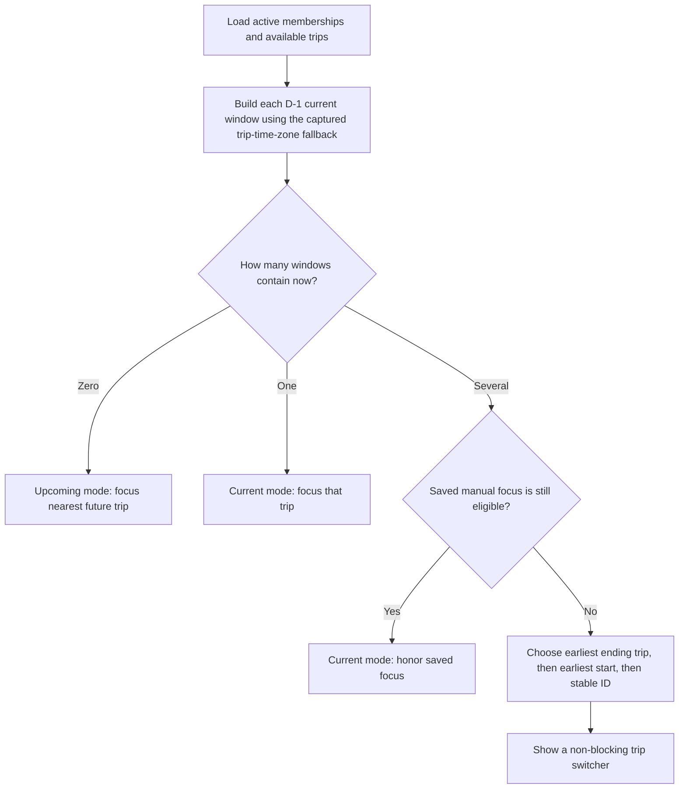

For a trip with captured compatibility time zone `T`:

- `current_window_start = startOfDay(start_date - 1 calendar day, T)`.
- `current_window_end = endOfDay(end_date, T)`.
- Archived, deleted, and inaccessible trips are never candidates.
- Upcoming Home uses the nearest future trip as its hero and may list later trips below it.
- Current Home uses the focused trip for Now/Next, shortcuts, alerts, accommodation, and today's itinerary.
- A manual switch persists only among currently eligible overlapping trips. Editing dates remains a separate action.
- The authenticated root route waits for both trips and saved focus. On a fresh launch it opens the eligible saved focus, or the deterministic earliest-end/earliest-start/stable-ID fallback when current windows overlap; with no current trip it opens Home.
- Automatic launch resolution belongs only to `/`. A traveler who explicitly navigates from the opened trip to `/home` stays on Home for that session rather than being redirected back.

This calendar-day rule avoids treating “one day early” as exactly 24 hours, which would fail around timezone offset changes.

### 11.6 Home priority resolver

The first eligible item wins within each severity group; ties use event time and then stable ID.

| Priority | Candidate examples | Primary action |
|---:|---|---|
| 1 | Cancelled flight, expired required document, unresolved sync conflict | Review or resolve |
| 2 | Boarding pass available, incomplete offline pack on D-1, overdue requirement | Open document or complete action |
| 3 | Delayed flight, departure/boarding approaching, check-in due | Open flight or check-in action |
| 4 | Current accommodation or next transport | Navigate, call, or copy reference |
| 5 | Next itinerary event | Open event |

Home applies authorization before relevance. From the already authorized document set it retains Shared documents plus Selected documents assigned to any traveler linked to the signed-in account for that trip; it excludes Assign later and another traveler's selected document. Explicit itinerary-document links outrank inferred booking/flight links. The next applicable event time is the primary ordering key and document purpose is only a tie-breaker, so a later boarding pass cannot displace a ticket required for an earlier event. Shortcut labels use the complete document title, while purpose, audience, and event/route context remain visible below it.

Need-now bubbles are derived from the focused trip and limited to five. The resolver prefers boarding pass over ticket, then visa/passport requirement, current accommodation, insurance, and next transport. Every bubble must have an actual target; placeholders are not rendered.

### 11.7 Flight presentation state machine

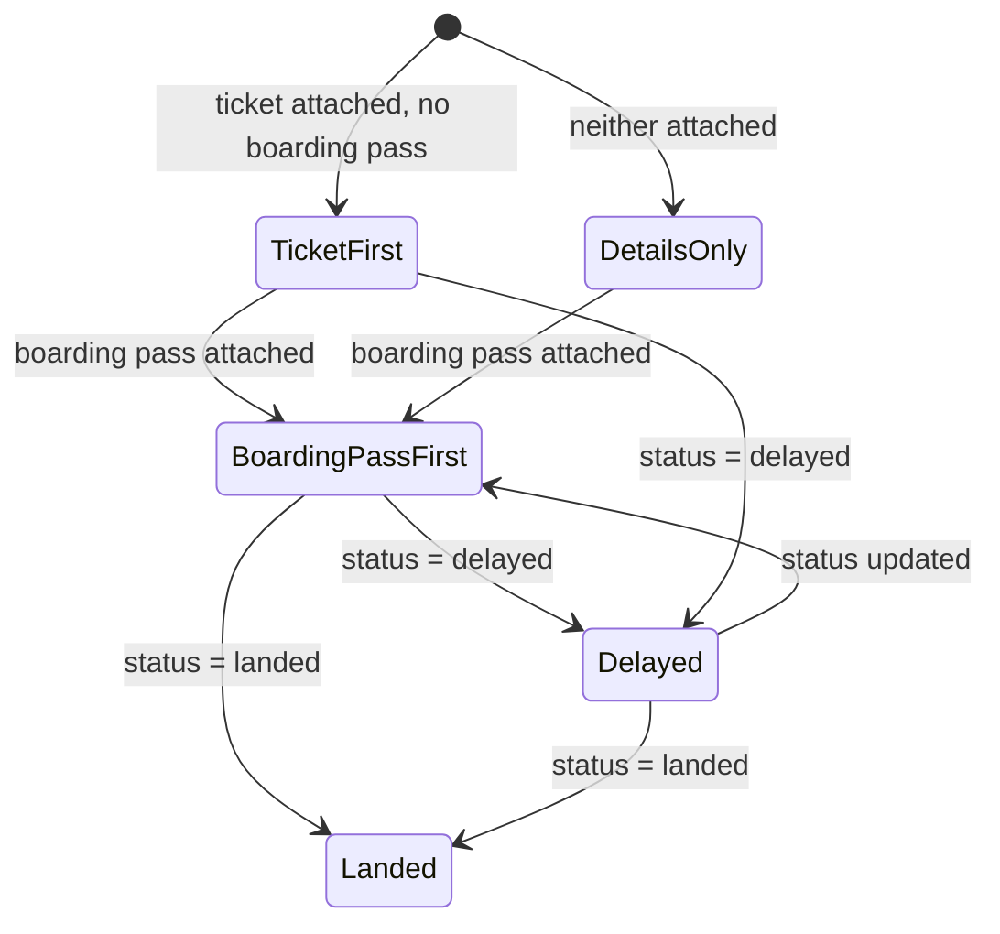

Presentation rules:

1. Before a boarding pass exists, show the ticket as the primary document action.
2. When an authorized boarding pass exists, make it primary and show the ticket under **Other documents**.
3. Boarding details combine the boarding pass metadata with the latest manual `boarding_at`, terminal, gate, seat, and boarding group. The app never implies those values came from the attachment.
4. `effective_departure_at` is `estimated_departure_at` when present for a delayed flight; otherwise it is `scheduled_departure_at`.
5. The countdown is `effective_departure_at - now`, recalculated while the app is visible. It changes to **Departed**, **Landed**, or **Cancelled** when the manual status says so.
6. Delay minutes are derived from estimated minus scheduled departure and are never a separate editable source of truth.
7. After landing, baggage claim and baggage-tag actions become prominent. All attached tickets, boarding passes, and baggage tags remain reachable throughout.
8. The flight hero shows seat chips before secondary details. Everyone context shows every participant and their entered seat; a selected-traveler context shows only that traveler's seat.

The manual update sheet edits status, estimated/actual times, boarding time, departure and arrival terminal/gate, baggage claim, and a note in one version-checked mutation. The form always labels the result **Updated by a traveler** with actor and time.

### 11.8 Alerts and reminder engine

The MVP does not depend on operating-system notification delivery. It recomputes alerts:

- after the local database opens;
- after foreground synchronization;
- when the browser tab becomes visible;
- when relevant local data changes; and
- on a lightweight visible-page timer so a countdown can cross a threshold.

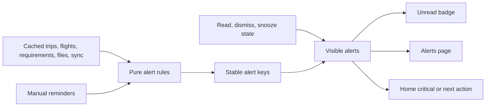

An alert key contains the rule ID, entity ID, and the value that created that occurrence, such as `flight-delayed:{legId}:{estimatedDeparture}`. A material new value creates a new alert; simply reopening the app does not. Dismissal hides only that occurrence, read state affects only the badge, and snooze does not alter the underlying flight or requirement.

The Alerts page groups visible items as **Urgent**, **Today**, and **Upcoming**, with a secondary **Dismissed** view. Initial rules cover manual flight cancellation or delay, approaching boarding/departure, missing boarding pass when a user-entered check-in time has passed, overdue readiness work, passport/visa expiry against the user-entered buffer, stale offline packs, sync conflicts, and manual reminders.

Web Push and scheduled server delivery remain later experiments. The data model must not require them for correct in-app behavior.

### 11.9 Airline metadata and action URLs

The starter dropdown is a small, versioned JSON catalog bundled with the application. Selecting an airline copies its metadata to `trip_airlines`; later catalog releases never silently overwrite a trip's edited values.

Allowed URL placeholders are limited to `{flightNumber}`, `{airlineCode}`, `{departureDate}`, `{bookingReference}`, `{departureAirport}`, and `{arrivalAirport}`. Expansion must URL-encode every value, allow only `https`, show the destination hostname before first use, and fall back to opening the airline's base page when a template is invalid. An owner or editor can disable or correct a stale action.

Logo and banner assets must be bundled with permission or explicitly uploaded by a user. The neutral fallback is the airline name plus a two-letter monogram; the UI must not fetch arbitrary third-party logo URLs.

### 11.10 Map hand-off

MVP map actions use [Google Maps URLs](https://developers.google.com/maps/documentation/urls/get-started), which require `api=1` but no API key:

```text
Search:     https://www.google.com/maps/search/?api=1&query={encoded address or lat,lng}
Directions: https://www.google.com/maps/dir/?api=1&destination={encoded address or lat,lng}
```

If both are available, coordinates are preferred to avoid ambiguous addresses. Otherwise the stored address is used. Online actions open in a new browser context; offline UI keeps **Copy address** available and explains that Maps needs a connection.

No Google key is created for MVP. Google Static Maps and Geocoding require a billing-enabled project even when usage remains within a free monthly cap, so embedded images and automatic coordinate lookup are outside this design. Standard OpenStreetMap tiles are also not an offline-download substitute because their public tile policy prohibits bulk/offline downloading.

### 11.11 Administrator console

The administrator experience has its own `/admin/sign-in` entry and `AdminShell`. It uses the same Supabase authentication service as the traveler application, but only a dedicated account whose user ID is active in `app_admins` can open protected Admin routes. An administrator who is also invited to a trip uses normal trip membership and document-visibility rules for that trip.

| Admin area | Editable browser-safe configuration |
|---|---|
| Overview | Current published version, draft validation state, catalog completeness, and recent publication history |
| Airlines | Name, IATA/ICAO codes, aliases, tracker/check-in/base URL templates, logo/banner asset, accent, ordering, and enabled state |
| Airports | IATA/ICAO codes, name, city, country, IANA timezone, aliases, optional coordinates, ordering, and enabled state |
| Travel defaults | Booking/document labels, category order, icons, readiness templates, reminder thresholds, and external-link defaults within code-defined schemas |
| Appearance | Allowlisted semantic color tokens for light and dark modes plus previews for important trip states |
| Releases | Draft comparison, validation results, publish, prior versions, audit details, and rollback |

The console never exposes API secrets, Row Level Security policies, executable validation code, user management, trip data, traveler data, or private documents. Airline and airport records are reference metadata, not live operational data; gate, terminal, delay, cancellation, and baggage values remain traveler-maintained trip information.

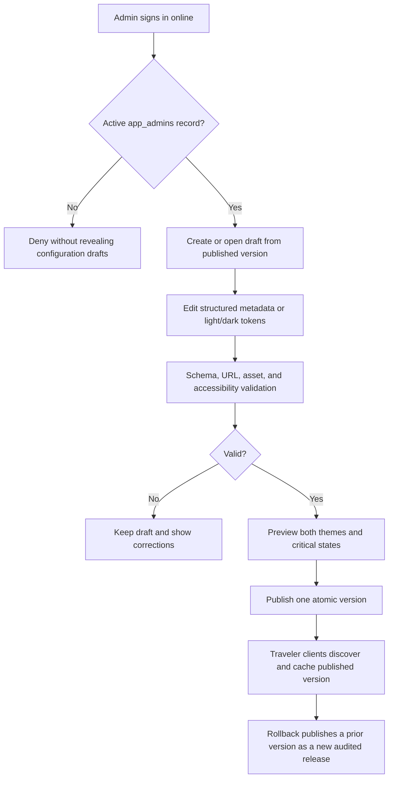

All administrator actions require a live connection. The console may display the last fetched published configuration when connectivity drops, but editing, saving, asset upload, publishing, and rollback are disabled. It has no IndexedDB edit drafts, mutation outbox, background replay, or offline-success message.

Selecting published airline or airport metadata for a trip copies its stable catalog key, source version, and display values into trip-scoped records. A later global publication can offer an **Update available** comparison, but it never silently changes an existing or historical trip.

### 11.12 Theme resolution and offline dark mode

The traveler chooses **System**, **Light**, or **Dark** per device. This is a local preference, so changing it on one phone does not unexpectedly change another person's device. System mode uses the browser's [`prefers-color-scheme`](https://developer.mozilla.org/en-US/docs/Web/CSS/Reference/At-rules/%40media/prefers-color-scheme) result and listens for operating-system changes while the app is open.

Before React starts, a small inline bootstrap reads the local preference and last validated published palette, selects a mode, and places `data-theme="light|dark"` plus the matching `color-scheme` on the document root. If local data is absent or invalid, it uses the bundled light/dark palette. This prevents a bright first-frame flash and works before IndexedDB, Supabase, or the network is available.

| Semantic token group | Examples | Constraint |
|---|---|---|
| Foundations | background, surface, elevated surface, border | Separate light and dark values; preserve visual hierarchy |
| Content | primary text, muted text, inverse text, link | Meet the selected WCAG 2.2 AA contrast targets on every allowed surface |
| Brand/action | accent, text on accent, focus ring | Focus remains visible; accent is never the only state indicator |
| Status | danger, warning, success, information | Pair color with an icon, label, or shape |
| Interaction | hover, pressed, selected, disabled, overlay | Preview keyboard, touch, and disabled states in both modes |
| Loading/offline | skeleton, stale, pending sync, conflict | Stay distinguishable without implying online freshness |

Admin-entered token values accept only fixed color formats supported by the schema; arbitrary CSS, URLs, functions, or scripts are rejected. Publication validation covers Home, flight cards, tickets and boarding passes, urgent alerts, document rows, dialogs, forms, disabled controls, offline/stale states, conflicts, and visible keyboard focus in both modes.

The service-worker package always includes safe default light and dark CSS. A complete validated published palette is cached as one version, never token by token, so an interrupted refresh cannot create a mixed theme. If a cached palette later fails validation or cannot be read, the app falls back to the bundled palette without blocking trip access.

### 11.13 Reference direction and motion contract

The visual direction uses several references for different problems rather than copying one application:

| Reference | Principle to study | Trip Vault interpretation |
|---|---|---|
| [Flighty design story](https://developer.apple.com/news/?id=970ncww4) | Put the one operational fact needed now ahead of secondary detail | A current flight or next action becomes the Home hero with time, gate, status, and document action visible at a glance |
| [Tripsy itinerary preferences](https://tripsy.help/article/59-itinerary-preferences) | Support readable day-by-day structure and useful density choices | Timeline groups remain clear on a phone and can later offer comfortable/compact density without changing information |
| [TripIt sample itinerary](https://help.tripit.com/en/support/solutions/articles/103000063427/) | Keep heterogeneous reservations in one chronological language | Flight, hotel, transport, and activity cards share predictable time/location/document positions |
| Trip Vault's own direction | Feel personal, calm, and dependable rather than like an airline operations screen | Warm surfaces, restrained travel imagery, document-vault clarity, explicit offline state, and no copied assets or layouts |

The time-based **Current** item and the viewport-focused item are different concepts. The app's clock and trip data determine Current; scrolling cannot change it. A carousel may additionally emphasize the card that has settled in the viewport, but that card never receives the **Current** label unless it is actually current.

| Surface or change | Visual treatment | Motion-enabled behavior | Reduced-motion behavior |
|---|---|---|---|
| Current trip hero | **Current trip** label, accent edge, stronger surface, scale `1.01` | One `180ms` settle when it becomes current | Static emphasized surface; no transform |
| Current timeline/Now card | **Now** label, accent marker, elevation, scale up to `1.02`, optional `-2px` lift | Discrete `180ms` transition when current state changes | Label, marker, and elevation change instantly |
| Settled carousel card | Full contrast and scale `1`; neighbors remain readable at approximately `0.97` | Change only after scroll settling or intersection threshold, never for every scroll pixel | Same discrete sizes with no interpolation |
| Pressed control | Shape, border, and pressed state | `80–100ms` scale to approximately `0.985` | Immediate pressed styling without movement |
| Page/route change | Stable header and navigation; content continuity | Optional `120–180ms` cross-fade | Immediate replacement with focus restored |
| Sheet or dialog | Modal surface and clear focus movement | `180–220ms` opacity plus short transform | Opacity-only or immediate presentation |

Implementation rules:

- Tailwind supplies utilities, but it does not make every animation inexpensive. Use property-specific `transition-transform`, `transition-opacity`, `transition-colors`, or `transition-shadow`; avoid `transition-all` in reusable components.
- Animate `transform` and `opacity` for movement. Do not animate layout dimensions, coordinates, large blurs, or backdrop filters during scrolling.
- Use CSS scroll snap for carousels and Intersection Observer only to detect a settled/visible state. Do not implement a continuously calculated scroll-zoom, parallax background, or sticky scale scrub.
- Never run an infinite pulse on delays, warnings, or the Now card. State changes may animate once and then settle.
- Apply `aria-current` where appropriate and retain a visible **Now** or **Current** label, so scale and color are never the only signal.
- Tailwind's `motion-safe`/`motion-reduce` variants disable non-essential transforms when the user requests reduced motion, following [W3C guidance for interaction animation](https://www.w3.org/WAI/WCAG22/Understanding/animation-from-interactions.html).
- The [View Transition API](https://developer.mozilla.org/en-US/docs/Web/API/View_Transition_API) may progressively enhance supported browsers after the base CSS transition is proven. Navigation and focus restoration must work identically when it is absent or disabled.
- Temporary `will-change: transform` may be applied immediately before an animation and removed afterward; it is not a permanent card style.

### 11.14 Bundled demonstration trip

`/preview` loads a deterministic local-only fixture called **Mediterranean Summer**. It is public because it contains no real data, never reads Supabase, and cannot be mistaken for an authenticated shared trip. A **Reset demo** action deletes its temporary browser changes and reloads the bundled baseline.

The fixture contains four stops, flights, hotels, ground transport, activities, readiness checks, manual reminders, and six membership/traveler cases: an owner-traveler, editor-traveler, viewer-traveler, managed parent, managed child, and non-traveling collaborator. A demo clock can switch between planning, D-1, travel-day, in-trip, and completed states without changing the real device clock. Its traveler focus mirrors the real workspace: Everyone tasks and person-specific tasks are distinguished, readiness totals recalculate for the chosen traveler, and scheduled tasks appear in the connected timeline rather than an older static preview.

| Sample asset | Format | Visibility demonstrated | Target size |
|---|---|---|---:|
| Fictional-airline e-ticket | PDF | Selected travelers | Under 350 KB |
| Fictional boarding pass with non-functional sample code | PDF | Traveler and managers | Under 250 KB |
| Hotel confirmation | PDF | Whole trip | Under 300 KB |
| Travel-insurance summary | PDF | Selected members | Under 400 KB |
| Museum ticket | PNG or PDF | Selected travelers | Under 250 KB |
| Two baggage-tag images | JPEG or WebP | Traveler and managers | Under 200 KB each |
| Visa-readiness checklist—not a visa | PDF | Whole trip | Under 250 KB |

Every page carries a prominent **SAMPLE — NOT VALID** watermark. Airlines, hotels, addresses, people, confirmation references, document numbers, signatures, QR codes, and barcodes are fictional and intentionally non-functional. The demo must not include a simulated passport or government identity document. All demo assets together target less than 3 MB and are precached so design review and the complete preview still work in airplane mode.

### 11.15 Itinerary event documents

An itinerary event has a **Documents** section containing zero or more ordered document links. Timeline cards stay compact; selecting a card opens the event detail, which shows the complete authorized list with title, purpose, traveler label where relevant, file size, and offline state.

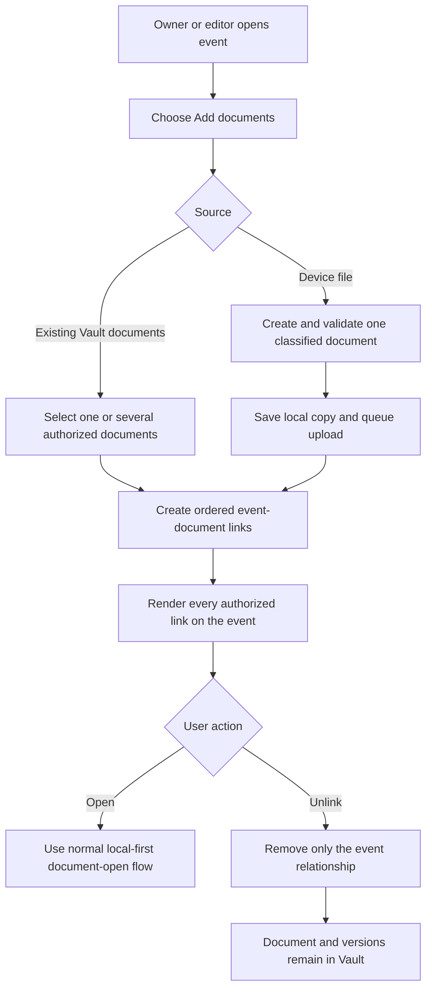

Rules:

- There is no one-document limit and no single `document_id` field on `itinerary_items`.
- A document may be linked to multiple events without copying its file or version records.
- If a document is already associated with the event's booking or flight leg, the picker identifies it and prevents a duplicate event link.
- Every new file uses the full upload sheet so purpose, Shared/Selected/Assign later usage, and access cannot be silently defaulted to generic `document` metadata. New files are added one at a time; the existing-Vault picker may attach several documents in one action.
- Event-link visibility follows the linked document. The server returns a link only when the member may read its document; locally cached links remain scoped to the signed-in profile.
- Reordering or unlinking is an itinerary edit and is limited to owners and editors for MVP.
- Unlinking, archiving, or deleting an event never deletes a Vault document. Deleting the document itself removes it from every event presentation according to the recoverable-deletion policy.
- When prepared offline, every authorized event link remains visible, and each locally present document opens through the same immediate profile-local flow. A missing file is labeled **Not downloaded** rather than making the event unavailable.

## 12. Form and Validation Behavior

- Create-trip and legacy itinerary/cost forms use `useFormDraft`; the unified Add Event sheet currently persists only after a valid submission and does not promise an incomplete draft.
- Initialize a new trip at local today + 15 calendar days and suggest an end seven calendar days after that start. Continue moving the suggestion when the untouched start changes, but never overwrite an end date the user deliberately edited. The versioned form-draft key prevents an older saved default from masquerading as the new suggestion.
- Ask Direct or Connecting before Flight details; ask Single or Connecting service for Train, Bus, and Ferry; ask neither for Cab. Render one leg for Direct/Single and at least two for Connecting, but persist only the ordered legs.
- Require both printed endpoint-local values for Flight. For Train, Bus, Ferry, and Cab, require departure and accept a missing arrival. Convert every supplied value with its endpoint's strict IANA time zone and never derive a printed arrival from departure.
- Hide zone and repeated-clock controls for Domestic journeys and every local event, including the Domestic Flight edit sheet. Derive zones from known airports; require strict manual origin and destination zones for International Other airports and international non-flight endpoints.
- Keep trip dates and readiness due/expiry dates date-only. Exact timeline events require a local start. A relative event keeps its before/after anchor while independently allowing no timing detail, a duration only, or a later explicit start and optional end. Date-only, all-day, and unscheduled modes do not claim a user-entered clock time.
- For Exact and explicitly timed Relative events, derive end from start plus duration or derive duration from start plus end. Reject end without start, non-positive duration, an end that is not later, inconsistent start/end/duration values, and any entered or derived date outside the trip bounds.
- Validate trip end date is not before start date.
- Preserve provider-issued confirmation codes exactly as entered while allowing normalized search.
- Require a booking reference/PNR for flights.
- Do not collect generic journey location; derive the visible route from every ordered origin and destination.
- Hide contact name for flights and trains. Treat hotel title as the property/provider snapshot and collect only Booked via/booking website as the purchase source.
- Keep Airline and Booked via catalog selectors available after Other is chosen so the user can return to a saved value without restarting the form.
- Reconcile booking website whenever Booked via changes in create or edit: use the selected catalog URL, clear a stale value when the catalog entry has none, and clear it on Other before accepting a manual HTTPS value.
- Validate each flight, train, bus, ferry, and cab leg has an origin zone and destination zone. Require Flight arrival; when a non-flight arrival exists, require it after departure. Validate chronological connection order and endpoint continuity, comparing normalized endpoint codes when both are present and normalized names otherwise; ask which occurrence to use for an ambiguous DST time only when International/Cross-border controls are exposed, and reject nonexistent local times.
- Validate the journey mode's discriminated `details` object before it enters the offline queue and again with the database constraint; reject unknown keys or a `kind` that differs from the leg mode.
- After participant scope is chosen, render allocation inputs only for included travelers. Write Train seat/berth + coach + passenger reference, Bus seat + passenger reference, and Ferry passenger reference plus seat/cabin only for assigned seating into `journey_leg_travelers` per traveler and leg. Cab has no seat allocation.
- Persist `bookings.participant_scope` explicitly. Everyone emits no booking-traveler rows; Selected preserves and requires at least one same-trip traveler and uses only those travelers for leg allocations. The migration backfill converts the legacy all-active-traveler representation to Everyone and deletes its redundant assignment rows.
- When appending a flight connection, keep its origin equal to the displayed prior arrival in the client and revalidate endpoint/time-zone continuity, positive layover, journey scope, and Domestic country in the locked database function.
- Keep trip time zone captured from the device and hidden from normal trip forms; do not present it as a free-text field.
- Present base and cost currency as a native dropdown. Common travel currencies appear first, followed by the runtime's supported ISO currency codes; Zod still validates the submitted three-letter code.
- Keep scheduled flight times immutable during a manual delay update; estimated and actual times are separate fields.
- Require an update timestamp and authenticated actor whenever manual operational flight fields change.
- Validate flight legs in chronological segment order without assuming departure and arrival share a timezone.
- Format every journey departure with the origin zone and every arrival/overall end with the corresponding destination or final-destination zone.
- Permit online generic booking enrichment for unbooked Activity, Meal, Transport, Preparation, and Custom events. Preserve the event and existing-booking selector; use nullable booking schedule fields until the event has a real start instead of copying flexible-mode ordering fallbacks.
- Render elapsed durations as compact week/day/hour/minute units, preserving non-zero remainder units.
- Require `https` for airline actions and official-guidance links; never execute arbitrary URL schemes.
- Require a destination and affected traveler for a visa requirement, while allowing `not_required` as an explicit manual status.
- Validate boarding-pass and baggage-tag documents against the related flight leg and traveler when supplied.
- Normalize join codes by removing spaces and hyphens and uppercasing before submission; authoritative verification remains server-side and is never queued offline.
- Require traveler and collaborator invitations to satisfy their mutually exclusive target fields.
- Require booking, itinerary, requirement, and document traveler assignments to belong to the same trip.
- Require selected document usage to contain at least one traveler in the UI; shared and unassigned modes contain no `document_travelers` rows.
- Derive each new Vault title from document type, Shared/Selected/Assign later traveler context, and linked event title. A custom name overrides the saved title but leaves the derived context visible below it; preserve the device filename only as immutable version metadata.
- When missing-cost recovery starts from an event, display that event title as a fixed source instead of asking the user to name the cost again.
- Keep document traveler usage separate from private/trip/selected-member access and explain that distinction beside the controls.
- Require every itinerary-document link to reference an event and document from the same trip and prevent duplicate active links for the same pair.
- Show the active managed-traveler context beside every form that can change another person's information.
- Require a trip, title, and category before document upload finalization. The reusable picker first rejects empty, unsupported, or oversized files; it may normalize an empty/generic MIME only from an approved filename extension.
- Reject a selected document of `5_000_000` bytes or larger before copying it into OPFS, while preserving the original device file and reporting its measured size.
- Validate administrator catalog codes, IANA timezones, HTTPS action templates, supported asset types, stable keys, and uniqueness before saving online.
- Accept only allowlisted semantic theme tokens and fixed color values; require accessible foreground/background and focus-state combinations before publication.
- Display validation near the affected field and keep user-entered data intact.
- Never block local draft creation solely because the device is offline.
- Do not create local drafts for administrator changes; disable Admin mutations whenever the connection or administrator session is unavailable.

## 13. PWA Update Behavior

1. Download a new app shell in the background.
2. Do not replace the currently running version during an edit or upload.
3. Show **Update ready** with a user-controlled reload action.
4. Ensure local database migrations complete before the new UI reads data.
5. Roll back the local transaction if a migration fails and keep the prior cached shell usable where possible.

## 14. Error Model

| Error class | Example | UI response |
|---|---|---|
| Validation | Missing destination | Inline correction; no retry |
| Offline | No connection during save | Save locally and show queued state |
| Authentication | Session cannot refresh | Preserve local read-only view and request sign-in online |
| Authorization | Membership removed | Block future cloud access and explain that an existing device copy must be removed locally |
| Conflict | Server version changed | Preserve both and open resolution flow |
| Quota | Insufficient local storage | Show required space and selective unpin options |
| Upload | Interrupted transfer | Keep the verified local original and retry the whole sub-5-MB file when the app is open and connected |
| Integrity | Checksum mismatch | Delete bad local copy and redownload |
| Admin offline | Connection lost in Admin console | Keep the last fetched view visible but disable all mutations and publishing |
| Published config | Downloaded version is incomplete or invalid | Keep the prior cached version and use bundled defaults if none exists |
| Unexpected | Unknown client error | Safe message plus redacted diagnostic ID |

## 15. Accessibility and Internationalization

- Meet WCAG 2.2 AA for contrast, focus, names, and touch targets.
- Support keyboard navigation and visible focus on desktop.
- Respect reduced-motion preferences.
- Use semantic headings, lists, buttons, dialogs, and status announcements.
- Store timestamps independently from display locale.
- Display dates, times, numbers, and addresses with the user's locale.
- Keep the architecture ready for translated strings even if the MVP ships in English only.

## 16. Verification Strategy

### 16.1 Current executable baseline

| Check | Last verified | Result |
|---|---|---|
| `npm run typecheck` | 2026-09-16 | Pass |
| `npm test` | 2026-09-16 | Pass: 78 files, 425 tests |
| `npm run build` | 2026-09-16 | Pass; only the existing chunk-size and dynamic-import advisories remain |
| `npm run format:check` | 2026-09-16 | Pass |
| `supabase/tests/001_schema_smoke.sql` | Current local SQL includes booking-vendor, trip-cleanup, relative-event timing, reservation/scope, ground-detail, allocation, optional-arrival, and hotel-RPC assertions | Rerun remotely after the single new tail `202609140001_event_form_data_model.sql` |
| Phone, desktop, sharing, upload, Cloudflare, and airplane mode | Current release | Manual acceptance pending in `docs/FEATURE_TEST_CHECKLIST.md` |

The lists below are the release coverage contract. They do not imply that every bullet already has a dedicated automated test; remote RLS, Storage, PWA installation, and true airplane-mode behavior require the named manual or SQL acceptance step.

### 16.2 Unit-test coverage

- Date and timezone formatting
- New-trip +15-day start and seven-day end suggestions, including preservation of a deliberately edited end date
- Direct versus Connecting leg initialization and persisted ordered-leg behavior
- Connecting-leg endpoint continuity by normalized code, with normalized-name fallback
- Complete route reduction across every ordered stop and week/day/hour/minute duration formatting
- Pathname scroll reset without intercepting same-trip query-string Timeline/Details transitions
- D-1 current-window calculation across timezones and daylight-saving boundaries
- Deterministic focus selection for overlapping trips
- Ticket, boarding-pass, delay-countdown, and landed baggage presentation rules
- Alert derivation, stable keys, read/dismiss/snooze behavior, and unread counts
- Google Maps URL construction and encoding without a key
- Airline action-template validation and placeholder expansion
- Visa validity-buffer calculations and disclaimer states
- Join-code normalization, target validation, and generic error mapping
- Traveler, member, manager, and collaborator capability predicates
- Full-ready versus essentials-ready manifest calculation
- Offline cold-start bootstrap without network responses
- Role and visibility predicates
- Manifest and quota calculations
- Outbox dependency ordering
- Offline Document Inbox deletion allowed only before the first cloud attempt, with attempted/cloud-backed entries retained until an online delete
- Version-conflict classification
- File-path sanitization and checksum handling
- Administrator-role checks without trip-permission bypass
- Published-configuration version validation, atomic cache replacement, and fallback behavior
- System, Light, and Dark resolution before first render and after an operating-system preference change
- Theme-token format, contrast, and unsafe-value rejection
- Catalog snapshots remaining unchanged after later global publications
- Strict document-size boundary at `4_999_999` and `5_000_000` bytes
- Demo-clock state derivation without reading or modifying the real device clock
- Profile-namespaced local paths and immediate local-open eligibility without a cached document-permission predicate
- Itinerary-document same-trip validation, duplicate-link prevention, stable ordering, and unlink-without-delete behavior
- Relative timing parsing for relation-only, duration-only, adding a real start later, start/end/duration derivation, mismatch rejection, and trip-bound validation
- Stable named before/after anchor groups, relation-only current-state exclusion, and calendar omission until a real start exists
- Generic booking-later eligibility and nullable schedule fields for untimed Activity, Meal, Transport, Preparation, and Custom events
- Reservation-state and participant-scope normalization for booking writes
- Validated Train/Bus/Ferry/Cab detail discriminators and optional non-flight arrival handling
- Per-traveler journey allocation mapping and offline-cache keys
- Approved filename-extension MIME recovery for generic phone files, plus extensionless OPFS MIME restoration
- Event-first document ranking, current-account traveler relevance, shared-document retention, and full reservation route/category aggregation

### 16.3 Component-test and UI coverage

- Dashboard states
- Upcoming versus current Home and overlap switcher
- Fresh root launch waits for saved focus, applies the deterministic overlap fallback, and does not redirect an explicit `/home` visit
- Flight card manual states and document-priority changes
- Alerts groups, badge count, and empty state
- Airline picker, missing-logo fallback, and URL warning
- Airline, airport, and booking-vendor saved-list selection, derived airport metadata, explicit Other entry, and keyboard-aware mobile result dialogs
- Conditional journey fields: hidden Domestic/local zones, derived known-airport zones, International Other/manual zones, no journey location, and hidden flight/train contact names
- Domestic Flight edit hides repeated-clock controls; International Flight edit retains them
- Booking-vendor Other remains reversible, with Airbnb and Trip.com present in the bundled fallback
- Large Trip details renders only three reservation/document previews, while the dedicated routes render all records with search, category and traveler filters, complete wrapping document titles, and Back continuity
- Manual visa input and readiness warnings
- Join-code entry without pre-redemption trip disclosure
- Traveler roster and managed-traveler context picker
- Non-traveling collaborator labels and excluded traveler actions
- Progressive booking forms by type: Flight is always Booked and Hotel defaults to Booked; Activity/Meal/Train/Bus/Ferry/Cab and eligible Transport/Custom forms start in their non-booked choice and reveal reservation-only fields after Booked/Reserved is selected, while a completed Cab may capture its actual provider/reference details; Preparation and Walk never show booking fields
- Journey chooser order and route vocabulary: Flight uses Direct/Connecting, Train/Bus/Ferry use Single/Connecting service, and Cab has no route-structure prompt
- Domestic Bus hides country and time-zone fields; non-flight arrivals are optional; allocation fields remain mode-aware: Train has seat/berth, coach and reference, Bus has seat and reference, and Ferry adds seat/cabin only for assigned seating
- Hotel check-in/check-out dates always create two milestones, while printed times are optional; missing times create date-only milestones with a hidden neutral ordering instant, a supplied checkout must follow check-in, and the booking plus both milestones save atomically
- Document visibility controls
- Document type presets, Shared/Selected/Assign later usage, assignment/access separation, and exact-duplicate recovery
- Document titles derived from purpose and traveler assignment, with original filenames preserved separately
- Traveler-focused filtering across timeline, reservations, costs, readiness, document lists, and event attachments
- In-app PDF viewer renders verified local bytes through the bundled PDF.js module with page, zoom, and fit controls; image preview has zoom controls; both retain **Open** as the device-viewer fallback and keep facts/management in the Info sheet
- Reusable document picker uses a large centered touch target for trip upload and the Profile inbox, a compact replacement variant, drag/drop and keyboard activation, immediate type/size feedback, generic phone-MIME normalization, and busy-state locking
- Offline and sync indicators
- Permission-dependent actions
- Admin sign-in, unauthorized state, catalog editors, release history, and online-only disabled states
- Theme editor previews for light/dark travel, alert, document, offline, and focus states
- Traveler appearance control in System, Light, and Dark modes
- Contextual-focus treatment with and without reduced motion, including separation between time-current and scroll-focused cards
- Demo trip reset, synthetic clock modes, sample-document watermark, and no-network rendering
- Local document opening for the owning profile, signed-out state, and account-switch isolation
- Event document section with zero, one, and several attachments; a queued/failed one-file upload; reorder; and unlink confirmation
- Mobile and desktop relative-event editing with Position/Event retained above a full-width optional schedule block, Start initially blank for legacy relation-only rows, End disabled until Start exists, and duration unit controls remaining visible above the phone keyboard
- Event details and timeline labels naming the relative anchor, showing planned duration without inventing a start, and exposing Add booking details for every supported generic event type
- Card interaction hierarchy: whole-card reservation navigation; read-first event and expense details for Viewers and Editors; direct-edit flight fact, note, airline snapshot, and readiness requirement cards; Owner-only Trip information activation; independently operable status/guidance/document/phone/map/archive actions; visible keyboard focus; and static variants where editing is not allowed
- `CostDetailsSheet` fields for amount, payment state, category, payer, booking/event linkage, participants and shares, and notes; **Balances by currency** hidden initially and revealed only through **Show balances**
- Empty, loading, failure, and conflict states

### 16.4 Database and Storage acceptance

- Every exposed table has least-privilege grants and Row Level Security.
- Non-members cannot read or mutate trip records.
- Unauthenticated users and unredeemed codes cannot read real trip metadata.
- A join code creates at most one membership and cannot be reused after concurrent redemption attempts.
- A known-account offer is limited to previously associated accounts and creates no membership before recipient acceptance.
- Traveler invitations cannot claim a different traveler, and collaborator invitations cannot create traveler-account links.
- The traveler context switcher never changes the authenticated account or bypasses Owner/Editor/Viewer trip roles.
- Viewers cannot edit shared content.
- Private and selected-member documents remain restricted.
- Document traveler assignments cannot cross trips and do not broaden private or selected-member visibility.
- Exact same-trip checksums are surfaced as an existing-document choice rather than a second stored object.
- Itinerary-document links cannot cross trips, expose an unreadable document, or duplicate an active event/document pair.
- Unlinking or deleting an itinerary event leaves the linked document and every immutable version intact.
- Flight legs cannot reference another trip's airline, traveler, or document.
- A `journey_leg_travelers` allocation cannot cross a trip or attach a traveler outside the booking roster; one active leg/traveler pair remains unique while seat, coach/cabin, and passenger references stay nullable.
- Train, Bus, Ferry, and Cab detail JSON must match the declared discriminator and its allowlisted keys; a non-flight arrival may be null, while a supplied arrival must still be after departure.
- Booking participant scope must agree with the traveler link set: Everyone resolves to the full active traveler roster, while Selected requires at least one selected traveler.
- `save_hotel_stay` writes the booking, traveler scope, and both check-in/check-out milestones as one transaction; optional printed-time flags decide exact versus date-only presentation, and a failure leaves none of the records partially created.
- Every saved connection must start where the previous leg ends; a post-creation flight connection fixes its origin to the previous arrival and the server independently enforces endpoint/time-zone continuity, positive layover, journey scope, and Domestic country before inheriting travelers and extending the flight booking and timeline event.
- Only owners and editors can change shared flight operations or airline metadata.
- Alert read state and manual reminders remain user-scoped.
- Ordinary users cannot read drafts, mutate configuration, publish releases, or add themselves to `app_admins`.
- Application administrators can manage configuration but cannot bypass trip membership or document visibility.
- Exactly one complete configuration release is published and readable by traveler clients at a time.
- Catalog assets are public-only, browser-safe, and writable only through administrator policies.
- Storage rejects document objects of `5_000_000` bytes or larger even when the client-side check is bypassed.
- `account-documents` accepts INSERT only for an owned pending unassociated receipt, exposes no UPDATE policy, and permits owner DELETE only while that receipt is unassociated; association makes the inbox original immutable.
- A successful account-document association clears cached pending/error state, and an associated server receipt suppresses a stale unassociated local inbox row during reconciliation.
- Permanent trip purge atomically queues legacy `trip-documents` paths with database deletion, removes and acknowledges those paths after commit, and retries retained queue rows during later online trip reads. Owner-held `account-documents` are removed only after their cascade-cleared association permits it; a failure retains the separate queue row or visible account receipt appropriate to that path.
- Removed members lose future database and storage access.
- Privileged service credentials are never required by the client.

### 16.5 Browser and end-to-end acceptance

- Onboarding through first trip creation
- Fresh authenticated root launch opens the saved eligible current trip or deterministic overlap fallback, while an explicit `/home` navigation remains on Home
- Trip cards open the trip timeline directly; all past/current/future events remain present and connected, and first open scrolls to the resolved active event
- Mouse click, keyboard activation, and phone tap on a timeline event first open its read-first detail sheet; Viewer sees the same details without Edit or Archive, while an Editor reaches those mutations inside the sheet
- A reservation's complete card opens its Flight or Booking details for every trip role, while Call and WhatsApp activate only the phone handler and never the card route
- Event-linked and main expense rows open `CostDetailsSheet` for Viewers and Editors; its payer, linkage, participants, shares, and notes are visible before role-gated mutations, and per-currency balances stay hidden until **Show balances** is enabled
- Flight fact, editable note, airline-snapshot, and readiness requirement cards open their edit surface directly for permitted roles; Viewer variants stay static, requirement status/guidance/document/Archive and note Archive remain independent, the Owner-only Trip information card opens Trip settings without absorbing its explicit Settings action, and only Admin catalog cards remain deferred
- Switching to one traveler leaves shared and selected-traveler records visible across the trip while hiding records assigned only to another traveler
- Phone event icons remain inside the card corner while desktop icons stay centered on the connector
- Flight creation asks Direct or Connecting; Train, Bus, and Ferry ask Single or Connecting service; Cab asks neither. Multi-leg routes reject a later origin that differs from the prior destination, and every saved stop appears in order.
- Known international airports fill code/country/time zone atomically. An International Other airport and International non-flight endpoint require an explicit strict zone; Domestic journeys show neither journey-country nor zone controls, and Domestic Flight editing never shows repeated-clock controls.
- Flight requires printed departure and arrival. Train, Bus, Ferry, and Cab require departure but allow arrival to remain unknown; when arrival is supplied, elapsed duration is derived from the endpoint-local times.
- Train retains seat/berth, coach, and passenger reference per included traveler and leg; Bus retains seat and passenger reference; Ferry retains passenger reference and conditionally seat/cabin for assigned seating; Cab intentionally has no passenger-seat allocation fields.
- Planned or walk-up journeys omit reservation-only fields. Changing a form to Booked reveals operator/property, Booked via, reference, contact, and ticket-specific fields without requiring a second timeline event.
- Departure displays use the origin zone and each arrival or overall journey end uses the corresponding destination or final-destination zone
- Hotel creation uses property name and Booked via without service-provider, time-zone, or repeated-clock controls
- An unbooked Activity, Meal, Transport, Preparation, or Custom event can receive online booking details later without creating a duplicate timeline event. An untimed event keeps nullable booking start/end/timezone values, while the itinerary editor still permits linking an existing booking
- A relative event may be relation-only, duration-only, or explicitly timed later; its timeline/detail label names the anchor, before/after groups remain stable, and no ordering fallback creates a fake Current state or calendar entry
- Event detail exposes optional cost, missing-cost recovery, map, Call/WhatsApp, booking-vendor, and all linked documents
- Compact cost summaries on Home and the trip header open the same itemized expense section
- Home, Profile, Vault, another trip, and other pathnames open at the top rather than inheriting timeline scroll
- Share-code text and locally generated QR redeem the same one-time traveler or collaborator invitation only after sign-in
- A previously associated account can receive a later trip offer on Home and must accept before joining
- An existing flight can receive a missing connection from Flight details without recreating the booking; its origin is the fixed prior arrival, a Domestic destination is country-filtered, and a forged discontinuous request is rejected by the server
- Invite acceptance and role enforcement
- Sign-up followed by successful one-time code redemption
- Invalid, expired, revoked, reused, brute-force-limited, and concurrent code redemption
- Claimed traveler, managed traveler, and non-traveling collaborator flows
- Organizer-assisted preparation on another traveler's phone
- Offline launch with a verified trip pack
- Airplane-mode cold start with zero network responses
- Complete prepared-trip browsing, alert calculation, local flight update, and pinned document preview
- Offline edit followed by reconnect and synchronization
- Interrupted upload followed by a safe whole-file retry from the verified local copy
- Offline deletion of a never-attempted pending inbox upload, plus online-only deletion of attempted or cloud-backed unassociated uploads and rejection of associated-upload deletion
- Permanent purge with legacy paths queued atomically with the database cascade, successful legacy cleanup acknowledged afterward, failed legacy cleanup retained for a later online trip-list retry, and account-inbox bytes/receipts cleaned only after association clearing
- Concurrent edit conflict
- Storage quota failure
- PWA upgrade with existing local data
- Home transition immediately before and at D-1 local midnight
- Overlapping current trips with automatic and manual focus
- Ticket-first flight changed offline to boarding-pass-first and then synchronized
- Manual delay update changes countdown and generates exactly one current alert occurrence
- Landed flight exposes baggage claim and multiple labeled baggage tags
- Offline Alerts page reproduces the same derived warnings and badge count
- Online Maps hand-off plus offline copy-address fallback
- Responsive behavior at phone, tablet, and desktop widths
- Dedicated administrator sign-in, denied ordinary-account access, draft validation, atomic publish, and audited rollback
- Administrator connection loss blocks editing and publishing without creating an offline mutation
- Administrator account cannot open a trip unless separately invited under normal membership rules
- Published metadata sync preserves existing trip snapshots and rejects incomplete versions
- Light/dark first paint, per-device override, System-mode change, offline reload, and bundled fallback without a theme flash
- Current-item emphasis during scroll, route changes, theme changes, and reduced-motion operation without layout shift or continuous scroll zoom
- Public demo cold start, all five synthetic time modes, local reset, and every watermarked sample document with zero Supabase requests
- Offline and online rejection of a `5_000_000`-byte file without adding it to OPFS, outbox, database metadata, or Storage
- Verified local document opens with no permission request, while another account on the same browser cannot discover or open it
- Attach several existing documents and successive one-at-a-time classified uploads to one itinerary event, retain a failed upload locally for retry, synchronize offline-created links, and unlink one without deleting any Vault document
- Select a document by tapping the centered picker, keyboard activation, and drag/drop on desktop; reject unsupported and `5_000_000`-byte files before local persistence, and accept an allowlisted extension reported by a phone as `application/octet-stream`
- Preview a multi-page PDF inside the app, change page/zoom/fit, zoom an image, open either file in the device viewer as a fallback, and confirm the Info button remains a compact secondary action on phone widths

### 16.6 Supabase rollout order

For an existing Trip Vault database, apply every not-yet-run migration in filename order. The current tail is:

1. `202609130004_account_document_storage_state.sql` if it has not already been applied.
2. `202609130005_booking_vendor_catalog_additions.sql`.
3. `202609130006_trip_storage_cleanup_queue.sql`.
4. `202609130007_relative_event_timing.sql`.
5. `202609140001_event_form_data_model.sql`.
6. `supabase/tests/001_schema_smoke.sql`.

Migration `202609130005` requires both an active `app_admins` row and the published release created by `202609130002_regional_travel_catalog.sql`; if either is absent, install/bootstrap it first instead of bypassing the guard.

Migration `202609130006` must follow `202609130005` in filename order. It installs the persistent legacy-object cleanup queue, owner-only permanent-delete RPC, guarded Storage-delete path, and hardened appended-flight connection function. A project already current through `202609130005` runs only `202609130006` before the smoke test.

Migration `202609130007` follows the cleanup migration. It adds `has_explicit_start_time` and `duration_minutes`, migrates flexible legacy rows without treating their ordering fallback as real time, validates schedule derivation and trip bounds, and propagates an anchor change only to relation-only dependants. A project already current through `202609130006` runs only `202609130007` before the smoke test.

Migration `202609140001` is the single new event-form schema delta for this redesign. It adds reservation state and participant scope, optional non-flight arrival plus typed ground-journey detail JSON, per-leg traveler allocations, and the atomic hotel-stay save function. A project already current through `202609130007` runs only `202609140001` and then the smoke test.

For a fresh Supabase project:

1. Run `supabase/TRIP_VAULT_COMPLETE_SETUP.sql` once to install the current schema and Storage policies, including the `202609140001` event-form data-model contract. Do not reapply the tail migration afterward.
2. Create the dedicated Auth administrator and bootstrap its active `app_admins` row through trusted SQL.
3. Run `202609130002_regional_travel_catalog.sql` to publish the regional airports, airlines, and initial vendors.
4. Run `202609130005_booking_vendor_catalog_additions.sql` to publish Airbnb and Trip.com in a new immutable release.
5. Run the schema smoke test.

The React bundle already contains fallback catalog JSON, so form entry does not depend on a successful remote catalog read. The SQL steps make the same metadata available through the versioned published configuration; they do not rewrite existing booking snapshots.

## 17. Configuration Boundaries

| Setting | Exposure | Purpose |
|---|---|---|
| Supabase project URL | Browser-safe | Client endpoint |
| Supabase publishable key | Browser-safe with correct RLS | Identifies project |
| Cloudflare environment name | Browser-safe | Diagnostics and feature flags |
| Published configuration version | Browser-safe | Lets clients atomically cache airline, airport, travel-default, and theme metadata |
| Appearance preference | Device-local | Stores System, Light, or Dark before application startup; contains no account or trip data |
| Application-administrator account ID | Server or migration only | Bootstraps the dedicated account in `app_admins`; never writable by the browser |
| Catalog asset bucket | Public-read, admin-write | Holds approved non-personal airline and presentation assets only |
| `MAX_DOCUMENT_BYTES` | Shared browser and server constant | `5_000_000`; accepted files must be strictly smaller and the bucket limit is configured to `4_999_999` bytes |
| Google Maps API key | Not present in MVP | Keyless Maps URLs are used; adding a provider API requires a new decision |
| Service-role or secret key | Server only | Administrative operations |
| Join-code hashing or HMAC secret | Server only | Protects one-time code verification if the selected hashing scheme requires a server-held pepper |
| Error-reporting token | Build or server scoped | Must avoid personal-data payloads |

`.env.example` should contain names and explanations only, never live values.

## 18. Detailed Decision Register

| ID | Question | Current options or decision | Status |
|---|---|---|---|
| LLD-001 | May editors invite members? | Owner only for MVP | Accepted |
| LLD-002 | How are sensitive documents protected locally? | Browser/OS profile isolation for the personal MVP; clear-local-copy and sign-out controls are provided | Accepted |
| LLD-003 | What is mandatory in a trip offline pack? | Product contract: complete structured trip data and all authorized current files; an explicitly reduced document set is `Essentials ready` | Accepted |
| LLD-004 | How long is recoverable deletion retained? | Current lists surface soft-deleted records for 30 days; a separately confirmed owner-only irreversible purge exists temporarily for test cleanup | Revisit after testing |
| LLD-005 | Which files may preview inline? | PDF and common images only | Accepted |
| LLD-006 | Does v1 include activity history? | Retain scoped security/configuration events; defer a general user-visible history screen | Accepted |
| LLD-007 | Styling implementation | Tailwind plus semantic CSS design tokens | Accepted |
| LLD-008 | Authentication method | Email-only Supabase authentication; onboarding has no separate confirmation gate for now | Accepted |
| LLD-009 | Offline session behavior | Previously enrolled, locally signed-in device supports reads and queued edits; reauthentication is required before synchronization | Accepted |
| LLD-010 | Conflict resolution depth | Record-level keep-local or use-cloud choice with both versions shown | Accepted |
| LLD-011 | Current trip selection | One focused trip per user; D-1 through trip end using the hidden captured trip-time-zone fallback; root fresh launch uses saved eligible focus or deterministic overlap fallback, while explicit `/home` remains Home | Accepted |
| LLD-012 | Flight status source | Traveler-maintained operational fields with visible actor/freshness and external links; no provider feed | Accepted |
| LLD-013 | Flight document priority | Ticket first until a boarding pass exists; boarding pass first afterward; baggage tags remain leg/traveler attachments | Accepted |
| LLD-014 | Visa assistance | Manual requirements, dates, status, document, and official link only; no eligibility automation | Accepted |
| LLD-015 | Notification boundary | Derived Alerts page and unread badge in MVP; Web Push and scheduled delivery later | Accepted |
| LLD-016 | Map boundary | Keyless Google Maps URLs; no embedded images, automatic geocoding, route optimization, or offline maps | Accepted |
| LLD-017 | Airline metadata ownership | Bundled starter catalog copied to editable trip-scoped records with safe local asset fallbacks | Accepted |
| LLD-018 | Invitation mechanism | Signed-in recipient redeems a unique 16-character, expiring, revocable, single-use code targeted to one traveler or collaborator | Accepted |
| LLD-019 | Traveler and account identity | Separate traveler profiles, optional account claim, and a persistent local traveler context for Owner/Editor management without identity impersonation; granular per-traveler delegation is deferred | Accepted |
| LLD-020 | Non-traveling help | Collaborator membership receives Editor or Viewer capabilities without a traveler link or traveler assignments | Accepted |
| LLD-021 | Trip privacy | Authentication and active membership are required for all real trip data, even when document binaries are excluded | Accepted |
| LLD-022 | Offline operating promise | Cached shell, IndexedDB, OPFS/IndexedDB files, local rules, and an outbox provide prepared-trip use; enrollment and remote changes require network, and full readiness remains subject to LLD-044 | Accepted |
| LLD-023 | Join-code parameters | 16 Crockford Base32 characters, 14-day expiry, and five failed attempts per authenticated account per fifteen minutes | Accepted |
| LLD-024 | Administrator sign-in | Separate `/admin/sign-in` entry using a dedicated Supabase Auth account plus an `app_admins` allowlist | Accepted |
| LLD-025 | Administrator privacy | Configuration authority never bypasses trip membership, traveler management, or document visibility | Accepted |
| LLD-026 | Browser-editable configuration | Airlines, airports, browser-safe travel defaults, catalog assets, and semantic light/dark tokens only; secrets and security policy remain deployment-managed | Accepted |
| LLD-027 | Configuration lifecycle | Online-only draft, validation, preview, atomic publish, audit, and rollback; traveler clients cache only a complete published version | Accepted |
| LLD-028 | Appearance resolution | Per-device System/Light/Dark preference, applied before React; bundled and last-published palettes support offline startup | Accepted |
| LLD-029 | Administrator sign-in hardening | Email authentication initially; add MFA or passkey before sensitive or wider deployment | Proposed |
| LLD-030 | Visual reference direction | Study Flighty's current-information hierarchy and Tripsy/TripIt's itinerary structure while creating an original Trip Vault visual language | Accepted |
| LLD-031 | Contextual focus motion | Small discrete zoom/elevation plus explicit text/accent; no continuous scroll-linked zoom, parallax, or motion-only meaning | Accepted |
| LLD-032 | Demo trip | Bundle a local-only, resettable synthetic trip with a controllable demo clock and small watermarked, non-functional documents | Accepted |
| LLD-033 | Document size | Accept only files smaller than `5_000_000` bytes, checked before OPFS/outbox work and again authoritatively in Storage | Accepted |
| LLD-034 | Compression boundary | No automatic document changes in MVP; a user-reviewed, explicitly lossy image-copy optimizer may be considered later, but PDFs remain unchanged | Accepted |
| LLD-035 | Local document-open check | Current profile context plus a verified file in that profile's OPFS namespace is enough; do not evaluate a cached document authorization record before opening | Accepted |
| LLD-036 | Itinerary event documents | Use a many-to-many link table so one event can have several ordered documents and one document can appear on several events without file duplication | Accepted |
| LLD-037 | Document traveler usage | Store Shared, Selected, or Assign later on the document and use `document_travelers` for one-or-many selected travelers; usage never grants access | Accepted |
| LLD-038 | Document route hierarchy | Make the local-first document itself the primary page; render PDF/image bytes with in-app controls, move facts and management to an Info sheet, and retain device **Open** as the compatibility fallback | Accepted |
| LLD-039 | Upload classification | Offer travel-language types with contextual defaults: shared stay confirmations, personal boarding/identity documents, and unassigned unnamed admission tickets | Accepted |
| LLD-040 | Exact duplicate behavior | Compare the current-version SHA-256 within a trip and attach/open the existing Vault record instead of storing duplicate bytes | Accepted |
| LLD-041 | Online read order | Use Supabase first with IndexedDB collection fallback while online; use IndexedDB directly when offline; TanStack Query has a 30-second freshness window | Accepted |
| LLD-042 | Trip-open behavior | Open the complete timeline, resolve one current/next/most-recent item, scroll it into view once, and restore scroll after viewing Details | Accepted |
| LLD-043 | Unified event creation | Use Add Event for travel, stays, meals, activities, preparation, transport, and custom entries with optional linked booking/cost/context | Accepted |
| LLD-044 | Offline manifest completeness | Add structured entity/version coverage, explicit generic-journey fetch, and non-document stale detection before the readiness badge alone is authoritative | Revisit |
| LLD-045 | Event upload interaction | Add one fully classified new file at a time; allow multi-select only when attaching existing Vault documents | Accepted |
| LLD-046 | Catalog picker fallback | Airline, airport, and booking-vendor selectors use one saved-list/Other interaction; explicit Other values create privacy-safe online suggestions for later administrator approval or rejection | Accepted |
| LLD-047 | Flight airport consistency | Selecting an airport supplies name, code, country, and IANA time zone atomically; derived values are read-only unless Other is selected | Accepted |
| LLD-048 | Traveler presentation focus | Everyone shows the whole trip; selecting one traveler shows shared plus that person's timeline, bookings, costs, readiness, seats, and documents without changing authorization | Accepted |
| LLD-049 | Known-account trip offer | Accounts that previously shared an accepted trip may be selected again, but the recipient must accept the new trip from Home before membership is created | Accepted |
| LLD-050 | Post-creation flight connections | Owners and editors can append a chronological flight leg later; travelers are inherited and booking/timeline end times advance atomically | Accepted |
| LLD-051 | Flexible event timing | Non-journey events may use exact time, date-only, all-day, before/after a dated event, or an Unscheduled section; relative placement remains independent from optional duration and later explicit start/end, while journey tickets retain exact endpoint times | Accepted |
| LLD-052 | Timeline state versus archive | Planned, Done, Skipped, and Cancelled remain visible states; Archive is reversible and a booking-backed milestone archives/restores its complete booking group | Accepted |
| LLD-053 | Trip date boundary | Dated events and their ends must stay within the trip start/end dates; the form constrains input and a database trigger is authoritative | Accepted |
| LLD-054 | Modal browser history | Device/browser Back closes the top sheet; nested edit/cost/upload returns to the underlying event sheet before navigating away | Accepted |
| LLD-055 | Trip-scoped expense sharing | Paid costs may name a traveler payer and participants; equal shares use integer minor units, balances are derived, and currencies are never silently combined | Accepted |
| LLD-056 | Testing deletion | The owner-only permanent-delete action is visibly temporary, requires the exact trip title, atomically queues legacy paths with database deletion, cleans queued and account-inbox objects after commit, retains the correct retry record on failure, and is online-only | Accepted for testing |
| LLD-057 | Admin redesign | Do not extend the current console until the trip application stabilizes; later rebuild it responsively with plain language and guided draft/publish/review flows | Deferred |
| LLD-058 | Account document staging | Cache and upload the original under the signed-in account first, then atomically associate it with trip metadata; retain incomplete work in the Profile inbox | Accepted |
| LLD-059 | Journey structure prompt | Ask Direct or Connecting for Flight, Single or Connecting service for Train/Bus/Ferry, and no route-structure question for Cab; create one or at least two editable legs as appropriate and persist only ordered legs | Accepted |
| LLD-060 | Visible time-zone boundary | Hide zones for Domestic journeys and local events; derive known flight-airport zones and request strict manual zones only where international metadata is not available | Accepted |
| LLD-061 | Provider-local schedule math | Require both printed endpoint times for Flight; allow Train/Bus/Ferry/Cab arrival to remain unknown; when both exist, convert endpoint-local times independently and derive elapsed duration from the resulting instants | Accepted |
| LLD-062 | Journey presentation | Derive a complete ordered route on cards/details, omit generic journey location, and format elapsed time with week/day/hour/minute units | Accepted |
| LLD-063 | Booking terminology | Airline/operator performs travel, hotel title is the property, and Booked via is the purchase channel; flight/train contact names and hotel clock/time-zone controls are omitted | Accepted |
| LLD-064 | Booking-vendor fallback | Keep the picker available after Other, reconcile its catalog URL or clear stale website state in create/edit, bundle Airbnb/Trip.com, and publish them through forward migration `202609130005` without rewriting booking snapshots | Accepted |
| LLD-065 | Expense entry point | Keep Home/trip-header totals compact and make both open the itemized Costs section | Accepted |
| LLD-066 | Route scroll ownership | Reset scroll for each pathname; preserve TripPage's own Timeline/Details query transition and per-trip active-position handling | Accepted |
| LLD-067 | Generic event booking enrichment | Permit an owner/editor to add booking details online to an unbooked Activity, Meal, Transport, Preparation, or Custom event; linking preserves the event, existing-booking choice, and nullable booking time until a real start exists | Accepted |
| LLD-068 | Connected endpoint continuity | Validate every later journey origin against the previous destination; fix a post-creation connection's origin in the UI and re-enforce its endpoint, zone, layover, scope, and Domestic country under database locks | Accepted |
| LLD-069 | Journey display zones | Render departure in its origin zone and arrival/overall end in its destination zone; hide repeated-clock choices throughout Domestic Flight editing | Accepted |
| LLD-070 | Account document lifecycle | Limit private-object INSERT to pending unassociated receipts, expose no UPDATE, allow DELETE only while unassociated, require online deletion after any cloud attempt, and use associated cloud receipts to suppress stale local inbox state | Accepted |
| LLD-071 | Permanent-purge Storage queue | Enqueue legacy paths and delete the trip atomically, acknowledge only successful post-commit object cleanup, retry retained queue rows on later online trip reads, and retain an account receipt when post-association account cleanup fails | Accepted for testing |
| LLD-072 | Relative schedule precision | Store whether a relative start is real, allow a positive duration without it, derive missing end/duration when possible, and never expose the anchor fallback as current, calendar, or booking time | Accepted |
| LLD-073 | Card interaction hierarchy | Use one whole-card primary action, show read-first details before editing rich records, send shallow flight/note/airline/readiness cards and the Owner trip overview directly to edit/settings, keep independent/destructive controls separate, and defer only Admin catalog cards | Accepted |
| LLD-074 | Deferred geographic suggestion source | If adopted later, pin one Countries States Cities Database release, import only the required country/city identifiers, coordinates, and IANA zones behind a local searchable projection, preserve ODbL attribution/provenance, retain Other, and keep airport codes plus Maps links in their existing authoritative paths | Deferred |
| LLD-075 | Progressive reservation capture | Store Planned, Walk-up/no reservation, or Booked explicitly; hide reservation-only inputs until Booked and allow a planned item to receive booking details later without duplicating the event | Accepted |
| LLD-076 | Journey traveler allocations | Keep Flight seat + boarding group + ticket number; store Train seat/berth + coach + reference, Bus seat + reference, and Ferry reference with seat/cabin only for assigned seating per included traveler and leg; do not force one shared seat field or add a Cab seat grid | Accepted |
| LLD-077 | Document preview engine | Bundle the browser-safe PDF.js module and worker with the PWA, render PDFs to canvas with page/zoom/fit controls, zoom images in-app, and keep device **Open** for fallback/unsupported rendering | Accepted |
| LLD-078 | Document file-selection surface | Use one reusable large centered, touch/keyboard/drop-enabled picker for trip upload and the Profile inbox, with a compact replacement variant and immediate size/type/busy feedback; defer Admin artwork selection to the Admin redesign | Accepted |
| LLD-079 | Large-trip collection routes | Keep Trip details to three-row previews and counts; expose complete reservation/document collections on stable searchable routes; batch/cache account-traveler and event-document relationships; rank documents by event time before purpose | Accepted |

## Source File Index

These paths are the implemented ownership map. Tests are co-located with their modules; remaining limitations are marked `Revisit` in the decision registers.

| Component | Path | Responsibility |
|---|---|---|
| App shell | `src/app/` | Providers, router, and top-level layout |
| Fresh-launch router | `src/components/RootRoute.tsx` | Waits for trips and saved focus, opens the eligible current trip deterministically, and leaves explicit Home navigation alone |
| Route scroll ownership | `src/app/RouteScrollManager.tsx` | Pathname reset while preserving TripPage query-string navigation |
| Product features | `src/features/` | Domain-specific UI and behavior |
| Administrator console | `src/features/admin/` | Protected online-only metadata, theme, validation, publication, and audit views |
| Demonstration trip | `src/demo/` | Synthetic fixtures, demo clock, reset behavior, and bundled sample documents |
| Starter travel catalogs | `src/features/metadata/starter-airlines.json`, `src/features/metadata/starter-airports.json`, `src/features/metadata/starter-vendors.json` | Versioned autocomplete seeds with user-entered fallback and optional suggestions |
| Journey-operator catalog | `src/features/metadata/starter-journey-operators.json`, `src/features/metadata/JourneyOperatorPicker.tsx` | Transport-specific operator suggestions with an explicit Other/manual fallback |
| Timeline feature | `src/features/timeline/`, `src/features/workspace/JourneyTravelerDetails.tsx`, `src/pages/TripPage.tsx` | Event creation, progressive reservation state, typed journey fields, per-leg traveler allocation, relative timing precision, active-item scrolling, event details, and trip details switch |
| Card interaction hierarchy and expense detail | `src/pages/TripPage.tsx`, `src/pages/TripPage.test.tsx`, `src/pages/BookingPage.tsx`, `src/pages/FlightPage.tsx`, `src/pages/FlightPage.test.tsx`, `src/pages/ReadinessPage.tsx`, `src/features/workspace/TripAirlinesPanel.tsx`, `src/features/workspace/TripAirlinesPanel.test.tsx` | Whole-card reservation/event/cost activation, read-first booking and expense fields, opt-in balances, Owner trip-overview settings, readiness direct edit with independent controls, and other direct-edit shallow cards |
| Large-trip collection views | `src/features/trips/TripDetailsView.tsx`, `src/features/trips/TripDetailsCards.tsx`, `src/features/trips/reservationPresentation.ts`, `src/components/TripDocumentRow.tsx`, `src/pages/TripReservationsPage.tsx`, `src/pages/TripDocumentsPage.tsx` | Three-row previews, category counts, compact rows, complete searchable/filterable collections, and event-first document grouping |
| Trip relationship batching | `src/features/workspace/tripRelationships.ts`, `src/features/queries/tripQueries.ts`, `src/features/sync/queryRoots.ts` | One cached current-account traveler-link read and one batched event-document reference read per trip, with offline fallback and targeted invalidation |
| Journey and booking detail | `src/pages/FlightPage.tsx`, `src/pages/BookingPage.tsx` | Endpoint-zone display, Domestic/International update controls, full route, seats, and booking detail |
| Generic event booking enrichment | `src/features/workspace/AddActivityBookingForm.tsx`, `src/features/trips/TripForms.tsx`, `src/features/trips/api.ts` | Supported event types, nullable untimed booking schedule, existing/new booking choices, versioned event link, and compensating archive |
| Theme definitions | `src/lib/theme/`, `src/styles/globals.css` | Bundled semantic light/dark fallbacks, local preference, and published-token application |
| Local database | `src/lib/local-db/` | IndexedDB schema, migrations, and repositories |
| Offline device context | `src/lib/auth/` | Last enrolled profile, explicit local sign-out, and expired-session airplane-mode fallback without storing new credentials |
| Offline file storage | `src/lib/storage/` | OPFS operations, manifests, and integrity |
| Document semantics | `src/features/workspace/documentModel.ts` | Travel-specific type presets, assignment labels/filtering, and exact duplicate detection |
| Account document inbox | `src/features/workspace/DocumentInboxPanel.tsx`, `src/features/workspace/api.ts`, `src/features/sync/localSync.ts` | Account-first staging, retry/verification, association cache reconciliation, stale-cloud suppression, and safe online/offline deletion boundary |
| Document selection and preview | `src/components/FileDropzone.tsx`, `src/components/DocumentPreview.tsx`, `src/pages/DocumentPage.tsx`, `public/vendor/pdfjs/` | Large/compact validated file selection, phone-MIME recovery, local PDF/image rendering, Info separation, and device Open fallback |
| Trip lifecycle | `src/features/trips/api.ts` | Archive, recoverable deletion, restore, and owner-only permanent purge with post-commit queued Storage cleanup |
| Backend client | `src/lib/supabase/` | Supabase client and typed repositories |
| Database deltas | `supabase/migrations/` | Post-baseline schema, function, grant, and RLS changes for existing projects |
| Account-document Storage hardening | `supabase/migrations/202609130004_account_document_storage_state.sql` | Verified completion, append-only Storage policies, association immutability, and unassociated cleanup boundary |
| Booking-vendor catalog addition | `supabase/migrations/202609130005_booking_vendor_catalog_additions.sql` | Copies the published release and adds Airbnb and Trip.com |
| Trip Storage cleanup queue | `supabase/migrations/202609130006_trip_storage_cleanup_queue.sql` | Persistent owner cleanup work, guarded legacy-object deletion, permanent-delete RPC, and server-hardened flight connection append |
| Relative-event timing migration | `supabase/migrations/202609130007_relative_event_timing.sql` | Explicit-start marker, optional planned duration, derivation constraints, anchor fallback propagation, and trip bounds |
| Event-form data-model migration | `supabase/migrations/202609140001_event_form_data_model.sql` | Reservation state, participant scope, optional non-flight arrival, typed ground details, per-leg traveler allocations, and atomic hotel-stay save |
| Consolidated database setup | `supabase/TRIP_VAULT_COMPLETE_SETUP.sql` | Full current setup for a fresh project |
| Co-located automated tests | `src/**/*.test.ts`, `src/**/*.test.tsx` | Domain, local database, sync, alert, presentation, and route behavior |
| Schema smoke test | `supabase/tests/001_schema_smoke.sql` | Tables, policies, functions, and Storage limit assertions |
| Redesign checklist | `docs/REDESIGN_CHECKLIST.md` | Implemented timeline redesign scope and retained follow-ups |
| Manual feature checklist | `docs/FEATURE_TEST_CHECKLIST.md` | Phone, desktop, member, journey, document, offline, and Admin acceptance |
| High-level design | `docs/HIGH_LEVEL_DESIGN.md` | Architecture and decision gates |
| Feature catalog | `docs/FEATURES.md` | Product scope and acceptance conditions |
