# Trip Vault Low-Level Design

This document is the implementation contract for the personal Trip Vault MVP. The timeline-first application, device storage, Supabase schema, PWA behavior, and administrator console exist in the repository. Online reads use Supabase first with an IndexedDB fallback; offline reads use the device copy directly.

**Document status:** Implemented personal MVP 1.0

**Implementation status:** Timeline-first implementation complete locally. Existing Supabase projects must apply migrations through `202609110003_document_experience.sql`; fresh projects may run `supabase/TRIP_VAULT_COMPLETE_SETUP.sql` once. Remote and airplane-mode acceptance remain pending.

## 1. Technology Set

| Concern | Implemented choice | Decision state | Notes |
|---|---|---|---|
| Language | TypeScript | Implemented | Shared types and safer data migrations |
| UI | React | Implemented | Responsive component model |
| Build and local development | Vite | Implemented | Supported by Cloudflare tooling |
| Hosting | Cloudflare Workers with Static Assets | Configured | SPA hosting is configured; successful post-push deployment is not verified in this document |
| Routing | React Router | Implemented | Explicit route and layout model |
| Remote query cache | TanStack Query | Implemented | Online request lifecycle; not the offline source of truth |
| Local metadata database | IndexedDB through Dexie | Implemented | Queryable structured offline data and migration support |
| Local file storage | Origin Private File System with fallback | Implemented | Pinned documents and checksum verification |
| PWA lifecycle | Service worker generated through a Vite-compatible PWA plugin | Implemented | App-shell caching and update prompts |
| Database and identity backend | Supabase | Accepted | Auth, Postgres, and Realtime in a dedicated Trip Vault project |
| Cloud file storage | Supabase private Storage | Implemented | Keeps file authorization aligned with trip data |
| Authentication | Supabase email-only authentication | Accepted | Onboarding has no separate confirmation gate for now; detailed session behavior follows the Supabase project configuration |
| Administrator authorization | Dedicated Supabase Auth account plus `app_admins` allowlist and RLS | Accepted | Separate Admin entry; no new authentication provider and no implicit trip access |
| Validation | Zod | Implemented | Shared parsing at network and form boundaries |
| Styling | Design tokens plus Tailwind CSS | Implemented | Semantic tokens support both appearance modes |
| Appearance modes | CSS custom properties with System, Light, and Dark | Accepted | Bundled fallback palettes, local preference, published admin palette, and offline startup |
| Motion | Property-specific Tailwind transitions plus CSS scroll snap and Intersection Observer | Implemented | Restrained focus changes and reduced-motion fallback |
| Map hand-off | Google Maps URLs | Accepted | Search and directions links need no API key; no embedded maps, geocoding, or downloads in MVP |
| Flight status | Manual records plus external links | Accepted | No live-data provider, scraping, or background polling |
| Testing | Vitest, React Testing Library, SQL smoke test, and manual browser acceptance | Implemented | The executable local baseline is 26 files and 108 tests; type-check and production PWA build pass |

## 2. Implemented Repository Layout

```text
trip-vault/
├── docs/
│   ├── HIGH_LEVEL_DESIGN.md
│   ├── LOW_LEVEL_DESIGN.md
│   ├── FEATURES.md
│   ├── REDESIGN_CHECKLIST.md
│   ├── FEATURE_TEST_CHECKLIST.md
│   ├── source-index.md
│   └── doc-conventions.md
├── public/
│   ├── demo-documents/
│   ├── icons/
│   └── brand-mark.svg
├── src/
│   ├── app/
│   │   ├── App.tsx
│   │   └── AppProviders.tsx
│   ├── components/
│   ├── demo/
│   ├── features/
│   │   ├── admin/
│   │   ├── alerts/
│   │   ├── home/
│   │   ├── metadata/
│   │   ├── readiness/
│   │   ├── sync/
│   │   ├── timeline/
│   │   ├── trips/
│   │   └── workspace/
│   ├── lib/
│   │   ├── auth/
│   │   ├── forms/
│   │   ├── local-db/
│   │   ├── storage/
│   │   ├── supabase/
│   │   └── theme/
│   ├── pages/
│   ├── styles/globals.css
│   └── test/
├── supabase/
│   ├── migrations/
│   ├── tests/
│   └── TRIP_VAULT_COMPLETE_SETUP.sql
├── scripts/
├── .env.example
├── package.json
├── tsconfig.json
├── vite.config.ts
└── wrangler.jsonc
```

Feature folders should own their views, hooks, validation, and tests. Shared primitives move into `components/` or `lib/` only after at least two features use them.

## 3. Route Map

| Route | Access | Primary view | Offline behavior |
|---|---|---|---|
| `/` | Public or authenticated | Redirect to onboarding or home | App shell available |
| `/welcome` | Public | Welcome and value introduction | Fully available |
| `/preview` | Public | Sample Mediterranean trip | Fully available with bundled demo data |
| `/sign-in` | Public | Email-only Supabase sign-in | Explains that connection is required |
| `/join` | Authenticated | Enter and redeem a one-time trip code | Connection required; reveals no real trip data before successful redemption |
| `/admin/sign-in` | Public | Dedicated administrator account sign-in | Connection required; generic denial reveals no allowlist membership |
| `/admin` | Application administrator | Configuration overview, validation failures, and published version | Cached view optional; all changes require connection |
| `/admin/airlines` | Application administrator | Global airline catalog and action templates | Read-only cached view; publishing unavailable |
| `/admin/airports` | Application administrator | Airport names, codes, timezones, aliases, and optional location | Read-only cached view; publishing unavailable |
| `/admin/vendors` | Application administrator | Booking vendor names, links, branding, ordering, and enablement | Read-only cached view; publishing unavailable |
| `/admin/suggestions` | Application administrator | Privacy-safe airline, airport, vendor, and provider suggestions | Not available offline |
| `/admin/defaults` | Application administrator | Booking, document, readiness, reminder, and link defaults | Read-only cached view; publishing unavailable |
| `/admin/appearance` | Application administrator | Light/dark token editor and preview | Bundled preview works; saving and publishing require connection |
| `/admin/releases` | Application administrator | Draft, publish history, audit, and rollback | Connection required |
| `/home` | Authenticated | Upcoming-trip or current-trip Home | Online trip read refreshes Supabase first; mode and focus are derived locally from the returned or cached collection |
| `/alerts` | Authenticated | Urgent, Today, Upcoming, and dismissed alerts | Alerts and unread count are derived locally from the currently loaded or cached data |
| `/trips` | Authenticated | Upcoming, active, and past trips | Supabase first online; cached trip index on failure or offline |
| `/trips/new` | Authenticated | Create a trip | A valid submitted creation is cached and queued; unfinished fields are not an autosaved draft |
| `/trips/:tripId` | Trip member | Complete chronological timeline by default; `?view=details` opens sectioned trip details | Online refresh with cached fallback; offline reads the authorized device snapshot and restores timeline position |
| `/trips/:tripId/bookings/:bookingId` | Trip member | Booking details and attachments | Network-first metadata with cached fallback |
| `/trips/:tripId/flights/:flightLegId` | Trip member | Flight details, manual update, ticket, boarding pass, and baggage tags | Network-first metadata with cached fallback; local document files remain available |
| `/trips/:tripId/readiness` | Trip member | Visa, passport, insurance, check-in, and custom requirements | Network-first list with cached fallback; supported submissions queue locally |
| `/trips/:tripId/documents/:documentId` | Authorized member | Local-first document viewer with secondary information/actions sheet | Verified local version opens immediately; a permitted cloud version downloads once and is cached |
| `/vault` | Authenticated | Searchable cross-trip document index | Searches local metadata; remote refresh when online |
| `/add` | Authenticated | Quick-add chooser | Drafts can be stored locally |
| `/profile` | Authenticated | Account, devices, storage, and security | Local settings available |

The wide-screen layout may render several routes as side panels, but URL identity must remain stable.

## 4. Domain Types

### 4.1 Enumerations

| Type | Implemented values |
|---|---|
| `trip_status` | `draft`, `upcoming`, `active`, `completed`, `archived` |
| `member_role` | `owner`, `editor`, `viewer` |
| `member_status` | `active`, `removed` |
| `participation_type` | `traveler`, `collaborator` |
| `traveler_status` | `active`, `removed` |
| `invitation_target_type` | `traveler`, `collaborator` |
| `app_admin_status` | `active`, `disabled` |
| `config_release_status` | `draft`, `published`, `retired` |
| `theme_preference` | `system`, `light`, `dark` |
| `booking_type` | `flight`, `hotel`, `train`, `bus`, `ferry`, `cab`, `transport`, `activity`, `restaurant`, `other` |
| `timeline_event_type` | `flight`, `train`, `bus`, `ferry`, `cab`, `hotel_check_in`, `hotel_check_out`, `transport`, `meal`, `activity`, `preparation`, `custom` |
| `journey_mode` | `train`, `bus`, `ferry`, `cab` |
| `journey_scope` | `domestic`, `international` |
| `cost_category` | `flight`, `hotel`, `transport`, `activity`, `food`, `visa`, `insurance`, `other` |
| `payment_status` | `planned`, `paid`, `refunded` |
| `document_category` | `flight`, `hotel`, `activity`, `visa`, `passport`, `insurance`, `ticket`, `transport`, `receipt`, `other` |
| `document_purpose` | `confirmation`, `ticket`, `boarding_pass`, `baggage_tag`, `visa`, `passport`, `insurance`, `hotel_confirmation`, `activity_ticket`, `meal_voucher`, `receipt`, `other` |
| `document_assignment_mode` | `shared`, `selected`, `unassigned` |
| `document_visibility` | `private`, `traveler_and_managers`, `trip`, `selected_members` |
| `flight_status` | `scheduled`, `check_in_open`, `boarding`, `delayed`, `departed`, `landed`, `cancelled` |
| `requirement_type` | `visa`, `passport`, `insurance`, `check_in`, `payment`, `packing`, `custom` |
| `requirement_status` | `to_check`, `not_required`, `required`, `in_progress`, `complete`, `expired` |
| `alert_severity` | `urgent`, `today`, `upcoming`, `information` |
| `focus_source` | `automatic`, `manual` |
| `sync_state` | `local_only`, `queued`, `syncing`, `synced`, `conflict`, `failed` |
| `offline_state` | `not_requested`, `preparing`, `essentials_ready`, `ready`, `stale`, `failed`, `insufficient_space` |

### 4.2 Shared value objects

Location data is context-specific rather than one shared database type:

| Context | Stored shape | Rule |
|---|---|---|
| Booking | Human-readable label/address in booking `location`, with optional future coordinates | User entry is preserved; coordinates are never required |
| Itinerary item | `label`, `address`, and optional HTTPS `map_url` | At least one useful location value is supplied when a map action is expected |
| Journey endpoint | Name/code/country plus a strict IANA time zone on each leg | Origin and destination are independent snapshots |

The app uses an explicit `map_url` when present; otherwise it builds a keyless Google Maps search from the stored label or address.

### 4.3 Database Tables

The catalog below is the logical model implemented by the migration set. The migration SQL remains authoritative for exact PostgreSQL types, defaults, triggers, indexes, grants, and Row Level Security policies.

#### `profiles`

| Field | Type | Purpose |
|---|---|---|
| `id` | UUID, primary key | Matches authenticated user ID |
| `display_name` | Text | Name shown to trip members |
| `avatar_path` | Text, nullable | Private or public-safe avatar reference |
| `home_timezone` | Text | Default for new trips |
| `created_at` | Timestamp | Audit timestamp |
| `updated_at` | Timestamp | Change detection |

#### `app_admins`

This table authorizes the separate administrator account. It is bootstrapped through a migration or trusted Supabase administrative operation; the browser has no insert, update, delete, or self-promotion policy.

| Field | Type | Purpose |
|---|---|---|
| `user_id` | UUID, primary key | Dedicated Supabase Auth administrator account |
| `status` | `app_admin_status` | Active or disabled |
| `granted_by` | UUID, nullable | Trusted bootstrap or prior administrator audit |
| `created_at` | Timestamp | Grant audit |
| `disabled_at` | Timestamp, nullable | Revocation audit |

#### `config_releases`

| Field | Type | Purpose |
|---|---|---|
| `id` | UUID, primary key | Configuration release identity |
| `version_number` | Integer, unique | Monotonic version shown to clients |
| `status` | `config_release_status` | Draft, currently published, or retired |
| `based_on_release_id` | UUID, nullable | Version copied to create the draft |
| `change_note` | Text | Administrator summary |
| `created_by` | UUID | Administrator author |
| `created_at` | Timestamp | Draft creation time |
| `published_by` | UUID, nullable | Administrator who published or rolled back |
| `published_at` | Timestamp, nullable | Activation time |

Exactly one release may be `published`. Publishing or rollback is a server transaction; travelers never read draft rows.

#### `airline_catalog_entries`

| Field | Type | Purpose |
|---|---|---|
| `id` | UUID, primary key | Stable catalog-entry identity |
| `config_release_id` | UUID | Draft or published version containing the row |
| `stable_key` | Text | Identity preserved across configuration releases |
| `name` | Text | Airline display name |
| `iata_code` | Text, nullable | Two-character code where known |
| `icao_code` | Text, nullable | Three-character code where known |
| `aliases` | Text array | Searchable former or familiar names |
| `check_in_url_template` | Text, nullable | Official check-in action |
| `manage_booking_url_template` | Text, nullable | Official booking-management action |
| `status_url_template` | Text, nullable | Official status action |
| `tracker_url_template` | Text, nullable | Default public tracker action |
| `brand_color` | Text, nullable | Optional accessible accent |
| `logo_asset_path` | Text, nullable | Immutable catalog asset |
| `banner_asset_path` | Text, nullable | Immutable catalog asset |
| `is_enabled` | Boolean | Available in new-flight pickers |
| `updated_by` | UUID | Administrator audit |
| `updated_at` | Timestamp | Change time |

#### `airport_catalog_entries`

| Field | Type | Purpose |
|---|---|---|
| `id` | UUID, primary key | Stable catalog-entry identity |
| `config_release_id` | UUID | Draft or published version containing the row |
| `stable_key` | Text | Identity preserved across releases |
| `iata_code` | Text, nullable | Three-character passenger airport code |
| `icao_code` | Text, nullable | Four-character airport code |
| `name` | Text | Airport display name |
| `city` | Text | Primary served city |
| `country_code` | Text | ISO country code |
| `timezone` | Text | IANA timezone used to seed flight times |
| `aliases` | Text array | Search terms such as metro or former names |
| `latitude` | Decimal, nullable | Optional picker/map seed |
| `longitude` | Decimal, nullable | Optional picker/map seed |
| `is_enabled` | Boolean | Available in new-flight pickers |
| `updated_by` | UUID | Administrator audit |
| `updated_at` | Timestamp | Change time |

Airport entries seed a flight leg. The leg keeps its own code, name, and timezone snapshot so later catalog corrections do not rewrite travel history.

#### `booking_vendor_catalog_entries`

| Field | Type | Purpose |
|---|---|---|
| `id` | UUID, primary key | Catalog-entry identity |
| `config_release_id` | UUID | Draft or published configuration version |
| `stable_key` | Text | Identity copied into a booking snapshot |
| `name` | Text | Vendor display name |
| `aliases` | Text array | Autocomplete search values |
| `website_url` | HTTPS URL, nullable | Safe hand-off to the vendor |
| `logo_asset_path` | Text, nullable | Validated catalog artwork |
| `brand_color` | Hex color, nullable | Optional accessible accent |
| `is_enabled` | Boolean | Included in new-entry autocomplete |
| `sort_order` | Integer | Admin-controlled ordering |
| `updated_by` | UUID | Administrator audit actor |
| `updated_at` | Timestamp | Change time |

#### `catalog_suggestions`

Authenticated users may submit a privacy-safe unknown airline, airport, booking vendor, or service-provider value. The row stores normalized display metadata and a pending/approved/rejected review state, but never a booking reference, traveler name, trip identifier, or document content. Admin review is online-only.

#### `metadata_defaults`

| Field | Type | Purpose |
|---|---|---|
| `config_release_id` | UUID | Parent release |
| `namespace` | Text | `booking`, `document`, `readiness`, `alerts`, or `external_links` |
| `key` | Text | Code-defined setting identifier |
| `value` | JSON | Value validated by the matching Zod and database schema |
| `updated_by` | UUID | Administrator audit |
| `updated_at` | Timestamp | Change time |

Primary key: `(config_release_id, namespace, key)`. Admin can adjust labels, icons, ordering, enablement, suggested document visibility, readiness templates, reminder thresholds, and external-link defaults, but cannot invent executable schemas or authorization rules.

#### `theme_palettes`

| Field | Type | Purpose |
|---|---|---|
| `config_release_id` | UUID, primary key | Parent release |
| `light_tokens` | JSON | Allowlisted light-palette token values |
| `dark_tokens` | JSON | Allowlisted dark-palette token values |
| `updated_by` | UUID | Administrator audit |
| `updated_at` | Timestamp | Change time |

Only fixed token names and validated color values are accepted; arbitrary CSS, selectors, URLs, fonts, or scripts are prohibited.

#### `config_audit_events`

| Field | Type | Purpose |
|---|---|---|
| `id` | UUID, primary key | Audit identity |
| `config_release_id` | UUID | Affected draft or published release |
| `actor_id` | UUID | Application administrator |
| `action` | Text | Created, edited, validated, published, retired, or rolled_back |
| `safe_summary` | JSON | Changed keys and identifiers without secrets |
| `created_at` | Timestamp | Event time |

#### `trips`

| Field | Type | Purpose |
|---|---|---|
| `id` | UUID, primary key | Stable trip identifier |
| `title` | Text | User-facing trip name |
| `destination_summary` | Text | Short destination label |
| `start_date` | Date | Trip start |
| `end_date` | Date | Trip end |
| `primary_timezone` | Text | Device-captured compatibility fallback for trip-day grouping and non-journey entries; not a free-text user field |
| `status` | `trip_status` | Lifecycle state |
| `cover_image_path` | Text, nullable | Optional visual |
| `created_by` | UUID | Original owner |
| `version` | Integer | Optimistic concurrency counter |
| `created_at` | Timestamp | Audit timestamp |
| `updated_at` | Timestamp | Change detection and cache freshness |
| `deleted_at` | Timestamp, nullable | Recoverable soft deletion |

#### `user_trip_focus`

| Field | Type | Purpose |
|---|---|---|
| `user_id` | UUID, primary key | One focus record per user |
| `trip_id` | UUID | Current candidate selected for Home |
| `source` | `focus_source` | Distinguishes automatic choice from explicit switching |
| `updated_at` | Timestamp | Resolves newer local or remote choices |

This table does not make a trip current. The Home selector must still verify active membership and the D-1 date window before honoring it.

#### `trip_members`

| Field | Type | Purpose |
|---|---|---|
| `trip_id` | UUID | Membership scope |
| `user_id` | UUID | Member identity |
| `role` | `member_role` | Trip-level capability |
| `participation_type` | `participation_type` | Traveler or non-traveling collaborator |
| `status` | `member_status` | Invitation and access state |
| `joined_at` | Timestamp, nullable | Acceptance audit |
| `added_by` | UUID | Actor who initiated membership |
| `removed_at` | Timestamp, nullable | Revocation audit |

Primary key: `(trip_id, user_id)`.

#### `travelers`

A traveler is a person represented in bookings, itinerary items, requirements, and documents. The person may or may not operate an account.

| Field | Type | Purpose |
|---|---|---|
| `id` | UUID, primary key | Traveler identity within the trip |
| `trip_id` | UUID | Parent trip and authorization scope |
| `display_name` | Text | Name used in trip planning |
| `status` | `traveler_status` | Active or removed; claimed and managed labels are derived from relationship rows |
| `is_minor` | Boolean | Optional workflow hint; never used to infer legal authority |
| `created_by` | UUID | Member who added the traveler |
| `version` | Integer | Optimistic concurrency counter |
| `created_at` | Timestamp | Audit timestamp |
| `updated_at` | Timestamp | Change detection and cache freshness |
| `removed_at` | Timestamp, nullable | Removal audit |

#### `traveler_accounts`

| Field | Type | Purpose |
|---|---|---|
| `traveler_id` | UUID, primary key | Claimed traveler profile |
| `user_id` | UUID | Signed-in account linked to that traveler |
| `invitation_id` | UUID | One-time code redemption that established the link |
| `linked_at` | Timestamp | Claim audit |

One account can claim at most one traveler per trip. Non-traveling collaborators have no row here.

#### `traveler_managers`

This table is retained as a forward-compatible authorization boundary but is not configured by the personal MVP UI. In the MVP, an Owner or Editor stays signed in as themselves and uses a local traveler context switcher; this is selection, not impersonation.

| Field | Type | Purpose |
|---|---|---|
| `traveler_id` | UUID | Managed traveler |
| `user_id` | UUID | Active trip member acting as manager |
| `can_view_documents` | Boolean | Can open traveler-and-manager documents |
| `can_manage_documents` | Boolean | Can upload or replace those documents |
| `can_edit_profile` | Boolean | Can update traveler details |
| `assigned_by` | UUID | Owner who delegated management |
| `created_at` | Timestamp | Audit timestamp |
| `revoked_at` | Timestamp, nullable | Delegation end |

Primary key: `(traveler_id, user_id)`.

#### `trip_invitations`

| Field | Type | Purpose |
|---|---|---|
| `id` | UUID, primary key | Invitation identifier |
| `trip_id` | UUID | Trip being shared |
| `target_type` | `invitation_target_type` | Traveler claim or non-traveling collaboration |
| `traveler_id` | UUID, nullable | Required for traveler invitations; null for collaborators |
| `role` | `member_role` | Editor or Viewer role granted after redemption |
| `code_lookup` | Text, unique | Non-secret prefix used to locate the invitation safely |
| `code_secret_hash` | Text | Salted hash of the high-entropy secret; raw code is shown only when created |
| `expires_at` | Timestamp | Invitation expiry |
| `invited_by` | UUID | Inviting member |
| `redeemed_by` | UUID, nullable | Resulting member identity |
| `redeemed_at` | Timestamp, nullable | Atomic single-use audit |
| `revoked_at` | Timestamp, nullable | Manual invalidation |

The displayed code contains the lookup prefix and a cryptographically random secret. It is unique per invitation, not shared across the trip. Before redemption it is bound to an intended traveler slot or collaborator role; after redemption it is permanently bound to that authenticated user.

#### `booking_travelers`

| Field | Type | Purpose |
|---|---|---|
| `booking_id` | UUID | Parent booking |
| `traveler_id` | UUID | Traveler covered by the reservation |
| `updated_at` | Timestamp | Change detection |

Primary key: `(booking_id, traveler_id)`.

#### `bookings`

| Field | Type | Purpose |
|---|---|---|
| `id` | UUID, primary key | Booking identifier |
| `trip_id` | UUID | Parent trip |
| `type` | `booking_type` | Display and form behavior |
| `title` | Text | Human-readable label |
| `provider` | Text, nullable | Airline, property, or operator |
| `reference_code` | Text, nullable | Confirmation or reservation code; mandatory for flights |
| `start_at` | Timestamp, nullable | Chronological placement |
| `end_at` | Timestamp, nullable | Duration or checkout |
| `source_timezone` | Text, nullable | Time zone as issued by provider |
| `journey_scope` | `domestic` / `international`, nullable | User-classified travel scope |
| `booked_via_name` | Text, nullable | Booking website, agency, or direct channel snapshot |
| `booked_via_url` | HTTPS URL, nullable | Booking-management hand-off |
| `booking_vendor_catalog_key` | Text, nullable | Optional published vendor source |
| `contact_name` | Text, nullable | Driver, property, operator, or agent contact |
| `contact_phone` | Text, nullable | Number exposed through platform Call and WhatsApp handlers |
| `location` | JSON, nullable | Structured name and address |
| `details` | JSON | Type-specific fields validated by schema |
| `created_by` | UUID | Audit actor |
| `version` | Integer | Optimistic concurrency counter |
| `created_at` | Timestamp | Audit timestamp |
| `updated_at` | Timestamp | Change detection and cache freshness |
| `deleted_at` | Timestamp, nullable | Recoverable soft deletion |

#### `trip_airlines`

An airline selected from the bundled starter catalog is copied into the trip before a flight leg references it. This keeps existing trips stable when the starter catalog changes and lets the trip owner or editor correct stale metadata.

| Field | Type | Purpose |
|---|---|---|
| `id` | UUID, primary key | Trip-scoped airline identity |
| `trip_id` | UUID | Authorization and edit scope |
| `name` | Text | Display name |
| `iata_code` | Text, nullable | Two-character airline code where known |
| `icao_code` | Text, nullable | Three-character airline code where known |
| `check_in_url_template` | Text, nullable | Approved official action template |
| `manage_booking_url_template` | Text, nullable | Approved official action template |
| `status_url_template` | Text, nullable | Approved official flight-status template |
| `tracker_url_template` | Text, nullable | User-selected public tracker template |
| `brand_color` | Text, nullable | Accessible card accent, never the only identity cue |
| `logo_asset_key` | Text, nullable | Bundled, licensed, or user-supplied asset reference |
| `banner_asset_key` | Text, nullable | Optional safe card artwork reference |
| `source_catalog_key` | Text, nullable | Global stable key copied from the published catalog |
| `source_config_version` | Integer, nullable | Published version from which metadata was copied |
| `metadata_source` | Text | `bundled_fallback`, `published_catalog`, or `manual` |
| `last_verified_at` | Timestamp, nullable | When action URLs were last checked by a user |
| `created_by` | UUID | Audit actor |
| `version` | Integer | Optimistic concurrency counter |
| `updated_at` | Timestamp | Change detection and cache freshness |

The client does not scrape or hotlink airline branding. Missing artwork falls back to a neutral monogram and the airline name.

#### `flight_legs`

One flight booking may contain several ordered legs. Each leg keeps scheduled values intact and records manual operational changes separately.

| Field | Type | Purpose |
|---|---|---|
| `id` | UUID, primary key | Flight-leg identifier |
| `booking_id` | UUID | Parent booking, which must have type `flight` |
| `segment_order` | Integer | Stable order within the booking |
| `marketing_airline_id` | UUID, nullable | Trip airline shown with the flight number |
| `operating_airline_id` | UUID, nullable | Operating carrier when different |
| `flight_number` | Text | Number as shown on the ticket |
| `departure_airport_catalog_key` | Text, nullable | Optional source catalog identity; display uses the snapshot fields below |
| `departure_airport_code` | Text, nullable | Usually IATA code |
| `departure_airport_name` | Text | Human-readable source airport |
| `arrival_airport_catalog_key` | Text, nullable | Optional source catalog identity; display uses the snapshot fields below |
| `arrival_airport_code` | Text, nullable | Usually IATA code |
| `arrival_airport_name` | Text | Human-readable destination airport |
| `scheduled_departure_at` | Timestamp | Original planned departure instant |
| `scheduled_arrival_at` | Timestamp | Original planned arrival instant |
| `estimated_departure_at` | Timestamp, nullable | Latest user-entered revised departure |
| `estimated_arrival_at` | Timestamp, nullable | Latest user-entered revised arrival |
| `actual_departure_at` | Timestamp, nullable | User-entered actual departure |
| `actual_arrival_at` | Timestamp, nullable | User-entered actual arrival |
| `departure_timezone` | Text | IANA timezone for source display |
| `arrival_timezone` | Text | IANA timezone for destination display |
| `boarding_at` | Timestamp, nullable | User-entered boarding time |
| `boarding_lead_minutes` | Integer, nullable | Derives boarding from departure when no exact time exists |
| `journey_scope` | `domestic` / `international`, nullable | Booking scope copied to the leg |
| `departure_country_code` | Two-letter code, nullable | Origin country snapshot |
| `arrival_country_code` | Two-letter code, nullable | Destination country snapshot |
| `departure_terminal` | Text, nullable | Current terminal |
| `departure_gate` | Text, nullable | Current gate |
| `arrival_terminal` | Text, nullable | Current arrival terminal |
| `arrival_gate` | Text, nullable | Current arrival gate when relevant |
| `baggage_claim` | Text, nullable | Arrival belt or collection note |
| `status` | `flight_status` | Current user-maintained state |
| `status_note` | Text, nullable | Delay, cancellation, or operational note |
| `status_updated_by` | UUID | User responsible for latest operational values |
| `status_updated_at` | Timestamp | Freshness shown in the UI |
| `version` | Integer | Optimistic concurrency counter |
| `updated_at` | Timestamp | Change detection and cache freshness |
| `deleted_at` | Timestamp, nullable | Recoverable soft deletion |

Unique constraint: `(booking_id, segment_order)`.

#### `flight_leg_travelers`

| Field | Type | Purpose |
|---|---|---|
| `flight_leg_id` | UUID | Parent leg |
| `traveler_id` | UUID | Traveler on the leg, with or without an account |
| `seat` | Text, nullable | Seat shown on the boarding pass |
| `boarding_group` | Text, nullable | Boarding group or sequence |
| `ticket_number` | Text, nullable | Optional ticket number; treated as sensitive metadata |
| `updated_at` | Timestamp | Change detection |

Primary key: `(flight_leg_id, traveler_id)`.

#### `journey_legs`

Train, Bus, Ferry/Boat, and Cab bookings share one ordered-leg model. Each leg stores mode, operator/service, origin and destination names/codes/countries, separate strict IANA time zones, scheduled instants, optional boarding lead/exact time, platforms or bays, coach/cabin, seat, status note, and optimistic version fields. The booking type must match the leg mode, arrival must be after departure, and `(booking_id, segment_order)` is unique.

The UI enters departure in origin local time and arrival in destination local time, converts both to instants, rejects DST gaps/ambiguous times unless the user chooses an occurrence, and computes elapsed duration from the instants.

#### `itinerary_items`

| Field | Type | Purpose |
|---|---|---|
| `id` | UUID, primary key | Itinerary identifier |
| `trip_id` | UUID | Parent trip |
| `booking_id` | UUID, nullable | Optional booking source |
| `title` | Text | Timeline label |
| `event_type` | `timeline_event_type` | Flight, Train, Bus, Ferry, Cab, hotel milestone, transport, meal, activity, preparation, or custom |
| `completed_at` | Timestamp, nullable | Completion state for preparation events |
| `starts_at` | Timestamp | Ordering time |
| `ends_at` | Timestamp, nullable | Optional duration |
| `timezone` | Text | Display time zone |
| `location` | JSON, nullable | Structured place |
| `notes` | Text, nullable | Shared contextual note |
| `applies_to_all_travelers` | Boolean | Uses the whole active traveler roster instead of selected participant rows |
| `sort_key` | Text | Stable ordering for equal times |
| `version` | Integer | Optimistic concurrency counter |
| `updated_at` | Timestamp | Change detection and cache freshness |
| `deleted_at` | Timestamp, nullable | Recoverable soft deletion |

#### `itinerary_participants`

If `itinerary_items.applies_to_all_travelers` is true, no participant rows are required. Otherwise this table contains the selected travelers.

| Field | Type | Purpose |
|---|---|---|
| `itinerary_item_id` | UUID | Parent itinerary item |
| `traveler_id` | UUID | Included traveler |
| `updated_at` | Timestamp | Change detection |

Primary key: `(itinerary_item_id, traveler_id)`.

#### `itinerary_item_documents`

An itinerary event may link any number of documents without owning or duplicating their stored files. The same document may be reused on more than one event.

| Field | Type | Purpose |
|---|---|---|
| `itinerary_item_id` | UUID | Parent itinerary event |
| `document_id` | UUID | Linked Vault document |
| `label` | Text, nullable | Optional event-specific label such as Entry ticket or Waiver |
| `sort_order` | Integer | Stable order within the event's document section |
| `created_by` | UUID | Member who attached the document |
| `version` | Integer | Optimistic concurrency for reorder or unlink |
| `created_at` | Timestamp | Attachment time |
| `updated_at` | Timestamp | Change detection and cache freshness |
| `deleted_at` | Timestamp, nullable | Recoverable unlink without deleting the document |

Primary key: `(itinerary_item_id, document_id)`. Unlinking a row or deleting an itinerary event does not delete the referenced document or any immutable file version.

#### `documents`

| Field | Type | Purpose |
|---|---|---|
| `id` | UUID, primary key | Stable document identity |
| `trip_id` | UUID | Parent trip |
| `booking_id` | UUID, nullable | Optional related booking |
| `flight_leg_id` | UUID, nullable | Optional related flight leg |
| `traveler_id` | UUID, nullable | Legacy single-traveler compatibility value; new usage assignment is authoritative in `document_travelers` |
| `assignment_mode` | `document_assignment_mode` | Shared booking/event, selected traveler set, or ticket awaiting assignment |
| `title` | Text | User-facing name |
| `category` | `document_category` | Search and filtering |
| `purpose` | `document_purpose` | Contextual presentation such as ticket, boarding pass, or baggage tag |
| `short_label` | Text, nullable | Bag number or another compact differentiator |
| `visibility` | `document_visibility` | Access scope |
| `current_version_id` | UUID, nullable | Version presented by default |
| `uploaded_by` | UUID | Original uploader |
| `version` | Integer | Metadata concurrency counter |
| `created_at` | Timestamp | Audit timestamp |
| `updated_at` | Timestamp | Change detection and cache freshness |
| `deleted_at` | Timestamp, nullable | Recoverable soft deletion |

Traveler usage and authorization are deliberately independent. A shared document is not public: its `visibility` still determines which signed-in members may open it. A selected assignment may contain one or several travelers. An unassigned activity ticket or meal voucher remains visible in the all-travelers trip view until someone decides who will use it.

#### `document_travelers`

Used only when `documents.assignment_mode = selected`.

| Field | Type | Purpose |
|---|---|---|
| `document_id` | UUID | Parent Vault document |
| `traveler_id` | UUID | Traveler who will use or carry it |
| `assigned_by` | UUID | Audit actor |
| `created_at` | Timestamp | Assignment time |

Primary key: `(document_id, traveler_id)`. A same-trip trigger rejects cross-trip assignments. The client retains `documents.traveler_id` only as backward-compatible support for older one-traveler records.

#### `document_versions`

| Field | Type | Purpose |
|---|---|---|
| `id` | UUID, primary key | File-version identity |
| `document_id` | UUID | Parent document |
| `version_number` | Integer | Monotonic version |
| `storage_path` | Text, unique | Private object location |
| `original_filename` | Text | Download name |
| `mime_type` | Text | Preview and validation |
| `byte_size` | Big integer | Quota and progress |
| `sha256` | Text | Integrity and offline verification |
| `created_by` | UUID | Upload actor |
| `created_at` | Timestamp | Audit timestamp |

#### `document_access`

Used only when a document has `selected_members` visibility.

| Field | Type | Purpose |
|---|---|---|
| `document_id` | UUID | Protected document |
| `user_id` | UUID | Explicitly permitted active trip member |
| `granted_by` | UUID | Audit actor |
| `created_at` | Timestamp | Audit timestamp |

Primary key: `(document_id, user_id)`.

#### `notes`

| Field | Type | Purpose |
|---|---|---|
| `id` | UUID, primary key | Note identity |
| `trip_id` | UUID | Parent trip |
| `title` | Text, nullable | Optional heading |
| `body` | Text | Plain text or constrained Markdown |
| `created_by` | UUID | Author |
| `version` | Integer | Optimistic concurrency counter |
| `created_at` | Timestamp | Audit timestamp |
| `updated_at` | Timestamp | Change detection and cache freshness |
| `deleted_at` | Timestamp, nullable | Recoverable soft deletion |

#### `trip_requirements`

| Field | Type | Purpose |
|---|---|---|
| `id` | UUID, primary key | Requirement identifier |
| `trip_id` | UUID | Parent trip |
| `type` | `requirement_type` | Visa, passport, insurance, check-in, or custom workflow |
| `title` | Text | User-facing requirement name |
| `destination_country_code` | Text, nullable | Relevant destination for a visa or entry requirement |
| `visa_type` | Text, nullable | User-entered visa or permit type |
| `status` | `requirement_status` | Current manual state |
| `due_date` | Date, nullable | Need-by date in trip context |
| `issued_on` | Date, nullable | User-entered document issue date |
| `expires_on` | Date, nullable | User-entered expiry date |
| `validity_buffer_days` | Integer, nullable | User-defined desired validity after the trip |
| `official_guidance_url` | Text, nullable | Embassy or government source selected by the user |
| `guidance_checked_at` | Timestamp, nullable | When the user last checked that source |
| `linked_document_id` | UUID, nullable | Direct resolution or viewing action |
| `notes` | Text, nullable | User-entered context and caveats |
| `created_by` | UUID | Audit actor |
| `version` | Integer | Optimistic concurrency counter |
| `updated_at` | Timestamp | Change detection and cache freshness |
| `deleted_at` | Timestamp, nullable | Recoverable soft deletion |

Trip Vault stores this information but never labels a traveler legally eligible or replaces official immigration guidance.

#### `requirement_assignees`

| Field | Type | Purpose |
|---|---|---|
| `requirement_id` | UUID | Parent requirement |
| `traveler_id` | UUID | Traveler affected, including a managed traveler without an account |
| `completed_at` | Timestamp, nullable | Optional per-person completion |
| `updated_at` | Timestamp | Change detection |

Primary key: `(requirement_id, traveler_id)`.

#### `trip_costs`

| Field | Type | Purpose |
|---|---|---|
| `id` | UUID, primary key | Cost identity |
| `trip_id` | UUID | Parent trip |
| `booking_id` | UUID, nullable | Optional booking relationship |
| `itinerary_item_id` | UUID, nullable | Optional event relationship |
| `title` | Text | User-facing description |
| `category` | `cost_category` | Flight, stay, transport, activity, food, visa, insurance, or other |
| `amount_minor` | Big integer | Non-negative amount in minor currency units |
| `currency_code` | Three-letter code | Currency used for the amount |
| `payment_status` | `payment_status` | Planned, paid, or refunded |
| `paid_by` | UUID, nullable | Optional paying account; no expense splitting is inferred |
| `notes` | Text, nullable | User-entered context |
| `created_by` | UUID | Audit actor |
| `version` | Integer | Optimistic concurrency counter |
| `created_at`, `updated_at`, `deleted_at` | Timestamps | Audit, synchronization, and soft deletion |

Trip totals group non-refunded costs by currency. Every Add Event path may create an optional linked cost; if none exists, the event details explicitly show that cost is missing and offer a completion action.

#### `reminders`

Manual reminders are persistent inputs to the alert engine; generated alerts themselves are not duplicated as server rows.

| Field | Type | Purpose |
|---|---|---|
| `id` | UUID, primary key | Reminder identifier |
| `user_id` | UUID | User who should see it |
| `trip_id` | UUID, nullable | Optional trip context |
| `entity_type` | Text, nullable | Flight leg, requirement, booking, document, or itinerary item |
| `entity_id` | UUID, nullable | Optional direct action target |
| `title` | Text | Reminder label |
| `due_at` | Timestamp | When it becomes active |
| `severity` | `alert_severity` | User-selected importance |
| `completed_at` | Timestamp, nullable | Resolution state |
| `version` | Integer | Optimistic concurrency counter |
| `updated_at` | Timestamp | Change detection and cache freshness |

#### `alert_states`

| Field | Type | Purpose |
|---|---|---|
| `user_id` | UUID | User-specific state |
| `alert_key` | Text | Stable deterministic key produced by the alert engine |
| `read_at` | Timestamp, nullable | Excludes alert from unread count |
| `dismissed_at` | Timestamp, nullable | Hides this occurrence until its key changes |
| `snoozed_until` | Timestamp, nullable | Temporarily suppresses it |
| `updated_at` | Timestamp | Reconciles device changes |

Primary key: `(user_id, alert_key)`.

#### `activity_events`

| Field | Type | Purpose |
|---|---|---|
| `id` | UUID, primary key | Audit-event identity |
| `trip_id` | UUID | Parent trip |
| `actor_id` | UUID | Member responsible |
| `entity_type` | Text | Trip, booking, document, note, or member |
| `entity_id` | UUID | Changed record |
| `action` | Text | Created, updated, deleted, invited, or access_changed |
| `safe_summary` | JSON | Redacted display details only |
| `created_at` | Timestamp | Event time |

### 4.4 Critical constraints and indexes

- `trips.end_date >= trips.start_date` and every stored timezone must be a supported IANA identifier.
- Client sessions cannot insert, update, or delete `app_admins`; administrator bootstrap and disablement use a trusted migration or server-only operation.
- Only an active application administrator can read drafts or mutate configuration tables. Ordinary authenticated users may read the single published release through a restricted view.
- At most one `config_releases` row is published. Publish and rollback atomically retire the prior published version and activate a fully validated version.
- Catalog stable keys are unique within a release; airline and airport snapshots copied into a trip are not changed by later global publication.
- Theme JSON accepts only known token keys and valid color values and must pass required contrast checks before publication.
- A `user_trip_focus` row may reference only a trip where the user has active membership; authorization is enforced again when reading.
- A traveler belongs to one trip. One account may claim at most one traveler in that trip, while a managed traveler may have no account.
- A collaborator membership has no traveler-account link. A traveler membership must receive its intended traveler link in the same transaction that redeems the code.
- A traveler-targeted invitation requires a traveler from the same trip; a collaborator invitation requires `traveler_id` to be null.
- Code redemption succeeds only for a signed-in user and only when the code is unexpired, unrevoked, unused, and within rate limits. Membership creation and code consumption are atomic.
- `flight_legs.booking_id` must reference a flight booking. Referenced trip airlines, documents, and travelers must belong to the same trip.
- Scheduled arrival must be after scheduled departure as an instant; different local calendar dates are valid.
- Latitude and longitude are either both null or both valid ranges.
- A document's optional booking, leg, legacy traveler, and linked trip must be mutually consistent. Every `document_travelers` row must reference a traveler from that same trip.
- `assignment_mode` describes usage only and never participates in `can_read_document`; visibility remains the sole document-access input after active trip membership.
- Every itinerary-document link references an event and document from the same trip; deleting or unlinking the event relationship never deletes the document.
- Every `document_versions.byte_size` is smaller than `5_000_000`; the same bound is checked before local queuing and enforced by the private bucket.
- `traveler_and_managers` visibility requires `documents.traveler_id`; trip-level documents use `trip` or `selected_members` visibility.
- Booking, flight-leg, itinerary, and requirement assignments always reference traveler profiles rather than account IDs.
- `validity_buffer_days` is non-negative; visa and passport warnings are advisory calculations only.
- External action URLs accept `https` only and are validated again when opened.
- Soft-deleted rows are excluded from normal indexes and queries.
- Synchronizable trip-owned tables receive `(trip_id, updated_at, id)` indexes for ordered change queries; the current client still refreshes complete authorized collections instead of maintaining pull cursors. Flights and generic journeys also index `(booking_id, segment_order)`.
- Alert-state lookup is indexed by `(user_id, updated_at)`; the deterministic `alert_key` is never derived from sensitive document contents.

## 5. Relationship Model

```mermaid
erDiagram
    PROFILES ||--o{ TRIP_MEMBERS : joins
    PROFILES ||--o| APP_ADMINS : may_authorize
    APP_ADMINS ||--o{ CONFIG_RELEASES : authors
    CONFIG_RELEASES ||--o{ AIRLINE_CATALOG_ENTRIES : versions
    CONFIG_RELEASES ||--o{ AIRPORT_CATALOG_ENTRIES : versions
    CONFIG_RELEASES ||--o{ BOOKING_VENDOR_CATALOG_ENTRIES : versions
    CONFIG_RELEASES ||--o{ METADATA_DEFAULTS : contains
    CONFIG_RELEASES ||--o| THEME_PALETTES : styles
    CONFIG_RELEASES ||--o{ CONFIG_AUDIT_EVENTS : records
    PROFILES ||--o| USER_TRIP_FOCUS : selects
    TRIPS ||--o{ TRIP_MEMBERS : contains
    TRIPS ||--o{ TRAVELERS : includes
    TRAVELERS ||--o| TRAVELER_ACCOUNTS : may_be_claimed
    PROFILES ||--o{ TRAVELER_ACCOUNTS : claims
    TRAVELERS ||--o{ TRAVELER_MANAGERS : delegates
    PROFILES ||--o{ TRAVELER_MANAGERS : manages
    TRIPS ||--o{ TRIP_INVITATIONS : offers
    TRAVELERS o|--o{ TRIP_INVITATIONS : targeted_by
    TRIPS ||--o{ TRIP_AIRLINES : configures
    TRIPS ||--o{ BOOKINGS : contains
    BOOKINGS ||--o{ BOOKING_TRAVELERS : covers
    TRAVELERS ||--o{ BOOKING_TRAVELERS : participates
    BOOKINGS ||--o{ FLIGHT_LEGS : contains
    BOOKINGS ||--o{ JOURNEY_LEGS : contains
    TRIP_AIRLINES ||--o{ FLIGHT_LEGS : markets_or_operates
    FLIGHT_LEGS ||--o{ FLIGHT_LEG_TRAVELERS : assigns
    TRAVELERS ||--o{ FLIGHT_LEG_TRAVELERS : travels
    TRIPS ||--o{ ITINERARY_ITEMS : schedules
    ITINERARY_ITEMS ||--o{ ITINERARY_PARTICIPANTS : assigns
    TRAVELERS ||--o{ ITINERARY_PARTICIPANTS : participates
    ITINERARY_ITEMS ||--o{ ITINERARY_ITEM_DOCUMENTS : attaches
    DOCUMENTS ||--o{ ITINERARY_ITEM_DOCUMENTS : appears_on
    BOOKINGS o|--o{ ITINERARY_ITEMS : informs
    TRIPS ||--o{ DOCUMENTS : contains
    DOCUMENTS ||--o{ DOCUMENT_TRAVELERS : assigned_to
    TRAVELERS ||--o{ DOCUMENT_TRAVELERS : uses
    BOOKINGS o|--o{ DOCUMENTS : attaches
    FLIGHT_LEGS o|--o{ DOCUMENTS : uses
    DOCUMENTS ||--o{ DOCUMENT_VERSIONS : versions
    DOCUMENTS ||--o{ DOCUMENT_ACCESS : grants
    PROFILES ||--o{ DOCUMENT_ACCESS : receives
    TRIPS ||--o{ NOTES : contains
    TRIPS ||--o{ TRIP_REQUIREMENTS : requires
    TRIP_REQUIREMENTS ||--o{ REQUIREMENT_ASSIGNEES : assigns
    TRAVELERS ||--o{ REQUIREMENT_ASSIGNEES : receives
    TRIPS ||--o{ TRIP_COSTS : totals
    BOOKINGS o|--o{ TRIP_COSTS : costs
    ITINERARY_ITEMS o|--o{ TRIP_COSTS : costs
    PROFILES ||--o{ REMINDERS : owns
    PROFILES ||--o{ ALERT_STATES : controls
    TRIPS ||--o{ ACTIVITY_EVENTS : records
```

## 6. Authorization Contract

### 6.1 Trip-level matrix

| Action | Owner | Editor | Viewer |
|---|---:|---:|---:|
| View trip and permitted shared records after sign-in | Yes | Yes | Yes |
| Edit trip details | Yes | Yes | No |
| Create and edit bookings or itinerary | Yes | Yes | No |
| Link, order, or unlink documents on an itinerary event | Yes | Yes | No |
| Update manual flight operations | Yes | Yes | No |
| Edit trip airline metadata | Yes | Yes | No |
| Edit shared readiness requirements | Yes | Yes | No |
| Upload trip-wide non-traveler documents | Yes | Yes | No |
| Upload and manage documents for self or assigned travelers | Yes | Yes | Yes |
| Manage own private documents | Yes | Yes | Yes |
| Generate, revoke, or replace join codes | Yes | No | No |
| Add a non-traveling collaborator | Yes | No | No |
| Delegate traveler management | Yes | No | No |
| Change member roles | Yes | No | No |
| Remove members | Yes | No | No |
| Delete or archive trip | Yes | No | No |

Non-traveling collaborators receive the capabilities of their Editor or Viewer role but are excluded from traveler counts, booking participants, traveler requirements, and traveler-document ownership.

### 6.2 Administrator authorization

The Admin entry uses the same Supabase Auth service but a dedicated account. After authentication, every Admin route and database mutation checks `is_app_admin(auth.uid())` against `app_admins`; a client-side route check alone is never trusted. Supabase RLS remains the enforcement layer for exposed tables.

| Action | Active app administrator | Ordinary authenticated member |
|---|---:|---:|
| Read published catalog and theme | Yes | Yes |
| Read drafts and audit history | Yes | No |
| Create or edit a draft | Yes | No |
| Publish or roll back configuration | Yes | No |
| Upload an immutable catalog asset | Yes | No |
| Add or promote an app administrator from the browser | No | No |
| View a private trip without trip membership | No | No |
| View or manage users' documents by being an app administrator | No | No |
| Edit API secrets, RLS, or executable validation schemas | No | No |

Administrator changes require a live connection and a current authenticated session. If the dedicated administrator account is also invited to a trip, that separate trip membership is evaluated normally and is unrelated to its configuration authority.

### 6.3 Document visibility evaluation

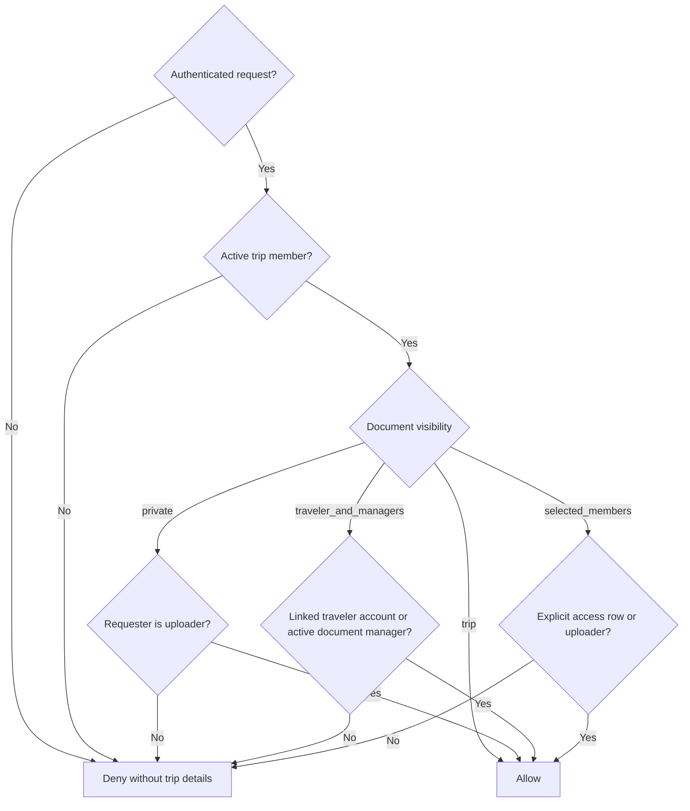

The same access predicate must protect document metadata and the corresponding private storage object. UI hiding is not authorization.

New uploads expose **Only me** (`private`), **Signed-in trip members** (`trip`), and **Selected signed-in members** (`selected_members`). `traveler_and_managers` remains a schema compatibility mode for older records and is not offered by the current upload flow.

### 6.4 One-time join-code redemption

The owner creates one invitation for one intended target. The implemented code uses a 16-character, case-insensitive Crockford Base32 value shown in four groups, avoids ambiguous characters, contains 80 random bits before formatting, expires after 14 days, and allows revocation or regeneration.

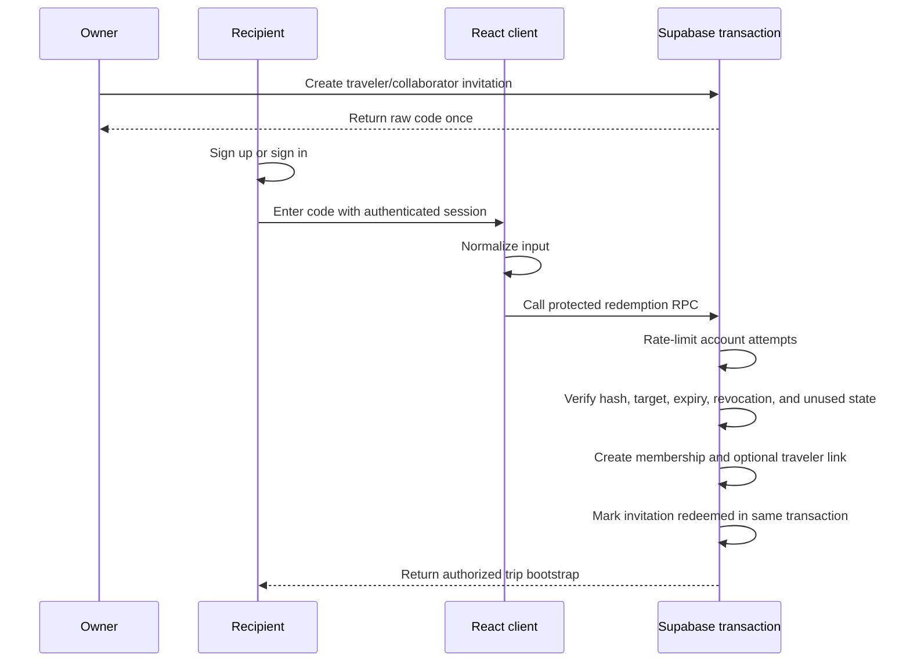

The first four code characters are stored as a non-secret lookup prefix; the complete code is stored only as a salted `crypt` hash. The MVP rate limit permits five failed attempts per authenticated account in fifteen minutes. A Cloudflare network-address limit may be layered on before public exposure, but is unnecessary for the personal deployment. The route returns the same generic failure for unknown, expired, used, or revoked codes and never returns trip title, dates, destination, travelers, or role before successful redemption. The client can encode the displayed code as a QR image locally; scanning still leads to authenticated redemption.

Code redemption requires a connection. Once redeemed, membership—not continued possession of the code—controls access.

### 6.5 Traveler and collaborator behavior

| Membership case | Traveler link | Appears in traveler roster | Can receive itinerary/bookings | Can use the app |
|---|---|---:|---:|---:|
| Claimed traveler | One `traveler_accounts` row | Yes | Yes | Yes |
| Managed child or parent | No account link required | Yes | Yes | Through a signed-in Owner or Editor |
| Non-traveling collaborator | None | Separately as collaborator | No | Yes, according to Editor/Viewer role |

If an elderly parent uses their own phone, the organizer helps create that parent's account, redeem their targeted code, and prepare the device offline. If the parent does not operate an account, an Owner or Editor remains signed in as themselves and selects the managed traveler from the persistent trip switcher. The selection pre-populates new bookings, requirements, itinerary items, and documents; it never changes the authenticated identity.

### 6.6 Trip-information boundary

- Public routes may show only generic product information and bundled synthetic preview data.
- The sign-in and join-code screens never disclose whether a real trip, traveler, or invitation exists.
- Real trip summaries, destinations, dates, traveler names, bookings, requirements, and document metadata require an authenticated active membership.
- An authorized member can see shared readiness state without receiving permission to open the linked document.

## 7. File Storage Contract

### 7.1 Bucket

Two Supabase Storage buckets are configured by the schema:

| Bucket | Read policy | Write policy | Contents |
|---|---|---|---|
| `trip-documents` | Authorized document predicate | Authorized trip uploader | Private travel documents and immutable versions |
| `catalog-assets` | Public, non-sensitive read | Active application administrator only | Immutable approved airline logos and banners |

No personal trip data, booking reference, traveler image, or uploaded travel document may enter `catalog-assets`.

### 7.2 Object key

```text
trips/{trip_id}/documents/{document_id}/versions/{version_id}/{sanitized_filename}
catalog/releases/{config_release_id}/{asset_id}/{sanitized_filename}
```

Object keys use generated IDs for authorization boundaries. Original filenames are metadata and must not be trusted as paths.

### 7.3 Upload sequence

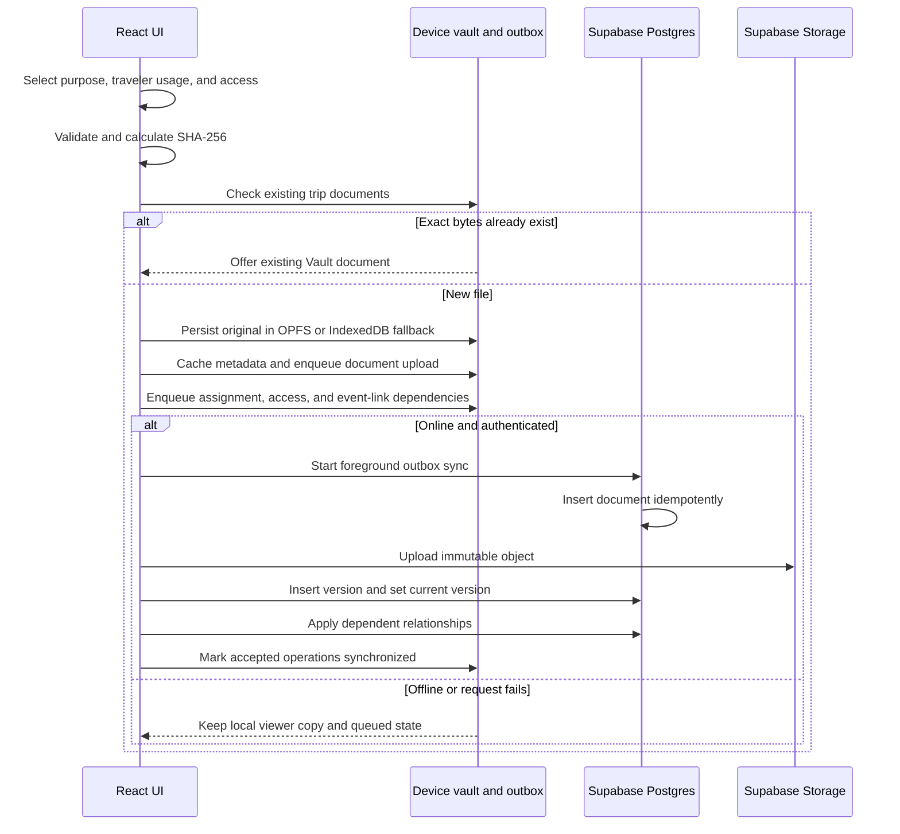

Because every accepted file is smaller than 5 MB, MVP retries the individual immutable file from its verified local copy rather than implementing chunk-level resume. A failed cloud upload remains immediately viewable from its local copy and its outbox operation exposes a safe failure class such as permission or authentication until a foreground retry finalizes it. Raw server details and document content are not logged.

### 7.4 Validation

- Allow an explicit MIME-type list for previews and downloads.
- Reject files of `5_000_000` bytes or larger before local queuing or upload.
- Sanitize display filenames and generate storage paths independently.
- Compute a SHA-256 digest for integrity and duplicate hints.
- Reject an exact same-trip checksum before copying another file; offer to link the existing Vault document to the event instead.
- Treat uploaded content as untrusted; do not render active HTML or SVG inline.
- Use attachment downloads for unsupported or risky file types.

### 7.5 Document-open flow

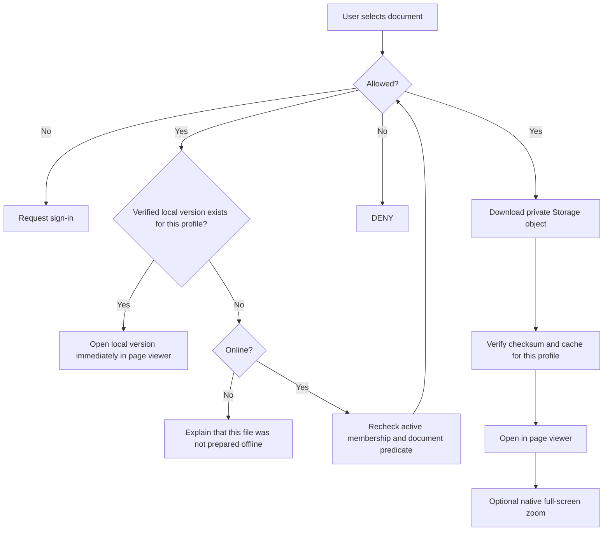

The app never stores a permanent public file address. A verified local file needs no per-open cached authorization evaluation: possession in the current profile's local namespace plus the current local sign-in context is sufficient. Server-side membership and visibility rules still decide whether a missing file may be downloaded. The route automatically renders the safe PDF or image; Download is secondary and optional. An Info sheet contains metadata, assignment, access, local-copy removal, replacement, archive, and version history. Traveler usage never changes this access decision. A readiness status may be shared without granting access to a missing cloud file.

### 7.6 File-size and optimization boundary

`MAX_DOCUMENT_BYTES` is exactly `5_000_000`; an accepted file must satisfy `file.size < MAX_DOCUMENT_BYTES`. The UI describes this as **smaller than 5 MB** and shows the measured size when a file is rejected. Shared validation checks the limit before an offline file is copied into OPFS or added to the outbox and checks it again during upload finalization. The `trip-documents` bucket limit is `4_999_999` bytes so a modified client cannot bypass the strict inequality. Supabase supports restrictions at both the project and [bucket level](https://supabase.com/docs/guides/storage/uploads/file-limits).

The MVP does not automatically compress, resize, recompress, rasterize, or rewrite an uploaded document:

- Lossless optimization may save little or nothing for an already compressed JPEG, WebP, or photo-heavy PDF and cannot guarantee the size target.
- Material reduction of a scan normally changes image resolution or encoding quality, so it must not be described as lossless.
- Rewriting a PDF can invalidate a digital signature, discard searchable text or annotations, alter page rendering, or make a barcode harder to scan.
- ZIP wrapping is not useful for in-app preview and often provides little benefit for compressed PDFs and images.

For an oversized file, the MVP preserves the selected original on the user's device, does not queue it, and explains how to export or scan a smaller copy. A later image-only **Make a smaller copy** action may use browser-side decoding and encoding, but it must show original/result size and a full-resolution legibility preview, require explicit approval, and never overwrite the original. PDFs remain unchanged unless a separate reviewed design is accepted.

## 8. Device Offline Model

### 8.1 Local structured stores

Dexie uses six physical stores. Most server domains share the generic `entities` store and are distinguished by a profile-scoped entity key; they are not separate IndexedDB object stores.

| Physical store | Contents |
|---|---|
| `settings` | Device-specific preferences and small non-secret values |
| `localDocuments` | Profile-scoped local file metadata, verification state, and OPFS path |
| `localFileBlobs` | IndexedDB blob fallback when OPFS is unavailable |
| `entities` | Profile-scoped structured snapshots keyed by logical domain and entity ID |
| `outbox` | Pending local mutations with dependency, attempt, and error state |
| `offlineManifests` | Prepared-trip level, expected document-version IDs, byte totals, and timestamps |

Logical keys in `entities` include profiles, published configuration, airlines, airports, vendors, trips, memberships, travelers, bookings, flight legs, generic journey legs, itinerary items and links, documents, requirements, costs, reminders, alert state, focus, and notes. The current client does not store incremental pull cursors; an online collection read replaces that authorized logical collection in the cache.

### 8.2 Local file record

| Field | Purpose |
|---|---|
| `profile_id` | Namespaces the copy to the profile that downloaded or created it |
| `document_version_id` | Connects local blob to immutable server version |
| `local_path` | OPFS-internal location |
| `byte_size` | Quota accounting |
| `sha256` | Integrity verification |
| `downloaded_at` | Readiness timestamp |
| `last_verified_at` | Last successful local checksum check |
| `pin_reason` | Explicit document pin or inherited trip pin |

Every local metadata row and OPFS document path is namespaced by `profile_id`. Signing into another account on the same browser opens a different local namespace and cannot list or open the prior profile's cached files. Sign-out follows the user-selected keep-or-remove-local-copies behavior; retained files become reachable again only when that same profile signs in or resumes its enrolled offline context.

### 8.3 Caching boundaries

| Content | Mechanism | Strategy |
|---|---|---|
| Versioned JS, CSS, icons, fonts | Service worker cache | Precache current application shell |
| Theme preference and validated bootstrap palette | LocalStorage plus bundled CSS fallback | Apply before React renders; contains no personal data |
| Published metadata catalogs | IndexedDB plus bundled JSON fallbacks | Use cached/bundled values at startup and refresh published configuration online |
| HTML navigation | Service worker precache and SPA navigation fallback | Serve the installed app shell without runtime-caching Supabase requests |
| Supabase structured records | IndexedDB | Supabase first while online, replacing the cached collection on success; cached collection on request failure or offline |
| Opened or prepared file originals | OPFS with IndexedDB blob fallback | Persist the verified profile-scoped copy until the user removes local data |
| Authenticated download URLs | Memory only | Never persist signed URLs |

### 8.4 Prepared-trip levels

| Level | Required local content | Meaning |
|---|---|---|
| Not prepared | App shell only or incomplete trip data | Do not promise travel access |
| Essentials ready | Complete structured trip data plus every explicitly selected document, all checksum-verified | Core itinerary works, but some authorized documents were intentionally excluded |
| Ready offline | Complete structured trip data plus the current version of every document the user is authorized to open for that trip, all checksum-verified | The prepared trip can be used fully within the offline capability boundary |
| Stale | The expected document-version set changed or a required local copy no longer verifies | Local content still opens, but structured-record staleness is not yet detected by the manifest |

The default **Make trip available offline** action targets **Ready offline**. If quota is insufficient, the app may offer a reviewed essentials subset but must label it **Essentials ready**, not fully ready.

Current implementation limitation: preparation fetches the major trip domains and verifies every selected current document version, but the persisted manifest enumerates only document-version IDs. It does not yet record structured entity versions, does not explicitly fetch generic `journey_legs`, and becomes stale automatically only when the document-version set changes. Therefore the current **Ready offline** display is provisional until an airplane-mode test passes; LLD-044 tracks the missing proof.

### 8.5 Airplane-mode cold start

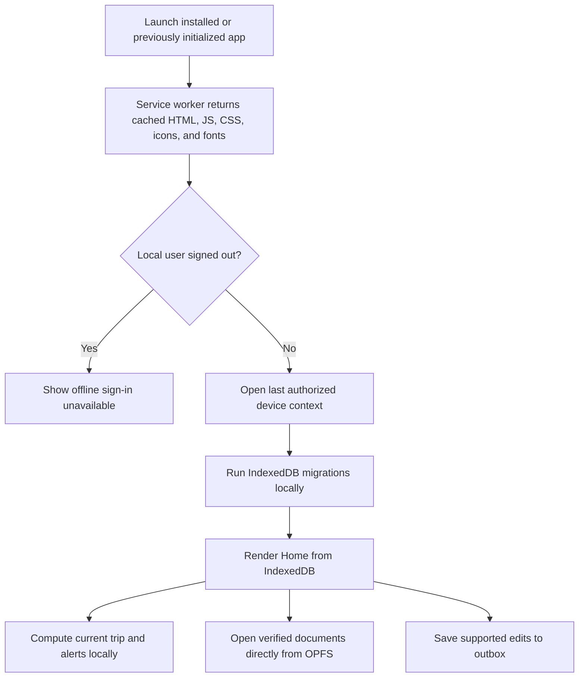

When the browser is offline and an enrolled device profile exists, the app does not wait for a Supabase request before rendering. The service worker supplies the executable application; Dexie/IndexedDB supplies cached structured data and catalogs; OPFS or the IndexedDB blob fallback supplies local originals. Required fonts, icons, fallback artwork, starter airline/airport/vendor data, and safe light/dark palettes are bundled rather than loaded from a CDN.

### 8.6 Offline capability matrix

| Capability | Fully offline after preparation? | Behavior |
|---|---:|---|
| Start the app and open Home | Yes | Cached shell and local database |
| View trips, itinerary, bookings, requirements, costs, and notes | Yes, when cached | Local authorized snapshot; preparation fetches these domains |
| View flight times, gate, ticket, boarding pass, and baggage tag | Yes | Structured cache plus verified OPFS files |
| View train, bus, ferry, or cab leg detail | Not guaranteed by preparation yet | Works if the journey-leg collection was already cached; LLD-044 adds an explicit preparation fetch |
| Compute D-1 mode, countdowns, and alerts | Yes | Device clock and local rules |
| Add or edit supported structured data | Yes | Validate locally and enqueue mutation |
| Add a document from the device | Yes, when smaller than 5,000,000 bytes and within quota | Validate size before copying to OPFS, checksum it, and queue upload metadata and bytes |
| Search trip and document metadata | Yes | IndexedDB indexes; no OCR |
| Sign up, sign in on a new device, or redeem a join code | No | Backend identity and atomic membership are required |
| Download a missing or changed cloud document | No | Existing local version may be shown as stale; missing file stays unavailable |
| Change membership or permissions | No | Requires authoritative server checks |
| Use Google Maps, airline check-in, or external flight tracking | No | Keep address/reference copy actions available |
| Receive another person's latest changes | No | Arrives during foreground synchronization after reconnecting |

Offline access relies on the device and browser profile that was previously authenticated. The app cannot learn that membership was revoked while disconnected; it reauthorizes before pushing or pulling on reconnection and then applies the removal policy. Without a later app-lock/encryption decision, the actual local security boundary is the device lock plus browser-origin isolation.

The app requests persistent storage through `navigator.storage.persist()` and records whether it was granted. Persistent mode reduces automatic eviction risk, but users can still clear site data or uninstall the PWA. OPFS is therefore a verified working copy, not the sole archival copy.

## 9. Synchronization Design

### 9.1 Local mutation envelope

| Field | Purpose |
|---|---|
| `operation_id` | Client-generated idempotency key |
| `entity_type` | Target domain |
| `entity_id` | Stable client-generated UUID |
| `operation` | Create, update, or delete |
| `payload` | Validated mutation data |
| `base_version` | Server version observed before edit |
| `depends_on` | Earlier operations that must finish first |
| `attempt_count` | Retry control |
| `last_error_code` | User-action or retry classification |
| `created_at` | Stable local ordering |

### 9.2 Foreground synchronization

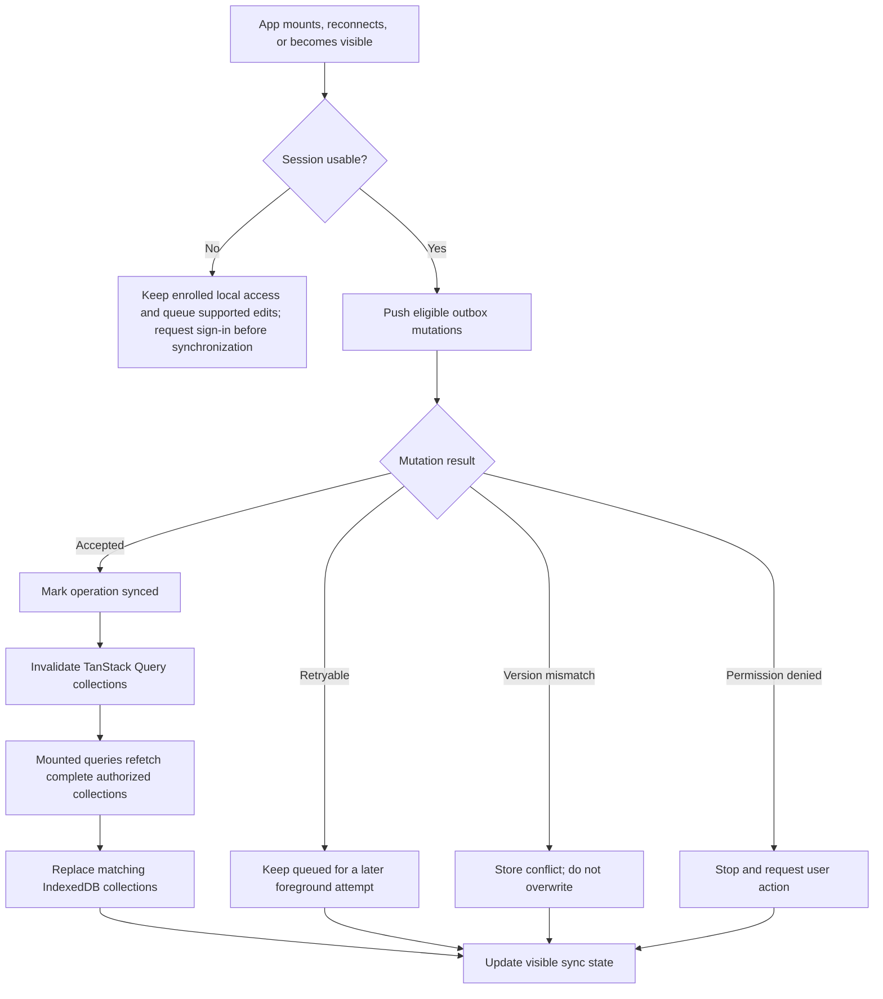

There is no incremental pull cursor in the current client. Online reads use complete authorized collection queries and update the cache; Supabase Realtime invalidates mounted query data after shared changes. Background Sync may be used as an enhancement where supported, but correctness cannot depend on it.

### 9.3 Conflict policy

| Data | Default conflict behavior |
|---|---|
| Trip fields | Show local and server values; user chooses |
| Booking fields | Field-level comparison where possible; otherwise user chooses version |
| Flight operational fields | Show both updates with actor and time; user selects the authoritative manual value |
| Airline action templates | Preserve both versions and require an editor to choose before launching a disputed URL |
| Itinerary ordering | Merge distinct items; flag edits to the same item |
| Itinerary-document links | Merge links to different documents; version-check reorder or unlink of the same relationship |
| Readiness requirements | Merge different assignees; conflict on edits to the same requirement |
| Notes | Preserve both bodies and request merge |
| Document binary | Never merge; create separate immutable versions |
| Deletion versus edit | Preserve edit locally and request restore-or-discard decision |

Server updates require `base_version` to match. A mismatch returns a conflict rather than silently using last-write-wins.

### 9.4 Published-configuration synchronization

1. Startup immediately uses the last locally validated published configuration or the bundled fallback.
2. When online, the client requests only the current published version number.
3. If unchanged, no catalog payload is downloaded.
4. If newer, the client downloads the complete published release and validates every section with Zod.
5. Airline catalog, airport catalog, defaults, theme tokens, and version are committed to IndexedDB in one transaction.
6. The small validated theme bootstrap snapshot is mirrored to LocalStorage for the next first paint.
7. Invalid or incomplete remote configuration is rejected as a unit; the prior cached version remains active.

Draft releases and audit history are never sent to ordinary traveler clients. Updating a global catalog does not mutate a trip's copied airline or airport values; it can only produce a reviewable **Update available** suggestion for an owner.

## 10. Offline Readiness Algorithm

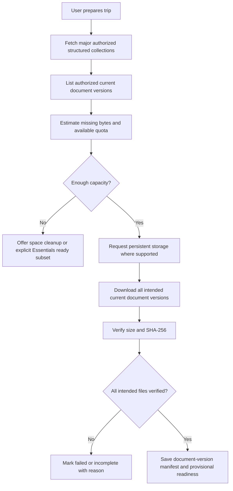

Today, readiness becomes `stale` automatically when the authorized document-version set changes or a required local file no longer verifies. Booking, itinerary, requirement, cost, and generic journey changes are fetched during normal reads but are not represented in the manifest, so they do not independently stale it. Revoked access is learned only after reconnecting; the app then blocks future cloud access and follows the agreed local-removal warning flow. LLD-044 is required before the badge alone can certify the complete structured pack.

## 11. UI Composition

### 11.1 Application shell

| Region | Phone | Wide screen |
|---|---|---|
| Header | Sticky brand, Alerts button, and theme action | Sticky brand plus visible sync status, Alerts, and theme action |
| Primary navigation | Fixed bottom bar: Home, Trips, Add, Vault, Profile | Persistent side navigation from the `lg` breakpoint |
| Content | Single-column responsive surfaces with safe-area spacing | Centered content area with wider cards and details sections |
| Add action | Central Add navigation action; trip timeline also has a floating Add Event control | Add navigation entry plus the same trip-scoped floating controls |
| Sync state | Compact icon/state with the issues panel available | Text status in the header with the same issues panel |

### 11.2 Core shared components

| Component | Responsibility |
|---|---|
| `AppShell` | Responsive header, desktop side navigation, phone bottom navigation, alert count, theme, and sync placement |
| `TripUi` exports | Shared `PageHeader`, `TripCard`, badges, empty states, and trip-facing visual primitives |
| `ModalSheet` | Accessible modal/sheet container used by mobile-friendly creation and management flows |
| `FocusSurface` | Current/active label, accent, elevation, and reduced-motion-safe emphasis |
| `TripPage` timeline composition | Complete timeline, phase jumps, active-event scroll, event detail sheet, people/sharing sheet, and Details switch |
| `AddEventForm` | Unified creation for flight, connected journeys, hotel milestones, meals, activities, preparation, transport, and custom events |
| `TimeZoneAutocomplete` | Strict searchable IANA-zone chooser with compact desktop list and mobile dialog behavior |
| `AirlinePicker`, `AirportPicker`, `VendorPicker` | Starter/published metadata autocomplete with user-entered-value fallback and privacy-safe suggestion support |
| `ParticipantSelector`, `TravelerSwitcher` | Everyone/selected-traveler assignment and persistent management context without impersonation |
| `EventDocuments` | Complete event document list, multi-select existing attachment, one-at-a-time classified upload, ordering, and unlink |
| `UploadDocumentForm` and `documentModel` | Travel-purpose presets, assignment/access separation, size validation, duplicate recovery, and queued local copy |
| `DocumentPage` | Local-first PDF/image viewer with native open and secondary Info sheet; online-only version history |
| `OfflinePackControl` | Quota check, persistence request, preparation progress, document verification, and provisional manifest state |
| `SyncStatus`, `SyncIssuesPanel`, `ForegroundSync`, `RealtimeRefresh` | Visible outbox state, foreground retry, issue recovery, and online query invalidation |
| `LocalQrCode` | Generates a share-code QR locally without a third-party QR service |
| `StoragePermissionPrompt` | Requests persistent browser storage after authentication and explains the device-copy boundary |
| `AdminPage` / `AdminShell` | Protected, online-only catalog, suggestion, appearance, release, and rollback experience |
| `ThemeProvider`, `ThemeToggle` | System/Light/Dark resolution with bundled offline-safe tokens |

### 11.3 Implemented visual tokens

| Token | Current direction |
|---|---|
| Background | Warm off-white |
| Surface | White with hairline gray border |
| Accent | Deep navy |
| Secondary accent | Muted coral |
| Text | Near-black with softer gray metadata |
| Radius | Moderate; restrained rather than pill-heavy |
| Shadow | Minimal; elevation only for overlays and active controls |
| Typography | Neutral sans-serif with strong numeric legibility |

No gradients should be used. Decorative elements must not compete with urgent trip information.

### 11.4 Timeline and trip details

`/trips/:tripId` opens in Timeline view unless `?view=details` is present.

- The timeline always renders the complete authorized itinerary from oldest to newest; Past, Current/Next, and Upcoming shortcuts scroll rather than filter.
- `resolveCurrentTimelineItem` selects the event containing the current time, otherwise the next event, otherwise the most recent past event.
- After the first data-backed render, two animation frames allow layout to settle before the active card scrolls near the viewport center. Returning from Details restores the saved timeline scroll unless the user explicitly requests a jump.
- The current/next card is the only card with the contextual accent and label. Every card remains clickable and keyboard-operable and opens the event-detail sheet.
- Event icons sit inside the card corner on phone layouts to preserve width; on desktop they align centrally with the vertical connector.
- Traveler focus changes defaults and document context but never removes other travelers' shared events from the timeline.
- The floating control group opens Add Event, People & sharing/current member, or the active-event jump. Creation controls are hidden from Viewers.
- Search matches timeline titles, booking/provider data, PNRs, airport codes/names, documents, travelers, readiness items, and related metadata after two characters, returning at most 40 results.
- Details view keeps the existing sectioned experience: Overview, Reservations, Costs, People, Readiness, Documents, Offline, Travel data, and Notes.

The floating Add Event sheet exposes Flight, Train, Bus, Ferry/Boat, Cab, Hotel, Meal, Activity, Preparation, Other transport, and Custom. Flight, train, bus, ferry, and cab bookings can contain ordered connecting legs. Each journey is explicitly Domestic or International; each endpoint uses a searchable strict IANA time zone, and the app converts provider-local departure/arrival values to instants while validating DST ambiguity, duration, and connection order. Flight PNR/reference is mandatory. Boarding lead or exact boarding time is journey-only. Hotel creation produces separate check-in and checkout timeline milestones.

All event types may include an optional linked cost. Bookings may also retain provider/operator, booking vendor, HTTPS website, contact name, and phone number. A valid 7–15 digit phone normalization enables direct `tel:` and `https://wa.me/` actions. Location-bearing entries expose an explicit map URL or a keyless Google Maps search.

Hotel entry initializes check-in at 15:00 on the trip start date and checkout at 11:00 on the following calendar day. If check-in is moved beyond the current checkout, the form advances checkout to the following day. Final validation converts both hotel-local values to instants and requires checkout to be strictly later, including across daylight-saving transitions.

### 11.5 Home mode and focused-trip selection

Current mode is personal to the signed-in user; it is not the shared `trip_status` field.

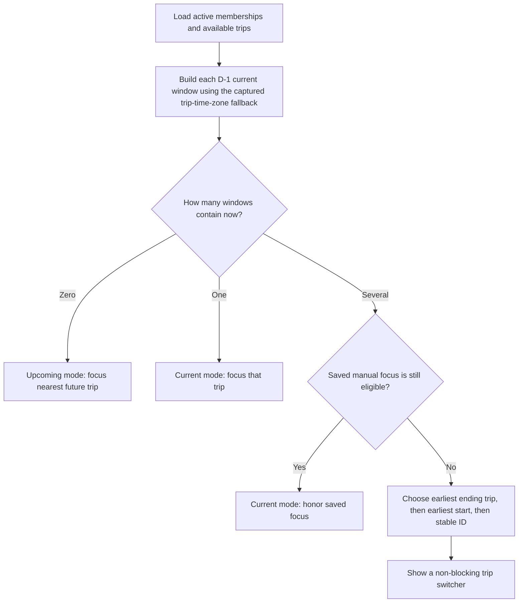

For a trip with captured compatibility time zone `T`:

- `current_window_start = startOfDay(start_date - 1 calendar day, T)`.
- `current_window_end = endOfDay(end_date, T)`.
- Archived, deleted, and inaccessible trips are never candidates.
- Upcoming Home uses the nearest future trip as its hero and may list later trips below it.
- Current Home uses the focused trip for Now/Next, shortcuts, alerts, accommodation, and today's itinerary.
- A manual switch persists only among currently eligible overlapping trips. Editing dates remains a separate action.

This calendar-day rule avoids treating “one day early” as exactly 24 hours, which would fail around timezone offset changes.

### 11.6 Home priority resolver

The first eligible item wins within each severity group; ties use event time and then stable ID.

| Priority | Candidate examples | Primary action |
|---:|---|---|
| 1 | Cancelled flight, expired required document, unresolved sync conflict | Review or resolve |
| 2 | Boarding pass available, incomplete offline pack on D-1, overdue requirement | Open document or complete action |
| 3 | Delayed flight, departure/boarding approaching, check-in due | Open flight or check-in action |
| 4 | Current accommodation or next transport | Navigate, call, or copy reference |
| 5 | Next itinerary event | Open event |

Need-now bubbles are derived from the focused trip and limited to five. The resolver prefers boarding pass over ticket, then visa/passport requirement, current accommodation, insurance, and next transport. Every bubble must have an actual target; placeholders are not rendered.

### 11.7 Flight presentation state machine

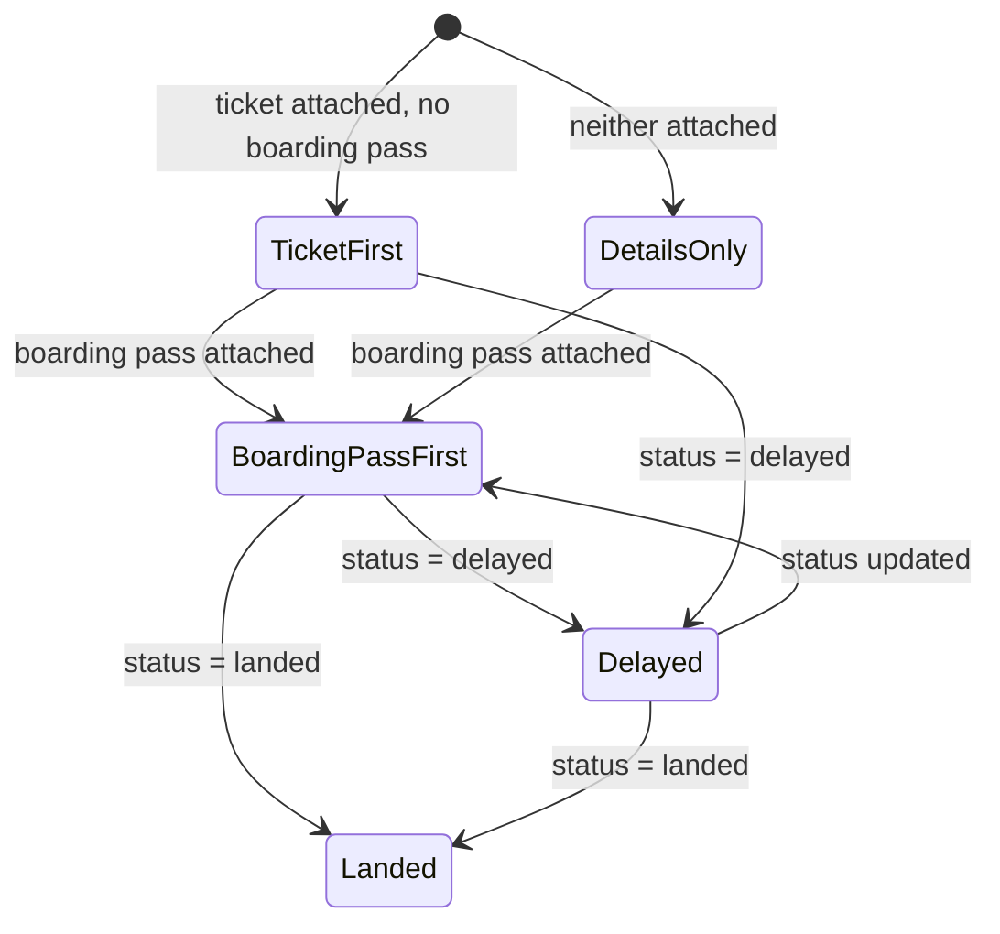

Presentation rules:

1. Before a boarding pass exists, show the ticket as the primary document action.
2. When an authorized boarding pass exists, make it primary and show the ticket under **Other documents**.
3. Boarding details combine the boarding pass metadata with the latest manual `boarding_at`, terminal, gate, seat, and boarding group. The app never implies those values came from the attachment.
4. `effective_departure_at` is `estimated_departure_at` when present for a delayed flight; otherwise it is `scheduled_departure_at`.
5. The countdown is `effective_departure_at - now`, recalculated while the app is visible. It changes to **Departed**, **Landed**, or **Cancelled** when the manual status says so.
6. Delay minutes are derived from estimated minus scheduled departure and are never a separate editable source of truth.
7. After landing, baggage claim and baggage-tag actions become prominent. All attached tickets, boarding passes, and baggage tags remain reachable throughout.

The manual update sheet edits status, estimated/actual times, boarding time, departure and arrival terminal/gate, baggage claim, and a note in one version-checked mutation. The form always labels the result **Updated by a traveler** with actor and time.

### 11.8 Alerts and reminder engine

The MVP does not depend on operating-system notification delivery. It recomputes alerts:

- after the local database opens;
- after foreground synchronization;
- when the browser tab becomes visible;
- when relevant local data changes; and
- on a lightweight visible-page timer so a countdown can cross a threshold.

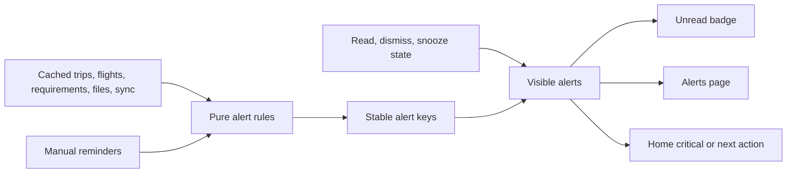

An alert key contains the rule ID, entity ID, and the value that created that occurrence, such as `flight-delayed:{legId}:{estimatedDeparture}`. A material new value creates a new alert; simply reopening the app does not. Dismissal hides only that occurrence, read state affects only the badge, and snooze does not alter the underlying flight or requirement.

The Alerts page groups visible items as **Urgent**, **Today**, and **Upcoming**, with a secondary **Dismissed** view. Initial rules cover manual flight cancellation or delay, approaching boarding/departure, missing boarding pass when a user-entered check-in time has passed, overdue readiness work, passport/visa expiry against the user-entered buffer, stale offline packs, sync conflicts, and manual reminders.

Web Push and scheduled server delivery remain later experiments. The data model must not require them for correct in-app behavior.

### 11.9 Airline metadata and action URLs

The starter dropdown is a small, versioned JSON catalog bundled with the application. Selecting an airline copies its metadata to `trip_airlines`; later catalog releases never silently overwrite a trip's edited values.

Allowed URL placeholders are limited to `{flightNumber}`, `{airlineCode}`, `{departureDate}`, `{bookingReference}`, `{departureAirport}`, and `{arrivalAirport}`. Expansion must URL-encode every value, allow only `https`, show the destination hostname before first use, and fall back to opening the airline's base page when a template is invalid. An owner or editor can disable or correct a stale action.

Logo and banner assets must be bundled with permission or explicitly uploaded by a user. The neutral fallback is the airline name plus a two-letter monogram; the UI must not fetch arbitrary third-party logo URLs.

### 11.10 Map hand-off

MVP map actions use [Google Maps URLs](https://developers.google.com/maps/documentation/urls/get-started), which require `api=1` but no API key:

```text
Search:     https://www.google.com/maps/search/?api=1&query={encoded address or lat,lng}
Directions: https://www.google.com/maps/dir/?api=1&destination={encoded address or lat,lng}
```

If both are available, coordinates are preferred to avoid ambiguous addresses. Otherwise the stored address is used. Online actions open in a new browser context; offline UI keeps **Copy address** available and explains that Maps needs a connection.

No Google key is created for MVP. Google Static Maps and Geocoding require a billing-enabled project even when usage remains within a free monthly cap, so embedded images and automatic coordinate lookup are outside this design. Standard OpenStreetMap tiles are also not an offline-download substitute because their public tile policy prohibits bulk/offline downloading.

### 11.11 Administrator console

The administrator experience has its own `/admin/sign-in` entry and `AdminShell`. It uses the same Supabase authentication service as the traveler application, but only a dedicated account whose user ID is active in `app_admins` can open protected Admin routes. An administrator who is also invited to a trip uses normal trip membership and document-visibility rules for that trip.

| Admin area | Editable browser-safe configuration |
|---|---|
| Overview | Current published version, draft validation state, catalog completeness, and recent publication history |
| Airlines | Name, IATA/ICAO codes, aliases, tracker/check-in/base URL templates, logo/banner asset, accent, ordering, and enabled state |
| Airports | IATA/ICAO codes, name, city, country, IANA timezone, aliases, optional coordinates, ordering, and enabled state |
| Travel defaults | Booking/document labels, category order, icons, readiness templates, reminder thresholds, and external-link defaults within code-defined schemas |
| Appearance | Allowlisted semantic color tokens for light and dark modes plus previews for important trip states |
| Releases | Draft comparison, validation results, publish, prior versions, audit details, and rollback |

The console never exposes API secrets, Row Level Security policies, executable validation code, user management, trip data, traveler data, or private documents. Airline and airport records are reference metadata, not live operational data; gate, terminal, delay, cancellation, and baggage values remain traveler-maintained trip information.

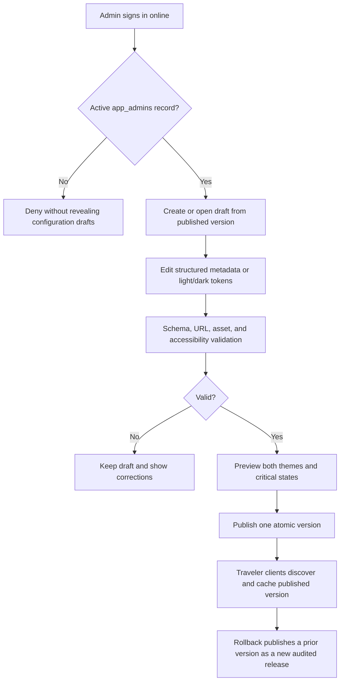

All administrator actions require a live connection. The console may display the last fetched published configuration when connectivity drops, but editing, saving, asset upload, publishing, and rollback are disabled. It has no IndexedDB edit drafts, mutation outbox, background replay, or offline-success message.

Selecting published airline or airport metadata for a trip copies its stable catalog key, source version, and display values into trip-scoped records. A later global publication can offer an **Update available** comparison, but it never silently changes an existing or historical trip.

### 11.12 Theme resolution and offline dark mode

The traveler chooses **System**, **Light**, or **Dark** per device. This is a local preference, so changing it on one phone does not unexpectedly change another person's device. System mode uses the browser's [`prefers-color-scheme`](https://developer.mozilla.org/en-US/docs/Web/CSS/Reference/At-rules/%40media/prefers-color-scheme) result and listens for operating-system changes while the app is open.

Before React starts, a small inline bootstrap reads the local preference and last validated published palette, selects a mode, and places `data-theme="light|dark"` plus the matching `color-scheme` on the document root. If local data is absent or invalid, it uses the bundled light/dark palette. This prevents a bright first-frame flash and works before IndexedDB, Supabase, or the network is available.

| Semantic token group | Examples | Constraint |
|---|---|---|
| Foundations | background, surface, elevated surface, border | Separate light and dark values; preserve visual hierarchy |
| Content | primary text, muted text, inverse text, link | Meet the selected WCAG 2.2 AA contrast targets on every allowed surface |
| Brand/action | accent, text on accent, focus ring | Focus remains visible; accent is never the only state indicator |
| Status | danger, warning, success, information | Pair color with an icon, label, or shape |
| Interaction | hover, pressed, selected, disabled, overlay | Preview keyboard, touch, and disabled states in both modes |
| Loading/offline | skeleton, stale, pending sync, conflict | Stay distinguishable without implying online freshness |

Admin-entered token values accept only fixed color formats supported by the schema; arbitrary CSS, URLs, functions, or scripts are rejected. Publication validation covers Home, flight cards, tickets and boarding passes, urgent alerts, document rows, dialogs, forms, disabled controls, offline/stale states, conflicts, and visible keyboard focus in both modes.

The service-worker package always includes safe default light and dark CSS. A complete validated published palette is cached as one version, never token by token, so an interrupted refresh cannot create a mixed theme. If a cached palette later fails validation or cannot be read, the app falls back to the bundled palette without blocking trip access.

### 11.13 Reference direction and motion contract

The visual direction uses several references for different problems rather than copying one application:

| Reference | Principle to study | Trip Vault interpretation |
|---|---|---|
| [Flighty design story](https://developer.apple.com/news/?id=970ncww4) | Put the one operational fact needed now ahead of secondary detail | A current flight or next action becomes the Home hero with time, gate, status, and document action visible at a glance |
| [Tripsy itinerary preferences](https://tripsy.help/article/59-itinerary-preferences) | Support readable day-by-day structure and useful density choices | Timeline groups remain clear on a phone and can later offer comfortable/compact density without changing information |
| [TripIt sample itinerary](https://help.tripit.com/en/support/solutions/articles/103000063427/) | Keep heterogeneous reservations in one chronological language | Flight, hotel, transport, and activity cards share predictable time/location/document positions |
| Trip Vault's own direction | Feel personal, calm, and dependable rather than like an airline operations screen | Warm surfaces, restrained travel imagery, document-vault clarity, explicit offline state, and no copied assets or layouts |

The time-based **Current** item and the viewport-focused item are different concepts. The app's clock and trip data determine Current; scrolling cannot change it. A carousel may additionally emphasize the card that has settled in the viewport, but that card never receives the **Current** label unless it is actually current.

| Surface or change | Visual treatment | Motion-enabled behavior | Reduced-motion behavior |
|---|---|---|---|
| Current trip hero | **Current trip** label, accent edge, stronger surface, scale `1.01` | One `180ms` settle when it becomes current | Static emphasized surface; no transform |
| Current timeline/Now card | **Now** label, accent marker, elevation, scale up to `1.02`, optional `-2px` lift | Discrete `180ms` transition when current state changes | Label, marker, and elevation change instantly |
| Settled carousel card | Full contrast and scale `1`; neighbors remain readable at approximately `0.97` | Change only after scroll settling or intersection threshold, never for every scroll pixel | Same discrete sizes with no interpolation |
| Pressed control | Shape, border, and pressed state | `80–100ms` scale to approximately `0.985` | Immediate pressed styling without movement |
| Page/route change | Stable header and navigation; content continuity | Optional `120–180ms` cross-fade | Immediate replacement with focus restored |
| Sheet or dialog | Modal surface and clear focus movement | `180–220ms` opacity plus short transform | Opacity-only or immediate presentation |

Implementation rules:

- Tailwind supplies utilities, but it does not make every animation inexpensive. Use property-specific `transition-transform`, `transition-opacity`, `transition-colors`, or `transition-shadow`; avoid `transition-all` in reusable components.
- Animate `transform` and `opacity` for movement. Do not animate layout dimensions, coordinates, large blurs, or backdrop filters during scrolling.
- Use CSS scroll snap for carousels and Intersection Observer only to detect a settled/visible state. Do not implement a continuously calculated scroll-zoom, parallax background, or sticky scale scrub.
- Never run an infinite pulse on delays, warnings, or the Now card. State changes may animate once and then settle.
- Apply `aria-current` where appropriate and retain a visible **Now** or **Current** label, so scale and color are never the only signal.
- Tailwind's `motion-safe`/`motion-reduce` variants disable non-essential transforms when the user requests reduced motion, following [W3C guidance for interaction animation](https://www.w3.org/WAI/WCAG22/Understanding/animation-from-interactions.html).
- The [View Transition API](https://developer.mozilla.org/en-US/docs/Web/API/View_Transition_API) may progressively enhance supported browsers after the base CSS transition is proven. Navigation and focus restoration must work identically when it is absent or disabled.
- Temporary `will-change: transform` may be applied immediately before an animation and removed afterward; it is not a permanent card style.

### 11.14 Bundled demonstration trip

`/preview` loads a deterministic local-only fixture called **Mediterranean Summer**. It is public because it contains no real data, never reads Supabase, and cannot be mistaken for an authenticated shared trip. A **Reset demo** action deletes its temporary browser changes and reloads the bundled baseline.

The fixture contains four stops, flights, hotels, ground transport, activities, readiness checks, manual reminders, and six membership/traveler cases: an owner-traveler, editor-traveler, viewer-traveler, managed parent, managed child, and non-traveling collaborator. A demo clock can switch between planning, D-1, travel-day, in-trip, and completed states without changing the real device clock.

| Sample asset | Format | Visibility demonstrated | Target size |
|---|---|---|---:|
| Fictional-airline e-ticket | PDF | Selected travelers | Under 350 KB |
| Fictional boarding pass with non-functional sample code | PDF | Traveler and managers | Under 250 KB |
| Hotel confirmation | PDF | Whole trip | Under 300 KB |
| Travel-insurance summary | PDF | Selected members | Under 400 KB |
| Museum ticket | PNG or PDF | Selected travelers | Under 250 KB |
| Two baggage-tag images | JPEG or WebP | Traveler and managers | Under 200 KB each |
| Visa-readiness checklist—not a visa | PDF | Whole trip | Under 250 KB |

Every page carries a prominent **SAMPLE — NOT VALID** watermark. Airlines, hotels, addresses, people, confirmation references, document numbers, signatures, QR codes, and barcodes are fictional and intentionally non-functional. The demo must not include a simulated passport or government identity document. All demo assets together target less than 3 MB and are precached so design review and the complete preview still work in airplane mode.

### 11.15 Itinerary event documents

An itinerary event has a **Documents** section containing zero or more ordered document links. Timeline cards stay compact; selecting a card opens the event detail, which shows the complete authorized list with title, purpose, traveler label where relevant, file size, and offline state.

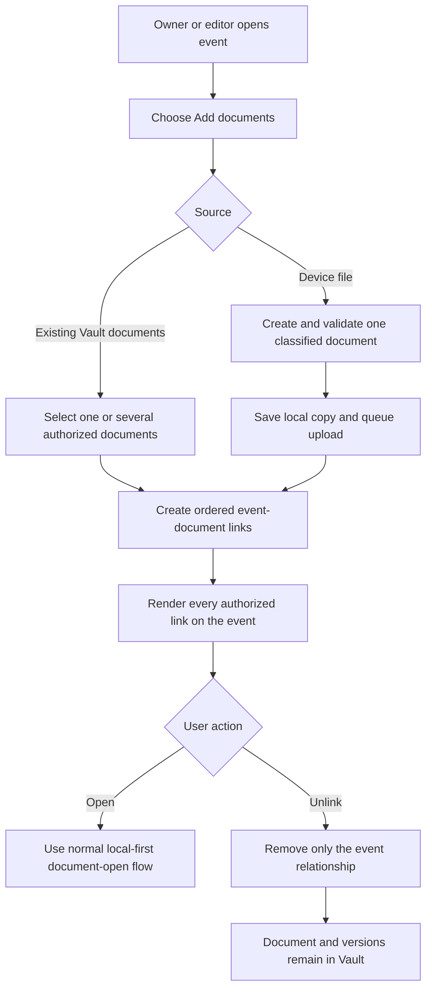

Rules:

- There is no one-document limit and no single `document_id` field on `itinerary_items`.
- A document may be linked to multiple events without copying its file or version records.
- If a document is already associated with the event's booking or flight leg, the picker identifies it and prevents a duplicate event link.
- Every new file uses the full upload sheet so purpose, Shared/Selected/Assign later usage, and access cannot be silently defaulted to generic `document` metadata. New files are added one at a time; the existing-Vault picker may attach several documents in one action.
- Event-link visibility follows the linked document. The server returns a link only when the member may read its document; locally cached links remain scoped to the signed-in profile.
- Reordering or unlinking is an itinerary edit and is limited to owners and editors for MVP.
- Unlinking, archiving, or deleting an event never deletes a Vault document. Deleting the document itself removes it from every event presentation according to the recoverable-deletion policy.
- When prepared offline, every authorized event link remains visible, and each locally present document opens through the same immediate profile-local flow. A missing file is labeled **Not downloaded** rather than making the event unavailable.

## 12. Form and Validation Behavior

- Create-trip and legacy itinerary/cost forms use `useFormDraft`; the unified Add Event sheet currently persists only after a valid submission and does not promise an incomplete draft.
- Convert journey endpoint-local date/time values to instants while retaining each endpoint's strict IANA time zone.
- Keep trip dates and readiness due/expiry dates date-only; unified timeline events require a local date and time.
- Validate trip end date is not before start date.
- Preserve provider-issued confirmation codes exactly as entered while allowing normalized search.
- Require a booking reference/PNR for flights.
- Validate each flight, train, bus, ferry, and cab leg has an origin zone, destination zone, arrival after departure, and chronological connection order; ask which occurrence to use for an ambiguous DST time and reject nonexistent local times.
- Keep trip time zone captured from the device and hidden from normal trip forms; do not present it as a free-text field.
- Present base and cost currency as a native dropdown. Common travel currencies appear first, followed by the runtime's supported ISO currency codes; Zod still validates the submitted three-letter code.
- Keep scheduled flight times immutable during a manual delay update; estimated and actual times are separate fields.
- Require an update timestamp and authenticated actor whenever manual operational flight fields change.
- Validate flight legs in chronological segment order without assuming departure and arrival share a timezone.
- Require `https` for airline actions and official-guidance links; never execute arbitrary URL schemes.
- Require a destination and affected traveler for a visa requirement, while allowing `not_required` as an explicit manual status.
- Validate boarding-pass and baggage-tag documents against the related flight leg and traveler when supplied.
- Normalize join codes by removing spaces and hyphens and uppercasing before submission; authoritative verification remains server-side and is never queued offline.
- Require traveler and collaborator invitations to satisfy their mutually exclusive target fields.
- Require booking, itinerary, requirement, and document traveler assignments to belong to the same trip.
- Require selected document usage to contain at least one traveler in the UI; shared and unassigned modes contain no `document_travelers` rows.
- Keep document traveler usage separate from private/trip/selected-member access and explain that distinction beside the controls.
- Require every itinerary-document link to reference an event and document from the same trip and prevent duplicate active links for the same pair.
- Show the active managed-traveler context beside every form that can change another person's information.
- Require a trip, title, and category before document upload finalization.
- Reject a selected document of `5_000_000` bytes or larger before copying it into OPFS, while preserving the original device file and reporting its measured size.
- Validate administrator catalog codes, IANA timezones, HTTPS action templates, supported asset types, stable keys, and uniqueness before saving online.
- Accept only allowlisted semantic theme tokens and fixed color values; require accessible foreground/background and focus-state combinations before publication.
- Display validation near the affected field and keep user-entered data intact.
- Never block local draft creation solely because the device is offline.
- Do not create local drafts for administrator changes; disable Admin mutations whenever the connection or administrator session is unavailable.

## 13. PWA Update Behavior

1. Download a new app shell in the background.
2. Do not replace the currently running version during an edit or upload.
3. Show **Update ready** with a user-controlled reload action.
4. Ensure local database migrations complete before the new UI reads data.
5. Roll back the local transaction if a migration fails and keep the prior cached shell usable where possible.

## 14. Error Model

| Error class | Example | UI response |
|---|---|---|
| Validation | Missing destination | Inline correction; no retry |
| Offline | No connection during save | Save locally and show queued state |
| Authentication | Session cannot refresh | Preserve local read-only view and request sign-in online |
| Authorization | Membership removed | Block future cloud access and explain that an existing device copy must be removed locally |
| Conflict | Server version changed | Preserve both and open resolution flow |
| Quota | Insufficient local storage | Show required space and selective unpin options |
| Upload | Interrupted transfer | Keep the verified local original and retry the whole sub-5-MB file when the app is open and connected |
| Integrity | Checksum mismatch | Delete bad local copy and redownload |
| Admin offline | Connection lost in Admin console | Keep the last fetched view visible but disable all mutations and publishing |
| Published config | Downloaded version is incomplete or invalid | Keep the prior cached version and use bundled defaults if none exists |
| Unexpected | Unknown client error | Safe message plus redacted diagnostic ID |

## 15. Accessibility and Internationalization

- Meet WCAG 2.2 AA for contrast, focus, names, and touch targets.
- Support keyboard navigation and visible focus on desktop.
- Respect reduced-motion preferences.
- Use semantic headings, lists, buttons, dialogs, and status announcements.
- Store timestamps independently from display locale.
- Display dates, times, numbers, and addresses with the user's locale.
- Keep the architecture ready for translated strings even if the MVP ships in English only.

## 16. Verification Strategy

### 16.1 Current executable baseline

| Check | Last verified | Result |
|---|---|---|
| `npm run typecheck` | 2026-09-11 | Pass |
| `npm test -- --run` | 2026-09-11 | Pass: 26 files, 108 tests |
| `npm run build` | 2026-09-11 | Pass; only the standard Vite large-chunk advisory remains |
| `supabase/tests/001_schema_smoke.sql` | Existing remote schema before the document-experience migration | Previously passed; rerun after applying `202609110003_document_experience.sql` |
| Phone, desktop, sharing, upload, Cloudflare, and airplane mode | Current release | Manual acceptance pending in `docs/FEATURE_TEST_CHECKLIST.md` |

The lists below are the release coverage contract. They do not imply that every bullet already has a dedicated automated test; remote RLS, Storage, PWA installation, and true airplane-mode behavior require the named manual or SQL acceptance step.

### 16.2 Unit-test coverage

- Date and timezone formatting
- D-1 current-window calculation across timezones and daylight-saving boundaries
- Deterministic focus selection for overlapping trips
- Ticket, boarding-pass, delay-countdown, and landed baggage presentation rules
- Alert derivation, stable keys, read/dismiss/snooze behavior, and unread counts
- Google Maps URL construction and encoding without a key
- Airline action-template validation and placeholder expansion
- Visa validity-buffer calculations and disclaimer states
- Join-code normalization, target validation, and generic error mapping
- Traveler, member, manager, and collaborator capability predicates
- Full-ready versus essentials-ready manifest calculation
- Offline cold-start bootstrap without network responses
- Role and visibility predicates
- Manifest and quota calculations
- Outbox dependency ordering
- Version-conflict classification
- File-path sanitization and checksum handling
- Administrator-role checks without trip-permission bypass
- Published-configuration version validation, atomic cache replacement, and fallback behavior
- System, Light, and Dark resolution before first render and after an operating-system preference change
- Theme-token format, contrast, and unsafe-value rejection
- Catalog snapshots remaining unchanged after later global publications
- Strict document-size boundary at `4_999_999` and `5_000_000` bytes
- Demo-clock state derivation without reading or modifying the real device clock
- Profile-namespaced local paths and immediate local-open eligibility without a cached document-permission predicate
- Itinerary-document same-trip validation, duplicate-link prevention, stable ordering, and unlink-without-delete behavior

### 16.3 Component-test and UI coverage

- Dashboard states
- Upcoming versus current Home and overlap switcher
- Flight card manual states and document-priority changes
- Alerts groups, badge count, and empty state
- Airline picker, missing-logo fallback, and URL warning
- Manual visa input and readiness warnings
- Join-code entry without pre-redemption trip disclosure
- Traveler roster and managed-traveler context picker
- Non-traveling collaborator labels and excluded traveler actions
- Booking forms by type
- Document visibility controls
- Document type presets, Shared/Selected/Assign later usage, assignment/access separation, and exact-duplicate recovery
- Visible-first PDF/image viewer, automatic verified local caching, Info sheet, and native full-screen action
- Offline and sync indicators
- Permission-dependent actions
- Admin sign-in, unauthorized state, catalog editors, release history, and online-only disabled states
- Theme editor previews for light/dark travel, alert, document, offline, and focus states
- Traveler appearance control in System, Light, and Dark modes
- Contextual-focus treatment with and without reduced motion, including separation between time-current and scroll-focused cards
- Demo trip reset, synthetic clock modes, sample-document watermark, and no-network rendering
- Local document opening for the owning profile, signed-out state, and account-switch isolation
- Event document section with zero, one, and several attachments; a queued/failed one-file upload; reorder; and unlink confirmation
- Empty, loading, failure, and conflict states

### 16.4 Database and Storage acceptance

- Every exposed table has least-privilege grants and Row Level Security.
- Non-members cannot read or mutate trip records.
- Unauthenticated users and unredeemed codes cannot read real trip metadata.
- A join code creates at most one membership and cannot be reused after concurrent redemption attempts.
- Traveler invitations cannot claim a different traveler, and collaborator invitations cannot create traveler-account links.
- The traveler context switcher never changes the authenticated account or bypasses Owner/Editor/Viewer trip roles.
- Viewers cannot edit shared content.
- Private and selected-member documents remain restricted.
- Document traveler assignments cannot cross trips and do not broaden private or selected-member visibility.
- Exact same-trip checksums are surfaced as an existing-document choice rather than a second stored object.
- Itinerary-document links cannot cross trips, expose an unreadable document, or duplicate an active event/document pair.
- Unlinking or deleting an itinerary event leaves the linked document and every immutable version intact.
- Flight legs cannot reference another trip's airline, traveler, or document.
- Only owners and editors can change shared flight operations or airline metadata.
- Alert read state and manual reminders remain user-scoped.
- Ordinary users cannot read drafts, mutate configuration, publish releases, or add themselves to `app_admins`.
- Application administrators can manage configuration but cannot bypass trip membership or document visibility.
- Exactly one complete configuration release is published and readable by traveler clients at a time.
- Catalog assets are public-only, browser-safe, and writable only through administrator policies.
- Storage rejects document objects of `5_000_000` bytes or larger even when the client-side check is bypassed.
- Removed members lose future database and storage access.
- Privileged service credentials are never required by the client.

### 16.5 Browser and end-to-end acceptance

- Onboarding through first trip creation
- Trip cards open the trip timeline directly; all past/current/future events remain present and connected, and first open scrolls to the resolved active event
- Phone event icons remain inside the card corner while desktop icons stay centered on the connector
- Flight, train, bus, ferry, and cab creation supports connected legs, strict endpoint time zones, domestic/international scope, and correct elapsed duration
- Event detail exposes optional cost, missing-cost recovery, map, Call/WhatsApp, booking-vendor, and all linked documents
- Share-code text and locally generated QR redeem the same one-time traveler or collaborator invitation only after sign-in
- Invite acceptance and role enforcement
- Sign-up followed by successful one-time code redemption
- Invalid, expired, revoked, reused, brute-force-limited, and concurrent code redemption
- Claimed traveler, managed traveler, and non-traveling collaborator flows
- Organizer-assisted preparation on another traveler's phone
- Offline launch with a verified trip pack
- Airplane-mode cold start with zero network responses
- Complete prepared-trip browsing, alert calculation, local flight update, and pinned document preview
- Offline edit followed by reconnect and synchronization
- Interrupted upload followed by a safe whole-file retry from the verified local copy
- Concurrent edit conflict
- Storage quota failure
- PWA upgrade with existing local data
- Home transition immediately before and at D-1 local midnight
- Overlapping current trips with automatic and manual focus
- Ticket-first flight changed offline to boarding-pass-first and then synchronized
- Manual delay update changes countdown and generates exactly one current alert occurrence
- Landed flight exposes baggage claim and multiple labeled baggage tags
- Offline Alerts page reproduces the same derived warnings and badge count
- Online Maps hand-off plus offline copy-address fallback
- Responsive behavior at phone, tablet, and desktop widths
- Dedicated administrator sign-in, denied ordinary-account access, draft validation, atomic publish, and audited rollback
- Administrator connection loss blocks editing and publishing without creating an offline mutation
- Administrator account cannot open a trip unless separately invited under normal membership rules
- Published metadata sync preserves existing trip snapshots and rejects incomplete versions
- Light/dark first paint, per-device override, System-mode change, offline reload, and bundled fallback without a theme flash
- Current-item emphasis during scroll, route changes, theme changes, and reduced-motion operation without layout shift or continuous scroll zoom
- Public demo cold start, all five synthetic time modes, local reset, and every watermarked sample document with zero Supabase requests
- Offline and online rejection of a `5_000_000`-byte file without adding it to OPFS, outbox, database metadata, or Storage
- Verified local document opens with no permission request, while another account on the same browser cannot discover or open it
- Attach several existing documents and successive one-at-a-time classified uploads to one itinerary event, retain a failed upload locally for retry, synchronize offline-created links, and unlink one without deleting any Vault document

## 17. Configuration Boundaries

| Setting | Exposure | Purpose |
|---|---|---|
| Supabase project URL | Browser-safe | Client endpoint |
| Supabase publishable key | Browser-safe with correct RLS | Identifies project |
| Cloudflare environment name | Browser-safe | Diagnostics and feature flags |
| Published configuration version | Browser-safe | Lets clients atomically cache airline, airport, travel-default, and theme metadata |
| Appearance preference | Device-local | Stores System, Light, or Dark before application startup; contains no account or trip data |
| Application-administrator account ID | Server or migration only | Bootstraps the dedicated account in `app_admins`; never writable by the browser |
| Catalog asset bucket | Public-read, admin-write | Holds approved non-personal airline and presentation assets only |
| `MAX_DOCUMENT_BYTES` | Shared browser and server constant | `5_000_000`; accepted files must be strictly smaller and the bucket limit is configured to `4_999_999` bytes |
| Google Maps API key | Not present in MVP | Keyless Maps URLs are used; adding a provider API requires a new decision |
| Service-role or secret key | Server only | Administrative operations |
| Join-code hashing or HMAC secret | Server only | Protects one-time code verification if the selected hashing scheme requires a server-held pepper |
| Error-reporting token | Build or server scoped | Must avoid personal-data payloads |

`.env.example` should contain names and explanations only, never live values.

## 18. Detailed Decision Register

| ID | Question | Current options or decision | Status |
|---|---|---|---|
| LLD-001 | May editors invite members? | Owner only for MVP | Accepted |
| LLD-002 | How are sensitive documents protected locally? | Browser/OS profile isolation for the personal MVP; clear-local-copy and sign-out controls are provided | Accepted |
| LLD-003 | What is mandatory in a trip offline pack? | Product contract: complete structured trip data and all authorized current files; an explicitly reduced document set is `Essentials ready` | Accepted |
| LLD-004 | How long is recoverable deletion retained? | Current lists surface soft-deleted records for 30 days; irreversible purge is not implemented | Revisit |
| LLD-005 | Which files may preview inline? | PDF and common images only | Accepted |
| LLD-006 | Does v1 include activity history? | Retain scoped security/configuration events; defer a general user-visible history screen | Accepted |
| LLD-007 | Styling implementation | Tailwind plus semantic CSS design tokens | Accepted |
| LLD-008 | Authentication method | Email-only Supabase authentication; onboarding has no separate confirmation gate for now | Accepted |
| LLD-009 | Offline session behavior | Previously enrolled, locally signed-in device supports reads and queued edits; reauthentication is required before synchronization | Accepted |
| LLD-010 | Conflict resolution depth | Record-level keep-local or use-cloud choice with both versions shown | Accepted |
| LLD-011 | Current trip selection | One focused trip per user; D-1 through trip end using the hidden captured trip-time-zone fallback; deterministic overlap fallback with manual switch | Accepted |
| LLD-012 | Flight status source | Traveler-maintained operational fields with visible actor/freshness and external links; no provider feed | Accepted |
| LLD-013 | Flight document priority | Ticket first until a boarding pass exists; boarding pass first afterward; baggage tags remain leg/traveler attachments | Accepted |
| LLD-014 | Visa assistance | Manual requirements, dates, status, document, and official link only; no eligibility automation | Accepted |
| LLD-015 | Notification boundary | Derived Alerts page and unread badge in MVP; Web Push and scheduled delivery later | Accepted |
| LLD-016 | Map boundary | Keyless Google Maps URLs; no embedded images, automatic geocoding, route optimization, or offline maps | Accepted |
| LLD-017 | Airline metadata ownership | Bundled starter catalog copied to editable trip-scoped records with safe local asset fallbacks | Accepted |
| LLD-018 | Invitation mechanism | Signed-in recipient redeems a unique 16-character, expiring, revocable, single-use code targeted to one traveler or collaborator | Accepted |
| LLD-019 | Traveler and account identity | Separate traveler profiles, optional account claim, and a persistent local traveler context for Owner/Editor management without identity impersonation; granular per-traveler delegation is deferred | Accepted |
| LLD-020 | Non-traveling help | Collaborator membership receives Editor or Viewer capabilities without a traveler link or traveler assignments | Accepted |
| LLD-021 | Trip privacy | Authentication and active membership are required for all real trip data, even when document binaries are excluded | Accepted |
| LLD-022 | Offline operating promise | Cached shell, IndexedDB, OPFS/IndexedDB files, local rules, and an outbox provide prepared-trip use; enrollment and remote changes require network, and full readiness remains subject to LLD-044 | Accepted |
| LLD-023 | Join-code parameters | 16 Crockford Base32 characters, 14-day expiry, and five failed attempts per authenticated account per fifteen minutes | Accepted |
| LLD-024 | Administrator sign-in | Separate `/admin/sign-in` entry using a dedicated Supabase Auth account plus an `app_admins` allowlist | Accepted |
| LLD-025 | Administrator privacy | Configuration authority never bypasses trip membership, traveler management, or document visibility | Accepted |
| LLD-026 | Browser-editable configuration | Airlines, airports, browser-safe travel defaults, catalog assets, and semantic light/dark tokens only; secrets and security policy remain deployment-managed | Accepted |
| LLD-027 | Configuration lifecycle | Online-only draft, validation, preview, atomic publish, audit, and rollback; traveler clients cache only a complete published version | Accepted |
| LLD-028 | Appearance resolution | Per-device System/Light/Dark preference, applied before React; bundled and last-published palettes support offline startup | Accepted |
| LLD-029 | Administrator sign-in hardening | Email authentication initially; add MFA or passkey before sensitive or wider deployment | Proposed |
| LLD-030 | Visual reference direction | Study Flighty's current-information hierarchy and Tripsy/TripIt's itinerary structure while creating an original Trip Vault visual language | Accepted |
| LLD-031 | Contextual focus motion | Small discrete zoom/elevation plus explicit text/accent; no continuous scroll-linked zoom, parallax, or motion-only meaning | Accepted |
| LLD-032 | Demo trip | Bundle a local-only, resettable synthetic trip with a controllable demo clock and small watermarked, non-functional documents | Accepted |
| LLD-033 | Document size | Accept only files smaller than `5_000_000` bytes, checked before OPFS/outbox work and again authoritatively in Storage | Accepted |
| LLD-034 | Compression boundary | No automatic document changes in MVP; a user-reviewed, explicitly lossy image-copy optimizer may be considered later, but PDFs remain unchanged | Accepted |
| LLD-035 | Local document-open check | Current profile context plus a verified file in that profile's OPFS namespace is enough; do not evaluate a cached document authorization record before opening | Accepted |
| LLD-036 | Itinerary event documents | Use a many-to-many link table so one event can have several ordered documents and one document can appear on several events without file duplication | Accepted |
| LLD-037 | Document traveler usage | Store Shared, Selected, or Assign later on the document and use `document_travelers` for one-or-many selected travelers; usage never grants access | Accepted |
| LLD-038 | Document route hierarchy | Make the local-first document itself the primary page; move facts and management to an Info sheet and retain native full-screen zoom | Accepted |
| LLD-039 | Upload classification | Offer travel-language types with contextual defaults: shared stay confirmations, personal boarding/identity documents, and unassigned unnamed admission tickets | Accepted |
| LLD-040 | Exact duplicate behavior | Compare the current-version SHA-256 within a trip and attach/open the existing Vault record instead of storing duplicate bytes | Accepted |
| LLD-041 | Online read order | Use Supabase first with IndexedDB collection fallback while online; use IndexedDB directly when offline; TanStack Query has a 30-second freshness window | Accepted |
| LLD-042 | Trip-open behavior | Open the complete timeline, resolve one current/next/most-recent item, scroll it into view once, and restore scroll after viewing Details | Accepted |
| LLD-043 | Unified event creation | Use Add Event for travel, stays, meals, activities, preparation, transport, and custom entries with optional linked booking/cost/context | Accepted |
| LLD-044 | Offline manifest completeness | Add structured entity/version coverage, explicit generic-journey fetch, and non-document stale detection before the readiness badge alone is authoritative | Revisit |
| LLD-045 | Event upload interaction | Add one fully classified new file at a time; allow multi-select only when attaching existing Vault documents | Accepted |

## Source File Index

These paths are the implemented ownership map. Tests are co-located with their modules; remaining limitations are marked `Revisit` in the decision registers.

| Component | Path | Responsibility |
|---|---|---|
| App shell | `src/app/` | Providers, router, and top-level layout |
| Product features | `src/features/` | Domain-specific UI and behavior |
| Administrator console | `src/features/admin/` | Protected online-only metadata, theme, validation, publication, and audit views |
| Demonstration trip | `src/demo/` | Synthetic fixtures, demo clock, reset behavior, and bundled sample documents |
| Starter travel catalogs | `src/features/metadata/starter-airlines.json`, `src/features/metadata/starter-airports.json`, `src/features/metadata/starter-vendors.json` | Versioned autocomplete seeds with user-entered fallback and optional suggestions |
| Timeline feature | `src/features/timeline/`, `src/pages/TripPage.tsx` | Event creation, chronological model, active-item scrolling, event details, and trip details switch |
| Theme definitions | `src/lib/theme/`, `src/styles/globals.css` | Bundled semantic light/dark fallbacks, local preference, and published-token application |
| Local database | `src/lib/local-db/` | IndexedDB schema, migrations, and repositories |
| Offline device context | `src/lib/auth/` | Last enrolled profile, explicit local sign-out, and expired-session airplane-mode fallback without storing new credentials |
| Offline file storage | `src/lib/storage/` | OPFS operations, manifests, and integrity |
| Document semantics | `src/features/workspace/documentModel.ts` | Travel-specific type presets, assignment labels/filtering, and exact duplicate detection |
| Backend client | `src/lib/supabase/` | Supabase client and typed repositories |
| Database definition | `supabase/migrations/` | Schema, functions, grants, and RLS policies |
| Consolidated database setup | `supabase/TRIP_VAULT_COMPLETE_SETUP.sql` | Fresh-project setup and idempotent full upgrade script |
| Co-located automated tests | `src/**/*.test.ts`, `src/**/*.test.tsx` | Domain, local database, sync, alert, presentation, and route behavior |
| Schema smoke test | `supabase/tests/001_schema_smoke.sql` | Tables, policies, functions, and Storage limit assertions |
| Redesign checklist | `docs/REDESIGN_CHECKLIST.md` | Implemented timeline redesign scope and retained follow-ups |
| Manual feature checklist | `docs/FEATURE_TEST_CHECKLIST.md` | Phone, desktop, member, journey, document, offline, and Admin acceptance |
| High-level design | `docs/HIGH_LEVEL_DESIGN.md` | Architecture and decision gates |
| Feature catalog | `docs/FEATURES.md` | Product scope and acceptance conditions |
