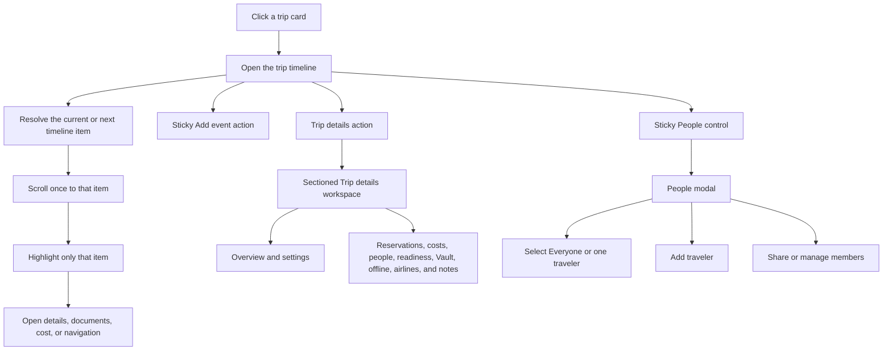

# Trip Vault Redesign Checklist

This document now records the accepted timeline-first redesign and its implementation checklist. The local application and forward migration are complete; phone, desktop, and remote Supabase acceptance remain for the owner to run.

Checked items are implemented or explicitly accepted. Unchecked items are still an acceptance-test gate or a deferred refinement.

## 1. Working Rules

- [x] Review and accept the P0 product decisions before changing application behavior.
- [x] Create new forward-only Supabase migrations; do not rewrite migrations already run in the shared project.
- [x] Implement the accepted redesign as one coordinated local release.
- [ ] Preview every slice at phone and desktop widths before starting the next slice.
- [x] Preserve offline behavior while rebuilding; an online-only replacement is not acceptable.
- [x] Keep administrator mutations online-only.
- [x] Keep real trip data behind sign-in and active trip membership.
- [x] Reconcile accepted decisions into HLD, LLD, and the feature catalog.

### Decision Status

| State | Meaning |
|---|---|
| Unchecked | Still open for discussion |
| Checked | Accepted and ready for the matching implementation slice |
| Deferred | Useful, but deliberately excluded from the current rebuild |
| Rejected | Considered and intentionally not included |

## 2. Redesign Outcome

The trip page should become a single chronological story. Flights, connections, hotel check-in and checkout, trains, transfers, meals, activities, readiness work, and their documents should appear in time order instead of being separated into unrelated feature areas.

### Non-negotiable Product Principles

- [x] Timeline is the default trip screen and primary navigation model inside a trip.
- [x] Exactly one time-based item receives the **Now** or **Next** treatment.
- [x] Opening a trip scrolls once to that item; later manual scrolling is never overridden.
- [x] Documents are primarily reached through their related event but continue to exist independently in Vault.
- [x] A connecting journey is created as one booking containing ordered legs, not as unrelated flights.
- [x] Both printed local endpoint times remain explicit. Strict zones are stored; known airports supply them, Domestic/local controls stay hidden, and missing international endpoint metadata is requested.
- [x] User-entered catalog values remain immediately usable without automatically becoming trusted global metadata.
- [x] Costs remain optional, but the interface distinguishes **missing cost** from a known zero/free cost.

## 3. Priority at a Glance

| Priority | Area | Why it comes here |
|---|---|---|
| P0 | Timeline structure and current-item resolver | This is the new product foundation |
| P0 | Event creation flow and event types | The timeline is unusable without a consistent add flow |
| P0 | Sticky People control and member modal | Traveler context and sharing must stay available while moving through a long timeline |
| P0 | Sectioned Trip details workspace | Preserves the current deep-management experience without cluttering the primary timeline |
| P0 | Strict time and timezone model | Flights and multi-country ordering cannot be trusted without it |
| P0 | Flight connections and mandatory PNR | Core booked-travel workflow |
| P0 | Event-first documents and working upload | Travel documents must be reachable when needed |
| P0 | Trip-local offline search | The larger timeline must remain quickly navigable |
| P0 | Event cost and missing-cost state | Enables correct trip totals without duplicate counting |
| P1 | Hotel milestones, trains, maps, and inline edits | Builds richer reservations on the timeline foundation |
| P1 | QR invitation sharing | Improves an already-supported secure sharing flow |
| P1 | Airline, airport, and booking-vendor autocomplete | Improves entry speed after the form contract is stable |
| P1 | Admin catalog review and publishing | Supports clean master data without blocking trip entry |
| P1 | Readiness as a pre-trip timeline card | Important, but its per-person completion behavior needs discussion |

## 4. Existing Database Foundations

These capabilities already exist and should be reused instead of recreated.

| Requirement | Existing foundation | Assessment |
|---|---|---|
| Connecting flights | `bookings` plus ordered `flight_legs.segment_order` | Database already supports multiple legs in one flight booking |
| Airport snapshots | Flight legs keep airport code, name, catalog key, and departure/arrival timezone | Suitable for stable historical display |
| Airport master data | `airport_catalog_entries` includes codes, aliases, city, country, timezone, and coordinates | Extend with review workflow and seed data; do not replace |
| Airline master data | Versioned `airline_catalog_entries` and trip-local `trip_airlines` snapshots | Suitable for autocomplete, logos, banners, and action links |
| Sequential itinerary | `itinerary_items` has start/end, timezone, sort key, booking link, and participants | Needs an explicit event type and stronger creation rules |
| Several documents per event | `itinerary_item_documents` is a many-to-many link | Correct model; upload behavior is the implementation gap |
| Independent Vault documents | `documents` and immutable `document_versions` | Keep unchanged as the file source of truth |
| Event and booking costs | `trip_costs` can link to a booking or itinerary item | Already sufficient for totals and missing-cost detection |
| One-time invitations | Hashed, expiring `trip_invitations` and atomic redemption | QR can reuse this without changing security rules |
| Member and traveler context | `trip_members`, `travelers`, `traveler_accounts`, and the existing device-local traveler selection | The new modal can reuse these records without impersonation or a new permission model |
| Sectioned trip workspace | Current trip page already loads reservations, offline pack, airlines, costs, people, readiness, documents, and notes | Recompose these existing areas under Trip details rather than rebuilding their data model |
| Google Maps hand-off | Booking and itinerary location JSON already exists | No Google key or new table is required initially |
| Offline search inputs | Structured trip, booking, itinerary, and document metadata is cached locally | P0 search can be local-first without a server search table |

## 5. Recommended Timeline Model

### D-01 — Canonical Timeline Item

- [x] Accept `itinerary_items` as the canonical row for everything intentionally displayed on the trip timeline.
- [x] Require every user-visible booking to create its timeline item or milestone rows in the same save workflow.
- [x] Keep detailed reservation data in `bookings`, `flight_legs`, and `journey_legs`.
- [x] Use `itinerary_items.booking_id` to connect timeline presentation to reservation details.
- [x] Do not build a second competing `timeline_entries` table.

Recommended mapping:

| User action | Booking records | Timeline records |
|---|---:|---:|
| Add activity, meal, or custom event without reservation | 0 | 1 |
| Add reserved activity or meal | 1 | 1 |
| Add one flight or a connecting flight | 1 booking plus 1..N legs | 1 grouped journey item |
| Add hotel | 1 | 2 milestones: check-in and checkout |
| Add train journey | 1 booking plus 1..N train legs | 1 grouped journey item |
| Add readiness work | Existing requirement rows | One derived pre-trip card; additional dated work uses `preparation` events |

### D-02 — Timeline Event Types

- [x] Add an explicit event type to `itinerary_items` rather than inferring every card from its title.
- [x] Accept stored types: `flight`, `train`, `bus`, `ferry`, `cab`, `hotel_check_in`, `hotel_check_out`, `transport`, `meal`, `activity`, `preparation`, and `custom`.
- [ ] Present Breakfast, Lunch, Dinner, and Drinks as meal templates or subtypes instead of separate top-level database types.
- [x] Permit a custom title for every type.
- [ ] Decide whether hotel check-in/out rows may be manually hidden without deleting the hotel booking.

### D-03 — Current/Next Resolver

- [x] If an item spans the current instant, choose it as **Now**.
- [x] Otherwise choose the earliest non-completed item after the current instant as **Next**.
- [ ] For a connecting flight, keep the grouped flight current from the first departure until final arrival and highlight the active or next leg inside it.
- [x] Use stable ID as the final tie-breaker when times and manual order are equal.
- [x] Scroll to the resolved item only when entering the trip or deliberately pressing **Jump to now**.
- [x] Do not change the resolved item merely because another card is centered during scrolling.
- [x] Use a label, marker, border, and restrained surface color; color or animation alone is insufficient.

### D-04 — Trip Page Composition

- [x] Clicking anywhere on a normal trip card opens that trip.
- [ ] Keep nested trip-card controls, such as offline preparation, separately operable without opening the trip accidentally.
- [x] Place the timeline first on the trip page.
- [x] Provide a sticky **Add event** action at the top and a phone-safe floating action when useful.
- [x] Provide a second sticky or hovering **People** control beside Add event.
- [x] Show the active People selection directly on the control as **Everyone** or the selected traveler's avatar/initial and name.
- [x] Provide a separate **Trip details** control that opens the sectioned management workspace described in D-04B.
- [x] Returning from Trip details restores the prior timeline scroll position and current/next highlight.
- [x] Reset Home, Profile, Vault, another trip, and every unrelated pathname to the top instead of carrying the timeline's scroll position across routes.
- [x] Use a vertical line and clear day separators on phone.
- [ ] Use a centered timeline plus a secondary details panel on wide screens when space allows.

### D-04A — People Control and Member Modal

- [ ] Keep the People control visible while scrolling a long timeline without covering the current event or bottom navigation.
- [ ] Open a phone bottom sheet and a desktop dialog/popover from the same control.
- [ ] Put **Everyone** first, followed by every active traveler with avatar/initial, name, account state, and selection state.
- [ ] Allow exactly one planning context at a time: Everyone or one traveler.
- [ ] Persist the selected planning context per trip on that device.
- [ ] Use the selection to prefill participants, document traveler, readiness assignee, and other person-specific fields in new forms.
- [ ] Allow the selected traveler to provide a focused timeline/document lens without changing what the signed-in member is authorized to see.
- [ ] Clearly label the behavior as **Planning for** or **Viewing for**; never present it as signing in as or impersonating that traveler.
- [ ] List non-traveling collaborators in the member-management area but not in the traveler-context selector.
- [ ] Include **Add traveler** for roles that may edit the trip.
- [ ] Include **Share trip** for the owner, leading to traveler/collaborator target, role, one-time code, and later QR options.
- [ ] Include **Members and roles** for the owner; Editors and Viewers receive read-only member information where allowed.
- [ ] Hide or disable actions the signed-in role cannot perform, while keeping the reason understandable.
- [ ] Return to the same timeline position after closing the modal or completing a member action.
- [ ] Announce the new selection accessibly and update the People control without reloading the trip.

### D-04B — Sectioned Trip Details Workspace

Trip details preserves the useful structure of the current trip page. It is the place for reviewing and managing the whole trip by subject, while Timeline remains the place for answering “what happens next?”

- [x] Treat **Timeline** and **Trip details** as two views of the same trip, with Timeline selected by default.
- [ ] Open Trip details as a full-screen nested trip view on phone rather than squeezing all sections into a small modal.
- [ ] Use a full-width sectioned workspace or side-by-side layout on desktop.
- [ ] Keep the trip identity header consistent across both views: title, destination summary, date range, role, and offline state.
- [ ] Preserve the current section-card visual language rather than redesigning every management surface at once.
- [x] Add a sticky section index or horizontally scrollable jump chips so a person can move directly to any section.
- [ ] Use real headings and anchored sections so browser navigation, keyboard focus, and deep links remain understandable.
- [x] Keep all sections reachable on one vertically scrollable page; jump navigation must not hide other sections behind tab-only state.
- [ ] Remember the most recently opened details section per trip on the device.
- [ ] Keep the sticky Add event and People controls available without covering section actions.
- [x] Return to the prior timeline position when the user chooses **Back to timeline**.

Recommended section order:

| Order | Section | Retained or revised contents |
|---:|---|---|
| 1 | Overview | Current trip header and metadata: title, destinations, dates, lifecycle/status, base currency, role, traveler/member counts, document count, and offline state |
| 2 | Reservations | Existing booking cards grouped by Flight, Hotel, Train, Transport, Activity/Meal reservation, and Other; each opens its full detail |
| 3 | Costs | Existing per-currency totals, planned/paid/refunded summary, cost rows, missing-cost count, and Add/Edit actions |
| 4 | People & sharing | Travelers, claimed/managed state, collaborators, roles, Add traveler, Share trip, remove/change-role actions, and the same current planning-context selection |
| 5 | Readiness | Existing Before you go summary, outstanding items, per-traveler progress, Add requirement, and Open readiness action |
| 6 | Documents | Existing focused-traveler document summary, recent/important documents, upload action, and Open Vault action |
| 7 | Offline availability | Existing offline pack state, size/space estimate, prepare/refresh/remove controls, and last verification time |
| 8 | Airlines and travel metadata | Existing trip airline snapshots, official external actions, branding fallback, and later booking-vendor metadata |
| 9 | Notes | Existing trip notes with Add, Edit, Archive, and offline-readable behavior |
| 10 | Settings and archive | Owner-only trip editing, lifecycle/archive actions, calendar export, and other low-frequency controls |

Section rules:

- [ ] Overview summarizes; it does not duplicate every child record.
- [ ] Reservations manages booking records, while their chronological occurrences remain visible on Timeline.
- [ ] Costs are listed once in Trip details and summarized on their related timeline event without creating duplicate totals.
- [ ] People & sharing reuses the People modal actions but provides the complete roster and role-management view.
- [ ] Documents remain independently manageable in Vault while showing relevant event relationships.
- [ ] Readiness retains its dedicated detailed workflow even when a summary card also appears before the trip on Timeline.
- [ ] Offline availability remains prominent enough to verify a trip before travel, not buried under general Settings.
- [ ] Settings and destructive actions remain last and visually separated from everyday trip information.
- [ ] Owner, Editor, and Viewer permissions continue to determine which section actions appear; section visibility itself must not imply edit permission.
- [ ] Loading or failure in one section does not replace the entire Trip details workspace with a blank/error page.
- [ ] Each section has a useful empty state and its most relevant allowed action.

This separation prevents two competing timelines: Trip details may link to **View on timeline**, but it does not render a second full itinerary list.

## 6. Event Creation Decisions

### D-05 — Add Event Modal

- [x] Open one modal or bottom sheet from the sticky/floating Add action.
- [x] Present Flight, Hotel, Activity, and Bus first, then Train, Ferry/Boat, Cab, Meal, Preparation, Other transport, and Custom.
- [x] Show only fields relevant to the selected type.
- [ ] Allow saving the event first and adding documents immediately afterward.
- [x] Allow optional cost entry in the same flow without forcing it.
- [x] Allow participant selection using Everyone or selected travelers.
- [ ] Preserve entered form values when moving between steps or fixing validation.
- [ ] On phone, use a full-height sheet with actions clear of the browser and PWA safe areas.
- [ ] On desktop, use a constrained dialog with keyboard focus containment and visible Save/Cancel actions.

### D-06 — Location and Navigation

- [x] Reuse a single location shape for hotels, non-journey transport, activities, meals, preparation, and custom events.
- [x] Do not ask for a generic location on Flight, Train, Bus, Ferry, or Cab; derive their complete route from ordered endpoints.
- [x] Accept place name and address without requiring coordinates.
- [x] Allow an optional pasted Google Maps or place URL.
- [ ] Use airport catalog coordinates or address/code for airport navigation.
- [ ] Keep **Copy address** available offline and label Maps as an online external action.
- [ ] Do not add a Google Maps API key, embedded map, or paid geocoding to this rebuild.

## 7. Time and Timezone Decisions

### D-07 — Remove Trip Timezone from Normal Entry

- [x] Stop asking ordinary users for a trip-wide timezone.
- [x] Retain `trips.primary_timezone` temporarily as a hidden compatibility fallback while older rows and Home logic are migrated.
- [ ] Derive the trip's first-day/current-window anchor from the earliest timed event's source timezone.
- [ ] When a trip has no timed event, use the creator's strict home timezone only as an explicit fallback.
- [ ] Remove the database column only in a later migration after no query or offline record depends on it.

Why: a Bengaluru–Dubai–London trip has no single truthful trip timezone. A trip-wide value is useful only as a fallback for date grouping and D-1 calculations; it should not rewrite local booking times.

### D-08 — Strict Zoned Times

- [x] Persist a valid IANA timezone for every timed itinerary event, while hiding the control for local events.
- [x] Persist separate valid departure and arrival IANA timezones for every journey leg.
- [x] Derive flight zones from a known airport. **Other** allows manual correction; International Other requires a strict zone.
- [x] Hide Domestic journey zones and repeated-clock fields in creation and Domestic Flight editing. Known airports keep catalog zones; other Domestic endpoints use one hidden fallback zone.
- [x] Ask one journey-country code once for a Domestic non-flight booking, not once for each leg.
- [x] Require a same-country route that crosses time-zone regions to use International so separate endpoint zones can be entered.
- [x] Require explicit strict origin and destination zones for International train, bus, ferry, and cab endpoints because no station/port catalog derives them.
- [x] Store the actual instant as `timestamptz` and preserve the source IANA timezone for reconstruction and display.
- [ ] Reject unknown abbreviations such as `IST`, `CST`, or `BST` because they are ambiguous.
- [x] Display departure in the origin's provider-local zone and arrival/overall end in the corresponding destination or final-destination zone.
- [ ] When different, offer the viewer/device local time as a secondary conversion with an explicit label.
- [ ] Define daylight-saving gap and duplicate-time behavior before implementation.

Recommended daylight-saving rule: reject a local time that does not exist; when a clock repeats, require the user to choose the intended offset rather than guessing.

## 8. Flight and Train Decisions

### D-09 — Flight PNR and Connecting Legs

- [x] Label flight `reference_code` as **PNR / booking reference**.
- [x] Require a non-empty PNR for a flight booking while keeping references optional for other event types.
- [x] Avoid a six-character-only validation rule because airline references vary; trim and cap the value instead.
- [x] Ask Direct or Connecting first: Direct starts with one leg, while Connecting starts with two and may add more.
- [x] Create one flight booking with ordered legs for a normal connection on the same reservation.
- [x] Reject a connection whose normalized origin does not match the prior leg's normalized destination, comparing codes when both exist and names otherwise.
- [x] When adding a missed flight connection later, lock the origin to the previous arrival, country-filter Domestic destinations, and revalidate endpoint/time-zone continuity, positive layover, journey scope, and Domestic country in the database function.
- [ ] Use one booking-level PNR for all legs unless a future separate-ticket workflow is accepted.
- [ ] Compute layover duration from one leg's arrival instant to the next leg's departure instant.
- [x] Reject overlapping or reverse-ordered legs.
- [x] Show every ordered stop, such as `BLR → DEL → DXB`, across cards and details and expand to individual leg cards.
- [ ] During a layover, highlight the next departure leg and show time remaining.
- [ ] Decide later whether separately ticketed flights need an explicit connection group.

### D-10 — Flight Editing and Boarding Time

- [ ] Add pencil actions beside departure and arrival sections in flight detail.
- [ ] Keep terminal, gate, boarding, estimated time, actual time, and baggage edits in a compact operational editor.
- [x] Add an optional `boarding_lead_minutes` per leg with a range of 0–360.
- [x] Allow entry of an explicit boarding time instead of or in addition to lead minutes.
- [x] Define precedence: explicit `boarding_at` wins; otherwise derive it from effective departure minus lead minutes.
- [ ] Keep all operational values explicitly labeled as manually maintained.

### D-11 — Train Support

- [x] Add `train`, `bus`, `ferry`, and `cab` to the booking types.
- [x] Model a train booking with ordered shared journey legs rather than storing important fields only in unvalidated JSON.
- [ ] Minimum train leg fields: operator, train number/name, departure station, arrival station, source times, source timezones, platform, coach, seat, and status note.
- [x] Allow several train legs in one booking when the journey includes a change.
- [ ] Reuse ticket-first document presentation and the grouped journey timeline card.
- [ ] Keep train operational status manual; do not promise live railway data.

## 9. Documents and Readiness Decisions

### D-12 — Event-first Documents

- [ ] Keep `documents` and immutable versions independent from events.
- [ ] Keep `itinerary_item_documents` as the primary event association.
- [ ] Starting upload from an event preselects that event and returns to it after success.
- [ ] Starting upload from Vault permits an unlinked document and offers event linking afterward.
- [ ] Preserve optional flight-leg association for a leg-specific ticket, boarding pass, or baggage tag.
- [ ] Show several authorized documents on one event and allow one document on several events.
- [ ] Unlinking an event never deletes the Vault document.
- [x] Keep the relationship model and add a two-phase account inbox: retain the original first, then atomically associate it with trip metadata only after Storage is verified.
- [x] Keep account originals append-only: pending unassociated INSERT only, no Storage UPDATE, unassociated DELETE only, and immutable after association.
- [x] Reconcile a successful association into the local receipt immediately and use the associated server receipt to suppress any stale unassociated cached inbox row.
- [x] Permit offline deletion only before the first upload attempt; attempted or cloud-backed unassociated files require online deletion so synchronization cannot restore them.
- [ ] Make upload stages observable: validate, create metadata, upload object, create immutable version, set current version, link event, and clean up a failed partial attempt.

### D-13 — Readiness as a Pre-trip Timeline Card

- [x] Use one generated readiness summary card; create other dated pre-trip work as `preparation` timeline events.
- [ ] Confirm whether every traveler receives an independent checkbox for a shared requirement.
- [ ] Keep `trip_requirements` and `requirement_assignees` as the underlying completion model.
- [ ] Show incomplete per-person states without exposing a private linked document to unauthorized members.
- [ ] Position readiness before the first travel event using an explicit due date, not an invented time.
- [ ] Decide the unfinished requirement from the original note: what exactly should a traveler be asked to confirm by checkbox?

Recommended starting point: one expandable **Trip readiness** card ordered by its nearest incomplete due date, with a row and completion state for each assigned traveler.

## 10. Cost Decisions

### D-14 — Event Cost and Trip Total

- [x] Continue using `trip_costs` as the only rows included in totals.
- [x] Adding a cost inside an event creates a linked `trip_costs` row automatically.
- [ ] Allow several cost rows for one booking/event, such as room, tax, or add-on.
- [x] Treat no linked cost row as **Cost missing**.
- [x] Treat an explicit zero-amount row as **Free**, not missing.
- [x] Show **Add cost** from every event whose cost is missing.
- [x] Sum each cost row once even when it has both booking and itinerary links.
- [x] Group totals by currency and do not invent exchange rates.
- [x] Keep the Home-card and trip-header totals compact and readable; clicking either opens the same itemized Trip expenses section.
- [x] In Trip expenses, show each expense with its event or manual title, payer, participants, amount, and lifecycle actions instead of only the aggregate.
- [ ] Agree how planned, paid, and refunded amounts contribute to the displayed total.

Recommended total: show committed spend (`paid - refunded`) and planned spend separately for each currency.

## 11. Search Decisions

### D-15 — Search Scope

- [ ] Make trip-local search P0 and place it in the trip header on both phone and desktop.
- [ ] Search cached metadata so the feature works offline.
- [ ] Include timeline titles/types, flight numbers, airport code/name, hotel/activity/meal names, booking vendor, PNR, traveler names, document title/purpose/short label, and notes where permitted.
- [ ] Group results by Timeline, Bookings, Documents, Travelers, and Readiness.
- [ ] Jump from a result to the matching timeline item or detail view.
- [ ] Apply current membership and document visibility before indexing or displaying a result.
- [ ] Do not search inside uploaded PDF/image contents.
- [ ] Defer cross-trip/global search until trip-local search is proven useful.

P0 can use a normalized local index over IndexedDB records. A PostgreSQL full-text index is not required at personal-trip scale and should be reconsidered only if measured search latency or cross-trip search demands it.

## 12. Sharing Decisions

### D-16 — QR Invitation

- [ ] Generate the QR from the existing unique, expiring, one-time invitation code.
- [ ] Encode an HTTPS join URL such as `/join?code=...`, not trip data.
- [ ] Require sign-in before redemption and reveal no trip metadata before success.
- [ ] Keep the invitation bound to the chosen traveler or non-traveling collaborator and role.
- [ ] Show QR, copy link, copy code, expiry, revoke, and regenerate actions together.
- [ ] Ensure a screenshot of a redeemed or revoked QR cannot be reused.
- [ ] Generate QR pixels client-side; no QR-generation service should receive the code.
- [ ] Do not store a QR image in Supabase because it is only a rendering of the invitation secret.

## 13. Autocomplete and Master Data Decisions

### D-17 — Shared Autocomplete Behavior

- [x] Use the shared accessible catalog-picker pattern for airline, airport, and booking-vendor fields; retain plain operator entry where no catalog exists yet.
- [x] Search the catalog's names, codes, and aliases.
- [x] Always provide **Other** when a suitable saved value is unavailable.
- [x] Keep the chosen name/code/URL as a booking or trip snapshot so later catalog changes do not rewrite history.
- [ ] Rank exact code, exact name, prefix, alias, recent trip value, and fuzzy matches in that order.
- [x] Keep a bundled catalog fallback available when the published catalog is offline or unavailable.
- [x] Never block saving because an entered value is absent from global master data.
- [x] Keep the booking-vendor picker visible in **Other** mode so choosing a saved vendor reverses the choice without restarting the form.

### D-18 — Airports

- [x] Provide a reviewed regional starter set for the current India, Singapore, Malaysia, and Indonesia personal-use scope; expand it through Admin review rather than claiming worldwide completeness.
- [ ] Record the source, license, snapshot date, and update process before importing airport data.
- [x] Search by the catalog's airport code, airport name, city, and aliases.
- [x] When entering an unknown airport for an International flight, require a display name, airport code, two-letter country, and strict IANA timezone; Domestic keeps the zone hidden and uses the compatibility fallback.
- [x] Use the unknown airport immediately as a flight-leg snapshot.
- [ ] Send only non-sensitive airport metadata to an administrator review queue.
- [ ] Let Admin correct and publish the airport without rewriting the original flight automatically.

### D-19 — Airlines and Booking Vendors

- [x] Keep the operator/property separate from **Booked via**: the airline operates a flight, the property name identifies a stay, and Airbnb, Trip.com, or Booking.com may be the seller.
- [x] In create and edit, selecting a saved vendor fills its catalog URL or clears a stale website when none is defined; choosing Other clears the prior catalog URL before manual entry while leaving the picker visible.
- [x] Keep booked-via display name, website URL, and optional catalog key as booking snapshots.
- [x] Retain the existing `provider` snapshot for the airline/operator, property name, restaurant, or activity provider; do not ask hotel users for both property and service provider.
- [x] Use the versioned booking-vendor catalog with name, aliases, official website, logo asset path, brand color, enabled state, and sort order.
- [x] Reuse the existing relative-path asset policy; do not hotlink arbitrary third-party logos.
- [x] Let custom airline/vendor values work immediately as snapshots.
- [x] Include Airbnb and Trip.com in the bundled fallback and publish them as an immutable successor release through `202609130005_booking_vendor_catalog_additions.sql`.
- [ ] Submit unmatched values to an administrator review queue instead of automatically publishing untrusted master data.

### D-20 — Administrator Review Queue

- [ ] Add pending suggestion types for airline, airport, and booking vendor.
- [ ] Exclude trip title, traveler, PNR, dates, documents, and other private trip context from suggestions.
- [ ] Allow Admin to merge with an existing entry, edit and promote, or reject.
- [ ] Publish promoted records through the existing versioned configuration release flow.
- [ ] Keep existing trips unchanged until a user deliberately accepts an updated catalog snapshot.

## 14. Database Change Status

The accepted schema changes are implemented in forward migrations. Remaining unchecked rows below are future candidates and must not be inferred as current behavior.

| Candidate change | Decision | Need | Recommendation |
|---|---|---|---|
| Add `timeline_event_type` and `itinerary_items.event_type` | D-01, D-02 | Must | Backfill from linked booking type; default remaining rows to `custom` |
| Add milestone uniqueness for hotel check-in/out | D-01, D-02 | Must | Add a milestone discriminator and prevent duplicate active milestones per booking |
| Validate all itinerary/booking/flight timezones with `valid_iana_timezone` | D-07, D-08 | Must | Add triggers or constraints in a new migration |
| Deprecate visible `trips.primary_timezone` input | D-07 | Must in UI | Keep the column temporarily; remove only after data and code migration |
| Require trimmed `bookings.reference_code` when type is `flight` | D-09 | Must | Use a type-aware database check plus matching Zod validation |
| Add `flight_legs.boarding_lead_minutes` | D-10 | Must | Nullable bounded integer; retain explicit `boarding_at` override |
| Add journey booking types and `journey_legs` | D-11 | Implemented | Train, Bus, Ferry, and Cab share ordered legs with strict endpoint timezones |
| Add booked-via snapshot fields to `bookings` | D-19 | Implemented | Keep `provider` for the actual operator/property; do not overload it with the seller |
| Add versioned `booking_vendor_catalog_entries` | D-19 | Implemented | Follow existing airline/airport release and asset rules; `202609130005` publishes Airbnb and Trip.com |
| Add privacy-safe `catalog_suggestions` | D-18, D-20 | Should | Authenticated insert, Admin-only read/review, no trip relationship |
| Add a new server search table/index | D-15 | Not yet | Start with authorized local/offline metadata search |
| Add QR database fields | D-16 | No | Render existing invitation code as a QR on the client |
| Add People-control database fields | D-04A | No | Reuse trip membership/traveler rows and keep the selected planning context device-local |
| Add Trip-details section tables | D-04B | No | Recompose existing trip queries and records; section and scroll state remain device-local |
| Add map-specific table | D-06 | No | Extend the validated location JSON shape only if a pasted Maps URL is accepted |
| Replace `trip_costs` | D-14 | No | Existing model supports event costs and correct aggregation |
| Replace event-document relationships | D-12 | No | Fix upload flow; keep the existing many-to-many link |
| Add readiness timeline rows | D-13 | No | The readiness card is derived; preparation events are ordinary itinerary rows |

### Proposed Migration Order

- [x] Migration R1–R4 combined in forward migration `202609110001_timeline_redesign.sql`: timeline types, hotel milestones, strict timezones, flight PNR/boarding lead, booked-via/catalog suggestions, and generic ordered journey legs.
- [x] No readiness linkage migration: D-13 uses a derived card plus preparation events.
- [x] Apply `202609130005_booking_vendor_catalog_additions.sql` after the published regional release from `202609130002`; it copies that release and adds Airbnb and Trip.com without changing booking snapshots.
- [x] Apply `202609130006_trip_storage_cleanup_queue.sql` after `202609130005`; it queues legacy object cleanup atomically with permanent trip deletion and hardens post-creation flight connections on the server.
- [ ] Each migration must include safe backfill behavior for existing rows and a rollback/recovery note.

Existing projects apply every missing migration in filename order. A project already current through `202609130004_account_document_storage_state.sql` runs `202609130005_booking_vendor_catalog_additions.sql`, then `202609130006_trip_storage_cleanup_queue.sql`, and then `supabase/tests/001_schema_smoke.sql`. A project current through `202609130005` runs only `202609130006` before the smoke test.

A fresh project uses this exact sequence:

1. `supabase/TRIP_VAULT_COMPLETE_SETUP.sql`
2. Bootstrap the dedicated Auth administrator as an active `app_admins` row through trusted SQL.
3. `supabase/migrations/202609130002_regional_travel_catalog.sql`
4. `supabase/migrations/202609130005_booking_vendor_catalog_additions.sql`
5. The complete setup already contains the `202609130006` schema contract; do not reapply that migration on a fresh database.
6. `supabase/tests/001_schema_smoke.sql`

Step 4 deliberately fails if step 2 or 3 is missing; do not bypass either guard.

## 15. Small Implementation and Preview Slices

Development starts only after the decisions used by that slice are checked.

| Slice | Scope—keep this exact boundary | Depends on | Database work |
|---:|---|---|---|
| 1A | Clickable trip card; timeline-first trip shell; day/vertical separators; current/next resolver; one-time auto-scroll; Trip details entry | D-01–D-04 | R1 event type only if needed for rendering |
| 1B | Sectioned Trip details workspace using the current cards; sticky section index; People control and member modal; return-to-timeline position | D-04A, D-04B | No section/member schema change |
| 2 | Add Event modal for Activity, Meal, Transport, and Custom; participants; location; optional cost | D-05, D-06, D-14 | Remaining R1 plus existing costs |
| 3 | Flight form with mandatory PNR, strict airport/timezone input, several legs, layover calculation, grouped timeline card | D-07–D-10 | R1 and R2 |
| 4 | Event-first document upload repair, several documents, return-to-event behavior, Vault independence | D-12 | Prefer no table change; add transactional helper only if diagnosis proves necessary |
| 5 | Offline trip-local search and result-to-timeline navigation | D-15 | None initially |
| 6 | Hotel check-in/out milestones, map actions, cost-missing states, and inline event/flight editing | D-02, D-06, D-10, D-14 | R1 |
| 7 | Train booking and grouped train timeline card | D-11 | R4 |
| 8 | QR invitation screen using existing one-time code security | D-16 | None |
| 9 | Unified autocomplete, vendor fields, airport seed, suggestion queue, and Admin catalog review | D-17–D-20 | R3 |
| 10 | Readiness pre-trip card after its behavior is accepted | D-13 | R5 only if required |

### Review Gate for Every Slice

- [ ] Phone portrait preview around 390 CSS pixels wide has no clipping or hidden action.
- [ ] Installed/mobile Safari and Android Chrome safe areas do not cover sticky or floating controls.
- [ ] Add event and People controls remain distinct, reachable, and non-overlapping at phone and desktop widths.
- [ ] Trip details section navigation remains usable with touch, keyboard, browser Back, and deep links.
- [ ] Moving between Timeline and Trip details preserves the user's place instead of resetting both views to the top.
- [ ] Desktop preview at 1280 CSS pixels or wider uses the extra space without stretching cards excessively.
- [ ] Keyboard navigation and visible focus work on desktop.
- [ ] Light, dark, and System modes remain readable.
- [ ] Reduced Motion keeps every state understandable without zoom or movement.
- [ ] Offline-capable behavior is tested offline; online-only actions explain their state.
- [ ] Existing shared and private data remains protected by membership and document rules.
- [ ] User reviews both phone and desktop screenshots or live previews before the next slice starts.

## 16. Questions to Resolve First

Discuss these in order; they block the largest amount of later work.

- [x] Q1: One grouped timeline item represents a connected journey; its detail view exposes the individual legs.
- [x] Q2: Every hotel creates check-in and checkout milestones linked to one booking.
- [x] Q3: Provider/source local time is primary; a future explicitly labeled device-local conversion may be secondary.
- [ ] Q4: For a separately ticketed connection with different PNRs, use separate flight bookings for now?
- [x] Q5: Accept **no cost row = missing** and **zero-value row = free**.
- [x] Q6: P0 search covers the open trip; global cross-trip search is deferred.
- [x] Q7: Unknown public metadata creates a best-effort privacy-safe Admin suggestion automatically.
- [x] Q8: Readiness is one derived summary card; dated pre-trip tasks are separate preparation events.
- [ ] Q9: Per-traveler readiness confirmation wording remains a future refinement; current status is requirement-level.
- [x] Q10: Traveler selection prefills new forms and shows shared plus that traveler's relevant timeline, reservations, costs, readiness, seats, and documents; it is a presentation filter rather than impersonation or authorization.
- [ ] Q11: Accept the recommended Trip details section order, with Timeline kept separate as the default trip view?

## 17. Explicitly Deferred During the Redesign

- [ ] No live flight-status provider.
- [ ] No email booking import.
- [ ] No OCR or PDF extraction.
- [ ] No route optimization or offline map downloads.
- [ ] No unauthenticated trip sharing.
- [ ] No automatic exchange-rate conversion.
- [ ] No automatic publication of user-entered master data.
- [ ] No native iOS or Android application rewrite.
- [ ] No broad visual rewrite outside the active implementation slice.

## 18. Current Lifecycle and Expense Decisions

- [x] New-trip dates suggest Start at today plus 15 days and End seven days later; changing Start updates only an untouched End.
- [x] Flexible event timing supports exact time, date-only, all-day, before/after a dated event, and unscheduled work.
- [x] Event status is Planned, Done, Skipped, or Cancelled and is independent of Archive.
- [x] Archiving a booking-backed milestone archives the whole booking group; standalone events archive individually.
- [x] Archived trip items are restored from one section. Documents retain their independent archive flow.
- [x] Event dates are constrained to the trip date range in both the form and database.
- [x] Timeline cards expose Navigation and flag missing locations without requiring the detail sheet.
- [x] Trip costs record a traveler payer and participants, split equally with integer minor units, and derive balances separately by currency.
- [x] Home and trip-header totals are compact links to the same itemized expense section; incorrect costs can be archived and restored.
- [x] Route-level scroll ownership prevents a long trip timeline from carrying its position into Home, Profile, Vault, or a different trip while preserving same-trip Timeline/Details restoration.
- [x] Fresh root launch waits for trip data and saved focus, opens the saved eligible current trip or the earliest-end/earliest-start/stable-ID overlap fallback, and leaves an explicit `/home` visit on Home.
- [x] Exact-time planned Activities may be created without a reservation and enriched online later; the new booking is linked to the existing event rather than creating another timeline row. Flexible Activities must first use Set exact time.
- [x] A clearly labeled owner-only permanent-delete control exists temporarily for clearing stale test trips. The database transaction queues legacy paths and deletes the trip; the client then removes and acknowledges successful legacy cleanup, retries retained queue rows during later online trip reads, and cleans account-inbox bytes only after association clears. Failures retain the separate queue row or Profile receipt appropriate to that path.
- [ ] TODO after the trip experience is stable: redesign the Admin console from first principles for plain language, responsive navigation, guided draft/publish steps, and clear review queues.
- [ ] Later option: grow trip expenses into an independent Splitwise-style feature only after the trip-scoped flow succeeds.

### Open-source expense companion benchmark

- [x] Spliit confirms that group-first expenses, participant selection, uneven splits, reimbursements, receipts, and PWA delivery form a practical product boundary: <https://github.com/spliit-app/spliit>.
- [x] SplitPro reinforces deriving balances from source expenses and supporting equal, percentage, share, and exact splits without making the balance itself authoritative: <https://github.com/oss-apps/split-pro>.
- [x] Balancia reinforces deterministic settlements, multiple payers, receipts, and keeping currencies separate unless the user explicitly chooses conversion: <https://github.com/sebitr/balancia>.
- [x] Trip Vault implements only the trip-linked first slice now: one payer, selected participants, equal minor-unit shares, per-currency balances, and archive/restore.
- [ ] Later, after trip retesting: consider multiple payers, exact/percentage/share splits, settlements, receipts, and an independent expense entry point.

## Source File Index

| Resource | Path | Relevance |
|---|---|---|
| Redesign checklist | `docs/REDESIGN_CHECKLIST.md` | Active decisions, priorities, schema impact, and preview order |
| High-level design | `docs/HIGH_LEVEL_DESIGN.md` | Current system boundaries to reconcile after decisions |
| Low-level design | `docs/LOW_LEVEL_DESIGN.md` | Current data and interaction contract |
| Feature catalog | `docs/FEATURES.md` | Current baseline feature inventory |
| Consolidated fresh-project schema | `supabase/TRIP_VAULT_COMPLETE_SETUP.sql` | Complete schema for a new Supabase project |
| Traveler focus and known accounts | `supabase/migrations/202609120001_traveler_focus_and_known_accounts.sql` | Focused traveler presentation, direct offers, flight connections, and document assignment |
| Timeline lifecycle and expenses | `supabase/migrations/202609130001_timeline_lifecycle_and_trip_expenses.sql` | Flexible timing, status, archive/restore, deletion, payer, participants, and equal splits |
| Regional travel catalog | `supabase/migrations/202609130002_regional_travel_catalog.sql` | Reviewed starter airports, airlines, and booking vendors |
| Account document inbox | `supabase/migrations/202609130003_account_document_inbox.sql` | Account-first original retention and atomic trip association |
| Document Storage state | `supabase/migrations/202609130004_account_document_storage_state.sql` | Server-verified object completion, append-only pending upload policy, and unassociated cleanup boundary |
| Booking-vendor additions | `supabase/migrations/202609130005_booking_vendor_catalog_additions.sql` | Immutable successor release containing Airbnb and Trip.com; requires the regional catalog and an active administrator |
| Trip Storage cleanup queue | `supabase/migrations/202609130006_trip_storage_cleanup_queue.sql` | Atomic legacy-path capture with trip deletion, retryable post-commit cleanup, and server-hardened appended flight connections |
| Manual acceptance | `docs/FEATURE_TEST_CHECKLIST.md` | Compact three-member, phone, desktop, offline, sharing, and Admin test run |
